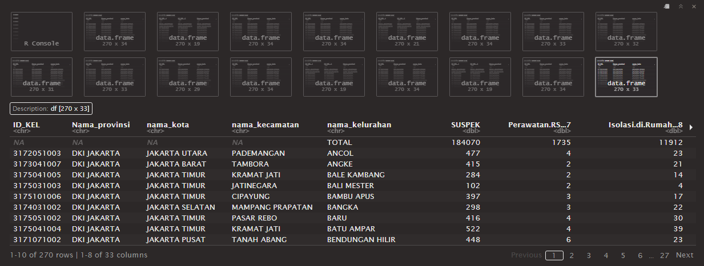
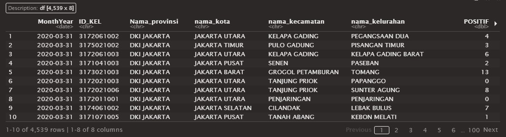
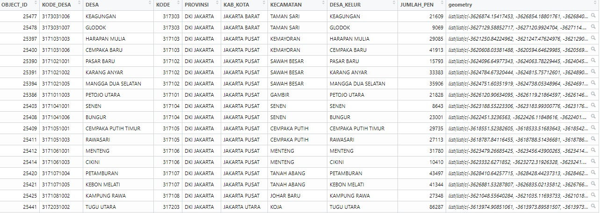
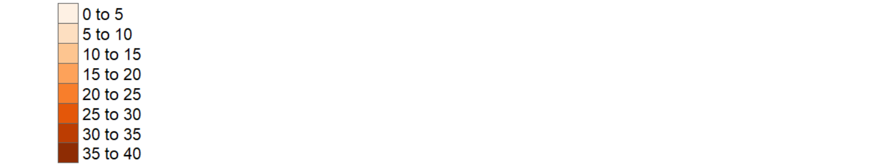

```{r setup, include=FALSE}
knitr::opts_chunk$set(echo = TRUE, fig.align = "center", tidy.opts=list(width.cutoff=80),tidy=TRUE)
```

# 1. Introduction

This analysis aims to analyse and visualise spatio-temporal patterns of COVID-19 in DKI Jakarta, Indonesia. Out of 34 provinces in Indonesia, DKI Jakarta was the province affected most by the pandemic, with close to 24% of cumulative confirmed cases. However, the cumulative confirmed cases were not evenly distributed, therefore this analysis intends to unravel which sub-districts had the highest number of cases and how time has changed the overall distribution.

## 1.1 The Data

For this analysis, the following data are used:

- [Open Data Covid-19 Provinsi DKI Jakarta](https://riwayat-file-covid-19-dki-jakarta-jakartagis.hub.arcgis.com/). This portal provides daily update of COVID-19 measures at both sub-district and district level. For the purpose of this analysis, data at the sub-district level is used. The datasets are in .CSV format, and monthly datasets from March 2020 to July 2021 will be used.

- [Indonesia Geospatial](https://www.indonesia-geospasial.com/). This portal provides a comprehensive collection of geospatial data mainly in ESRI shapefile format at different geographical levels. For the purpose of this analysis, the Shapefile (SHP) Batas Desa Provinsi DKI Jakarta provided at PODES 2019 geospatial layer is used.

**P.S.** For **Open Data Covid-19 Provinsi DKI Jakarta**, *March 2020 Dataset only started from* **25 March 2020** *as per the source, so the dataset might not be a true representative of March 2020. Similarly for January 2021 Dataset,* **30 January 2021** *is the most updated data, the link to access 31 January 2021 is broken so this may not be a true representation of January 2021.* 

# 2. Setting up the environment

To begin the study, R packages will be used for efficiency and a more comprehensive analysis, such as *tidyverse* and *sf* etc.

```{r results='hide'}
load("THE1_workspace.Rdata")
packages = c('tidyverse', 'sf', 'readxl', 'readr', 'stringr', 'tmap', 'lemon', 'formatR')
for (p in packages)
  {
  if(!require(p, character.only = T))
    {
    install.packages(p)
  }
  library(p,character.only = T)
}
```


```{r include=FALSE}

# Prevent values from showing as exponential

options(scipen = 999)

save.image(file = "THE1_workspace.Rdata")

knit_print.data.frame <- lemon_print
```

```{r include=FALSE}
library(knitr)

# knit('_posts/2021-08-27-take-home-exercise-1/take-home-exercise-1.Rmd')
```

# 3. Data Wrangling

## 3.1 Aspatial Data

### 3.1.1 Importing and creating a list 

Datasets will now be imported into Rstudio.

*list.files* function helps to create a list from the imported data files. The files are also imported all at once using a pattern to match the file names, ensuring full efficiency as compared to importing the files individually. 

The R function *lapply* is also complementary for this process, as well as adding the file names as an additional column to the dataframes (So as to display the data by month later on).

```{r results='hide'}
file_list <- list.files(path = "data/the1data/COVID-DATA" , pattern = "*.xlsx",  full.names = T)
df_list <- lapply(seq_along(file_list), function(x) transform(read_xlsx(file_list[x]), MonthYear = file_list[x]))
```
### 3.1.2 Looking through the data and initial data cleaning  

From here we then manually check through *df_list* to find which Meninggal(english translation: **Deaths**) column is the correct one for each file, for referencing the coalesce process later on in the next few steps (E.g. For February 2021, Meninggal...1 is the correct column to use since it is the Meninggal column with no NA values.)

The inspection tells us that *Meninggal...23 to Meninggal...25* is not used so we can skip those columns later on in the coalesce process.

```{r results='hide'}
df_list
```


### 3.1.3 Combine df_list into a dataframe  

We will then combine df_list into a real dataframe using *Idlpy* function from the *plyr* package. 

```{r}
library(plyr)
df <- ldply(df_list, data.frame)

```


### 3.1.4 Conversion of data types for certain columns

To combine/integrate values from the various *Meninggal* columns, we will have to convert *Meninggal...26* column's data type so we can use coalesce function later on (because it originally is a *chr* type and *chr* type cannot combine with *double* type). 

July 2020 is using *Meninggal...26* as the correct column, so we have to carry out the conversion.

```{r}

df$Meninggal...26 = as.double(df$Meninggal...26)

df <- df %>%
  na_if("N/A")
```

### 3.1.5 Coalesce process for NA/missing values

In this step we aim to combine *ID_KEL* into one main column, since some of the files have different layouts, which led to NA values in some rows. **Coalesce** is a function to take in values from another column (So if ID_KEL has NA values while ID_KEL...1 has values, we will take from ID_KEL...1 and add them into ID_KEL)

```{r}
df <- df %>% 
  mutate(ID_KEL = coalesce(ID_KEL, ID_KEL...1, ID_KEL...2))
```

Similarly, we want to combine Meninggal together as one column, since some of the files have different layouts. We know that only **Meninggal 28,29,30,31** is used after checking the datasets earlier on during **df_list**, so we will only integrate those columns together.

```{r}
df <- df %>% 
  mutate(Meninggal = coalesce(Meninggal, Meninggal...28, Meninggal...29, Meninggal...30, Meninggal...31, Meninggal...26))
```

### 3.1.6 Subsetting the necessary columns from dataframe

Next, we will get only the required columns out from the dataframe.

```{r}
library(dplyr)

df2 <- df %>%
  select("MonthYear", "ID_KEL", "Nama_provinsi", "nama_kota", "nama_kecamatan", "nama_kelurahan", "POSITIF", "Meninggal")
```

So df2 is the modified dataframe, and currently this is the output. *lemon_print* from **lemon** R Package is used for a more aesthetically pleasing dataframe.

```{r caption= "Modified dataframe df2 (Rendered with lemon_print)", render = lemon_print}

head(df2)
```

### 3.1.7 Cleaning up *MonthYear* column so as to sort the values by month

As shown above, we will need to clean up the *MonthYear* column as it is very messy. We will clean up the *MonthYear* column using *str_replace* function, to replace unnecessary characters in the values.

```{r}
df2 <- df2 %>% 
  mutate_at("MonthYear", str_replace, "data/the1data/COVID-DATA/Standar Kelurahan Data Corona", "")

df2 <- df2 %>% 
  mutate_at("MonthYear", str_replace, "[(]", "")

df2 <- df2 %>% 
  mutate_at("MonthYear", str_replace, "[)]", "")

df2 <- df2 %>% 
  mutate_at("MonthYear", str_replace, ".xlsx", "")

```

We will then turn MonthYear column into *date* data type using *Sys.setlocale* and *as.Date* functions.

```{r}
Sys.setlocale(locale="ind")
df2$MonthYear <- c(df2$MonthYear) %>%
as.Date(df2$MonthYear, format ="%d %B %Y")
```
```{r include=FALSE}
df2
```

Next, we will remove any wrong/unnecessary rows (NA values in *ID_KEL*, subdistrict name as rows in *ID_KEL* column etc).

```{r results='hide'}
df2[!is.na(df2$ID_KEL),]

df2 <- subset(df2, grepl('^\\d+$', df2$ID_KEL))

```

Then, sorting the modified dataframe by *MonthYear* and resetting of index.

```{r}
df2 <- df2[order(df2$MonthYear),]
final_df <- df2
row.names(final_df) <- 1:nrow(final_df)
```


```{r include=FALSE}
final_df
```

### 3.1.8 Exporting *.rds* files out from the final dataframe

With all the data cleaning done, we will end out with writing out a .rds file from *final_df* and utilising it further on in the analysis, so as to ensure minimum data storage space.

```{r}
aspatial_df <- write_rds(final_df, "data/the1data/rds/aspatial_df.rds")
```

```{r}
aspatial_df <- read_rds("data/the1data/rds/aspatial_df.rds")
```

## 3.2 Geospatial Data

### 3.2.1 Importing shapefile data into a simple feature dataframe

The following code cunk imports the **DKI Jakarta** geospatial data into R as a simple feature dataframe.

```{r}
geospatial_df <- st_read(dsn = "data/the1data/BATAS DESA DESEMBER 2019 DUKCAPIL DKI JAKARTA", 
                layer = "BATAS_DESA_DESEMBER_2019_DUKCAPIL_DKI_JAKARTA")
```

```{r include=FALSE}
# - To take a quick look at the output dataframe
glimpse(geospatial_df)
```

### 3.2.2 Checking and ensuring Projected Coordinates Systems of the data is correct

```{r}
st_crs(geospatial_df)
```

From the above output, we see that the Projected Coordinates System is WGS84 which is **wrong**, therefore we'll Change the Projected Coordinates Systems to **DGN95** (which is the national Projected Coordinates Systems of Indonesia).

```{r}
jakarta_DGN95 <- st_transform(geospatial_df, 23845)
```

### 3.2.3 Excluding the outer islands from the sf dataframe

Outer Islands are also known as **Kepulauan Seribu**, we will exclude them as they are detached from the mainland.

```{r}
jakarta_DGN95 <- subset(jakarta_DGN95, KAB_KOTA != "KEPULAUAN SERIBU")
```

### 3.2.4 Subsetting necessary columns from the sf dataframe

For the analysis, we will only keep the first nine fields, whereby the last field is **JUMLAH_PEN** (Total Population).

```{r}
jakarta_DGN95 <- jakarta_DGN95[, 0:9]
```


### 3.2.5 Data cleaning and amended some inaccuracies between the datasets

Some inaccuracies in the data were discovered between identification keys from aspatial and geospatial after manually checking through their data. Therefore, necessary amendments were made to the data.

If data cleaning process is not done, there will be data missing from some states (Plotted maps will have missing values).

```{r}
jakarta_DGN95$DESA_KELUR[jakarta_DGN95$DESA == 'BALEKAMBANG'] <- 'BALE KAMBANG'
jakarta_DGN95$DESA_KELUR[jakarta_DGN95$DESA == 'HALIM PERDANA KUSUMA'] <- 'HALIM PERDANA KUSUMAH'
jakarta_DGN95$DESA_KELUR[jakarta_DGN95$DESA == 'JATIPULO'] <- 'JATI PULO'
jakarta_DGN95$DESA_KELUR[jakarta_DGN95$DESA == 'KALIBARU'] <- 'KALI BARU'
jakarta_DGN95$DESA_KELUR[jakarta_DGN95$DESA == 'KRAMATJATI'] <- 'KRAMAT JATI'
jakarta_DGN95$DESA_KELUR[jakarta_DGN95$DESA == 'PALMERIAM'] <- 'PAL MERIAM'
jakarta_DGN95$DESA_KELUR[jakarta_DGN95$DESA == 'PINANGRANTI'] <- 'PINANG RANTI'
jakarta_DGN95$DESA_KELUR[jakarta_DGN95$DESA == 'PAL MERAH'] <- 'PALMERAH'
jakarta_DGN95$DESA_KELUR[jakarta_DGN95$DESA == 'TENGAH'] <- 'KAMPUNG TENGAH'
jakarta_DGN95$DESA_KELUR[jakarta_DGN95$DESA == 'PULOGADUNG'] <- 'PULO GADUNG'
jakarta_DGN95$DESA_KELUR[jakarta_DGN95$DESA == 'KALI DERES'] <- 'KALIDERES'
jakarta_DGN95$DESA_KELUR[jakarta_DGN95$DESA == 'RAWAJATI'] <- 'RAWA JATI'
jakarta_DGN95$DESA_KELUR[jakarta_DGN95$DESA == 'KRENDANG'] <- 'KERENDANG'
```

The below code chunk is to help us check if the identifier keys between the aspatial and geospatial data are correct.

```{r eval=FALSE}
a <-c(aspatial_df$nama_kelurahan)
b <-c(jakarta_DGN95$DESA_KELUR)

a[!(a %in% b)]

```

```{r include=FALSE}
jakarta_DGN95
```

### 3.2.6 Removing NA value rows from dataframe

We will drop NA value rows, as they will affect our analysis results.

*P.S. 2 sub-districts (DANAU SUNTER and DANAU SUNTER DLL) will be dropped through this process as most of their values fall under NA values, only their OBJECT_ID and Sub-district names were present, population data and positive cases data were missing/NA.* 

```{r}
jakarta_DGN95 <- jakarta_DGN95 %>% drop_na(OBJECT_ID)
```

## 3.3 Geospatial Data Integration

### 3.3.1 Data preparation for *Cumulative Case Rate* by month (per 10,000 Population)

Functions from various packages will be used: e.g. *pivot_wider()* of **tidyr** package and *group_by* of **dplyr** package.

The formula we are using is: 
              
    COVID-19 Case Rate per 10,000 population (Monthly) = (Total Cumulative Cases / Total Population) x 10000

```{r}
Case_Rate <- aspatial_df %>%
  inner_join(jakarta_DGN95, by=c("nama_kelurahan" = "DESA_KELUR")) %>%
  group_by(nama_kelurahan, MonthYear) %>%
  dplyr::summarise(`Covid_Cases_Per_10000_Pop` = ((sum(`POSITIF`) / `JUMLAH_PEN`) * 10000)) %>%
  ungroup() %>%
  pivot_wider(names_from = MonthYear,
              values_from = Covid_Cases_Per_10000_Pop)
```

### 3.3.2 Data preparation for *Cumulative Death Rate* by month (per 10,000 Population)

Functions from various packages will be used: e.g. *pivot_wider()* of **tidyr** package and *group_by* of **dplyr** package.

The formula we are using is: 
              
    COVID-19 Death Rate per 10,000 population (Monthly) = (Total Cumulative Deaths / Total Population) x 10000

```{r}
Death_Rate <- aspatial_df %>%
  inner_join(jakarta_DGN95, by=c("nama_kelurahan" = "DESA_KELUR")) %>%
  group_by(nama_kelurahan, MonthYear) %>%
  dplyr::summarise(`Death_Rate_Per_10000` = ((sum(Meninggal) / JUMLAH_PEN) * 10000)) %>%
  ungroup() %>%
  pivot_wider(names_from = MonthYear,
              values_from = Death_Rate_Per_10000)
```

### 3.3.3 Data Preparation for *Relative Risk* mapping (with regards to Cumulative Death Rate)

Preparing another dataframe *Positive_Cases* to join *Death_Rate* dataframe in the upcoming processes, to add the additional columns needed for relative risk mapping later on (E.g. POSITIF and Meninggal).

```{r}
Positive_Cases <- aspatial_df %>%
  select('MonthYear', 'nama_kelurahan', 'POSITIF', 'Meninggal')

Positive_Cases <- Positive_Cases[Positive_Cases$MonthYear == "2021-07-31",]
```

*Positive_Cases* dataframe will now be integrated within *Death_Rate* dataframe.

```{r}
Death_Rate <- left_join(Positive_Cases, Death_Rate, by= c("nama_kelurahan" = "nama_kelurahan"))

Death_Rate <- subset(Death_Rate, select = -c(MonthYear))

```

### 3.3.4 Renaming the columns for both dataframes for easier identification during analysis

The columns will be renamed and simplified for easier identification, such as removing Date value from the *MonthYear* values (e.g. "2021-02-28" into "02-2021").

```{r}
colnames(Case_Rate) <- c('SUB_DISTRICT', '03-2020', '04-2020', '05-2020', '06-2020', '07-2020', '08-2020', '09-2020', '10-2020', '11-2020', '12-2020', '01-2021', '02-2021', '03-2021', '04-2021', '05-2021', '06-2021', '07-2021')

colnames(Death_Rate) <- c('SUB_DISTRICT', 'POSITIVE_CASES', 'DEATHS', '03-2020', '04-2020', '05-2020', '06-2020', '07-2020', '08-2020', '09-2020', '10-2020', '11-2020', '12-2020', '01-2021', '02-2021', '03-2021', '04-2021', '05-2021', '06-2021', '07-2021')

```

### 3.3.5 Additional data cleaning to ensure cleaned data is used for analysis 

A simple code chunk to quickly check and ensure there are no NA values.

```{r eval=FALSE}
Case_Rate[rowSums(is.na(Case_Rate))!=0,]
```

*Death_Rate* dataframe is found to have NA rows, therefore we deleted them using *na.omit()* function.

```{r eval=FALSE}
Death_Rate[rowSums(is.na(Death_Rate))!=0,]

Death_Rate <- na.omit(Death_Rate)
```

### 3.3.6 Exporting *.rds* files and using them for efficient data storage 

Rds files are used as a form of best practice, so as to lessen the amount of data storage for the required data.

```{r}
Case_Rate_rds <- write_rds(Case_Rate, "data/the1data/rds/Case_Rate_rds.rds")
Death_Rate_rds <- write_rds(Death_Rate, "data/the1data/rds/Death_Rate_rds.rds")
```

```{r}
Case_Rate_rds <- read_rds("data/the1data/rds/Case_Rate_rds.rds")
Death_Rate_rds <- read_rds("data/the1data/rds/Death_Rate_rds.rds")
```

#### Visualisation of **Case_Rate_Rds**


#### Visualisation of **Death_Rate_Rds**


```{r include=FALSE}
Case_Rate_rds
```

```{r include=FALSE}
Death_Rate_rds
```

# 4. Geospatial Analysis

## 4.1 Data Preparation for Mapping

### 4.1.1 Joining Geospatial data (jakarta_DGN95) with Aspatial data (Case Rate and Death Rate)

*left_join* of **dplyr** is used to join the geospatial data and attributes from the aspatial data using the names of sub-districts as a common identifier ("DESA_KELUR" for jakarta_DGN95, and "SUB_DISTRICT" for Case/Death_Rate_rds)

```{r}
Case_Rate_Final <- left_join(jakarta_DGN95, Case_Rate_rds, by= c("DESA_KELUR" = "SUB_DISTRICT"))

Death_Rate_Final <- left_join(jakarta_DGN95, Death_Rate_rds, by= c("DESA_KELUR" = "SUB_DISTRICT"))
```

Taking a look at the **Finalised Dataframes**

```{r}
head(Case_Rate_Final)
```

```{r}
head(Death_Rate_Final)
```


### 4.1.2 Checking for NA rows in the combined dataframes

Once again, checking for NA rows to ensure substantial analysis results will be attained.

```{r}
Case_Rate_Final[rowSums(is.na(Case_Rate_Final))!=0,]

Death_Rate_Final[rowSums(is.na(Death_Rate_Final))!=0,]
```

No NA rows were found, so we are good to proceed on.

## 4.2 Thematic Mapping

### 4.2.1 Small multiples choropleth maps to see the distribution of COVID Cases and Deaths: **March 2020** (First Month)

Plotting small multiples choropleth maps using *KAB_KOTA* field (Municipality Level, e.g. West Jakarta, North Jakarta etc). March 2020 is the first month that we have data on so we will be using March 2020 data to start this study. 

```{r}
tm_shape(Case_Rate_Final) +
  tm_fill("03-2020",
          style = 'jenks',
          palette = "Blues",
          thres.poly = 0) + 
  tm_facets(by="KAB_KOTA", 
            free.coords=TRUE, 
            drop.shapes=TRUE) +
  tm_layout(legend.show = TRUE,
            main.title = 'Distribution of cumulative confirmed Case\nRate per 10,000 Population (March 2020)',
            main.title.position = "left", 
            title.size = 12) +
  tm_borders(alpha = 0.5)
```
From the plotted map, we can see that there is an even distribution throughout the different municipalities (no particular municipality with outlandish number of cases). 

But **Gelora** in *Tanah Abang, Jakarta Pusat*, and the area surrounding **Senayan** in *Kebayoran Baru, Jakarta Selatan* seemingly has slightly more cases than the other sub-districts as shown by their darker blue shading.

```{r}
tm_shape(Death_Rate_Final) +
  tm_fill("03-2020",
          style = "jenks",
          palette = "Greens",
          thres.poly = 0) + 
  tm_facets(by="KAB_KOTA", 
            free.coords=TRUE, 
            drop.shapes=TRUE) +
  tm_layout(legend.show = TRUE,
            main.title = 'Distribution of cumulative Death Rate\nper 10,000 Population (March 2020)',
            main.title.position = "left", 
            title.size = 12) +
  tm_borders(alpha = 0.5)
```
Similar to case rate, we can see that there is a seemingly even distribution throughout the different districts (no particular district with outlandish number of death cases). 

However, the sub-districts of **Gondangdia** in *Mentang, Jakarta Pusat* and **Karet Semanggi** of *Setiabudi, Jakarta Selatan* has slightly more death cases than the other sub-districts.

### 4.2.2 Small multiples choropleth maps to see the distribution of COVID Cases and Deaths: **July 2021** (Last Month)

July 2021 is the last month that we have data on, so we will be using it to see the change in distribution from the first to the last month.

```{r}
tm_shape(Case_Rate_Final) +
  tm_fill("07-2021",
          style = 'jenks',
          palette = "Blues",
          thres.poly = 0) + 
  tm_facets(by="KAB_KOTA", 
            free.coords=TRUE, 
            drop.shapes=TRUE) +
  tm_layout(legend.show = TRUE,
            main.title = 'Distribution of cumulative confirmed Case\nRate per 10,000 Population (July 2021)',
            main.title.position = "left", 
            title.size = 12) +
  tm_borders(alpha = 0.5)
```
We won't be without taking into account the difference in number of cases from March 2020 to July 2020, this visualisation simply serves as a mean for comparing the distribution of cases across Jakarta.

Similar to the first month, an even distribution is seen throughout the different districts. 

However, there is a concentrated subdistrict **Gambir** in *Gambir, Jakarta Pusat* with a much higher number of cases than the other sub-districts as shown by the darker blue shading.

```{r}
tm_shape(Death_Rate_Final) +
  tm_fill("07-2021",
          style = "jenks",
          palette = "Greens",
          thres.poly = 0) + 
  tm_facets(by="KAB_KOTA", 
            free.coords=TRUE, 
            drop.shapes=TRUE) +
  tm_layout(legend.show = TRUE,
            main.title = 'Distribution of cumulative Death Rate\nper 10,000 Population (July 2021)',
            main.title.position = "left", 
            title.size = 12) +
  tm_borders(alpha = 0.5)
```

Similar to case rate, we can see that there is a seemingly even distribution throughout the different sub-districts of Jakarta. 

However, the subdistrict of **Gambir** in *Gambir, Jakarta Pusat* is an outlier as well, with a much higher number of death cases than the other sub-districts as shown by the darker green shading.

**P.S.** *As mentioned earlier on, these visualisations does not take into account the difference in number of cases from March 2020 to July 2020, we are only comparing the change in distribution of cases across Jakarta.* 

### 4.2.3 Time-series choropleth maps of *Positive Cases* Rate throughout March 2020 to July 2021

To take into account the increase in total cases, time-series choropleth maps will be used to do this analysis.

Firstly, *summary* function is used to find the minimum and highest value from **Case_Rate_Final** "07-2021" (AKA column with the most updated number of cumulative positive cases), so as to determine the appropriate category breakpoints.

```{r}
summary(Case_Rate_Final$`07-2021`)
```
With reference to the results above, the **breakpoints** for our breaks vector will be c(0, 500, 1000, 1500, 2000, 2500, 3000). 

We will plot small multiple maps to see how the distribution of COVID cases has changed on a **monthly basis** from March 2020 to July 2021. 

```{r fig.asp = 1,fig.width = 15, fig.height=6}
tm_shape(Case_Rate_Final)+ 
  tm_polygons(c("03-2020", "04-2020", "05-2020", "06-2020", "07-2020", "08-2020", "09-2020", "10-2020", "11-2020", "12-2020", "01-2021", "02-2021", "03-2021", "04-2021", "05-2021", "06-2021", "07-2021"),
          breaks = c(0, 500, 1000, 1500, 2000, 2500, 3000), 
          palette = "Reds") +
  tm_layout(panel.show = TRUE, 
            panel.labels = c("03-2020", "04-2020", "05-2020", "06-2020", "07-2020", "08-2020", "09-2020", "10-2020", "11-2020", "12-2020", "01-2021", "02-2021", "03-2021", "04-2021", "05-2021", "06-2021", "07-2021"),
            panel.label.size = 3,
            asp = NA,
            legend.show = FALSE)
```


Similar to the above visualisation, but now we will look at an estimated **5-month change** in time period (Splitting the 17 months into 4 parts, which equals ~5) to see how the distribution of COVID cases has changed from March 2020 to July 2021.

```{r fig.asp = 1,fig.width = 15, fig.height=6}
tm_shape(Case_Rate_Final)+ 
  tm_polygons(c("03-2020", "08-2020", "02-2021", "07-2021"),
          breaks = c(0, 500, 1000, 1500, 2000, 2500, 3000), 
          palette = "Reds") +
  tm_layout(panel.show = TRUE, 
            panel.labels = c("03-2020", "08-2020", "02-2021", "07-2021"),
            panel.label.size = 3,
            asp = NA,
            legend.show = FALSE)
```


Based on the 2 visualisations above, here are some of the observations made about *Positive Cases Rate*:

- The first significant outbreak originated from the subdistrict of **Gambir** in *Gambir, Jakarta Pusat* in September 2020
- The outbreak then started to affect some of the neighbouring subdistricts in the following months (Oct 2020 to Feb 2021), mainly below *Gambir*, such as *Senayan* and *Halim Perdan Kusumah*
- As the virus spread to more subdistricts, **50% of districts** started to suffer from significant outbreaks as seen in *June 2021's small multiple map*
- By the time data was collected at the end of July 2021, we can see that the COVID outbreak has reached around **80% of Jakarta**. This is evident from the wider spread of deeper red in *July 2021's small multiple map*, which is **a stark difference from** *June 2021's map*.
- The subdistricts affected most seemed to cluster around the initial origin district of **Gambir**, with a seemingly dispersed pattern for the subdistricts with higher number of cases.

### 4.2.4 Time-series choropleth map of *Death Rate* throughout March 2020 to July 2021

Utilising the same method as Case Rate, we will use time-series choropleth maps to see the change in distribution for deaths in the region. 

Firstly, summary function is used to find the minimum and highest value from **Death_Rate_Final** “07-2021” (AKA column with the most updated number of cumulative positive cases), so as to determine the appropriate category breakpoints.

```{r}
summary(Death_Rate_Final$`07-2021`)
```
With reference to the results above, the **breakpoints** for our breaks vector will be c(0, 5, 10, 15, 20, 25, 30, 35, 40).

Small multiple maps will be plotted to see how the distribution of deaths has changed on a **monthly basis** from March 2020 to July 2021. 

```{r fig.asp = 1,fig.width = 15, fig.height=6}
tm_shape(Death_Rate_Final)+ 
  tm_polygons(c("03-2020", "04-2020", "05-2020", "06-2020", "07-2020", "08-2020", "09-2020", "10-2020", "11-2020", "12-2020", "01-2021", "02-2021", "03-2021", "04-2021", "05-2021", "06-2021", "07-2021"),
          breaks = c(0, 5, 10, 15, 20, 25, 30, 35, 40), 
          palette = "Oranges") +
  tm_layout(panel.show = TRUE, 
            panel.labels = c("03-2020", "04-2020", "05-2020", "06-2020", "07-2020", "08-2020", "09-2020", "10-2020", "11-2020", "12-2020", "01-2021", "02-2021", "03-2021", "04-2021", "05-2021", "06-2021", "07-2021"),
            panel.label.size = 3,
            asp = NA,
            legend.show = FALSE)
```


Similar to the above visualisation, but now we will look at an estimated 5-month change in time period (Splitting the 17 months into 4 parts, which equals ~5) to see how the distribution of deaths from COVID has changed from March 2020 to July 2021.

```{r fig.asp = 1,fig.width = 15, fig.height=6}
tm_shape(Death_Rate_Final)+ 
  tm_polygons(c("03-2020", "08-2020", "02-2021", "07-2021"),
          breaks = c(0, 5, 10, 15, 20, 25, 30, 35, 40), 
          palette = "Oranges") +
  tm_layout(panel.show = TRUE, 
            panel.labels = c("03-2020", "08-2020", "02-2021", "07-2021"),
            panel.label.size = 3,
            legend.show = FALSE)
```


Based on the 2 visualisations above, here are some of the observations made about *Death Cases Rate*:

- Same as *Positive Cases Rate*, the first sub-district with concerning number of deaths was the same subdistrict of **Gambir** in *Gambir, Jakarta Pusat*, however it was only more significant in January 2021 as compared to September 2020 for *Cases Rate*
- The number of deaths then started to increase around the neighbouring subdistricts in the following months (Feb 2021 to July 2021)
- **> 50% of districts** started to suffer from significant number of deaths from March 2021 onwards, as seen in *March 2021 to June 2021’s small multiple maps*
- Similar to *Case Rate*, by the time data was collected at the end of July 2021, we can see that deaths from COVID cases has reached ***around 75% of Jakarta**. This is evident from the wider spread of deeper orange in July 2021’s small multiple map, which is quite a drastic difference from June 2021’s map
- The end result in July 2021 looked similar to *Case Rate's July 2021 map*, with subdistricts affected most seemingly clustered around the initial origin district of *Gambir*

## 4.3 Analytical Mapping

### 4.3.1 Plotting Percentile Maps to visualise extreme values

Firstly, we will extract **07-2021** as a vector out of an sf data frame.

```{r}
percent <- c(0,.01,.1,.5,.9,.99,1)
var <- Case_Rate_Final["07-2021"] %>%
  st_set_geometry(NULL)
quantile(var[,1], percent)
```

The extraction will need the following code chunk (a function) to run.  

```{r}
get.var <- function(vname,df) {
  v <- df[vname] %>% 
    st_set_geometry(NULL)
  v <- unname(v[,1])
  return(v)
}
```

#### Percentile Map for **Positive Cases Rate**

```{r}
percent <- c(0,.01,.1,.5,.9,.99,1)
var <- get.var("07-2021", Case_Rate_Final)
bperc <- quantile(var,percent)
tm_shape(jakarta_DGN95) +
  tm_polygons() +
tm_shape(Case_Rate_Final) +
  tm_fill("07-2021",
          title="Percentile",
          breaks=bperc,
          palette="Reds",
          labels=c("< 1%", "1% - 10%",
                   "10% - 50%", 
                   "50% - 90%",
                   "90% - 99%", 
                   "> 99%"))  +
  tm_borders() +
  tm_layout(main.title = "Percentile Map for Cumulative Cases Rate in July 2021", 
            main.title.position = "left",
            main.title.size = 1.2,
            legend.outside = TRUE,
            frame = TRUE) +
  tm_compass(type="8star", size = 2, position = c( 'left','bottom')) +
  tm_scale_bar(position = c( 'left','bottom')) 
```
From the above percentile map, we can see:

- The various sub-districts actually fall across all 5 classes of Percentile
- Majority of them falls under the *1% - 10%* and *50% - 90%* class
- For the extreme ends,only around 3-4 sub-districts falls under **>99%** class and 2 sub-districts falls under **<1%** class
- This means that there are a **small number of outliers**

#### Percentile Map for **Death Rate**

```{r}
percent <- c(0,.01,.1,.5,.9,.99,1)
var <- get.var("07-2021", Death_Rate_Final)
bperc <- quantile(var,percent)
tm_shape(jakarta_DGN95) +
  tm_polygons() +
tm_shape(Death_Rate_Final) +
  tm_fill("07-2021",
          title="Percentile",
          breaks=bperc,
          palette="Oranges",
          labels=c("< 1%", "1% - 10%",
                   "10% - 50%", 
                   "50% - 90%",
                   "90% - 99%", 
                   "> 99%"))  +
  tm_borders() +
  tm_layout(main.title = "Percentile Map for Cumulative Death Rate in July 2021", 
            main.title.position = "left",
            main.title.size = 1.2,
            legend.outside = TRUE,
            frame = TRUE) +
  tm_compass(type="8star", size = 2, position = c( 'left','bottom')) +
  tm_scale_bar(position = c( 'left','bottom')) 
```
From the above percentile map, we can see:

- The various sub-districts actually fall across all 5 classes of Percentile
- Majority of them falls under the *1% - 10%* and *50% - 90%* class
- For the extreme ends, only around 2-3 sub-districts falls under **>99%** class and 2 sub-districts falls under **<1%** class
- This means that there are a small number of outliers, but they are not significant

### 4.3.2 Plotting BoxMaps to visualise outliers

The following code chunk will be used to create the appropriate break points for plotting a box map.

```{r}
boxbreaks <- function(v,mult=1.5) {
  qv <- unname(quantile(v))
  iqr <- qv[4] - qv[2]
  upfence <- qv[4] + mult * iqr
  lofence <- qv[2] - mult * iqr
  # initialize break points vector
  bb <- vector(mode="numeric",length=7)
  # logic for lower and upper fences
  if (lofence < qv[1]) {  # no lower outliers
    bb[1] <- lofence
    bb[2] <- floor(qv[1])
  } else {
    bb[2] <- lofence
    bb[1] <- qv[1]
  }
  if (upfence > qv[5]) { # no upper outliers
    bb[7] <- upfence
    bb[6] <- ceiling(qv[5])
  } else {
    bb[6] <- upfence
    bb[7] <- qv[5]
  }
  bb[3:5] <- qv[2:4]
  return(bb)
}
```

The following code chunk creates an R function that will help extract a variable as a vector from a chosen sf data frame.

```{r}
get.var <- function(vname,df) {
  v <- df[vname] %>% st_set_geometry(NULL)
  v <- unname(v[,1])
  return(v)
}
```

Next, we will be creating a function that will help us churn out box maps whenever needed. 

```{r}
boxmap <- function(vnam, df, 
                   legtitle=NA,
                   mtitle="Box Map",
                   mult=1.5){
  var <- get.var(vnam,df)
  bb <- boxbreaks(var)
  tm_shape(df) +
     tm_fill(vnam,title=legtitle,
             breaks=bb,
             palette="Blues",
          labels = c("lower outlier", 
                     "< 25%", 
                     "25% - 50%", 
                     "50% - 75%",
                     "> 75%", 
                     "upper outlier"))  +
  tm_borders() +
  tm_layout(main.title = "Box Map Visualisation",
            main.title.position = "left",
            main.title.size = 1.2,
            legend.outside = TRUE,
            legend.height = 0.45, 
            legend.width = 0.35,
            frame = TRUE) +
  tm_compass(type="8star", size = 2, position = c( 'left','bottom')) +
  tm_scale_bar(position = c( 'left','bottom'))
}
```

#### Box Map for **Case Rate**

```{r}
boxmap("07-2021", Case_Rate_Final)
```
From the above box map, we can see for *Positive Cases Rate*:

- A difference in results as compared to the results we got from the earlier **Percentile Map**
- Most of the sub-districts fall into the *25% to the upper outlier* classes.
- Earlier on, we noticed there were only a small number of outliers but through this box map visualisation, we could see that there are actually quite a significant number of sub-districts that fall into the **lower outlier** and **upper outlier** classes
- This means that there would be **a stark difference** in the number of cases **between sub-districts**, especially when comparing one that falls under lower outlier and another from upper outlier
- But the difference in results may have also arose from the Percentile Map's classes, as their *lower and upper outliers* equivalents were *<1% and >99%* respectively, which are more extreme than this box map's classes.

#### Box Map for **Death Rate**

```{r}
boxmap("07-2021", Death_Rate_Final)
```
From the above box map, we can see for *Death Rate*:

- Similar results to what we got from the earlier **Percentile Map**
- Most of the sub-districts fall into the *25% to >75* classes.
- Earlier on, we noticed there were only a small number of outliers but through this box map visualisation, we could see that there are actually quite **a significant number of sub-districts** that fall into the **lower outlier** classes
- However, this may be a positive thing actually. More sub-districts falling into the *lower outlier* means that there are lesser deaths, which is definitely something we hope to maintain during this pandemic, mimimise the amount of deaths caused by the COVID-19 virus. 

### 4.3.3 Plotting Relative Risk Maps

The concept of a Standardised Mortality Rate (SMR) or also known as Relative Risk, is a commonly used metric in public health analysis or studies of the spread of a disease. Through this SMR, we can see the various indicated risk levels the sub-districts of Jakarta are parked under, based on the data we analysed.  

To prepare the required data for relative risk map, we will start off with computing the reference rate, which is the **total sum of deaths** over the **total sum of the population**.

```{r}
Sum_deaths <- sum(Death_Rate_Final$DEATHS)
Sum_population <- sum(Death_Rate_Final$JUMLAH_PEN)

reference_rate <- Sum_deaths / Sum_population
```

After that, we will compute the **expected number of deaths** based on the *reference rate* of the whole province and the *individual sub-district population (JUMLAH_PEN)*.

```{r}
Expected_Deaths <- reference_rate * Death_Rate_Final$JUMLAH_PEN
```

Finally, we will divide the *No. of Deaths per sub-district* over the *expected number of deaths* to get the **SMR**. The SMR will then give us a quick analysis of which sub-districts have higher than expected number of deaths, and which sub-districts have lower than expected deaths.

```{r}
Death_Rate_Final$SMR <- Death_Rate_Final$DEATHS / Expected_Deaths
```

#### Plotting Relative Risk Map

In this map visualisation, sub-districts highlighted in **blue** indicates a **risk lower than the province average**, or SMR < 1. On the other hand, those highlighted in **red** indicates a **higher risk than the province average**, or SMR > 1.

```{r}
RR_Map <- tm_shape(Death_Rate_Final) +
     tm_fill("SMR", title="Excess Risk", breaks=c(-100,.25,.5,1,2,4,1000), 
             labels = c("<.25", ".25 - .50", ".50 - 1.00","1.00 - 2.00", "2.00 - 4.00", "> 4.00" ), 
             palette = "-RdBu")  +
  tm_borders() +
  tm_layout(legend.outside = TRUE, legend.outside.position = "right") +
  tm_compass(type="8star", size = 2, position = c( 'left','bottom')) +
  tm_scale_bar(position = c( 'left','bottom'))

RR_Map
```
Results from the Relative Risk Map:

- As expected, the sub-district of **Gambir** has the highest risk amongst the sub-districts, with a SMR of > 4. This is not surprising as **Gambir** has been identified during the earlier analyses as the origin of where the COVID-19 virus actually broke out significantly.
- The sub-district of **Karet Kuningan** in *Setiabudi, Jakarta Seletan* is also identified as a significant high risk sub-district, with a SMR of 2.0 to 4.0, which is still higher than the cut off of high risk SMR > 1. This was unforeseen because this particular sub-district wasn't distinctive during the earlier analyses. 
- The rest of the sub-districts are distributed almost equally, **half being high risk** with SMR of 1.0 - 2.0, and another **half being low risk**, as highlighted in blue with a SMR of < 1. 
- This phenomenon is not the most favourable, hopefully the situation will become better over time and we hope to see more blue than red in the following months.


```{r include=FALSE}
# RR_Map_Box <- boxmap("SMR", Death_Rate_Final)
# RR_Map_Box
```

# 5. Conclusion

This spatio-temporal analysis of COVID-19 patterns in DKI Jakarta, Indonesia has been a substantial one, with certain **spatial patterns being discovered** throughout the months of data. 

The most concerning sub-district would definitely be **Gambir**, which stood out multiple times throughout the various analyses. It was also the **origin of the first outbreak**, which led to other sub-districts being affected greatly as well, especially those in its immediate surroundings. 

The COVID-19 pandemic has undoubtedly affected the whole world, we need to be strong and work together as one during this uncertain time. 

I shall end this study with a positive quote; 

*"You can't stop the waves, but you can learn to surf"*

-- Jon Kabat-Zinn

