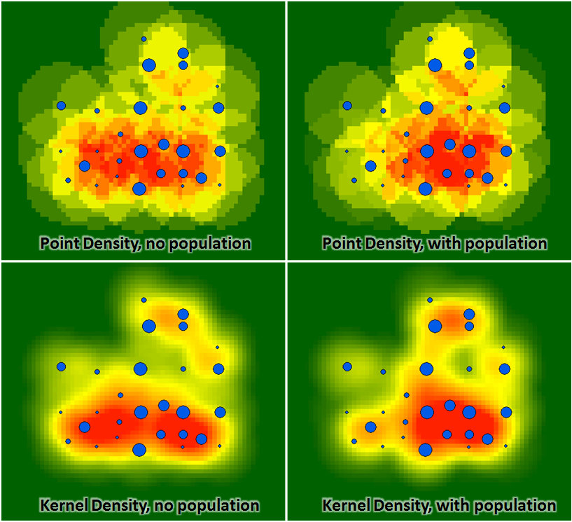

```{r setup, include=FALSE}
knitr::opts_chunk$set(echo = TRUE, fig.align = "center", tidy.opts=list(width.cutoff=80),tidy=TRUE)
```

# 1. Introduction

Singapore is one of the few countries that does not legalise short-term rentals for properties, a minimum stay of three months is still required for rental of properties as of [2019](https://www.todayonline.com/singapore/short-term-home-sharing-remains-illegal-singapore-airbnb-disappointed). Therefore, it was surprising to discover data sets for Airbnb listings located in Singapore in [Inside Airbnb]('http://insideairbnb.com/about.html'). But we shall dive deeper into this phenomenon of Airbnb being allowed in Singapore perhaps another day. 

For this exercise, we will utilising those data sets to generate useful insights through:

- Analysing the distribution of Airbnb listings in Pre-COVID Singapore using 2019 dataset
- Analysing the impact of COVID-19 on these listings based on the most updated 2021 dataset

## 1.1 The Data

For analysis purposes, the following data are used:

- Airbnb listings for June 2019 and June 2021 from [Inside Airbnb]('http://insideairbnb.com/get-the-data.html')

- Various geospatial data sets of choice extracted from SLA OneMap Service, using [OneMap.Sg API]('https://cran.r-project.org/web/packages/onemapsgapi/index.html')

# 2. Setting up the environment

To begin the study, R packages will be used for efficiency and a more comprehensive analysis, such as *tidyverse* and *sf* etc.

```{r results='hide'}

packages <- c('readr','maptools', 'sf', 'raster', 'spatstat', 'tmap', 'tidyverse', 'plotly', 'ggthemes')
for (p in packages)
  {
  if(!require(p, character.only = T))
    {
    install.packages(p)
  }
  library(p,character.only = T)
}
```

# 3. Data Wrangling

## 3.1 Aspatial Data

### 3.1.1 Importing in Aspatial Data 

We will first import in data using the Airbnb 2019 dataset, to see the distribution of listings. The analysis aims to uncover whether the distribution of Airbnb listings are affected by location factors such as near hotels or tourist attractions. 

Kernel Density Maps will be used to unravel spatial patterns between the location of listings and various location factors mentioned earlier on. The advantage of using Kernel Density over Point Density is that the results are much more spatially accurate, because Point Density usually produces more steep edges which is not desirable. On the other hand, Kernel density gives smoother results that allows for plotting nicer visuals, which is crucial for getting substantial analysis insights. 



```{r}
airbnb_2019 <- read_csv("data/the2data/airbnb2019.csv") 
```

```{r}
sg_hotels <- read_csv("data/the2data/OneMapData/hotels.csv") 
```

## Recalibrating Projected Coordinates Systems to the correct one

```{r}
coordinates(airbnb_2019)=c('longitude', 'latitude')

proj4string(airbnb_2019) <- CRS("+proj=longlat +ellps=WGS84 +datum=WGS84 +no_defs")

coordinates(sg_hotels)=c('Lng', 'Lat')

proj4string(sg_hotels) <- CRS("+proj=longlat +ellps=WGS84 +datum=WGS84 +no_defs")
```

Checking and ensuring Projected Coordinates Systems of the sf object is correct

```{r}
st_crs(airbnb_2019)
```

```{r}
tmap_mode("view")
tm_shape(airbnb_2019) +
  tm_dots(alpha = 0.4,
          col = "blue",
          size = 0.05) +
  tm_shape(sg_hotels) +
  tm_dots(alpha = 0.4,
          col = "red",
          size = 0.05) 
```


# References

- [Short-term home sharing remains illegal in Singapore; Airbnb disappointed](https://www.todayonline.com/singapore/short-term-home-sharing-remains-illegal-singapore-airbnb-disappointed)

- [Kernel vs Point Density](https://community.esri.com/t5/arcgis-spatial-analyst-questions/kernel-vs-point-density/td-p/610486)
