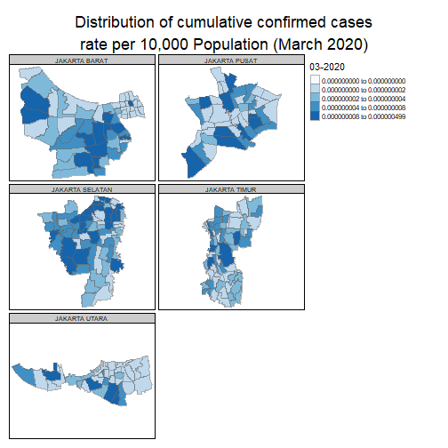
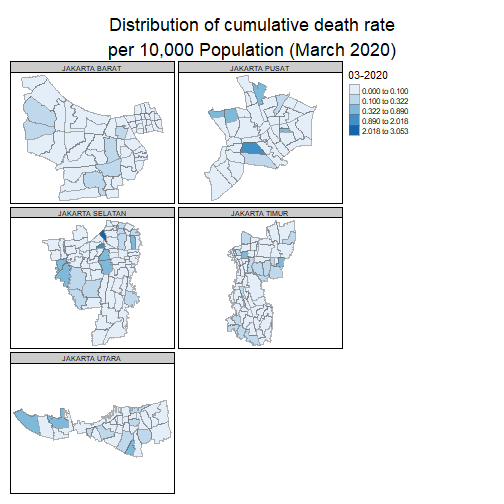
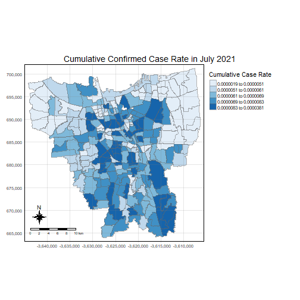
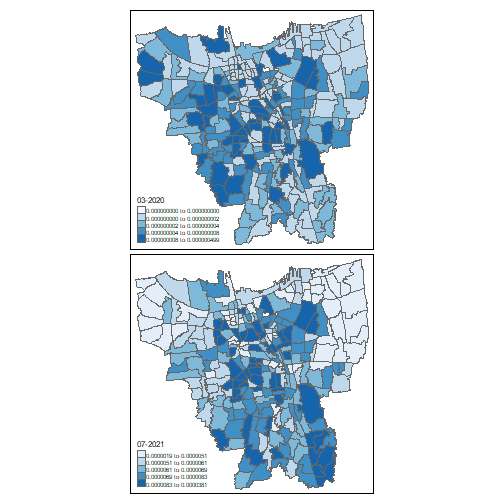
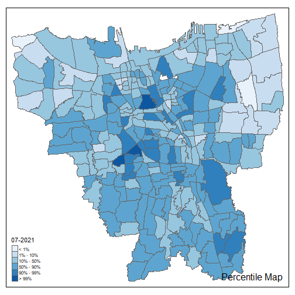
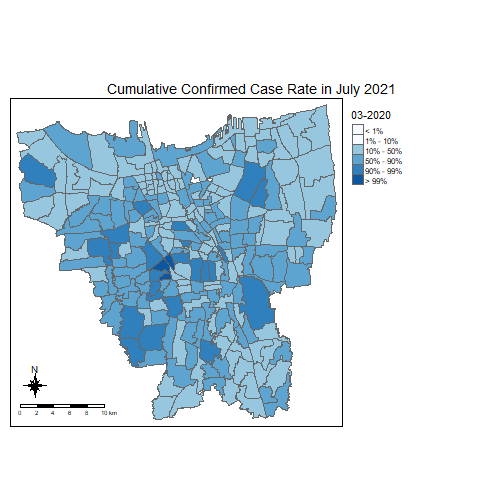
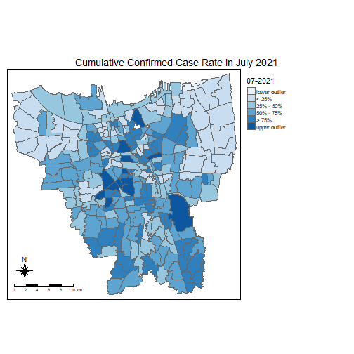

# 1. Introduction

This analysis aims to analyse and visualise spatio-temporal patterns of COVID-19 in DKI Jakarta, Indonesia. Out of 34 provinces in Indonesia, DKI Jakarta was the province affected most by the pandemic, with close to 24% of cumulative confirmed cases. However, the cumulative confirmed cases were not evenly distributed, therefore this analysis intends to unravel which sub-districts had the highest number of cases and how time has changed the overall distribution.

## THE DATA

For this analysis, the following data are used:

- [Open Data Covid-19 Provinsi DKI Jakarta](https://riwayat-file-covid-19-dki-jakarta-jakartagis.hub.arcgis.com/). This portal provides daily update of COVID-19 measures at both sub-district and district level. For the purpose of this analysis, data at the sub-district level is used. The datasets are in .CSV format, and monthly datasets from March 2020 to July 2021 will be used.

- [Indonesia Geospatial](https://www.indonesia-geospasial.com/). This portal provides a comprehensive collection of geospatial data mainly in ESRI shapefile format at different geographical levels. For the purpose of this analysis, the Shapefile (SHP) Batas Desa Provinsi DKI Jakarta provided at PODES 2019 geospatial layer is used.

# 2. Setting up the environment

- R packages will be used for efficiency and a more comprehensive analysis, such as *tidyverse* and *sf* etc.


```r
packages = c('tidyverse', 'sf', 'readxl', 'readr', 'stringr', 'tmap')
for (p in packages)
  {
  if(!require(p, character.only = T))
    {
    install.packages(p)
  }
  library(p,character.only = T)
}
```
# Prevent values from showing as exponential


# 3. Data Wrangling

# Importing aspatial Data

## List.files helps to create a list from the imported data files. The files are also imported all at once using a pattern to match the file names, ensuring full efficiency as compared to importing the files individually. The R function lapply is also complementary for this process, as well as adding the file names as an additional column to the dataframes (So as to display the data by month later on).


```r
file_list <- list.files(path = "data/the1data/COVID-DATA" , pattern = "*.xlsx",  full.names = T)
df_list <- lapply(seq_along(file_list), function(x) transform(read_xlsx(file_list[x]), MonthYear = file_list[x]))
```

## To help visualise the combined list of data. From here we can then manually check which Meninggal column is the correct one for each file, for referencing the coalesce process later on in the next few steps (E.g. For February 2021, Meninggal...1 is the correct column to use since it is the Meninggal column with no NA values.) The inspection tells us that *Meninggal...23 to Meninggal...25* is not used so we can skip those columns later on in the coalesce process.


```r
df_list
```

```
## [[1]]
##        ID_KEL Nama_provinsi       nama_kota   nama_kecamatan      nama_kelurahan SUSPEK Perawatan.RS...7 Isolasi.di.Rumah...8 Suspek.Meninggal
## 1        <NA>          <NA>            <NA>             <NA>               TOTAL 717950              197                28717             2311
## 2  3172051003   DKI JAKARTA   JAKARTA UTARA       PADEMANGAN               ANCOL    N/A              N/A                  N/A              N/A
## 3  3173041007   DKI JAKARTA   JAKARTA BARAT          TAMBORA               ANGKE    N/A              N/A                  N/A              N/A
## 4  3175041005   DKI JAKARTA   JAKARTA TIMUR      KRAMAT JATI        BALE KAMBANG    N/A              N/A                  N/A              N/A
## 5  3175031003   DKI JAKARTA   JAKARTA TIMUR       JATINEGARA         BALI MESTER    N/A              N/A                  N/A              N/A
## 6  3175101006   DKI JAKARTA   JAKARTA TIMUR         CIPAYUNG          BAMBU APUS    N/A              N/A                  N/A              N/A
## 7  3174031002   DKI JAKARTA JAKARTA SELATAN MAMPANG PRAPATAN              BANGKA    N/A              N/A                  N/A              N/A
## 8  3175051002   DKI JAKARTA   JAKARTA TIMUR       PASAR REBO                BARU    N/A              N/A                  N/A              N/A
## 9  3175041004   DKI JAKARTA   JAKARTA TIMUR      KRAMAT JATI          BATU AMPAR    N/A              N/A                  N/A              N/A
## 10 3171071002   DKI JAKARTA   JAKARTA PUSAT      TANAH ABANG     BENDUNGAN HILIR    N/A              N/A                  N/A              N/A
## 11 3175031002   DKI JAKARTA   JAKARTA TIMUR       JATINEGARA         BIDARA CINA    N/A              N/A                  N/A              N/A
## 12 3174101002   DKI JAKARTA JAKARTA SELATAN     PESANGGRAHAN             BINTARO    N/A              N/A                  N/A              N/A
## 13 3174011005   DKI JAKARTA JAKARTA SELATAN            TEBET          BUKIT DURI    N/A              N/A                  N/A              N/A
## 14 3171041006   DKI JAKARTA   JAKARTA PUSAT            SENEN              BUNGUR    N/A              N/A                  N/A              N/A
## 15 3175061007   DKI JAKARTA   JAKARTA TIMUR           CAKUNG        CAKUNG BARAT    N/A              N/A                  N/A              N/A
## 16 3175061004   DKI JAKARTA   JAKARTA TIMUR           CAKUNG        CAKUNG TIMUR    N/A              N/A                  N/A              N/A
## 17 3175041007   DKI JAKARTA   JAKARTA TIMUR      KRAMAT JATI              CAWANG    N/A              N/A                  N/A              N/A
## 18 3175101008   DKI JAKARTA   JAKARTA TIMUR         CIPAYUNG               CEGER    N/A              N/A                  N/A              N/A
## 19 3171031006   DKI JAKARTA   JAKARTA PUSAT        KEMAYORAN        CEMPAKA BARU    N/A              N/A                  N/A              N/A
## 20 3171051002   DKI JAKARTA   JAKARTA PUSAT    CEMPAKA PUTIH CEMPAKA PUTIH BARAT    N/A              N/A                  N/A              N/A
## 21 3171051001   DKI JAKARTA   JAKARTA PUSAT    CEMPAKA PUTIH CEMPAKA PUTIH TIMUR    N/A              N/A                  N/A              N/A
## 22 3173011001   DKI JAKARTA   JAKARTA BARAT       CENGKARENG    CENGKARENG BARAT    N/A              N/A                  N/A              N/A
## 23 3173011006   DKI JAKARTA   JAKARTA BARAT       CENGKARENG    CENGKARENG TIMUR    N/A              N/A                  N/A              N/A
## 24 3175091002   DKI JAKARTA   JAKARTA TIMUR          CIRACAS             CIBUBUR    N/A              N/A                  N/A              N/A
## 25 3171011002   DKI JAKARTA   JAKARTA PUSAT           GAMBIR              CIDENG    N/A              N/A                  N/A              N/A
## 26 3174091003   DKI JAKARTA JAKARTA SELATAN        JAGAKARSA            CIGANJUR    N/A              N/A                  N/A              N/A
## 27 3175051003   DKI JAKARTA   JAKARTA TIMUR       PASAR REBO           CIJANTUNG    N/A              N/A                  N/A              N/A
## 28 3171061003   DKI JAKARTA   JAKARTA PUSAT          MENTENG              CIKINI    N/A              N/A                  N/A              N/A
## 29 3174081006   DKI JAKARTA JAKARTA SELATAN         PANCORAN              CIKOKO    N/A              N/A                  N/A              N/A
##    Selesai.Isolasi...10 PROBABLE Perawatan.RS...12 Isolasi.di.Rumah...13 Probable.Meninggal Selesai.Isolasi...15 PELAKU.PERJALANAN
## 1                686725     7476                95                     0               5333                 2048              4452
## 2                   N/A      N/A               N/A                   N/A                N/A                  N/A               N/A
## 3                   N/A      N/A               N/A                   N/A                N/A                  N/A               N/A
## 4                   N/A      N/A               N/A                   N/A                N/A                  N/A               N/A
## 5                   N/A      N/A               N/A                   N/A                N/A                  N/A               N/A
## 6                   N/A      N/A               N/A                   N/A                N/A                  N/A               N/A
## 7                   N/A      N/A               N/A                   N/A                N/A                  N/A               N/A
## 8                   N/A      N/A               N/A                   N/A                N/A                  N/A               N/A
## 9                   N/A      N/A               N/A                   N/A                N/A                  N/A               N/A
## 10                  N/A      N/A               N/A                   N/A                N/A                  N/A               N/A
## 11                  N/A      N/A               N/A                   N/A                N/A                  N/A               N/A
## 12                  N/A      N/A               N/A                   N/A                N/A                  N/A               N/A
## 13                  N/A      N/A               N/A                   N/A                N/A                  N/A               N/A
## 14                  N/A      N/A               N/A                   N/A                N/A                  N/A               N/A
## 15                  N/A      N/A               N/A                   N/A                N/A                  N/A               N/A
## 16                  N/A      N/A               N/A                   N/A                N/A                  N/A               N/A
## 17                  N/A      N/A               N/A                   N/A                N/A                  N/A               N/A
## 18                  N/A      N/A               N/A                   N/A                N/A                  N/A               N/A
## 19                  N/A      N/A               N/A                   N/A                N/A                  N/A               N/A
## 20                  N/A      N/A               N/A                   N/A                N/A                  N/A               N/A
## 21                  N/A      N/A               N/A                   N/A                N/A                  N/A               N/A
## 22                  N/A      N/A               N/A                   N/A                N/A                  N/A               N/A
## 23                  N/A      N/A               N/A                   N/A                N/A                  N/A               N/A
## 24                  N/A      N/A               N/A                   N/A                N/A                  N/A               N/A
## 25                  N/A      N/A               N/A                   N/A                N/A                  N/A               N/A
## 26                  N/A      N/A               N/A                   N/A                N/A                  N/A               N/A
## 27                  N/A      N/A               N/A                   N/A                N/A                  N/A               N/A
## 28                  N/A      N/A               N/A                   N/A                N/A                  N/A               N/A
## 29                  N/A      N/A               N/A                   N/A                N/A                  N/A               N/A
##    Perawatan.RS...17 Isolasi.di.Rumah...18 Selesai.Isolasi...19 KONTAK.ERAT Perawatan.RS...21 Isolasi.di.Rumah...22 Selesai.Isolasi...23 DISCARDED
## 1                  0                     3                 4449      886591                 0                 44028               842563     17463
## 2                N/A                   N/A                  N/A         N/A               N/A                   N/A                  N/A       N/A
## 3                N/A                   N/A                  N/A         N/A               N/A                   N/A                  N/A       N/A
## 4                N/A                   N/A                  N/A         N/A               N/A                   N/A                  N/A       N/A
## 5                N/A                   N/A                  N/A         N/A               N/A                   N/A                  N/A       N/A
## 6                N/A                   N/A                  N/A         N/A               N/A                   N/A                  N/A       N/A
## 7                N/A                   N/A                  N/A         N/A               N/A                   N/A                  N/A       N/A
## 8                N/A                   N/A                  N/A         N/A               N/A                   N/A                  N/A       N/A
## 9                N/A                   N/A                  N/A         N/A               N/A                   N/A                  N/A       N/A
## 10               N/A                   N/A                  N/A         N/A               N/A                   N/A                  N/A       N/A
## 11               N/A                   N/A                  N/A         N/A               N/A                   N/A                  N/A       N/A
## 12               N/A                   N/A                  N/A         N/A               N/A                   N/A                  N/A       N/A
## 13               N/A                   N/A                  N/A         N/A               N/A                   N/A                  N/A       N/A
## 14               N/A                   N/A                  N/A         N/A               N/A                   N/A                  N/A       N/A
## 15               N/A                   N/A                  N/A         N/A               N/A                   N/A                  N/A       N/A
## 16               N/A                   N/A                  N/A         N/A               N/A                   N/A                  N/A       N/A
## 17               N/A                   N/A                  N/A         N/A               N/A                   N/A                  N/A       N/A
## 18               N/A                   N/A                  N/A         N/A               N/A                   N/A                  N/A       N/A
## 19               N/A                   N/A                  N/A         N/A               N/A                   N/A                  N/A       N/A
## 20               N/A                   N/A                  N/A         N/A               N/A                   N/A                  N/A       N/A
## 21               N/A                   N/A                  N/A         N/A               N/A                   N/A                  N/A       N/A
## 22               N/A                   N/A                  N/A         N/A               N/A                   N/A                  N/A       N/A
## 23               N/A                   N/A                  N/A         N/A               N/A                   N/A                  N/A       N/A
## 24               N/A                   N/A                  N/A         N/A               N/A                   N/A                  N/A       N/A
## 25               N/A                   N/A                  N/A         N/A               N/A                   N/A                  N/A       N/A
## 26               N/A                   N/A                  N/A         N/A               N/A                   N/A                  N/A       N/A
## 27               N/A                   N/A                  N/A         N/A               N/A                   N/A                  N/A       N/A
## 28               N/A                   N/A                  N/A         N/A               N/A                   N/A                  N/A       N/A
## 29               N/A                   N/A                  N/A         N/A               N/A                   N/A                  N/A       N/A
##    Isolasi.di.Rumah...25 Meninggal...26 Selesai.Isolasi...27 POSITIF Dirawat Sembuh Meninggal...31 Self.Isolation Keterangan
## 1                      0              1                17462  339735    4425 323892           5478           5940         NA
## 2                    N/A            N/A                  N/A     834       8    808              9              9         NA
## 3                    N/A            N/A                  N/A     617      23    572              8             14         NA
## 4                    N/A            N/A                  N/A     755       8    698             15             34         NA
## 5                    N/A            N/A                  N/A     358       4    344              8              2         NA
## 6                    N/A            N/A                  N/A     870      19    816             13             22         NA
## 7                    N/A            N/A                  N/A     811       5    788             10              8         NA
## 8                    N/A            N/A                  N/A    1038      16    987             10             25         NA
## 9                    N/A            N/A                  N/A    1447      16   1347             25             59         NA
## 10                   N/A            N/A                  N/A     898      11    856             12             19         NA
## 11                   N/A            N/A                  N/A    1073      17   1012             22             22         NA
## 12                   N/A            N/A                  N/A    1510      18   1424             30             38         NA
## 13                   N/A            N/A                  N/A     816      13    774             16             13         NA
## 14                   N/A            N/A                  N/A     634      16    596             14              8         NA
## 15                   N/A            N/A                  N/A     995      20    938             12             25         NA
## 16                   N/A            N/A                  N/A    1281      22   1209             27             23         NA
## 17                   N/A            N/A                  N/A    1198      16   1132             13             37         NA
## 18                   N/A            N/A                  N/A     721      15    678              9             19         NA
## 19                   N/A            N/A                  N/A    1344      14   1279             24             27         NA
## 20                   N/A            N/A                  N/A    1672      16   1587             29             40         NA
## 21                   N/A            N/A                  N/A    1145      13   1098             12             22         NA
## 22                   N/A            N/A                  N/A    2000      40   1880             39             41         NA
## 23                   N/A            N/A                  N/A    2264      48   2116             49             51         NA
## 24                   N/A            N/A                  N/A    1984      29   1873             29             53         NA
## 25                   N/A            N/A                  N/A     645       8    609             10             18         NA
## 26                   N/A            N/A                  N/A    1228      22   1157             21             28         NA
## 27                   N/A            N/A                  N/A    1494      19   1377             29             69         NA
## 28                   N/A            N/A                  N/A     257       5    241              5              6         NA
## 29                   N/A            N/A                  N/A     419       4    407              7              1         NA
##                                                                                     MonthYear
## 1  data/the1data/COVID-DATA/Standar Kelurahan Data Corona (28 Februari 2021 Pukul 10.00).xlsx
## 2  data/the1data/COVID-DATA/Standar Kelurahan Data Corona (28 Februari 2021 Pukul 10.00).xlsx
## 3  data/the1data/COVID-DATA/Standar Kelurahan Data Corona (28 Februari 2021 Pukul 10.00).xlsx
## 4  data/the1data/COVID-DATA/Standar Kelurahan Data Corona (28 Februari 2021 Pukul 10.00).xlsx
## 5  data/the1data/COVID-DATA/Standar Kelurahan Data Corona (28 Februari 2021 Pukul 10.00).xlsx
## 6  data/the1data/COVID-DATA/Standar Kelurahan Data Corona (28 Februari 2021 Pukul 10.00).xlsx
## 7  data/the1data/COVID-DATA/Standar Kelurahan Data Corona (28 Februari 2021 Pukul 10.00).xlsx
## 8  data/the1data/COVID-DATA/Standar Kelurahan Data Corona (28 Februari 2021 Pukul 10.00).xlsx
## 9  data/the1data/COVID-DATA/Standar Kelurahan Data Corona (28 Februari 2021 Pukul 10.00).xlsx
## 10 data/the1data/COVID-DATA/Standar Kelurahan Data Corona (28 Februari 2021 Pukul 10.00).xlsx
## 11 data/the1data/COVID-DATA/Standar Kelurahan Data Corona (28 Februari 2021 Pukul 10.00).xlsx
## 12 data/the1data/COVID-DATA/Standar Kelurahan Data Corona (28 Februari 2021 Pukul 10.00).xlsx
## 13 data/the1data/COVID-DATA/Standar Kelurahan Data Corona (28 Februari 2021 Pukul 10.00).xlsx
## 14 data/the1data/COVID-DATA/Standar Kelurahan Data Corona (28 Februari 2021 Pukul 10.00).xlsx
## 15 data/the1data/COVID-DATA/Standar Kelurahan Data Corona (28 Februari 2021 Pukul 10.00).xlsx
## 16 data/the1data/COVID-DATA/Standar Kelurahan Data Corona (28 Februari 2021 Pukul 10.00).xlsx
## 17 data/the1data/COVID-DATA/Standar Kelurahan Data Corona (28 Februari 2021 Pukul 10.00).xlsx
## 18 data/the1data/COVID-DATA/Standar Kelurahan Data Corona (28 Februari 2021 Pukul 10.00).xlsx
## 19 data/the1data/COVID-DATA/Standar Kelurahan Data Corona (28 Februari 2021 Pukul 10.00).xlsx
## 20 data/the1data/COVID-DATA/Standar Kelurahan Data Corona (28 Februari 2021 Pukul 10.00).xlsx
## 21 data/the1data/COVID-DATA/Standar Kelurahan Data Corona (28 Februari 2021 Pukul 10.00).xlsx
## 22 data/the1data/COVID-DATA/Standar Kelurahan Data Corona (28 Februari 2021 Pukul 10.00).xlsx
## 23 data/the1data/COVID-DATA/Standar Kelurahan Data Corona (28 Februari 2021 Pukul 10.00).xlsx
## 24 data/the1data/COVID-DATA/Standar Kelurahan Data Corona (28 Februari 2021 Pukul 10.00).xlsx
## 25 data/the1data/COVID-DATA/Standar Kelurahan Data Corona (28 Februari 2021 Pukul 10.00).xlsx
## 26 data/the1data/COVID-DATA/Standar Kelurahan Data Corona (28 Februari 2021 Pukul 10.00).xlsx
## 27 data/the1data/COVID-DATA/Standar Kelurahan Data Corona (28 Februari 2021 Pukul 10.00).xlsx
## 28 data/the1data/COVID-DATA/Standar Kelurahan Data Corona (28 Februari 2021 Pukul 10.00).xlsx
## 29 data/the1data/COVID-DATA/Standar Kelurahan Data Corona (28 Februari 2021 Pukul 10.00).xlsx
##  [ reached 'max' / getOption("max.print") -- omitted 241 rows ]
## 
## [[2]]
##          ID_KEL...1       ID_KEL...2    Nama_provinsi        nama_kota    nama_kecamatan        nama_kelurahan  ODP Proses.Pemantauan
## 1              <NA>             <NA>             <NA>             <NA>              <NA>                 TOTAL 8246               215
## 2   BELUM DIKETAHUI  BELUM DIKETAHUI  BELUM DIKETAHUI  BELUM DIKETAHUI   BELUM DIKETAHUI       BELUM DIKETAHUI 2649                49
## 3  LUAR DKI JAKARTA LUAR DKI JAKARTA LUAR DKI JAKARTA LUAR DKI JAKARTA  LUAR DKI JAKARTA      LUAR DKI JAKARTA 1336                22
## 4        3173061005       3173061005      DKI JAKARTA    JAKARTA BARAT        KALI DERES            PEGADUNGAN    9                 1
## 5        3174071006       3174071006      DKI JAKARTA  JAKARTA SELATAN    KEBAYORAN BARU               SENAYAN    1                 0
## 6        3173051001       3173051001      DKI JAKARTA    JAKARTA BARAT       KEBON JERUK           KEBON JERUK   24                 0
## 7        3172061001       3172061001      DKI JAKARTA    JAKARTA UTARA     KELAPA GADING   KELAPA GADING TIMUR   46                 0
## 8        3173021003       3173021003      DKI JAKARTA    JAKARTA BARAT GROGOL PETAMBURAN                TOMANG   46                 1
## 9        3175071001       3175071001      DKI JAKARTA    JAKARTA TIMUR       DUREN SAWIT           DUREN SAWIT   18                 0
## 10       3173061001       3173061001      DKI JAKARTA    JAKARTA BARAT        KALI DERES             KALIDERES   22                 1
## 11       3174051002       3174051002      DKI JAKARTA  JAKARTA SELATAN    KEBAYORAN LAMA         PONDOK PINANG   21                 2
## 12       3175071004       3175071004      DKI JAKARTA    JAKARTA TIMUR       DUREN SAWIT         PONDOK KELAPA   14                 0
## 13       3174061001       3174061001      DKI JAKARTA  JAKARTA SELATAN          CILANDAK        CILANDAK BARAT   22                 2
## 14       3173081004       3173081004      DKI JAKARTA    JAKARTA BARAT         KEMBANGAN             SRENGSENG   10                 0
## 15       3174011003       3174011003      DKI JAKARTA  JAKARTA SELATAN             TEBET         MENTENG DALAM   16                 1
## 16       3172061003       3172061003      DKI JAKARTA    JAKARTA UTARA     KELAPA GADING   KELAPA GADING BARAT   77                 1
## 17       3174031002       3174031002      DKI JAKARTA  JAKARTA SELATAN  MAMPANG PRAPATAN                BANGKA   11                 0
## 18       3175081004       3175081004      DKI JAKARTA    JAKARTA TIMUR           MAKASAR HALIM PERDANA KUSUMAH    6                 0
## 19       3172021006       3172021006      DKI JAKARTA    JAKARTA UTARA     TANJUNG PRIOK          SUNTER AGUNG   47                 4
## 20       3172011005       3172011005      DKI JAKARTA    JAKARTA UTARA       PENJARINGAN                 PLUIT   27                 1
## 21       3174091005       3174091005      DKI JAKARTA  JAKARTA SELATAN         JAGAKARSA         TANJUNG BARAT   10                 0
## 22       3173051005       3173051005      DKI JAKARTA    JAKARTA BARAT       KEBON JERUK             DURI KEPA   20                 0
## 23       3175021007       3175021007      DKI JAKARTA    JAKARTA TIMUR       PULO GADUNG                  JATI   22                 0
## 24       3174011001       3174011001      DKI JAKARTA  JAKARTA SELATAN             TEBET           TEBET TIMUR    5                 0
## 25       3174061002       3174061002      DKI JAKARTA  JAKARTA SELATAN          CILANDAK           LEBAK BULUS   25                 3
## 26       3174101002       3174101002      DKI JAKARTA  JAKARTA SELATAN      PESANGGRAHAN               BINTARO   18                 1
## 27       3171031003       3171031003      DKI JAKARTA    JAKARTA PUSAT         KEMAYORAN         HARAPAN MULIA   10                 1
## 28       3173051007       3173051007      DKI JAKARTA    JAKARTA BARAT       KEBON JERUK        KEDOYA SELATAN   18                 0
## 29       3173051004       3173051004      DKI JAKARTA    JAKARTA BARAT       KEBON JERUK            KELAPA DUA   17                 0
## 30       3175041004       3175041004      DKI JAKARTA    JAKARTA TIMUR       KRAMAT JATI            BATU AMPAR   14                 1
## 31       3174071005       3174071005      DKI JAKARTA  JAKARTA SELATAN    KEBAYORAN BARU            RAWA BARAT    5                 0
## 32       3175031006       3175031006      DKI JAKARTA    JAKARTA TIMUR        JATINEGARA        CIPINANG MUARA    9                 0
## 33       3175061003       3175061003      DKI JAKARTA    JAKARTA TIMUR            CAKUNG          PENGGILINGAN   50                 1
## 34       3174011002       3174011002      DKI JAKARTA  JAKARTA SELATAN             TEBET           TEBET BARAT    4                 0
## 35       3173021004       3173021004      DKI JAKARTA    JAKARTA BARAT GROGOL PETAMBURAN              JELAMBAR    3                 0
## 36       3174011005       3174011005      DKI JAKARTA  JAKARTA SELATAN             TEBET            BUKIT DURI   11                 0
## 37       3174021003       3174021003      DKI JAKARTA  JAKARTA SELATAN        SETIA BUDI        KARET KUNINGAN   12                 1
## 38       3173071001       3173071001      DKI JAKARTA    JAKARTA BARAT          PALMERAH              PALMERAH   23                 3
## 39       3171051002       3171051002      DKI JAKARTA    JAKARTA PUSAT     CEMPAKA PUTIH   CEMPAKA PUTIH BARAT   63                 1
## 40       3175041007       3175041007      DKI JAKARTA    JAKARTA TIMUR       KRAMAT JATI                CAWANG    5                 0
## 41       3175021006       3175021006      DKI JAKARTA    JAKARTA TIMUR       PULO GADUNG            KAYU PUTIH   26                 1
## 42       3171061001       3171061001      DKI JAKARTA    JAKARTA PUSAT           MENTENG               MENTENG   25                 0
## 43       3175051004       3175051004      DKI JAKARTA    JAKARTA TIMUR        PASAR REBO              KALISARI   14                 2
## 44       3174051001       3174051001      DKI JAKARTA  JAKARTA SELATAN    KEBAYORAN LAMA  KEBAYORAN LAMA UTARA   10                 0
## 45       3173051006       3173051006      DKI JAKARTA    JAKARTA BARAT       KEBON JERUK          KEDOYA UTARA   13                 1
## 46       3171031002       3171031002      DKI JAKARTA    JAKARTA PUSAT         KEMAYORAN          KEBON KOSONG   35                 3
## 47       3173081001       3173081001      DKI JAKARTA    JAKARTA BARAT         KEMBANGAN       KEMBANGAN UTARA    3                 0
## 48       3171081001       3171081001      DKI JAKARTA    JAKARTA PUSAT        JOHAR BARU            JOHAR BARU   31                 1
## 49       3175021002       3175021002      DKI JAKARTA    JAKARTA TIMUR       PULO GADUNG        PISANGAN TIMUR   45                 1
## 50       3172031002       3172031002      DKI JAKARTA    JAKARTA UTARA              KOJA            TUGU UTARA   40                 4
## 51       3174041006       3174041006      DKI JAKARTA  JAKARTA SELATAN      PASAR MINGGU         PEJATEN BARAT   27                 1
## 52       3173011002       3173011002      DKI JAKARTA    JAKARTA BARAT        CENGKARENG          DURI KOSAMBI   12                 0
##    Selesai.Pemantauan  PDP Masih.Dirawat Pulang.dan.Sehat POSITIF Dirawat Sembuh Meninggal Self.Isolation Keterangan
## 1                8031 5582           982             4600    4138    2073    412       381           1272          0
## 2                2600 2751           149             2602     405     328     15         7             55         NA
## 3                1314  908           118              790     754     422     62        54            216         NA
## 4                   8   16             4               12      39      12     11         3             13         NA
## 5                   1   12            12                0      17       0     15         0              2         NA
## 6                  24   13             5                8      29      12      6         4              7         NA
## 7                  46   38            10               28      30       9      9         4              8         NA
## 8                  45   10             5                5      30      10     13         1              6         NA
## 9                  18   13             9                4      29      17      5         4              3         NA
## 10                 21   13             4                9      31       9      9         5              8         NA
## 11                 19    9             6                3      30      11      1         8             10         NA
## 12                 14    6             4                2      45      21      1         5             18         NA
## 13                 20   23             6               17      24      11      5         3              5         NA
## 14                 10    8             2                6      17       4      6         2              5         NA
## 15                 15    9             0                9      18       7      3         2              6         NA
## 16                 76   28             4               24      43      16      6         3             18         NA
## 17                 11    7             3                4      11       2      5         1              3         NA
## 18                  6    6             2                4      23      13      6         2              2         NA
## 19                 43   45            25               20      66      39      4         7             16         NA
## 20                 26   24             4               20      24      13      3         2              6         NA
## 21                 10   15             2               13      15       6      1         1              7         NA
## 22                 20   12             6                6      28      15      2         2              9         NA
## 23                 22   16             9                7      18      10      2         0              6         NA
## 24                  5    3             1                2      15       5      3         3              4         NA
## 25                 22   11             0               11      20       5      3         6              6         NA
## 26                 17   11             3                8      23      11      3         6              3         NA
## 27                  9    9             3                6      11       2      1         2              6         NA
## 28                 18   11             2                9      11       3      4         1              3         NA
## 29                 17    5             0                5      12       4      2         0              6         NA
## 30                 13   10             6                4      18       4      1         2             11         NA
## 31                  5    4             3                1       7       2      4         1              0         NA
## 32                  9    3             0                3      19       6      1         2             10         NA
## 33                 49   13             8                5      27      13      3         2              9         NA
## 34                  4    8             2                6      28      16      1         2              9         NA
## 35                  3    4             1                3      13       5      3         3              2         NA
## 36                 11    9             5                4      13       4      3         3              3         NA
## 37                 11    9             1                8      12       4      3         2              3         NA
## 38                 20    8             5                3      26       9      3         4             10         NA
## 39                 62   32             7               25      30      13      3         5              9         NA
## 40                  5    5             1                4      13       6      1         1              5         NA
## 41                 25   20             6               14      31      19      1         4              7         NA
## 42                 25    8             3                5      17       8      2         4              3         NA
## 43                 12    9             2                7      16       4      2         2              8         NA
## 44                 10    8             3                5       9       4      3         1              1         NA
## 45                 12    6             2                4      14       8      1         0              5         NA
## 46                 32   14             8                6      18       5      3         4              6         NA
## 47                  3    7             4                3      16       6      3         1              6         NA
## 48                 30   16             6               10      15       5      2         1              7         NA
## 49                 44   10             5                5       7       1      1         3              2         NA
## 50                 36   18             5               13      18       7      1         2              8         NA
## 51                 26    7             5                2      12       6      0         2              4         NA
## 52                 12    6             1                5      13       6      3         1              3         NA
##                                                                                  MonthYear
## 1  data/the1data/COVID-DATA/Standar Kelurahan Data Corona (30 April 2020 Pukul 09.00).xlsx
## 2  data/the1data/COVID-DATA/Standar Kelurahan Data Corona (30 April 2020 Pukul 09.00).xlsx
## 3  data/the1data/COVID-DATA/Standar Kelurahan Data Corona (30 April 2020 Pukul 09.00).xlsx
## 4  data/the1data/COVID-DATA/Standar Kelurahan Data Corona (30 April 2020 Pukul 09.00).xlsx
## 5  data/the1data/COVID-DATA/Standar Kelurahan Data Corona (30 April 2020 Pukul 09.00).xlsx
## 6  data/the1data/COVID-DATA/Standar Kelurahan Data Corona (30 April 2020 Pukul 09.00).xlsx
## 7  data/the1data/COVID-DATA/Standar Kelurahan Data Corona (30 April 2020 Pukul 09.00).xlsx
## 8  data/the1data/COVID-DATA/Standar Kelurahan Data Corona (30 April 2020 Pukul 09.00).xlsx
## 9  data/the1data/COVID-DATA/Standar Kelurahan Data Corona (30 April 2020 Pukul 09.00).xlsx
## 10 data/the1data/COVID-DATA/Standar Kelurahan Data Corona (30 April 2020 Pukul 09.00).xlsx
## 11 data/the1data/COVID-DATA/Standar Kelurahan Data Corona (30 April 2020 Pukul 09.00).xlsx
## 12 data/the1data/COVID-DATA/Standar Kelurahan Data Corona (30 April 2020 Pukul 09.00).xlsx
## 13 data/the1data/COVID-DATA/Standar Kelurahan Data Corona (30 April 2020 Pukul 09.00).xlsx
## 14 data/the1data/COVID-DATA/Standar Kelurahan Data Corona (30 April 2020 Pukul 09.00).xlsx
## 15 data/the1data/COVID-DATA/Standar Kelurahan Data Corona (30 April 2020 Pukul 09.00).xlsx
## 16 data/the1data/COVID-DATA/Standar Kelurahan Data Corona (30 April 2020 Pukul 09.00).xlsx
## 17 data/the1data/COVID-DATA/Standar Kelurahan Data Corona (30 April 2020 Pukul 09.00).xlsx
## 18 data/the1data/COVID-DATA/Standar Kelurahan Data Corona (30 April 2020 Pukul 09.00).xlsx
## 19 data/the1data/COVID-DATA/Standar Kelurahan Data Corona (30 April 2020 Pukul 09.00).xlsx
## 20 data/the1data/COVID-DATA/Standar Kelurahan Data Corona (30 April 2020 Pukul 09.00).xlsx
## 21 data/the1data/COVID-DATA/Standar Kelurahan Data Corona (30 April 2020 Pukul 09.00).xlsx
## 22 data/the1data/COVID-DATA/Standar Kelurahan Data Corona (30 April 2020 Pukul 09.00).xlsx
## 23 data/the1data/COVID-DATA/Standar Kelurahan Data Corona (30 April 2020 Pukul 09.00).xlsx
## 24 data/the1data/COVID-DATA/Standar Kelurahan Data Corona (30 April 2020 Pukul 09.00).xlsx
## 25 data/the1data/COVID-DATA/Standar Kelurahan Data Corona (30 April 2020 Pukul 09.00).xlsx
## 26 data/the1data/COVID-DATA/Standar Kelurahan Data Corona (30 April 2020 Pukul 09.00).xlsx
## 27 data/the1data/COVID-DATA/Standar Kelurahan Data Corona (30 April 2020 Pukul 09.00).xlsx
## 28 data/the1data/COVID-DATA/Standar Kelurahan Data Corona (30 April 2020 Pukul 09.00).xlsx
## 29 data/the1data/COVID-DATA/Standar Kelurahan Data Corona (30 April 2020 Pukul 09.00).xlsx
## 30 data/the1data/COVID-DATA/Standar Kelurahan Data Corona (30 April 2020 Pukul 09.00).xlsx
## 31 data/the1data/COVID-DATA/Standar Kelurahan Data Corona (30 April 2020 Pukul 09.00).xlsx
## 32 data/the1data/COVID-DATA/Standar Kelurahan Data Corona (30 April 2020 Pukul 09.00).xlsx
## 33 data/the1data/COVID-DATA/Standar Kelurahan Data Corona (30 April 2020 Pukul 09.00).xlsx
## 34 data/the1data/COVID-DATA/Standar Kelurahan Data Corona (30 April 2020 Pukul 09.00).xlsx
## 35 data/the1data/COVID-DATA/Standar Kelurahan Data Corona (30 April 2020 Pukul 09.00).xlsx
## 36 data/the1data/COVID-DATA/Standar Kelurahan Data Corona (30 April 2020 Pukul 09.00).xlsx
## 37 data/the1data/COVID-DATA/Standar Kelurahan Data Corona (30 April 2020 Pukul 09.00).xlsx
## 38 data/the1data/COVID-DATA/Standar Kelurahan Data Corona (30 April 2020 Pukul 09.00).xlsx
## 39 data/the1data/COVID-DATA/Standar Kelurahan Data Corona (30 April 2020 Pukul 09.00).xlsx
## 40 data/the1data/COVID-DATA/Standar Kelurahan Data Corona (30 April 2020 Pukul 09.00).xlsx
## 41 data/the1data/COVID-DATA/Standar Kelurahan Data Corona (30 April 2020 Pukul 09.00).xlsx
## 42 data/the1data/COVID-DATA/Standar Kelurahan Data Corona (30 April 2020 Pukul 09.00).xlsx
## 43 data/the1data/COVID-DATA/Standar Kelurahan Data Corona (30 April 2020 Pukul 09.00).xlsx
## 44 data/the1data/COVID-DATA/Standar Kelurahan Data Corona (30 April 2020 Pukul 09.00).xlsx
## 45 data/the1data/COVID-DATA/Standar Kelurahan Data Corona (30 April 2020 Pukul 09.00).xlsx
## 46 data/the1data/COVID-DATA/Standar Kelurahan Data Corona (30 April 2020 Pukul 09.00).xlsx
## 47 data/the1data/COVID-DATA/Standar Kelurahan Data Corona (30 April 2020 Pukul 09.00).xlsx
## 48 data/the1data/COVID-DATA/Standar Kelurahan Data Corona (30 April 2020 Pukul 09.00).xlsx
## 49 data/the1data/COVID-DATA/Standar Kelurahan Data Corona (30 April 2020 Pukul 09.00).xlsx
## 50 data/the1data/COVID-DATA/Standar Kelurahan Data Corona (30 April 2020 Pukul 09.00).xlsx
## 51 data/the1data/COVID-DATA/Standar Kelurahan Data Corona (30 April 2020 Pukul 09.00).xlsx
## 52 data/the1data/COVID-DATA/Standar Kelurahan Data Corona (30 April 2020 Pukul 09.00).xlsx
##  [ reached 'max' / getOption("max.print") -- omitted 218 rows ]
## 
## [[3]]
##        ID_KEL Nama_provinsi       nama_kota   nama_kecamatan      nama_kelurahan SUSPEK Perawatan.RS...7 Isolasi.di.Rumah...8 Suspek.Meninggal
## 1        <NA>          <NA>            <NA>             <NA>               TOTAL 887079              189                23042             2311
## 2  3172051003   DKI JAKARTA   JAKARTA UTARA       PADEMANGAN               ANCOL    N/A              N/A                  N/A              N/A
## 3  3173041007   DKI JAKARTA   JAKARTA BARAT          TAMBORA               ANGKE    N/A              N/A                  N/A              N/A
## 4  3175041005   DKI JAKARTA   JAKARTA TIMUR      KRAMAT JATI        BALE KAMBANG    N/A              N/A                  N/A              N/A
## 5  3175031003   DKI JAKARTA   JAKARTA TIMUR       JATINEGARA         BALI MESTER    N/A              N/A                  N/A              N/A
## 6  3175101006   DKI JAKARTA   JAKARTA TIMUR         CIPAYUNG          BAMBU APUS    N/A              N/A                  N/A              N/A
## 7  3174031002   DKI JAKARTA JAKARTA SELATAN MAMPANG PRAPATAN              BANGKA    N/A              N/A                  N/A              N/A
## 8  3175051002   DKI JAKARTA   JAKARTA TIMUR       PASAR REBO                BARU    N/A              N/A                  N/A              N/A
## 9  3175041004   DKI JAKARTA   JAKARTA TIMUR      KRAMAT JATI          BATU AMPAR    N/A              N/A                  N/A              N/A
## 10 3171071002   DKI JAKARTA   JAKARTA PUSAT      TANAH ABANG     BENDUNGAN HILIR    N/A              N/A                  N/A              N/A
## 11 3175031002   DKI JAKARTA   JAKARTA TIMUR       JATINEGARA         BIDARA CINA    N/A              N/A                  N/A              N/A
## 12 3174101002   DKI JAKARTA JAKARTA SELATAN     PESANGGRAHAN             BINTARO    N/A              N/A                  N/A              N/A
## 13 3174011005   DKI JAKARTA JAKARTA SELATAN            TEBET          BUKIT DURI    N/A              N/A                  N/A              N/A
## 14 3171041006   DKI JAKARTA   JAKARTA PUSAT            SENEN              BUNGUR    N/A              N/A                  N/A              N/A
## 15 3175061007   DKI JAKARTA   JAKARTA TIMUR           CAKUNG        CAKUNG BARAT    N/A              N/A                  N/A              N/A
## 16 3175061004   DKI JAKARTA   JAKARTA TIMUR           CAKUNG        CAKUNG TIMUR    N/A              N/A                  N/A              N/A
## 17 3175041007   DKI JAKARTA   JAKARTA TIMUR      KRAMAT JATI              CAWANG    N/A              N/A                  N/A              N/A
## 18 3175101008   DKI JAKARTA   JAKARTA TIMUR         CIPAYUNG               CEGER    N/A              N/A                  N/A              N/A
## 19 3171031006   DKI JAKARTA   JAKARTA PUSAT        KEMAYORAN        CEMPAKA BARU    N/A              N/A                  N/A              N/A
## 20 3171051002   DKI JAKARTA   JAKARTA PUSAT    CEMPAKA PUTIH CEMPAKA PUTIH BARAT    N/A              N/A                  N/A              N/A
## 21 3171051001   DKI JAKARTA   JAKARTA PUSAT    CEMPAKA PUTIH CEMPAKA PUTIH TIMUR    N/A              N/A                  N/A              N/A
## 22 3173011001   DKI JAKARTA   JAKARTA BARAT       CENGKARENG    CENGKARENG BARAT    N/A              N/A                  N/A              N/A
## 23 3173011006   DKI JAKARTA   JAKARTA BARAT       CENGKARENG    CENGKARENG TIMUR    N/A              N/A                  N/A              N/A
## 24 3175091002   DKI JAKARTA   JAKARTA TIMUR          CIRACAS             CIBUBUR    N/A              N/A                  N/A              N/A
## 25 3171011002   DKI JAKARTA   JAKARTA PUSAT           GAMBIR              CIDENG    N/A              N/A                  N/A              N/A
## 26 3174091003   DKI JAKARTA JAKARTA SELATAN        JAGAKARSA            CIGANJUR    N/A              N/A                  N/A              N/A
## 27 3175051003   DKI JAKARTA   JAKARTA TIMUR       PASAR REBO           CIJANTUNG    N/A              N/A                  N/A              N/A
## 28 3171061003   DKI JAKARTA   JAKARTA PUSAT          MENTENG              CIKINI    N/A              N/A                  N/A              N/A
## 29 3174081006   DKI JAKARTA JAKARTA SELATAN         PANCORAN              CIKOKO    N/A              N/A                  N/A              N/A
##    Selesai.Isolasi...10 PROBABLE Perawatan.RS...12 Isolasi.di.Rumah...13 Probable.Meninggal Selesai.Isolasi...15 PELAKU.PERJALANAN
## 1                861537    10790               571                     0               6948                 3271             22555
## 2                   N/A      N/A               N/A                   N/A                N/A                  N/A               N/A
## 3                   N/A      N/A               N/A                   N/A                N/A                  N/A               N/A
## 4                   N/A      N/A               N/A                   N/A                N/A                  N/A               N/A
## 5                   N/A      N/A               N/A                   N/A                N/A                  N/A               N/A
## 6                   N/A      N/A               N/A                   N/A                N/A                  N/A               N/A
## 7                   N/A      N/A               N/A                   N/A                N/A                  N/A               N/A
## 8                   N/A      N/A               N/A                   N/A                N/A                  N/A               N/A
## 9                   N/A      N/A               N/A                   N/A                N/A                  N/A               N/A
## 10                  N/A      N/A               N/A                   N/A                N/A                  N/A               N/A
## 11                  N/A      N/A               N/A                   N/A                N/A                  N/A               N/A
## 12                  N/A      N/A               N/A                   N/A                N/A                  N/A               N/A
## 13                  N/A      N/A               N/A                   N/A                N/A                  N/A               N/A
## 14                  N/A      N/A               N/A                   N/A                N/A                  N/A               N/A
## 15                  N/A      N/A               N/A                   N/A                N/A                  N/A               N/A
## 16                  N/A      N/A               N/A                   N/A                N/A                  N/A               N/A
## 17                  N/A      N/A               N/A                   N/A                N/A                  N/A               N/A
## 18                  N/A      N/A               N/A                   N/A                N/A                  N/A               N/A
## 19                  N/A      N/A               N/A                   N/A                N/A                  N/A               N/A
## 20                  N/A      N/A               N/A                   N/A                N/A                  N/A               N/A
## 21                  N/A      N/A               N/A                   N/A                N/A                  N/A               N/A
## 22                  N/A      N/A               N/A                   N/A                N/A                  N/A               N/A
## 23                  N/A      N/A               N/A                   N/A                N/A                  N/A               N/A
## 24                  N/A      N/A               N/A                   N/A                N/A                  N/A               N/A
## 25                  N/A      N/A               N/A                   N/A                N/A                  N/A               N/A
## 26                  N/A      N/A               N/A                   N/A                N/A                  N/A               N/A
## 27                  N/A      N/A               N/A                   N/A                N/A                  N/A               N/A
## 28                  N/A      N/A               N/A                   N/A                N/A                  N/A               N/A
## 29                  N/A      N/A               N/A                   N/A                N/A                  N/A               N/A
##    Perawatan.RS...17 Isolasi.di.Rumah...18 Selesai.Isolasi...19 KONTAK.ERAT Perawatan.RS...21 Isolasi.di.Rumah...22 Selesai.Isolasi...23 DISCARDED
## 1                  0                  5636                16919     1258215                 0                 29442              1228773     17553
## 2                N/A                   N/A                  N/A         N/A               N/A                   N/A                  N/A       N/A
## 3                N/A                   N/A                  N/A         N/A               N/A                   N/A                  N/A       N/A
## 4                N/A                   N/A                  N/A         N/A               N/A                   N/A                  N/A       N/A
## 5                N/A                   N/A                  N/A         N/A               N/A                   N/A                  N/A       N/A
## 6                N/A                   N/A                  N/A         N/A               N/A                   N/A                  N/A       N/A
## 7                N/A                   N/A                  N/A         N/A               N/A                   N/A                  N/A       N/A
## 8                N/A                   N/A                  N/A         N/A               N/A                   N/A                  N/A       N/A
## 9                N/A                   N/A                  N/A         N/A               N/A                   N/A                  N/A       N/A
## 10               N/A                   N/A                  N/A         N/A               N/A                   N/A                  N/A       N/A
## 11               N/A                   N/A                  N/A         N/A               N/A                   N/A                  N/A       N/A
## 12               N/A                   N/A                  N/A         N/A               N/A                   N/A                  N/A       N/A
## 13               N/A                   N/A                  N/A         N/A               N/A                   N/A                  N/A       N/A
## 14               N/A                   N/A                  N/A         N/A               N/A                   N/A                  N/A       N/A
## 15               N/A                   N/A                  N/A         N/A               N/A                   N/A                  N/A       N/A
## 16               N/A                   N/A                  N/A         N/A               N/A                   N/A                  N/A       N/A
## 17               N/A                   N/A                  N/A         N/A               N/A                   N/A                  N/A       N/A
## 18               N/A                   N/A                  N/A         N/A               N/A                   N/A                  N/A       N/A
## 19               N/A                   N/A                  N/A         N/A               N/A                   N/A                  N/A       N/A
## 20               N/A                   N/A                  N/A         N/A               N/A                   N/A                  N/A       N/A
## 21               N/A                   N/A                  N/A         N/A               N/A                   N/A                  N/A       N/A
## 22               N/A                   N/A                  N/A         N/A               N/A                   N/A                  N/A       N/A
## 23               N/A                   N/A                  N/A         N/A               N/A                   N/A                  N/A       N/A
## 24               N/A                   N/A                  N/A         N/A               N/A                   N/A                  N/A       N/A
## 25               N/A                   N/A                  N/A         N/A               N/A                   N/A                  N/A       N/A
## 26               N/A                   N/A                  N/A         N/A               N/A                   N/A                  N/A       N/A
## 27               N/A                   N/A                  N/A         N/A               N/A                   N/A                  N/A       N/A
## 28               N/A                   N/A                  N/A         N/A               N/A                   N/A                  N/A       N/A
## 29               N/A                   N/A                  N/A         N/A               N/A                   N/A                  N/A       N/A
##    Isolasi.di.Rumah...25 Meninggal...26 Selesai.Isolasi...27 POSITIF Dirawat Sembuh Meninggal...31 Self.Isolation Keterangan
## 1                      0              1                17552  408620    3527 394939           6733           3421         NA
## 2                    N/A            N/A                  N/A     956       8    928             11              9         NA
## 3                    N/A            N/A                  N/A     763       3    739             14              7         NA
## 4                    N/A            N/A                  N/A     992      11    954             18              9         NA
## 5                    N/A            N/A                  N/A     391       1    380              8              2         NA
## 6                    N/A            N/A                  N/A    1106      13   1060             15             18         NA
## 7                    N/A            N/A                  N/A     926       3    896             12             15         NA
## 8                    N/A            N/A                  N/A    1316       7   1280             15             14         NA
## 9                    N/A            N/A                  N/A    1799      20   1738             30             11         NA
## 10                   N/A            N/A                  N/A    1072      18   1032             16              6         NA
## 11                   N/A            N/A                  N/A    1390       7   1334             28             21         NA
## 12                   N/A            N/A                  N/A    1841      11   1781             39             10         NA
## 13                   N/A            N/A                  N/A    1024      14    983             19              8         NA
## 14                   N/A            N/A                  N/A     735      15    703             16              1         NA
## 15                   N/A            N/A                  N/A    1126      12   1092             15              7         NA
## 16                   N/A            N/A                  N/A    1463      11   1411             29             12         NA
## 17                   N/A            N/A                  N/A    1502      17   1452             19             14         NA
## 18                   N/A            N/A                  N/A     937       5    911             12              9         NA
## 19                   N/A            N/A                  N/A    1558      11   1497             29             21         NA
## 20                   N/A            N/A                  N/A    2000      24   1925             39             12         NA
## 21                   N/A            N/A                  N/A    1380      13   1347             19              1         NA
## 22                   N/A            N/A                  N/A    2479      27   2354             47             51         NA
## 23                   N/A            N/A                  N/A    2699      24   2586             56             33         NA
## 24                   N/A            N/A                  N/A    2556      22   2442             40             52         NA
## 25                   N/A            N/A                  N/A     745       3    725             12              5         NA
## 26                   N/A            N/A                  N/A    1620      13   1548             27             32         NA
## 27                   N/A            N/A                  N/A    1886      14   1818             46              8         NA
## 28                   N/A            N/A                  N/A     320       5    303              8              4         NA
## 29                   N/A            N/A                  N/A     510      11    486              7              6         NA
##                                                                                  MonthYear
## 1  data/the1data/COVID-DATA/Standar Kelurahan Data Corona (30 April 2021 Pukul 10.00).xlsx
## 2  data/the1data/COVID-DATA/Standar Kelurahan Data Corona (30 April 2021 Pukul 10.00).xlsx
## 3  data/the1data/COVID-DATA/Standar Kelurahan Data Corona (30 April 2021 Pukul 10.00).xlsx
## 4  data/the1data/COVID-DATA/Standar Kelurahan Data Corona (30 April 2021 Pukul 10.00).xlsx
## 5  data/the1data/COVID-DATA/Standar Kelurahan Data Corona (30 April 2021 Pukul 10.00).xlsx
## 6  data/the1data/COVID-DATA/Standar Kelurahan Data Corona (30 April 2021 Pukul 10.00).xlsx
## 7  data/the1data/COVID-DATA/Standar Kelurahan Data Corona (30 April 2021 Pukul 10.00).xlsx
## 8  data/the1data/COVID-DATA/Standar Kelurahan Data Corona (30 April 2021 Pukul 10.00).xlsx
## 9  data/the1data/COVID-DATA/Standar Kelurahan Data Corona (30 April 2021 Pukul 10.00).xlsx
## 10 data/the1data/COVID-DATA/Standar Kelurahan Data Corona (30 April 2021 Pukul 10.00).xlsx
## 11 data/the1data/COVID-DATA/Standar Kelurahan Data Corona (30 April 2021 Pukul 10.00).xlsx
## 12 data/the1data/COVID-DATA/Standar Kelurahan Data Corona (30 April 2021 Pukul 10.00).xlsx
## 13 data/the1data/COVID-DATA/Standar Kelurahan Data Corona (30 April 2021 Pukul 10.00).xlsx
## 14 data/the1data/COVID-DATA/Standar Kelurahan Data Corona (30 April 2021 Pukul 10.00).xlsx
## 15 data/the1data/COVID-DATA/Standar Kelurahan Data Corona (30 April 2021 Pukul 10.00).xlsx
## 16 data/the1data/COVID-DATA/Standar Kelurahan Data Corona (30 April 2021 Pukul 10.00).xlsx
## 17 data/the1data/COVID-DATA/Standar Kelurahan Data Corona (30 April 2021 Pukul 10.00).xlsx
## 18 data/the1data/COVID-DATA/Standar Kelurahan Data Corona (30 April 2021 Pukul 10.00).xlsx
## 19 data/the1data/COVID-DATA/Standar Kelurahan Data Corona (30 April 2021 Pukul 10.00).xlsx
## 20 data/the1data/COVID-DATA/Standar Kelurahan Data Corona (30 April 2021 Pukul 10.00).xlsx
## 21 data/the1data/COVID-DATA/Standar Kelurahan Data Corona (30 April 2021 Pukul 10.00).xlsx
## 22 data/the1data/COVID-DATA/Standar Kelurahan Data Corona (30 April 2021 Pukul 10.00).xlsx
## 23 data/the1data/COVID-DATA/Standar Kelurahan Data Corona (30 April 2021 Pukul 10.00).xlsx
## 24 data/the1data/COVID-DATA/Standar Kelurahan Data Corona (30 April 2021 Pukul 10.00).xlsx
## 25 data/the1data/COVID-DATA/Standar Kelurahan Data Corona (30 April 2021 Pukul 10.00).xlsx
## 26 data/the1data/COVID-DATA/Standar Kelurahan Data Corona (30 April 2021 Pukul 10.00).xlsx
## 27 data/the1data/COVID-DATA/Standar Kelurahan Data Corona (30 April 2021 Pukul 10.00).xlsx
## 28 data/the1data/COVID-DATA/Standar Kelurahan Data Corona (30 April 2021 Pukul 10.00).xlsx
## 29 data/the1data/COVID-DATA/Standar Kelurahan Data Corona (30 April 2021 Pukul 10.00).xlsx
##  [ reached 'max' / getOption("max.print") -- omitted 241 rows ]
## 
## [[4]]
##        ID_KEL Nama_provinsi       nama_kota   nama_kecamatan      nama_kelurahan SUSPEK Perawatan.RS...7 Isolasi.di.Rumah...8 Suspek.Meninggal
## 1        <NA>          <NA>            <NA>             <NA>               TOTAL 593699              245                16800             2311
## 2  3172051003   DKI JAKARTA   JAKARTA UTARA       PADEMANGAN               ANCOL   1629                0                   50                0
## 3  3173041007   DKI JAKARTA   JAKARTA BARAT          TAMBORA               ANGKE   1367                0                   42                2
## 4  3175041005   DKI JAKARTA   JAKARTA TIMUR      KRAMAT JATI        BALE KAMBANG    948                1                   38                1
## 5  3175031003   DKI JAKARTA   JAKARTA TIMUR       JATINEGARA         BALI MESTER    273                0                    4                1
## 6  3175101006   DKI JAKARTA   JAKARTA TIMUR         CIPAYUNG          BAMBU APUS   1501                2                   39                1
## 7  3174031002   DKI JAKARTA JAKARTA SELATAN MAMPANG PRAPATAN              BANGKA   1230                1                   42                2
## 8  3175051002   DKI JAKARTA   JAKARTA TIMUR       PASAR REBO                BARU   1265                0                   33                1
## 9  3175041004   DKI JAKARTA   JAKARTA TIMUR      KRAMAT JATI          BATU AMPAR   1645                0                   84                1
## 10 3171071002   DKI JAKARTA   JAKARTA PUSAT      TANAH ABANG     BENDUNGAN HILIR   1721                1                   41                0
## 11 3175031002   DKI JAKARTA   JAKARTA TIMUR       JATINEGARA         BIDARA CINA   1064                0                   34                3
## 12 3174101002   DKI JAKARTA JAKARTA SELATAN     PESANGGRAHAN             BINTARO   2973                3                  119                2
## 13 3174011005   DKI JAKARTA JAKARTA SELATAN            TEBET          BUKIT DURI   1221                1                   44                3
## 14 3171041006   DKI JAKARTA   JAKARTA PUSAT            SENEN              BUNGUR    705                0                   38                2
## 15 3175061007   DKI JAKARTA   JAKARTA TIMUR           CAKUNG        CAKUNG BARAT   1166                0                   50                1
## 16 3175061004   DKI JAKARTA   JAKARTA TIMUR           CAKUNG        CAKUNG TIMUR   1363                0                   50                2
## 17 3175041007   DKI JAKARTA   JAKARTA TIMUR      KRAMAT JATI              CAWANG   1125                0                   46                0
## 18 3175101008   DKI JAKARTA   JAKARTA TIMUR         CIPAYUNG               CEGER    897                0                   16                0
## 19 3171031006   DKI JAKARTA   JAKARTA PUSAT        KEMAYORAN        CEMPAKA BARU   1637                3                   76                2
## 20 3171051002   DKI JAKARTA   JAKARTA PUSAT    CEMPAKA PUTIH CEMPAKA PUTIH BARAT   2904                3                   59                2
## 21 3171051001   DKI JAKARTA   JAKARTA PUSAT    CEMPAKA PUTIH CEMPAKA PUTIH TIMUR   2476                1                   60                1
## 22 3173011001   DKI JAKARTA   JAKARTA BARAT       CENGKARENG    CENGKARENG BARAT   3512                0                   42                1
## 23 3173011006   DKI JAKARTA   JAKARTA BARAT       CENGKARENG    CENGKARENG TIMUR   3425                0                   59                7
## 24 3175091002   DKI JAKARTA   JAKARTA TIMUR          CIRACAS             CIBUBUR   3168                2                  107                4
## 25 3171011002   DKI JAKARTA   JAKARTA PUSAT           GAMBIR              CIDENG   1021                0                   31                2
## 26 3174091003   DKI JAKARTA JAKARTA SELATAN        JAGAKARSA            CIGANJUR   2028                1                   53                1
## 27 3175051003   DKI JAKARTA   JAKARTA TIMUR       PASAR REBO           CIJANTUNG   2154                0                   57                3
## 28 3171061003   DKI JAKARTA   JAKARTA PUSAT          MENTENG              CIKINI    401                0                   14                0
## 29 3174081006   DKI JAKARTA JAKARTA SELATAN         PANCORAN              CIKOKO    537                0                   13                0
##    Selesai.Isolasi...10 PROBABLE Perawatan.RS...12 Isolasi.di.Rumah...13 Probable.Meninggal Selesai.Isolasi...15 PELAKU.PERJALANAN
## 1                574343     6762                79                     0               5333                 1350              3976
## 2                  1579        5                 0                     0                  0                    5                18
## 3                  1323        3                 0                     0                  1                    2                 2
## 4                   908        8                 0                     0                  0                    8                 6
## 5                   268        3                 0                     0                  0                    3                 1
## 6                  1459        2                 0                     0                  0                    2                 7
## 7                  1185        7                 0                     0                  1                    6                18
## 8                  1231        0                 0                     0                  0                    0                 5
## 9                  1560        7                 0                     0                  0                    7                 6
## 10                 1679        7                 0                     0                  0                    7                 8
## 11                 1027        6                 0                     0                  0                    6                 9
## 12                 2849        9                 3                     0                  0                    6                10
## 13                 1173        3                 0                     0                  0                    3                17
## 14                  665        3                 0                     0                  0                    3                21
## 15                 1115        4                 0                     0                  0                    4                 1
## 16                 1311        4                 0                     0                  1                    3                 7
## 17                 1079        4                 0                     0                  0                    4                 8
## 18                  881        0                 0                     0                  0                    0                 3
## 19                 1556        1                 0                     0                  0                    1                10
## 20                 2840       14                 0                     0                  0                   14                27
## 21                 2414        4                 0                     0                  0                    4                15
## 22                 3469        6                 0                     0                  0                    6                 8
## 23                 3359        9                 1                     0                  0                    8                 4
## 24                 3055        2                 0                     0                  0                    2                35
## 25                  988        3                 0                     0                  0                    3                14
## 26                 1973        5                 0                     0                  0                    5                12
## 27                 2094        1                 0                     0                  0                    1                14
## 28                  387        2                 0                     0                  0                    2                 3
## 29                  524        1                 0                     0                  0                    1                10
##    Perawatan.RS...17 Isolasi.di.Rumah...18 Selesai.Isolasi...19 KONTAK.ERAT Perawatan.RS...21 Isolasi.di.Rumah...22 Selesai.Isolasi...23 DISCARDED
## 1                  0                    18                 3958      687547                 0                 15608               671939     16740
## 2                  0                     0                   18        1195                 0                    18                 1177        15
## 3                  0                     0                    2         802                 0                    12                  790        27
## 4                  0                     0                    6        1381                 0                    60                 1321        29
## 5                  0                     0                    1         533                 0                     2                  531        11
## 6                  0                     0                    7        1729                 0                    44                 1685        26
## 7                  0                     0                   18        1793                 0                    25                 1768        10
## 8                  0                     0                    5         851                 0                    13                  838        20
## 9                  0                     0                    6        2766                 0                   101                 2665        31
## 10                 0                     0                    8        1594                 0                    14                 1580        12
## 11                 0                     0                    9        1448                 0                    32                 1416        44
## 12                 0                     0                   10        2936                 0                   124                 2812        31
## 13                 0                     0                   17        1195                 0                    37                 1158        21
## 14                 0                     0                   21        1144                 0                    60                 1084        23
## 15                 0                     0                    1        1551                 0                    63                 1488        73
## 16                 0                     0                    7        2051                 0                    54                 1997        68
## 17                 0                     0                    8        2257                 0                   128                 2129        25
## 18                 0                     0                    3        1110                 0                    14                 1096        12
## 19                 0                     0                   10        1943                 0                    89                 1854        45
## 20                 0                     0                   27        3585                 0                    97                 3488        62
## 21                 0                     0                   15        2930                 0                    61                 2869        68
## 22                 0                     0                    8        3953                 0                    55                 3898        16
## 23                 0                     0                    4        3616                 0                    51                 3565        21
## 24                 0                     0                   35        3800                 0                   202                 3598       102
## 25                 0                     0                   14        1305                 0                    33                 1272        14
## 26                 0                     0                   12        1858                 0                    28                 1830        21
## 27                 0                     0                   14        1236                 0                    28                 1208        16
## 28                 0                     0                    3         707                 0                    20                  687        12
## 29                 0                     0                   10         689                 0                    40                  649         4
##    Isolasi.di.Rumah...25 Meninggal...26 Selesai.Isolasi...27 POSITIF Dirawat Sembuh Meninggal...31 Self.Isolation Keterangan
## 1                      0              1                16739  266244    3056 238395           4254          20539         NA
## 2                      0              0                   15     599       6    546              7             40         NA
## 3                      0              0                   27     422       1    371              6             44         NA
## 4                      0              0                   29     559       7    494             11             47         NA
## 5                      0              0                   11     300       5    280              4             11         NA
## 6                      0              0                   26     651      16    559              9             67         NA
## 7                      0              0                   10     644       1    562              7             74         NA
## 8                      0              0                   20     692      15    617              5             55         NA
## 9                      0              0                   31    1057       7    941             15             94         NA
## 10                     0              0                   12     705       8    644             10             43         NA
## 11                     0              0                   44     805       9    750             16             30         NA
## 12                     0              0                   31    1129      11    996             23             99         NA
## 13                     0              0                   21     603       4    516             13             70         NA
## 14                     0              0                   23     487      10    434              9             34         NA
## 15                     0              0                   73     785      10    726             10             39         NA
## 16                     0              0                   68     944      16    839             17             72         NA
## 17                     0              0                   25     907       8    812             11             76         NA
## 18                     0              0                   12     452       1    402              6             43         NA
## 19                     0              0                   45    1027       9    874             20            124         NA
## 20                     0              0                   62    1345      22   1202             22             99         NA
## 21                     0              0                   68     877      14    786             11             66         NA
## 22                     0              0                   16    1545      14   1390             30            111         NA
## 23                     0              0                   21    1712      26   1498             36            152         NA
## 24                     0              0                  102    1387      11   1221             22            133         NA
## 25                     0              0                   14     502      14    430             10             48         NA
## 26                     0              0                   21     861       3    776             11             71         NA
## 27                     0              0                   16    1039      10    926             20             83         NA
## 28                     0              0                   12     210       3    189              3             15         NA
## 29                     0              0                    4     300       6    253              6             35         NA
##                                                                                    MonthYear
## 1  data/the1data/COVID-DATA/Standar Kelurahan Data Corona (30 Januari 2021 Pukul 10.00).xlsx
## 2  data/the1data/COVID-DATA/Standar Kelurahan Data Corona (30 Januari 2021 Pukul 10.00).xlsx
## 3  data/the1data/COVID-DATA/Standar Kelurahan Data Corona (30 Januari 2021 Pukul 10.00).xlsx
## 4  data/the1data/COVID-DATA/Standar Kelurahan Data Corona (30 Januari 2021 Pukul 10.00).xlsx
## 5  data/the1data/COVID-DATA/Standar Kelurahan Data Corona (30 Januari 2021 Pukul 10.00).xlsx
## 6  data/the1data/COVID-DATA/Standar Kelurahan Data Corona (30 Januari 2021 Pukul 10.00).xlsx
## 7  data/the1data/COVID-DATA/Standar Kelurahan Data Corona (30 Januari 2021 Pukul 10.00).xlsx
## 8  data/the1data/COVID-DATA/Standar Kelurahan Data Corona (30 Januari 2021 Pukul 10.00).xlsx
## 9  data/the1data/COVID-DATA/Standar Kelurahan Data Corona (30 Januari 2021 Pukul 10.00).xlsx
## 10 data/the1data/COVID-DATA/Standar Kelurahan Data Corona (30 Januari 2021 Pukul 10.00).xlsx
## 11 data/the1data/COVID-DATA/Standar Kelurahan Data Corona (30 Januari 2021 Pukul 10.00).xlsx
## 12 data/the1data/COVID-DATA/Standar Kelurahan Data Corona (30 Januari 2021 Pukul 10.00).xlsx
## 13 data/the1data/COVID-DATA/Standar Kelurahan Data Corona (30 Januari 2021 Pukul 10.00).xlsx
## 14 data/the1data/COVID-DATA/Standar Kelurahan Data Corona (30 Januari 2021 Pukul 10.00).xlsx
## 15 data/the1data/COVID-DATA/Standar Kelurahan Data Corona (30 Januari 2021 Pukul 10.00).xlsx
## 16 data/the1data/COVID-DATA/Standar Kelurahan Data Corona (30 Januari 2021 Pukul 10.00).xlsx
## 17 data/the1data/COVID-DATA/Standar Kelurahan Data Corona (30 Januari 2021 Pukul 10.00).xlsx
## 18 data/the1data/COVID-DATA/Standar Kelurahan Data Corona (30 Januari 2021 Pukul 10.00).xlsx
## 19 data/the1data/COVID-DATA/Standar Kelurahan Data Corona (30 Januari 2021 Pukul 10.00).xlsx
## 20 data/the1data/COVID-DATA/Standar Kelurahan Data Corona (30 Januari 2021 Pukul 10.00).xlsx
## 21 data/the1data/COVID-DATA/Standar Kelurahan Data Corona (30 Januari 2021 Pukul 10.00).xlsx
## 22 data/the1data/COVID-DATA/Standar Kelurahan Data Corona (30 Januari 2021 Pukul 10.00).xlsx
## 23 data/the1data/COVID-DATA/Standar Kelurahan Data Corona (30 Januari 2021 Pukul 10.00).xlsx
## 24 data/the1data/COVID-DATA/Standar Kelurahan Data Corona (30 Januari 2021 Pukul 10.00).xlsx
## 25 data/the1data/COVID-DATA/Standar Kelurahan Data Corona (30 Januari 2021 Pukul 10.00).xlsx
## 26 data/the1data/COVID-DATA/Standar Kelurahan Data Corona (30 Januari 2021 Pukul 10.00).xlsx
## 27 data/the1data/COVID-DATA/Standar Kelurahan Data Corona (30 Januari 2021 Pukul 10.00).xlsx
## 28 data/the1data/COVID-DATA/Standar Kelurahan Data Corona (30 Januari 2021 Pukul 10.00).xlsx
## 29 data/the1data/COVID-DATA/Standar Kelurahan Data Corona (30 Januari 2021 Pukul 10.00).xlsx
##  [ reached 'max' / getOption("max.print") -- omitted 241 rows ]
## 
## [[5]]
##          ID_KEL...1       ID_KEL...2    Nama_provinsi        nama_kota    nama_kecamatan        nama_kelurahan   ODP Proses.Pemantauan
## 1              <NA>             <NA>             <NA>             <NA>              <NA>                 TOTAL 93069               583
## 2   BELUM DIKETAHUI  BELUM DIKETAHUI  BELUM DIKETAHUI  BELUM DIKETAHUI   BELUM DIKETAHUI       BELUM DIKETAHUI 12627                 0
## 3  LUAR DKI JAKARTA LUAR DKI JAKARTA LUAR DKI JAKARTA LUAR DKI JAKARTA  LUAR DKI JAKARTA      LUAR DKI JAKARTA 13652               260
## 4        3173061005       3173061005      DKI JAKARTA    JAKARTA BARAT        KALI DERES            PEGADUNGAN   569                 2
## 5        3174071006       3174071006      DKI JAKARTA  JAKARTA SELATAN    KEBAYORAN BARU               SENAYAN    23                 0
## 6        3173051001       3173051001      DKI JAKARTA    JAKARTA BARAT       KEBON JERUK           KEBON JERUK   737                 4
## 7        3172061001       3172061001      DKI JAKARTA    JAKARTA UTARA     KELAPA GADING   KELAPA GADING TIMUR   589                 2
## 8        3173021003       3173021003      DKI JAKARTA    JAKARTA BARAT GROGOL PETAMBURAN                TOMANG   325                 0
## 9        3175071001       3175071001      DKI JAKARTA    JAKARTA TIMUR       DUREN SAWIT           DUREN SAWIT   297                 7
## 10       3173061001       3173061001      DKI JAKARTA    JAKARTA BARAT        KALI DERES             KALIDERES   868                 3
## 11       3174051002       3174051002      DKI JAKARTA  JAKARTA SELATAN    KEBAYORAN LAMA         PONDOK PINANG   503                 9
## 12       3175071004       3175071004      DKI JAKARTA    JAKARTA TIMUR       DUREN SAWIT         PONDOK KELAPA   302                 3
## 13       3174061001       3174061001      DKI JAKARTA  JAKARTA SELATAN          CILANDAK        CILANDAK BARAT   542                 1
## 14       3173081004       3173081004      DKI JAKARTA    JAKARTA BARAT         KEMBANGAN             SRENGSENG   198                 3
## 15       3174011003       3174011003      DKI JAKARTA  JAKARTA SELATAN             TEBET         MENTENG DALAM   299                 0
## 16       3172061003       3172061003      DKI JAKARTA    JAKARTA UTARA     KELAPA GADING   KELAPA GADING BARAT   565                 3
## 17       3174031002       3174031002      DKI JAKARTA  JAKARTA SELATAN  MAMPANG PRAPATAN                BANGKA   393                 0
## 18       3175081004       3175081004      DKI JAKARTA    JAKARTA TIMUR           MAKASAR HALIM PERDANA KUSUMAH    88                 2
## 19       3172021006       3172021006      DKI JAKARTA    JAKARTA UTARA     TANJUNG PRIOK          SUNTER AGUNG   953                 5
## 20       3172011005       3172011005      DKI JAKARTA    JAKARTA UTARA       PENJARINGAN                 PLUIT   205                 0
## 21       3174091005       3174091005      DKI JAKARTA  JAKARTA SELATAN         JAGAKARSA         TANJUNG BARAT   172                 3
## 22       3173051005       3173051005      DKI JAKARTA    JAKARTA BARAT       KEBON JERUK             DURI KEPA   546                 1
## 23       3175021007       3175021007      DKI JAKARTA    JAKARTA TIMUR       PULO GADUNG                  JATI   223                 1
## 24       3174011001       3174011001      DKI JAKARTA  JAKARTA SELATAN             TEBET           TEBET TIMUR   232                 0
## 25       3174061002       3174061002      DKI JAKARTA  JAKARTA SELATAN          CILANDAK           LEBAK BULUS   308                 4
## 26       3174101002       3174101002      DKI JAKARTA  JAKARTA SELATAN      PESANGGRAHAN               BINTARO   579                 0
## 27       3171031003       3171031003      DKI JAKARTA    JAKARTA PUSAT         KEMAYORAN         HARAPAN MULIA   188                 1
## 28       3173051007       3173051007      DKI JAKARTA    JAKARTA BARAT       KEBON JERUK        KEDOYA SELATAN   252                 1
## 29       3173051004       3173051004      DKI JAKARTA    JAKARTA BARAT       KEBON JERUK            KELAPA DUA   143                 1
## 30       3175041004       3175041004      DKI JAKARTA    JAKARTA TIMUR       KRAMAT JATI            BATU AMPAR   177                 2
## 31       3174071005       3174071005      DKI JAKARTA  JAKARTA SELATAN    KEBAYORAN BARU            RAWA BARAT    28                 1
## 32       3175031006       3175031006      DKI JAKARTA    JAKARTA TIMUR        JATINEGARA        CIPINANG MUARA   194                 4
## 33       3175061003       3175061003      DKI JAKARTA    JAKARTA TIMUR            CAKUNG          PENGGILINGAN   317                 3
## 34       3174011002       3174011002      DKI JAKARTA  JAKARTA SELATAN             TEBET           TEBET BARAT   311                 1
## 35       3173021004       3173021004      DKI JAKARTA    JAKARTA BARAT GROGOL PETAMBURAN              JELAMBAR   326                 1
## 36       3174011005       3174011005      DKI JAKARTA  JAKARTA SELATAN             TEBET            BUKIT DURI   211                 1
## 37       3174021003       3174021003      DKI JAKARTA  JAKARTA SELATAN        SETIA BUDI        KARET KUNINGAN   176                 0
## 38       3173071001       3173071001      DKI JAKARTA    JAKARTA BARAT          PALMERAH              PALMERAH   814                 4
## 39       3171051002       3171051002      DKI JAKARTA    JAKARTA PUSAT     CEMPAKA PUTIH   CEMPAKA PUTIH BARAT   795                 6
## 40       3175041007       3175041007      DKI JAKARTA    JAKARTA TIMUR       KRAMAT JATI                CAWANG    95                 2
## 41       3175021006       3175021006      DKI JAKARTA    JAKARTA TIMUR       PULO GADUNG            KAYU PUTIH   349                 1
## 42       3171061001       3171061001      DKI JAKARTA    JAKARTA PUSAT           MENTENG               MENTENG   241                 2
## 43       3175051004       3175051004      DKI JAKARTA    JAKARTA TIMUR        PASAR REBO              KALISARI   168                 3
## 44       3174051001       3174051001      DKI JAKARTA  JAKARTA SELATAN    KEBAYORAN LAMA  KEBAYORAN LAMA UTARA   254                 2
## 45       3173051006       3173051006      DKI JAKARTA    JAKARTA BARAT       KEBON JERUK          KEDOYA UTARA   349                 1
## 46       3171031002       3171031002      DKI JAKARTA    JAKARTA PUSAT         KEMAYORAN          KEBON KOSONG   169                 0
## 47       3173081001       3173081001      DKI JAKARTA    JAKARTA BARAT         KEMBANGAN       KEMBANGAN UTARA   173                 1
##    Selesai.Pemantauan ODP.Meninggal   PDP Masih.Dirawat Pulang.dan.Sehat PDP.Meninggal POSITIF Dirawat Sembuh Meninggal Self.Isolation Keterangan
## 1               92338           148 17690           736            14950          2004   11276     951   6512       641           3172          0
## 2               12568            59  5294             0             3734          1560    1341     256    299        24            762         NA
## 3               13380            12  3339           169             3092            78    1878      25   1709        74             70         NA
## 4                 566             1    79             3               70             6      51       6     38         4              3         NA
## 5                  23             0    18             1               17             0      16       0     16         0              0         NA
## 6                 732             1    74             4               67             3      77       2     50         7             18         NA
## 7                 586             1   178             1              175             2      45       0     31         7              7         NA
## 8                 325             0    45             4               39             2      88       6     59         2             21         NA
## 9                 290             0    63             2               59             2      57       5     35         7             10         NA
## 10                863             2    95             6               86             3      50       7     30         4              9         NA
## 11                494             0    64             6               56             2      51       5     31         9              6         NA
## 12                299             0    32             1               31             0      66       6     45         4             11         NA
## 13                541             0    78             1               73             4      40       6     23         3              8         NA
## 14                195             0    52             2               48             2      41       3     26         3              9         NA
## 15                296             3    38             2               33             3      33       2     22         3              6         NA
## 16                562             0   147             2              143             2      59       5     37         5             12         NA
## 17                393             0    23             2               20             1      21       0     13         2              6         NA
## 18                 86             0    15             1               12             2      28       2     20         2              4         NA
## 19                948             0   157             1              155             1     173      11    128        11             23         NA
## 20                205             0    51             1               46             4      50       5     36         5              4         NA
## 21                169             0    50             3               46             1      25       2     13         2              8         NA
## 22                543             2    52             1               50             1      70      10     33         6             21         NA
## 23                221             1    29             1               28             0      33       1     27         0              5         NA
## 24                232             0    19             2               16             1      19       1     12         3              3         NA
## 25                304             0    41             1               38             2      34       3     19         6              6         NA
## 26                579             0    72            16               54             2      51       4     28         7             12         NA
## 27                187             0    24             1               21             2      31       1     13         3             14         NA
## 28                251             0    33             2               26             5      26       0     13         1             12         NA
## 29                142             0    17             2               15             0      33       2     24         0              7         NA
## 30                175             0    31             5               25             1      27       2     19         3              3         NA
## 31                 26             1     7             0                7             0       7       0      6         1              0         NA
## 32                190             0    28             4               23             1      39       3     25         1             10         NA
## 33                311             3    45             1               43             1      58       7     31         3             17         NA
## 34                310             0    32             0               32             0      37       2     25         2              8         NA
## 35                325             0    24             3               16             5      35       1     24         4              6         NA
## 36                209             1    36             3               31             2      28       6     13         5              4         NA
## 37                176             0    21             2               18             1      16       0     13         2              1         NA
## 38                809             1   120             5              114             1      90       9     45         9             27         NA
## 39                788             1    97             5               91             1      55       6     38         5              6         NA
## 40                 93             0    22             0               22             0      25       2     18         1              4         NA
## 41                347             1    53             1               49             3      52       3     29         5             15         NA
## 42                239             0    27             2               23             2      37       3     24         4              6         NA
## 43                165             0    32             1               31             0      29       0     17         3              9         NA
## 44                252             0    43             7               35             1      25       4     14         2              5         NA
## 45                348             0    25             0               23             2      25       3     16         0              6         NA
## 46                169             0    37             2               30             5      47       3     25         5             14         NA
## 47                172             0    30             1               26             3      33       2     21         1              9         NA
##                                                                                 MonthYear
## 1  data/the1data/COVID-DATA/Standar Kelurahan Data Corona (30 Juni 2020 Pukul 09.00).xlsx
## 2  data/the1data/COVID-DATA/Standar Kelurahan Data Corona (30 Juni 2020 Pukul 09.00).xlsx
## 3  data/the1data/COVID-DATA/Standar Kelurahan Data Corona (30 Juni 2020 Pukul 09.00).xlsx
## 4  data/the1data/COVID-DATA/Standar Kelurahan Data Corona (30 Juni 2020 Pukul 09.00).xlsx
## 5  data/the1data/COVID-DATA/Standar Kelurahan Data Corona (30 Juni 2020 Pukul 09.00).xlsx
## 6  data/the1data/COVID-DATA/Standar Kelurahan Data Corona (30 Juni 2020 Pukul 09.00).xlsx
## 7  data/the1data/COVID-DATA/Standar Kelurahan Data Corona (30 Juni 2020 Pukul 09.00).xlsx
## 8  data/the1data/COVID-DATA/Standar Kelurahan Data Corona (30 Juni 2020 Pukul 09.00).xlsx
## 9  data/the1data/COVID-DATA/Standar Kelurahan Data Corona (30 Juni 2020 Pukul 09.00).xlsx
## 10 data/the1data/COVID-DATA/Standar Kelurahan Data Corona (30 Juni 2020 Pukul 09.00).xlsx
## 11 data/the1data/COVID-DATA/Standar Kelurahan Data Corona (30 Juni 2020 Pukul 09.00).xlsx
## 12 data/the1data/COVID-DATA/Standar Kelurahan Data Corona (30 Juni 2020 Pukul 09.00).xlsx
## 13 data/the1data/COVID-DATA/Standar Kelurahan Data Corona (30 Juni 2020 Pukul 09.00).xlsx
## 14 data/the1data/COVID-DATA/Standar Kelurahan Data Corona (30 Juni 2020 Pukul 09.00).xlsx
## 15 data/the1data/COVID-DATA/Standar Kelurahan Data Corona (30 Juni 2020 Pukul 09.00).xlsx
## 16 data/the1data/COVID-DATA/Standar Kelurahan Data Corona (30 Juni 2020 Pukul 09.00).xlsx
## 17 data/the1data/COVID-DATA/Standar Kelurahan Data Corona (30 Juni 2020 Pukul 09.00).xlsx
## 18 data/the1data/COVID-DATA/Standar Kelurahan Data Corona (30 Juni 2020 Pukul 09.00).xlsx
## 19 data/the1data/COVID-DATA/Standar Kelurahan Data Corona (30 Juni 2020 Pukul 09.00).xlsx
## 20 data/the1data/COVID-DATA/Standar Kelurahan Data Corona (30 Juni 2020 Pukul 09.00).xlsx
## 21 data/the1data/COVID-DATA/Standar Kelurahan Data Corona (30 Juni 2020 Pukul 09.00).xlsx
## 22 data/the1data/COVID-DATA/Standar Kelurahan Data Corona (30 Juni 2020 Pukul 09.00).xlsx
## 23 data/the1data/COVID-DATA/Standar Kelurahan Data Corona (30 Juni 2020 Pukul 09.00).xlsx
## 24 data/the1data/COVID-DATA/Standar Kelurahan Data Corona (30 Juni 2020 Pukul 09.00).xlsx
## 25 data/the1data/COVID-DATA/Standar Kelurahan Data Corona (30 Juni 2020 Pukul 09.00).xlsx
## 26 data/the1data/COVID-DATA/Standar Kelurahan Data Corona (30 Juni 2020 Pukul 09.00).xlsx
## 27 data/the1data/COVID-DATA/Standar Kelurahan Data Corona (30 Juni 2020 Pukul 09.00).xlsx
## 28 data/the1data/COVID-DATA/Standar Kelurahan Data Corona (30 Juni 2020 Pukul 09.00).xlsx
## 29 data/the1data/COVID-DATA/Standar Kelurahan Data Corona (30 Juni 2020 Pukul 09.00).xlsx
## 30 data/the1data/COVID-DATA/Standar Kelurahan Data Corona (30 Juni 2020 Pukul 09.00).xlsx
## 31 data/the1data/COVID-DATA/Standar Kelurahan Data Corona (30 Juni 2020 Pukul 09.00).xlsx
## 32 data/the1data/COVID-DATA/Standar Kelurahan Data Corona (30 Juni 2020 Pukul 09.00).xlsx
## 33 data/the1data/COVID-DATA/Standar Kelurahan Data Corona (30 Juni 2020 Pukul 09.00).xlsx
## 34 data/the1data/COVID-DATA/Standar Kelurahan Data Corona (30 Juni 2020 Pukul 09.00).xlsx
## 35 data/the1data/COVID-DATA/Standar Kelurahan Data Corona (30 Juni 2020 Pukul 09.00).xlsx
## 36 data/the1data/COVID-DATA/Standar Kelurahan Data Corona (30 Juni 2020 Pukul 09.00).xlsx
## 37 data/the1data/COVID-DATA/Standar Kelurahan Data Corona (30 Juni 2020 Pukul 09.00).xlsx
## 38 data/the1data/COVID-DATA/Standar Kelurahan Data Corona (30 Juni 2020 Pukul 09.00).xlsx
## 39 data/the1data/COVID-DATA/Standar Kelurahan Data Corona (30 Juni 2020 Pukul 09.00).xlsx
## 40 data/the1data/COVID-DATA/Standar Kelurahan Data Corona (30 Juni 2020 Pukul 09.00).xlsx
## 41 data/the1data/COVID-DATA/Standar Kelurahan Data Corona (30 Juni 2020 Pukul 09.00).xlsx
## 42 data/the1data/COVID-DATA/Standar Kelurahan Data Corona (30 Juni 2020 Pukul 09.00).xlsx
## 43 data/the1data/COVID-DATA/Standar Kelurahan Data Corona (30 Juni 2020 Pukul 09.00).xlsx
## 44 data/the1data/COVID-DATA/Standar Kelurahan Data Corona (30 Juni 2020 Pukul 09.00).xlsx
## 45 data/the1data/COVID-DATA/Standar Kelurahan Data Corona (30 Juni 2020 Pukul 09.00).xlsx
## 46 data/the1data/COVID-DATA/Standar Kelurahan Data Corona (30 Juni 2020 Pukul 09.00).xlsx
## 47 data/the1data/COVID-DATA/Standar Kelurahan Data Corona (30 Juni 2020 Pukul 09.00).xlsx
##  [ reached 'max' / getOption("max.print") -- omitted 223 rows ]
## 
## [[6]]
##        ID_KEL Nama_provinsi       nama_kota   nama_kecamatan      nama_kelurahan  SUSPEK Perawatan.RS...7 Isolasi.di.Rumah...8 Suspek.Meninggal
## 1        <NA>          <NA>            <NA>             <NA>               TOTAL 1216217               70                61650             2311
## 2  3172051003   DKI JAKARTA   JAKARTA UTARA       PADEMANGAN               ANCOL     N/A              N/A                  N/A              N/A
## 3  3173041007   DKI JAKARTA   JAKARTA BARAT          TAMBORA               ANGKE     N/A              N/A                  N/A              N/A
## 4  3175041005   DKI JAKARTA   JAKARTA TIMUR      KRAMAT JATI        BALE KAMBANG     N/A              N/A                  N/A              N/A
## 5  3175031003   DKI JAKARTA   JAKARTA TIMUR       JATINEGARA         BALI MESTER     N/A              N/A                  N/A              N/A
## 6  3175101006   DKI JAKARTA   JAKARTA TIMUR         CIPAYUNG          BAMBU APUS     N/A              N/A                  N/A              N/A
## 7  3174031002   DKI JAKARTA JAKARTA SELATAN MAMPANG PRAPATAN              BANGKA     N/A              N/A                  N/A              N/A
## 8  3175051002   DKI JAKARTA   JAKARTA TIMUR       PASAR REBO                BARU     N/A              N/A                  N/A              N/A
## 9  3175041004   DKI JAKARTA   JAKARTA TIMUR      KRAMAT JATI          BATU AMPAR     N/A              N/A                  N/A              N/A
## 10 3171071002   DKI JAKARTA   JAKARTA PUSAT      TANAH ABANG     BENDUNGAN HILIR     N/A              N/A                  N/A              N/A
## 11 3175031002   DKI JAKARTA   JAKARTA TIMUR       JATINEGARA         BIDARA CINA     N/A              N/A                  N/A              N/A
## 12 3174101002   DKI JAKARTA JAKARTA SELATAN     PESANGGRAHAN             BINTARO     N/A              N/A                  N/A              N/A
## 13 3174011005   DKI JAKARTA JAKARTA SELATAN            TEBET          BUKIT DURI     N/A              N/A                  N/A              N/A
## 14 3171041006   DKI JAKARTA   JAKARTA PUSAT            SENEN              BUNGUR     N/A              N/A                  N/A              N/A
## 15 3175061007   DKI JAKARTA   JAKARTA TIMUR           CAKUNG        CAKUNG BARAT     N/A              N/A                  N/A              N/A
## 16 3175061004   DKI JAKARTA   JAKARTA TIMUR           CAKUNG        CAKUNG TIMUR     N/A              N/A                  N/A              N/A
## 17 3175041007   DKI JAKARTA   JAKARTA TIMUR      KRAMAT JATI              CAWANG     N/A              N/A                  N/A              N/A
## 18 3175101008   DKI JAKARTA   JAKARTA TIMUR         CIPAYUNG               CEGER     N/A              N/A                  N/A              N/A
## 19 3171031006   DKI JAKARTA   JAKARTA PUSAT        KEMAYORAN        CEMPAKA BARU     N/A              N/A                  N/A              N/A
## 20 3171051002   DKI JAKARTA   JAKARTA PUSAT    CEMPAKA PUTIH CEMPAKA PUTIH BARAT     N/A              N/A                  N/A              N/A
## 21 3171051001   DKI JAKARTA   JAKARTA PUSAT    CEMPAKA PUTIH CEMPAKA PUTIH TIMUR     N/A              N/A                  N/A              N/A
## 22 3173011001   DKI JAKARTA   JAKARTA BARAT       CENGKARENG    CENGKARENG BARAT     N/A              N/A                  N/A              N/A
## 23 3173011006   DKI JAKARTA   JAKARTA BARAT       CENGKARENG    CENGKARENG TIMUR     N/A              N/A                  N/A              N/A
## 24 3175091002   DKI JAKARTA   JAKARTA TIMUR          CIRACAS             CIBUBUR     N/A              N/A                  N/A              N/A
## 25 3171011002   DKI JAKARTA   JAKARTA PUSAT           GAMBIR              CIDENG     N/A              N/A                  N/A              N/A
## 26 3174091003   DKI JAKARTA JAKARTA SELATAN        JAGAKARSA            CIGANJUR     N/A              N/A                  N/A              N/A
## 27 3175051003   DKI JAKARTA   JAKARTA TIMUR       PASAR REBO           CIJANTUNG     N/A              N/A                  N/A              N/A
## 28 3171061003   DKI JAKARTA   JAKARTA PUSAT          MENTENG              CIKINI     N/A              N/A                  N/A              N/A
## 29 3174081006   DKI JAKARTA JAKARTA SELATAN         PANCORAN              CIKOKO     N/A              N/A                  N/A              N/A
##    Selesai.Isolasi...10 PROBABLE Perawatan.RS...12 Isolasi.di.Rumah...13 Probable.Meninggal Selesai.Isolasi...15 PELAKU.PERJALANAN
## 1               1152186    19640              1461                     0              10664                 7515             78174
## 2                   N/A      N/A               N/A                   N/A                N/A                  N/A               N/A
## 3                   N/A      N/A               N/A                   N/A                N/A                  N/A               N/A
## 4                   N/A      N/A               N/A                   N/A                N/A                  N/A               N/A
## 5                   N/A      N/A               N/A                   N/A                N/A                  N/A               N/A
## 6                   N/A      N/A               N/A                   N/A                N/A                  N/A               N/A
## 7                   N/A      N/A               N/A                   N/A                N/A                  N/A               N/A
## 8                   N/A      N/A               N/A                   N/A                N/A                  N/A               N/A
## 9                   N/A      N/A               N/A                   N/A                N/A                  N/A               N/A
## 10                  N/A      N/A               N/A                   N/A                N/A                  N/A               N/A
## 11                  N/A      N/A               N/A                   N/A                N/A                  N/A               N/A
## 12                  N/A      N/A               N/A                   N/A                N/A                  N/A               N/A
## 13                  N/A      N/A               N/A                   N/A                N/A                  N/A               N/A
## 14                  N/A      N/A               N/A                   N/A                N/A                  N/A               N/A
## 15                  N/A      N/A               N/A                   N/A                N/A                  N/A               N/A
## 16                  N/A      N/A               N/A                   N/A                N/A                  N/A               N/A
## 17                  N/A      N/A               N/A                   N/A                N/A                  N/A               N/A
## 18                  N/A      N/A               N/A                   N/A                N/A                  N/A               N/A
## 19                  N/A      N/A               N/A                   N/A                N/A                  N/A               N/A
## 20                  N/A      N/A               N/A                   N/A                N/A                  N/A               N/A
## 21                  N/A      N/A               N/A                   N/A                N/A                  N/A               N/A
## 22                  N/A      N/A               N/A                   N/A                N/A                  N/A               N/A
## 23                  N/A      N/A               N/A                   N/A                N/A                  N/A               N/A
## 24                  N/A      N/A               N/A                   N/A                N/A                  N/A               N/A
## 25                  N/A      N/A               N/A                   N/A                N/A                  N/A               N/A
## 26                  N/A      N/A               N/A                   N/A                N/A                  N/A               N/A
## 27                  N/A      N/A               N/A                   N/A                N/A                  N/A               N/A
## 28                  N/A      N/A               N/A                   N/A                N/A                  N/A               N/A
## 29                  N/A      N/A               N/A                   N/A                N/A                  N/A               N/A
##    Perawatan.RS...17 Isolasi.di.Rumah...18 Selesai.Isolasi...19 KONTAK.ERAT Perawatan.RS...21 Isolasi.di.Rumah...22 Selesai.Isolasi...23 DISCARDED
## 1                  0                  5648                72526     1579706                 0                 73427              1506279     20362
## 2                N/A                   N/A                  N/A         N/A               N/A                   N/A                  N/A       N/A
## 3                N/A                   N/A                  N/A         N/A               N/A                   N/A                  N/A       N/A
## 4                N/A                   N/A                  N/A         N/A               N/A                   N/A                  N/A       N/A
## 5                N/A                   N/A                  N/A         N/A               N/A                   N/A                  N/A       N/A
## 6                N/A                   N/A                  N/A         N/A               N/A                   N/A                  N/A       N/A
## 7                N/A                   N/A                  N/A         N/A               N/A                   N/A                  N/A       N/A
## 8                N/A                   N/A                  N/A         N/A               N/A                   N/A                  N/A       N/A
## 9                N/A                   N/A                  N/A         N/A               N/A                   N/A                  N/A       N/A
## 10               N/A                   N/A                  N/A         N/A               N/A                   N/A                  N/A       N/A
## 11               N/A                   N/A                  N/A         N/A               N/A                   N/A                  N/A       N/A
## 12               N/A                   N/A                  N/A         N/A               N/A                   N/A                  N/A       N/A
## 13               N/A                   N/A                  N/A         N/A               N/A                   N/A                  N/A       N/A
## 14               N/A                   N/A                  N/A         N/A               N/A                   N/A                  N/A       N/A
## 15               N/A                   N/A                  N/A         N/A               N/A                   N/A                  N/A       N/A
## 16               N/A                   N/A                  N/A         N/A               N/A                   N/A                  N/A       N/A
## 17               N/A                   N/A                  N/A         N/A               N/A                   N/A                  N/A       N/A
## 18               N/A                   N/A                  N/A         N/A               N/A                   N/A                  N/A       N/A
## 19               N/A                   N/A                  N/A         N/A               N/A                   N/A                  N/A       N/A
## 20               N/A                   N/A                  N/A         N/A               N/A                   N/A                  N/A       N/A
## 21               N/A                   N/A                  N/A         N/A               N/A                   N/A                  N/A       N/A
## 22               N/A                   N/A                  N/A         N/A               N/A                   N/A                  N/A       N/A
## 23               N/A                   N/A                  N/A         N/A               N/A                   N/A                  N/A       N/A
## 24               N/A                   N/A                  N/A         N/A               N/A                   N/A                  N/A       N/A
## 25               N/A                   N/A                  N/A         N/A               N/A                   N/A                  N/A       N/A
## 26               N/A                   N/A                  N/A         N/A               N/A                   N/A                  N/A       N/A
## 27               N/A                   N/A                  N/A         N/A               N/A                   N/A                  N/A       N/A
## 28               N/A                   N/A                  N/A         N/A               N/A                   N/A                  N/A       N/A
## 29               N/A                   N/A                  N/A         N/A               N/A                   N/A                  N/A       N/A
##    Isolasi.di.Rumah...25 Meninggal...26 Selesai.Isolasi...27 POSITIF Dirawat Sembuh Meninggal...31 Self.Isolation Keterangan
## 1                      0              1                20361  543468   22210 464943           8486          47829         NA
## 2                    N/A            N/A                  N/A    1211      31   1063             16            101         NA
## 3                    N/A            N/A                  N/A    1143      88    906             18            131         NA
## 4                    N/A            N/A                  N/A    1341      37   1126             24            154         NA
## 5                    N/A            N/A                  N/A     543      30    432              9             72         NA
## 6                    N/A            N/A                  N/A    1698      52   1344             20            282         NA
## 7                    N/A            N/A                  N/A    1214      30   1055             16            113         NA
## 8                    N/A            N/A                  N/A    1707      73   1424             26            184         NA
## 9                    N/A            N/A                  N/A    2397      57   2062             43            235         NA
## 10                   N/A            N/A                  N/A    1381      85   1203             20             73         NA
## 11                   N/A            N/A                  N/A    1834      52   1557             36            189         NA
## 12                   N/A            N/A                  N/A    2400      80   2043             49            228         NA
## 13                   N/A            N/A                  N/A    1452      67   1186             22            177         NA
## 14                   N/A            N/A                  N/A     960      45    811             22             82         NA
## 15                   N/A            N/A                  N/A    1464      79   1272             17             96         NA
## 16                   N/A            N/A                  N/A    1854      74   1609             34            137         NA
## 17                   N/A            N/A                  N/A    1975      67   1686             23            199         NA
## 18                   N/A            N/A                  N/A    1238      31   1056             21            130         NA
## 19                   N/A            N/A                  N/A    2013      83   1716             41            173         NA
## 20                   N/A            N/A                  N/A    2642     181   2221             48            192         NA
## 21                   N/A            N/A                  N/A    1867     134   1594             24            115         NA
## 22                   N/A            N/A                  N/A    3647     170   3033             64            380         NA
## 23                   N/A            N/A                  N/A    3986     293   3253             72            368         NA
## 24                   N/A            N/A                  N/A    3590     126   2972             53            439         NA
## 25                   N/A            N/A                  N/A    1049      34    876             14            125         NA
## 26                   N/A            N/A                  N/A    2150      57   1887             38            168         NA
## 27                   N/A            N/A                  N/A    2523      81   2124             55            263         NA
## 28                   N/A            N/A                  N/A     428      27    360             10             31         NA
## 29                   N/A            N/A                  N/A     681      26    560              7             88         NA
##                                                                                 MonthYear
## 1  data/the1data/COVID-DATA/Standar Kelurahan Data Corona (30 Juni 2021 Pukul 10.00).xlsx
## 2  data/the1data/COVID-DATA/Standar Kelurahan Data Corona (30 Juni 2021 Pukul 10.00).xlsx
## 3  data/the1data/COVID-DATA/Standar Kelurahan Data Corona (30 Juni 2021 Pukul 10.00).xlsx
## 4  data/the1data/COVID-DATA/Standar Kelurahan Data Corona (30 Juni 2021 Pukul 10.00).xlsx
## 5  data/the1data/COVID-DATA/Standar Kelurahan Data Corona (30 Juni 2021 Pukul 10.00).xlsx
## 6  data/the1data/COVID-DATA/Standar Kelurahan Data Corona (30 Juni 2021 Pukul 10.00).xlsx
## 7  data/the1data/COVID-DATA/Standar Kelurahan Data Corona (30 Juni 2021 Pukul 10.00).xlsx
## 8  data/the1data/COVID-DATA/Standar Kelurahan Data Corona (30 Juni 2021 Pukul 10.00).xlsx
## 9  data/the1data/COVID-DATA/Standar Kelurahan Data Corona (30 Juni 2021 Pukul 10.00).xlsx
## 10 data/the1data/COVID-DATA/Standar Kelurahan Data Corona (30 Juni 2021 Pukul 10.00).xlsx
## 11 data/the1data/COVID-DATA/Standar Kelurahan Data Corona (30 Juni 2021 Pukul 10.00).xlsx
## 12 data/the1data/COVID-DATA/Standar Kelurahan Data Corona (30 Juni 2021 Pukul 10.00).xlsx
## 13 data/the1data/COVID-DATA/Standar Kelurahan Data Corona (30 Juni 2021 Pukul 10.00).xlsx
## 14 data/the1data/COVID-DATA/Standar Kelurahan Data Corona (30 Juni 2021 Pukul 10.00).xlsx
## 15 data/the1data/COVID-DATA/Standar Kelurahan Data Corona (30 Juni 2021 Pukul 10.00).xlsx
## 16 data/the1data/COVID-DATA/Standar Kelurahan Data Corona (30 Juni 2021 Pukul 10.00).xlsx
## 17 data/the1data/COVID-DATA/Standar Kelurahan Data Corona (30 Juni 2021 Pukul 10.00).xlsx
## 18 data/the1data/COVID-DATA/Standar Kelurahan Data Corona (30 Juni 2021 Pukul 10.00).xlsx
## 19 data/the1data/COVID-DATA/Standar Kelurahan Data Corona (30 Juni 2021 Pukul 10.00).xlsx
## 20 data/the1data/COVID-DATA/Standar Kelurahan Data Corona (30 Juni 2021 Pukul 10.00).xlsx
## 21 data/the1data/COVID-DATA/Standar Kelurahan Data Corona (30 Juni 2021 Pukul 10.00).xlsx
## 22 data/the1data/COVID-DATA/Standar Kelurahan Data Corona (30 Juni 2021 Pukul 10.00).xlsx
## 23 data/the1data/COVID-DATA/Standar Kelurahan Data Corona (30 Juni 2021 Pukul 10.00).xlsx
## 24 data/the1data/COVID-DATA/Standar Kelurahan Data Corona (30 Juni 2021 Pukul 10.00).xlsx
## 25 data/the1data/COVID-DATA/Standar Kelurahan Data Corona (30 Juni 2021 Pukul 10.00).xlsx
## 26 data/the1data/COVID-DATA/Standar Kelurahan Data Corona (30 Juni 2021 Pukul 10.00).xlsx
## 27 data/the1data/COVID-DATA/Standar Kelurahan Data Corona (30 Juni 2021 Pukul 10.00).xlsx
## 28 data/the1data/COVID-DATA/Standar Kelurahan Data Corona (30 Juni 2021 Pukul 10.00).xlsx
## 29 data/the1data/COVID-DATA/Standar Kelurahan Data Corona (30 Juni 2021 Pukul 10.00).xlsx
##  [ reached 'max' / getOption("max.print") -- omitted 241 rows ]
## 
## [[7]]
##        ID_KEL Nama_provinsi       nama_kota   nama_kecamatan      nama_kelurahan SUSPEK Perawatan.RS...7 Isolasi.di.Rumah...8 Suspek.Meninggal
## 1        <NA>          <NA>            <NA>             <NA>               TOTAL 261610             1328                21201             2311
## 2  3172051003   DKI JAKARTA   JAKARTA UTARA       PADEMANGAN               ANCOL    618                2                   58                0
## 3  3173041007   DKI JAKARTA   JAKARTA BARAT          TAMBORA               ANGKE    628                5                   38                2
## 4  3175041005   DKI JAKARTA   JAKARTA TIMUR      KRAMAT JATI        BALE KAMBANG    422                1                   51                1
## 5  3175031003   DKI JAKARTA   JAKARTA TIMUR       JATINEGARA         BALI MESTER    156                1                    9                1
## 6  3175101006   DKI JAKARTA   JAKARTA TIMUR         CIPAYUNG          BAMBU APUS    789                2                   35                1
## 7  3174031002   DKI JAKARTA JAKARTA SELATAN MAMPANG PRAPATAN              BANGKA    460                5                   51                2
## 8  3175051002   DKI JAKARTA   JAKARTA TIMUR       PASAR REBO                BARU    583                2                   69                1
## 9  3175041004   DKI JAKARTA   JAKARTA TIMUR      KRAMAT JATI          BATU AMPAR    742                4                   85                1
## 10 3171071002   DKI JAKARTA   JAKARTA PUSAT      TANAH ABANG     BENDUNGAN HILIR    571                4                   31                0
## 11 3175031002   DKI JAKARTA   JAKARTA TIMUR       JATINEGARA         BIDARA CINA    547                7                   47                3
## 12 3174101002   DKI JAKARTA JAKARTA SELATAN     PESANGGRAHAN             BINTARO   1038                4                  120                2
## 13 3174011005   DKI JAKARTA JAKARTA SELATAN            TEBET          BUKIT DURI    520                3                   25                3
## 14 3171041006   DKI JAKARTA   JAKARTA PUSAT            SENEN              BUNGUR    310                3                   10                2
## 15 3175061007   DKI JAKARTA   JAKARTA TIMUR           CAKUNG        CAKUNG BARAT    585                1                  135                1
## 16 3175061004   DKI JAKARTA   JAKARTA TIMUR           CAKUNG        CAKUNG TIMUR    607                4                   61                2
## 17 3175041007   DKI JAKARTA   JAKARTA TIMUR      KRAMAT JATI              CAWANG    547                4                   58                0
## 18 3175101008   DKI JAKARTA   JAKARTA TIMUR         CIPAYUNG               CEGER    446                4                   21                0
## 19 3171031006   DKI JAKARTA   JAKARTA PUSAT        KEMAYORAN        CEMPAKA BARU    855                5                   55                2
## 20 3171051002   DKI JAKARTA   JAKARTA PUSAT    CEMPAKA PUTIH CEMPAKA PUTIH BARAT   1276                6                  124                2
## 21 3171051001   DKI JAKARTA   JAKARTA PUSAT    CEMPAKA PUTIH CEMPAKA PUTIH TIMUR   1010               26                  114                1
## 22 3173011001   DKI JAKARTA   JAKARTA BARAT       CENGKARENG    CENGKARENG BARAT   1498                7                  333                1
## 23 3173011006   DKI JAKARTA   JAKARTA BARAT       CENGKARENG    CENGKARENG TIMUR   1280                4                   97                7
## 24 3175091002   DKI JAKARTA   JAKARTA TIMUR          CIRACAS             CIBUBUR   1277                3                  127                4
## 25 3171011002   DKI JAKARTA   JAKARTA PUSAT           GAMBIR              CIDENG    395                1                   24                2
## 26 3174091003   DKI JAKARTA JAKARTA SELATAN        JAGAKARSA            CIGANJUR    982                4                   70                1
## 27 3175051003   DKI JAKARTA   JAKARTA TIMUR       PASAR REBO           CIJANTUNG   1092                6                   86                3
## 28 3171061003   DKI JAKARTA   JAKARTA PUSAT          MENTENG              CIKINI    206                2                    7                0
## 29 3174081006   DKI JAKARTA JAKARTA SELATAN         PANCORAN              CIKOKO    273                1                   36                0
## 30 3174061001   DKI JAKARTA JAKARTA SELATAN         CILANDAK      CILANDAK BARAT   2082                8                  266                5
##    Selesai.Isolasi...10 PROBABLE Perawatan.RS...12 Isolasi.di.Rumah...13 Probable.Meninggal Selesai.Isolasi...15 PELAKU.PERJALANAN
## 1                236770     5080                46                     0               4452                  582              3369
## 2                   558        4                 0                     0                  0                    4                16
## 3                   583        3                 0                     0                  1                    2                 1
## 4                   369        7                 0                     0                  0                    7                 5
## 5                   145        2                 0                     0                  0                    2                 1
## 6                   751        0                 0                     0                  0                    0                 5
## 7                   402        5                 0                     0                  1                    4                18
## 8                   511        0                 0                     0                  0                    0                 5
## 9                   652        4                 1                     0                  0                    3                 4
## 10                  536        2                 0                     0                  0                    2                 4
## 11                  490        1                 0                     0                  0                    1                 8
## 12                  912        5                 0                     0                  0                    5                 9
## 13                  489        2                 0                     0                  0                    2                15
## 14                  295        2                 1                     0                  0                    1                13
## 15                  448        3                 0                     0                  0                    3                 0
## 16                  540        3                 0                     0                  1                    2                 6
## 17                  485        1                 0                     0                  0                    1                 6
## 18                  421        0                 0                     0                  0                    0                 1
## 19                  793        1                 0                     0                  0                    1                 7
## 20                 1144       10                 2                     0                  0                    8                23
## 21                  869        1                 0                     0                  0                    1                13
## 22                 1157        1                 0                     0                  0                    1                 6
## 23                 1172        2                 0                     0                  0                    2                 4
## 24                 1143        1                 0                     0                  0                    1                31
## 25                  368        0                 0                     0                  0                    0                14
## 26                  907        2                 0                     0                  0                    2                12
## 27                  997        0                 0                     0                  0                    0                 8
## 28                  197        2                 0                     0                  0                    2                 2
## 29                  236        1                 0                     0                  0                    1                10
## 30                 1803        3                 0                     0                  0                    3               100
##    Perawatan.RS...17 Isolasi.di.Rumah...18 Selesai.Isolasi...19 KONTAK.ERAT Isolasi.di.Rumah...21 Selesai.Isolasi...22 DISCARDED
## 1                  0                    46                 3323      443495                 40338               403157     12955
## 2                  0                     3                   13         844                    72                  772        10
## 3                  0                     0                    1         605                    18                  587        27
## 4                  0                     0                    5         760                    65                  695        25
## 5                  0                     0                    1         311                    83                  228         7
## 6                  0                     0                    5        1099                   102                  997        20
## 7                  0                     0                   18        1009                   122                  887         8
## 8                  0                     0                    5         520                    41                  479        19
## 9                  0                     0                    4        1495                   159                 1336        29
## 10                 0                     0                    4        1059                    85                  974        11
## 11                 0                     0                    8         850                   126                  724        40
## 12                 0                     0                    9        1989                   209                 1780        28
## 13                 0                     0                   15         812                    79                  733        17
## 14                 0                     0                   13         728                    58                  670        18
## 15                 0                     0                    0        1011                   122                  889        57
## 16                 0                     0                    6        1154                   138                 1016        52
## 17                 0                     0                    6        1334                   146                 1188        22
## 18                 0                     0                    1         718                    53                  665        10
## 19                 0                     0                    7        1299                    75                 1224        39
## 20                 0                     0                   23        2410                   132                 2278        52
## 21                 0                     1                   12        1949                   167                 1782        61
## 22                 0                     0                    6        2313                   177                 2136        14
## 23                 0                     0                    4        2517                   177                 2340        20
## 24                 0                     1                   30        2348                    86                 2262        97
## 25                 0                     0                   14         820                    69                  751        14
## 26                 0                     0                   12        1087                   130                  957        16
## 27                 0                     0                    8         740                    50                  690        13
## 28                 0                     0                    2         348                    80                  268        11
## 29                 0                     0                   10         394                    34                  360         1
## 30                 0                     0                  100        2553                   266                 2287        42
##    Isolasi.di.Rumah...24 Meninggal...25 Selesai.Isolasi...26 POSITIF Dirawat Sembuh Meninggal...30 Self.Isolation Keterangan
## 1                      0              1                12954  136861    2289 124078           2671           7823         NA
## 2                      0              0                   10     385       4    359              4             18         NA
## 3                      0              0                   27     227       0    213              4             10         NA
## 4                      0              0                   25     240       5    215              3             17         NA
## 5                      0              0                    7     211       2    200              3              6         NA
## 6                      0              0                   20     253      12    223              3             15         NA
## 7                      0              0                    8     263       4    239              2             18         NA
## 8                      0              0                   19     268       9    235              2             22         NA
## 9                      0              0                   29     404       8    350              6             40         NA
## 10                     0              0                   11     375      11    316             10             38         NA
## 11                     0              0                   40     420      12    369             11             28         NA
## 12                     0              0                   28     530       9    460             11             50         NA
## 13                     0              0                   17     297       8    262              8             19         NA
## 14                     0              0                   18     237       2    222              6              7         NA
## 15                     0              0                   57     450       2    411              7             30         NA
## 16                     0              0                   52     392       2    348              9             33         NA
## 17                     0              0                   22     438      14    392              7             25         NA
## 18                     0              0                   10     179       5    152              3             19         NA
## 19                     0              0                   39     538       5    494             18             21         NA
## 20                     0              0                   52     781       3    732             16             30         NA
## 21                     0              0                   61     436       4    404              6             22         NA
## 22                     0              0                   14     664       8    611             14             31         NA
## 23                     0              0                   20     918      16    821             18             63         NA
## 24                     0              0                   97     506      12    448             10             36         NA
## 25                     0              0                   14     251       3    229              8             11         NA
## 26                     0              0                   16     304       4    269              4             27         NA
## 27                     0              0                   13     422       6    378             11             27         NA
## 28                     0              0                   11     100       3     93              2              2         NA
## 29                     0              0                    1     123       4     97              3             19         NA
## 30                     0              0                   42     675       9    579             11             76         NA
##                                                                                     MonthYear
## 1  data/the1data/COVID-DATA/Standar Kelurahan Data Corona (30 November 2020 Pukul 10.00).xlsx
## 2  data/the1data/COVID-DATA/Standar Kelurahan Data Corona (30 November 2020 Pukul 10.00).xlsx
## 3  data/the1data/COVID-DATA/Standar Kelurahan Data Corona (30 November 2020 Pukul 10.00).xlsx
## 4  data/the1data/COVID-DATA/Standar Kelurahan Data Corona (30 November 2020 Pukul 10.00).xlsx
## 5  data/the1data/COVID-DATA/Standar Kelurahan Data Corona (30 November 2020 Pukul 10.00).xlsx
## 6  data/the1data/COVID-DATA/Standar Kelurahan Data Corona (30 November 2020 Pukul 10.00).xlsx
## 7  data/the1data/COVID-DATA/Standar Kelurahan Data Corona (30 November 2020 Pukul 10.00).xlsx
## 8  data/the1data/COVID-DATA/Standar Kelurahan Data Corona (30 November 2020 Pukul 10.00).xlsx
## 9  data/the1data/COVID-DATA/Standar Kelurahan Data Corona (30 November 2020 Pukul 10.00).xlsx
## 10 data/the1data/COVID-DATA/Standar Kelurahan Data Corona (30 November 2020 Pukul 10.00).xlsx
## 11 data/the1data/COVID-DATA/Standar Kelurahan Data Corona (30 November 2020 Pukul 10.00).xlsx
## 12 data/the1data/COVID-DATA/Standar Kelurahan Data Corona (30 November 2020 Pukul 10.00).xlsx
## 13 data/the1data/COVID-DATA/Standar Kelurahan Data Corona (30 November 2020 Pukul 10.00).xlsx
## 14 data/the1data/COVID-DATA/Standar Kelurahan Data Corona (30 November 2020 Pukul 10.00).xlsx
## 15 data/the1data/COVID-DATA/Standar Kelurahan Data Corona (30 November 2020 Pukul 10.00).xlsx
## 16 data/the1data/COVID-DATA/Standar Kelurahan Data Corona (30 November 2020 Pukul 10.00).xlsx
## 17 data/the1data/COVID-DATA/Standar Kelurahan Data Corona (30 November 2020 Pukul 10.00).xlsx
## 18 data/the1data/COVID-DATA/Standar Kelurahan Data Corona (30 November 2020 Pukul 10.00).xlsx
## 19 data/the1data/COVID-DATA/Standar Kelurahan Data Corona (30 November 2020 Pukul 10.00).xlsx
## 20 data/the1data/COVID-DATA/Standar Kelurahan Data Corona (30 November 2020 Pukul 10.00).xlsx
## 21 data/the1data/COVID-DATA/Standar Kelurahan Data Corona (30 November 2020 Pukul 10.00).xlsx
## 22 data/the1data/COVID-DATA/Standar Kelurahan Data Corona (30 November 2020 Pukul 10.00).xlsx
## 23 data/the1data/COVID-DATA/Standar Kelurahan Data Corona (30 November 2020 Pukul 10.00).xlsx
## 24 data/the1data/COVID-DATA/Standar Kelurahan Data Corona (30 November 2020 Pukul 10.00).xlsx
## 25 data/the1data/COVID-DATA/Standar Kelurahan Data Corona (30 November 2020 Pukul 10.00).xlsx
## 26 data/the1data/COVID-DATA/Standar Kelurahan Data Corona (30 November 2020 Pukul 10.00).xlsx
## 27 data/the1data/COVID-DATA/Standar Kelurahan Data Corona (30 November 2020 Pukul 10.00).xlsx
## 28 data/the1data/COVID-DATA/Standar Kelurahan Data Corona (30 November 2020 Pukul 10.00).xlsx
## 29 data/the1data/COVID-DATA/Standar Kelurahan Data Corona (30 November 2020 Pukul 10.00).xlsx
## 30 data/the1data/COVID-DATA/Standar Kelurahan Data Corona (30 November 2020 Pukul 10.00).xlsx
##  [ reached 'max' / getOption("max.print") -- omitted 240 rows ]
## 
## [[8]]
##        ID_KEL Nama_provinsi       nama_kota   nama_kecamatan      nama_kelurahan SUSPEK Perawatan.RS...7 Isolasi.di.Rumah...8 Suspek.Meninggal
## 1        <NA>          <NA>            <NA>             <NA>               TOTAL 126169             1714                10485             2311
## 2  3172051003   DKI JAKARTA   JAKARTA UTARA       PADEMANGAN               ANCOL    369                0                   17                0
## 3  3173041007   DKI JAKARTA   JAKARTA BARAT          TAMBORA               ANGKE    341                2                   11                2
## 4  3175041005   DKI JAKARTA   JAKARTA TIMUR      KRAMAT JATI        BALE KAMBANG    211                6                   13                1
## 5  3175031003   DKI JAKARTA   JAKARTA TIMUR       JATINEGARA         BALI MESTER     83                0                    2                1
## 6  3175101006   DKI JAKARTA   JAKARTA TIMUR         CIPAYUNG          BAMBU APUS    275                4                   35                1
## 7  3174031002   DKI JAKARTA JAKARTA SELATAN MAMPANG PRAPATAN              BANGKA    189                4                   15                2
## 8  3175051002   DKI JAKARTA   JAKARTA TIMUR       PASAR REBO                BARU    250                2                   32                1
## 9  3175041004   DKI JAKARTA   JAKARTA TIMUR      KRAMAT JATI          BATU AMPAR    346                6                   17                1
## 10 3171071002   DKI JAKARTA   JAKARTA PUSAT      TANAH ABANG     BENDUNGAN HILIR    332                4                    9                0
## 11 3175031002   DKI JAKARTA   JAKARTA TIMUR       JATINEGARA         BIDARA CINA    263                3                   22                3
## 12 3174101002   DKI JAKARTA JAKARTA SELATAN     PESANGGRAHAN             BINTARO    557                6                   21                2
## 13 3174011005   DKI JAKARTA JAKARTA SELATAN            TEBET          BUKIT DURI    284                4                   24                3
## 14 3171041006   DKI JAKARTA   JAKARTA PUSAT            SENEN              BUNGUR    188                3                    7                2
## 15 3175061007   DKI JAKARTA   JAKARTA TIMUR           CAKUNG        CAKUNG BARAT    239                3                   39                1
## 16 3175061004   DKI JAKARTA   JAKARTA TIMUR           CAKUNG        CAKUNG TIMUR    293                6                   37                2
## 17 3175041007   DKI JAKARTA   JAKARTA TIMUR      KRAMAT JATI              CAWANG    229                3                   21                0
## 18 3175101008   DKI JAKARTA   JAKARTA TIMUR         CIPAYUNG               CEGER    182                2                   34                0
## 19 3171031006   DKI JAKARTA   JAKARTA PUSAT        KEMAYORAN        CEMPAKA BARU    478                5                   27                2
## 20 3171051002   DKI JAKARTA   JAKARTA PUSAT    CEMPAKA PUTIH CEMPAKA PUTIH BARAT    744                3                   18                2
## 21 3171051001   DKI JAKARTA   JAKARTA PUSAT    CEMPAKA PUTIH CEMPAKA PUTIH TIMUR    507                7                   14                1
## 22 3173011001   DKI JAKARTA   JAKARTA BARAT       CENGKARENG    CENGKARENG BARAT    436                4                   45                1
## 23 3173011006   DKI JAKARTA   JAKARTA BARAT       CENGKARENG    CENGKARENG TIMUR    629                4                   72                7
## 24 3175091002   DKI JAKARTA   JAKARTA TIMUR          CIRACAS             CIBUBUR    644               14                   74                4
## 25 3171011002   DKI JAKARTA   JAKARTA PUSAT           GAMBIR              CIDENG    227                0                    9                2
## 26 3174091003   DKI JAKARTA JAKARTA SELATAN        JAGAKARSA            CIGANJUR    531                9                   19                1
## 27 3175051003   DKI JAKARTA   JAKARTA TIMUR       PASAR REBO           CIJANTUNG    557                6                   91                3
## 28 3171061003   DKI JAKARTA   JAKARTA PUSAT          MENTENG              CIKINI    117                3                   13                0
## 29 3174081006   DKI JAKARTA JAKARTA SELATAN         PANCORAN              CIKOKO    149                0                    3                0
## 30 3174061001   DKI JAKARTA JAKARTA SELATAN         CILANDAK      CILANDAK BARAT    661                3                   52                5
## 31 3174041003   DKI JAKARTA JAKARTA SELATAN     PASAR MINGGU      CILANDAK TIMUR    345                5                   41                1
##    Selesai.Isolasi...10 PROBABLE Perawatan.RS...12 Isolasi.di.Rumah...13 Probable.Meninggal Selesai.Isolasi...15 PELAKU.PERJALANAN
## 1                111659     2999                26                     0               2648                  325              2691
## 2                   352        4                 0                     0                  0                    4                 9
## 3                   326        1                 0                     0                  1                    0                 0
## 4                   191        1                 0                     0                  0                    1                 5
## 5                    80        0                 0                     0                  0                    0                 0
## 6                   235        0                 0                     0                  0                    0                 4
## 7                   168        4                 0                     0                  1                    3                18
## 8                   215        0                 0                     0                  0                    0                 4
## 9                   322        2                 0                     0                  0                    2                 2
## 10                  319        0                 0                     0                  0                    0                 4
## 11                  235        0                 0                     0                  0                    0                 2
## 12                  528        4                 0                     0                  0                    4                 9
## 13                  253        1                 0                     0                  0                    1                13
## 14                  176        1                 0                     0                  0                    1                13
## 15                  196        0                 0                     0                  0                    0                 0
## 16                  248        2                 0                     0                  1                    1                 5
## 17                  205        1                 0                     0                  0                    1                 5
## 18                  146        0                 0                     0                  0                    0                 1
## 19                  444        1                 0                     0                  0                    1                 7
## 20                  721        2                 0                     0                  0                    2                14
## 21                  485        0                 0                     0                  0                    0                10
## 22                  386        0                 0                     0                  0                    0                 5
## 23                  546        1                 0                     0                  0                    1                 4
## 24                  552        1                 0                     0                  0                    1                30
## 25                  216        0                 0                     0                  0                    0                 8
## 26                  502        2                 0                     0                  0                    2                12
## 27                  457        0                 0                     0                  0                    0                 2
## 28                  101        0                 0                     0                  0                    0                 0
## 29                  146        1                 0                     0                  0                    1                10
## 30                  601        1                 0                     0                  0                    1                97
## 31                  298        4                 0                     0                  0                    4                17
##    Perawatan.RS...17 Isolasi.di.Rumah...18 Selesai.Isolasi...19 KONTAK.ERAT Isolasi.di.Rumah...21 Selesai.Isolasi...22 DISCARDED Meninggal...24
## 1                  0                    90                 2601      207964                 22973               184991      8303              1
## 2                  0                     0                    9         539                    43                  496         7              0
## 3                  0                     0                    0         435                    18                  417        25              0
## 4                  0                     0                    5         417                    31                  386        23              0
## 5                  0                     0                    0          89                     9                   80         4              0
## 6                  0                     1                    3         429                    58                  371        17              0
## 7                  0                     0                   18         551                    44                  507         8              0
## 8                  0                     0                    4         322                    22                  300        16              0
## 9                  0                     0                    2         729                    74                  655        25              0
## 10                 0                     1                    3         431                    46                  385         9              0
## 11                 0                     1                    1         317                    37                  280        31              0
## 12                 0                     0                    9        1152                    57                 1095        22              0
## 13                 0                     0                   13         442                    35                  407        13              0
## 14                 0                     0                   13         445                    16                  429        10              0
## 15                 0                     0                    0         553                    58                  495        39              0
## 16                 0                     0                    5         615                    73                  542        34              0
## 17                 0                     0                    5         529                    58                  471        15              0
## 18                 0                     1                    0         256                    56                  200         8              0
## 19                 0                     0                    7         650                    77                  573        32              0
## 20                 0                     2                   12        1628                    71                 1557        48              0
## 21                 0                     0                   10        1160                    56                 1104        53              0
## 22                 0                     0                    5        1010                    92                  918        12              0
## 23                 0                     0                    4        1327                   116                 1211        14              0
## 24                 0                     0                   30        1603                    50                 1553        85              0
## 25                 0                     0                    8         452                    26                  426        13              0
## 26                 0                     1                   11         458                    56                  402        10              0
## 27                 0                     1                    1         434                    34                  400         8              0
## 28                 0                     0                    0         171                    10                  161        11              0
## 29                 0                     0                   10         234                     9                  225         0              0
## 30                 0                     2                   95        1079                   133                  946        37              0
## 31                 0                     0                   17         344                    36                  308        86              0
##    Selesai.Isolasi...25 POSITIF Dirawat Sembuh Meninggal...29 Self.Isolation Keterangan
## 1                  8302   74368    1964  60320           1731          10353         NA
## 2                     7     195       1    164              2             28         NA
## 3                    25     119       5    105              2              7         NA
## 4                    23     113       3     91              2             17         NA
## 5                     4      25       1     22              1              1         NA
## 6                    17     109       4     85              1             19         NA
## 7                     8     112       3     96              2             11         NA
## 8                    16     102       6     77              0             19         NA
## 9                    25     147       4    118              3             22         NA
## 10                    9     167       5    125              3             34         NA
## 11                   31     206       1    170              9             26         NA
## 12                   22     213       8    157              7             41         NA
## 13                   13     141       2    105              7             27         NA
## 14                   10     142       1    121              2             18         NA
## 15                   39     185       3    132              3             47         NA
## 16                   34     189      10    136              2             41         NA
## 17                   15     156       5    125              3             23         NA
## 18                    8      78       3     49              2             24         NA
## 19                   32     267       8    222             12             25         NA
## 20                   48     537       1    473             10             53         NA
## 21                   53     303       3    259              5             36         NA
## 22                   12     257       4    198              4             51         NA
## 23                   14     450      16    338             12             84         NA
## 24                   85     226       3    180              6             37         NA
## 25                   13     159       5    128              6             20         NA
## 26                   10     135       7     96              4             28         NA
## 27                    8     179       4    137              7             31         NA
## 28                   11      43       2     26              2             13         NA
## 29                    0      49       1     47              1              0         NA
## 30                   37     235       8    168              7             52         NA
## 31                   86     209       2    175              7             25         NA
##                                                                                      MonthYear
## 1  data/the1data/COVID-DATA/Standar Kelurahan Data Corona (30 September 2020 Pukul 10.00).xlsx
## 2  data/the1data/COVID-DATA/Standar Kelurahan Data Corona (30 September 2020 Pukul 10.00).xlsx
## 3  data/the1data/COVID-DATA/Standar Kelurahan Data Corona (30 September 2020 Pukul 10.00).xlsx
## 4  data/the1data/COVID-DATA/Standar Kelurahan Data Corona (30 September 2020 Pukul 10.00).xlsx
## 5  data/the1data/COVID-DATA/Standar Kelurahan Data Corona (30 September 2020 Pukul 10.00).xlsx
## 6  data/the1data/COVID-DATA/Standar Kelurahan Data Corona (30 September 2020 Pukul 10.00).xlsx
## 7  data/the1data/COVID-DATA/Standar Kelurahan Data Corona (30 September 2020 Pukul 10.00).xlsx
## 8  data/the1data/COVID-DATA/Standar Kelurahan Data Corona (30 September 2020 Pukul 10.00).xlsx
## 9  data/the1data/COVID-DATA/Standar Kelurahan Data Corona (30 September 2020 Pukul 10.00).xlsx
## 10 data/the1data/COVID-DATA/Standar Kelurahan Data Corona (30 September 2020 Pukul 10.00).xlsx
## 11 data/the1data/COVID-DATA/Standar Kelurahan Data Corona (30 September 2020 Pukul 10.00).xlsx
## 12 data/the1data/COVID-DATA/Standar Kelurahan Data Corona (30 September 2020 Pukul 10.00).xlsx
## 13 data/the1data/COVID-DATA/Standar Kelurahan Data Corona (30 September 2020 Pukul 10.00).xlsx
## 14 data/the1data/COVID-DATA/Standar Kelurahan Data Corona (30 September 2020 Pukul 10.00).xlsx
## 15 data/the1data/COVID-DATA/Standar Kelurahan Data Corona (30 September 2020 Pukul 10.00).xlsx
## 16 data/the1data/COVID-DATA/Standar Kelurahan Data Corona (30 September 2020 Pukul 10.00).xlsx
## 17 data/the1data/COVID-DATA/Standar Kelurahan Data Corona (30 September 2020 Pukul 10.00).xlsx
## 18 data/the1data/COVID-DATA/Standar Kelurahan Data Corona (30 September 2020 Pukul 10.00).xlsx
## 19 data/the1data/COVID-DATA/Standar Kelurahan Data Corona (30 September 2020 Pukul 10.00).xlsx
## 20 data/the1data/COVID-DATA/Standar Kelurahan Data Corona (30 September 2020 Pukul 10.00).xlsx
## 21 data/the1data/COVID-DATA/Standar Kelurahan Data Corona (30 September 2020 Pukul 10.00).xlsx
## 22 data/the1data/COVID-DATA/Standar Kelurahan Data Corona (30 September 2020 Pukul 10.00).xlsx
## 23 data/the1data/COVID-DATA/Standar Kelurahan Data Corona (30 September 2020 Pukul 10.00).xlsx
## 24 data/the1data/COVID-DATA/Standar Kelurahan Data Corona (30 September 2020 Pukul 10.00).xlsx
## 25 data/the1data/COVID-DATA/Standar Kelurahan Data Corona (30 September 2020 Pukul 10.00).xlsx
## 26 data/the1data/COVID-DATA/Standar Kelurahan Data Corona (30 September 2020 Pukul 10.00).xlsx
## 27 data/the1data/COVID-DATA/Standar Kelurahan Data Corona (30 September 2020 Pukul 10.00).xlsx
## 28 data/the1data/COVID-DATA/Standar Kelurahan Data Corona (30 September 2020 Pukul 10.00).xlsx
## 29 data/the1data/COVID-DATA/Standar Kelurahan Data Corona (30 September 2020 Pukul 10.00).xlsx
## 30 data/the1data/COVID-DATA/Standar Kelurahan Data Corona (30 September 2020 Pukul 10.00).xlsx
## 31 data/the1data/COVID-DATA/Standar Kelurahan Data Corona (30 September 2020 Pukul 10.00).xlsx
##  [ reached 'max' / getOption("max.print") -- omitted 239 rows ]
## 
## [[9]]
##             ID_KEL   Nama_provinsi       nama_kota   nama_kecamatan      nama_kelurahan SUSPEK Perawatan.RS...7 Isolasi.di.Rumah...8
## 1             <NA>            <NA>            <NA>             <NA>                <NA>  81695             1789                 4617
## 2       3172051003     DKI JAKARTA   JAKARTA UTARA       PADEMANGAN               ANCOL    265                7                   19
## 3       3173041007     DKI JAKARTA   JAKARTA BARAT          TAMBORA               ANGKE    271                0                    6
## 4       3175041005     DKI JAKARTA   JAKARTA TIMUR      KRAMAT JATI        BALE KAMBANG    149                8                   16
## 5       3175031003     DKI JAKARTA   JAKARTA TIMUR       JATINEGARA         BALI MESTER     52                0                    4
## 6       3175101006     DKI JAKARTA   JAKARTA TIMUR         CIPAYUNG          BAMBU APUS    163                6                   13
## 7       3174031002     DKI JAKARTA JAKARTA SELATAN MAMPANG PRAPATAN              BANGKA    108                0                    4
## 8       3175051002     DKI JAKARTA   JAKARTA TIMUR       PASAR REBO                BARU    136                3                   15
## 9       3175041004     DKI JAKARTA   JAKARTA TIMUR      KRAMAT JATI          BATU AMPAR    250                3                   33
## 10 BELUM DIKETAHUI BELUM DIKETAHUI BELUM DIKETAHUI  BELUM DIKETAHUI     BELUM DIKETAHUI  10842                0                    0
## 11      3171071002     DKI JAKARTA   JAKARTA PUSAT      TANAH ABANG     BENDUNGAN HILIR    256                9                   14
## 12      3175031002     DKI JAKARTA   JAKARTA TIMUR       JATINEGARA         BIDARA CINA    179                6                   20
## 13      3174101002     DKI JAKARTA JAKARTA SELATAN     PESANGGRAHAN             BINTARO    433                1                    9
## 14      3174011005     DKI JAKARTA JAKARTA SELATAN            TEBET          BUKIT DURI    125                4                    8
## 15      3171041006     DKI JAKARTA   JAKARTA PUSAT            SENEN              BUNGUR    135                4                   10
## 16      3175061007     DKI JAKARTA   JAKARTA TIMUR           CAKUNG        CAKUNG BARAT    134                8                    7
## 17      3175061004     DKI JAKARTA   JAKARTA TIMUR           CAKUNG        CAKUNG TIMUR    156               13                   17
## 18      3175041007     DKI JAKARTA   JAKARTA TIMUR      KRAMAT JATI              CAWANG    147                8                   24
## 19      3175101008     DKI JAKARTA   JAKARTA TIMUR         CIPAYUNG               CEGER    106                3                    8
## 20      3171031006     DKI JAKARTA   JAKARTA PUSAT        KEMAYORAN        CEMPAKA BARU    324               15                   19
## 21      3171051002     DKI JAKARTA   JAKARTA PUSAT    CEMPAKA PUTIH CEMPAKA PUTIH BARAT    569                8                   16
## 22      3171051001     DKI JAKARTA   JAKARTA PUSAT    CEMPAKA PUTIH CEMPAKA PUTIH TIMUR    381                4                   22
## 23      3173011001     DKI JAKARTA   JAKARTA BARAT       CENGKARENG    CENGKARENG BARAT    252                7                   37
## 24      3173011006     DKI JAKARTA   JAKARTA BARAT       CENGKARENG    CENGKARENG TIMUR    361                8                   22
## 25      3175091002     DKI JAKARTA   JAKARTA TIMUR          CIRACAS             CIBUBUR    355                8                   32
## 26      3171011002     DKI JAKARTA   JAKARTA PUSAT           GAMBIR              CIDENG    173                3                    6
## 27      3174091003     DKI JAKARTA JAKARTA SELATAN        JAGAKARSA            CIGANJUR    433                8                   16
## 28      3175051003     DKI JAKARTA   JAKARTA TIMUR       PASAR REBO           CIJANTUNG    328               10                   28
## 29      3171061003     DKI JAKARTA   JAKARTA PUSAT          MENTENG              CIKINI     80                4                    9
## 30      3174081006     DKI JAKARTA JAKARTA SELATAN         PANCORAN              CIKOKO     84                3                    8
## 31      3174061001     DKI JAKARTA JAKARTA SELATAN         CILANDAK      CILANDAK BARAT    368               18                   26
## 32      3174041003     DKI JAKARTA JAKARTA SELATAN     PASAR MINGGU      CILANDAK TIMUR    168               30                   11
##    Suspek.Meninggal Selesai.Isolasi...10 PROBABLE Perawatan.RS...12 Isolasi.di.Rumah...13 Probable.Meninggal Selesai.Isolasi...15
## 1              2302                72987     1427                51                     0               1276                  100
## 2                 0                  239        1                 0                     0                  0                    1
## 3                 2                  263        1                 0                     0                  1                    0
## 4                 1                  124        1                 0                     0                  0                    1
## 5                 1                   47        0                 0                     0                  0                    0
## 6                 1                  143        0                 0                     0                  0                    0
## 7                 2                  102        2                 0                     0                  1                    1
## 8                 1                  117        0                 0                     0                  0                    0
## 9                 1                  213        1                 0                     0                  0                    1
## 10             1690                 9152     1270                 0                     0               1268                    2
## 11                0                  233        0                 0                     0                  0                    0
## 12                3                  150        0                 0                     0                  0                    0
## 13                2                  421        3                 1                     0                  0                    2
## 14                3                  110        1                 0                     0                  0                    1
## 15                2                  119        1                 0                     0                  0                    1
## 16                1                  118        0                 0                     0                  0                    0
## 17                2                  124        2                 1                     0                  1                    0
## 18                0                  115        1                 0                     0                  0                    1
## 19                0                   95        0                 0                     0                  0                    0
## 20                2                  288        1                 1                     0                  0                    0
## 21                2                  543        1                 1                     0                  0                    0
## 22                1                  354        0                 0                     0                  0                    0
## 23                1                  207        0                 0                     0                  0                    0
## 24                7                  324        1                 0                     0                  0                    1
## 25                4                  311        0                 0                     0                  0                    0
## 26                2                  162        0                 0                     0                  0                    0
## 27                1                  408        1                 0                     0                  0                    1
## 28                3                  287        0                 0                     0                  0                    0
## 29                0                   67        0                 0                     0                  0                    0
## 30                0                   73        0                 0                     0                  0                    0
## 31                5                  319        0                 0                     0                  0                    0
## 32                1                  126        0                 0                     0                  0                    0
##    PELAKU.PERJALANAN Isolasi.di.Rumah...17 Selesai.Isolasi...18 KONTAK.ERAT Isolasi.di.Rumah...20 Selesai.Isolasi...21 DISCARDED Meninggal...23
## 1               2380                    59                 2321      136052                 10453               125599      6526              1
## 2                  8                     0                    8         426                    33                  393         4              0
## 3                  0                     0                    0         394                    24                  370        24              0
## 4                  4                     1                    3         328                    68                  260        23              0
## 5                  0                     0                    0          53                     5                   48         2              0
## 6                  3                     0                    3         242                    42                  200        15              0
## 7                 18                     0                   18         445                    15                  430         7              0
## 8                  4                     1                    3         239                    17                  222         9              0
## 9                  2                     1                    1         516                    61                  455        25              0
## 10               105                     0                  105        5223                     0                 5223        73              1
## 11                 3                     0                    3         307                    15                  292         5              0
## 12                 1                     0                    1         219                    25                  194        23              0
## 13                 7                     0                    7         928                    35                  893        19              0
## 14                13                     0                   13         297                    25                  272         9              0
## 15                13                     0                   13         386                    15                  371         8              0
## 16                 0                     0                    0         403                    49                  354        34              0
## 17                 3                     0                    3         381                    45                  336        26              0
## 18                 4                     0                    4         353                    39                  314        12              0
## 19                 0                     0                    0         102                    14                   88         8              0
## 20                 7                     0                    7         352                    51                  301        29              0
## 21                 9                     0                    9        1290                    65                 1225        40              0
## 22                 9                     0                    9         947                    35                  912        45              0
## 23                 5                     0                    5         634                    40                  594         8              0
## 24                 3                     0                    3         763                    78                  685        13              0
## 25                28                     3                   25        1321                   123                 1198        76              0
## 26                 8                     0                    8         309                    19                  290        10              0
## 27                 9                     0                    9         302                    50                  252         6              0
## 28                 1                     0                    1         321                    53                  268         4              0
## 29                 0                     0                    0         142                    18                  124        11              0
## 30                10                     0                   10         182                     6                  176         0              0
## 31                92                     0                   92         589                    55                  534        36              0
## 32                17                     0                   17         243                     9                  234        58              0
##    Selesai.Isolasi...24 POSITIF Dirawat Sembuh Meninggal...28 Self.Isolation Keterangan
## 1                  6525   40309    3288  30538           1202           5281         NA
## 2                     4      99      15     69              2             13         NA
## 3                    24      86       8     70              2              6         NA
## 4                    23      65       2     50              1             12         NA
## 5                     2      14       0     12              1              1         NA
## 6                    15      62       0     58              0              4         NA
## 7                     7      55       4     42              2              7         NA
## 8                     9      36       1     28              0              7         NA
## 9                    25      67       2     58              3              4         NA
## 10                   72   12205    2097   7198            252           2658         NA
## 11                    5      53       1     47              1              4         NA
## 12                   23     121       2    101              8             10         NA
## 13                   19     100       7     84              6              3         NA
## 14                    9      54       1     44              6              3         NA
## 15                    8      91       3     74              2             12         NA
## 16                   34      77       1     64              1             11         NA
## 17                   26      64       5     55              1              3         NA
## 18                   12      61       1     55              2              3         NA
## 19                    8      16       2     12              0              2         NA
## 20                   29     185       4    151              9             21         NA
## 21                   40     275      10    233              9             23         NA
## 22                   45     166       0    147              3             16         NA
## 23                    8      89       3     73              4              9         NA
## 24                   13     189       6    153              6             24         NA
## 25                   76      85       4     74              3              4         NA
## 26                   10      83       2     65              5             11         NA
## 27                    6      70       0     61              4              5         NA
## 28                    4      89       5     53              3             28         NA
## 29                   11      22       1     15              2              4         NA
## 30                    0      30       1     27              1              1         NA
## 31                   36      90       1     84              4              1         NA
## 32                   58     106       5     82              4             15         NA
##                                                                                    MonthYear
## 1  data/the1data/COVID-DATA/Standar Kelurahan Data Corona (31 Agustus 2020 Pukul 10.00).xlsx
## 2  data/the1data/COVID-DATA/Standar Kelurahan Data Corona (31 Agustus 2020 Pukul 10.00).xlsx
## 3  data/the1data/COVID-DATA/Standar Kelurahan Data Corona (31 Agustus 2020 Pukul 10.00).xlsx
## 4  data/the1data/COVID-DATA/Standar Kelurahan Data Corona (31 Agustus 2020 Pukul 10.00).xlsx
## 5  data/the1data/COVID-DATA/Standar Kelurahan Data Corona (31 Agustus 2020 Pukul 10.00).xlsx
## 6  data/the1data/COVID-DATA/Standar Kelurahan Data Corona (31 Agustus 2020 Pukul 10.00).xlsx
## 7  data/the1data/COVID-DATA/Standar Kelurahan Data Corona (31 Agustus 2020 Pukul 10.00).xlsx
## 8  data/the1data/COVID-DATA/Standar Kelurahan Data Corona (31 Agustus 2020 Pukul 10.00).xlsx
## 9  data/the1data/COVID-DATA/Standar Kelurahan Data Corona (31 Agustus 2020 Pukul 10.00).xlsx
## 10 data/the1data/COVID-DATA/Standar Kelurahan Data Corona (31 Agustus 2020 Pukul 10.00).xlsx
## 11 data/the1data/COVID-DATA/Standar Kelurahan Data Corona (31 Agustus 2020 Pukul 10.00).xlsx
## 12 data/the1data/COVID-DATA/Standar Kelurahan Data Corona (31 Agustus 2020 Pukul 10.00).xlsx
## 13 data/the1data/COVID-DATA/Standar Kelurahan Data Corona (31 Agustus 2020 Pukul 10.00).xlsx
## 14 data/the1data/COVID-DATA/Standar Kelurahan Data Corona (31 Agustus 2020 Pukul 10.00).xlsx
## 15 data/the1data/COVID-DATA/Standar Kelurahan Data Corona (31 Agustus 2020 Pukul 10.00).xlsx
## 16 data/the1data/COVID-DATA/Standar Kelurahan Data Corona (31 Agustus 2020 Pukul 10.00).xlsx
## 17 data/the1data/COVID-DATA/Standar Kelurahan Data Corona (31 Agustus 2020 Pukul 10.00).xlsx
## 18 data/the1data/COVID-DATA/Standar Kelurahan Data Corona (31 Agustus 2020 Pukul 10.00).xlsx
## 19 data/the1data/COVID-DATA/Standar Kelurahan Data Corona (31 Agustus 2020 Pukul 10.00).xlsx
## 20 data/the1data/COVID-DATA/Standar Kelurahan Data Corona (31 Agustus 2020 Pukul 10.00).xlsx
## 21 data/the1data/COVID-DATA/Standar Kelurahan Data Corona (31 Agustus 2020 Pukul 10.00).xlsx
## 22 data/the1data/COVID-DATA/Standar Kelurahan Data Corona (31 Agustus 2020 Pukul 10.00).xlsx
## 23 data/the1data/COVID-DATA/Standar Kelurahan Data Corona (31 Agustus 2020 Pukul 10.00).xlsx
## 24 data/the1data/COVID-DATA/Standar Kelurahan Data Corona (31 Agustus 2020 Pukul 10.00).xlsx
## 25 data/the1data/COVID-DATA/Standar Kelurahan Data Corona (31 Agustus 2020 Pukul 10.00).xlsx
## 26 data/the1data/COVID-DATA/Standar Kelurahan Data Corona (31 Agustus 2020 Pukul 10.00).xlsx
## 27 data/the1data/COVID-DATA/Standar Kelurahan Data Corona (31 Agustus 2020 Pukul 10.00).xlsx
## 28 data/the1data/COVID-DATA/Standar Kelurahan Data Corona (31 Agustus 2020 Pukul 10.00).xlsx
## 29 data/the1data/COVID-DATA/Standar Kelurahan Data Corona (31 Agustus 2020 Pukul 10.00).xlsx
## 30 data/the1data/COVID-DATA/Standar Kelurahan Data Corona (31 Agustus 2020 Pukul 10.00).xlsx
## 31 data/the1data/COVID-DATA/Standar Kelurahan Data Corona (31 Agustus 2020 Pukul 10.00).xlsx
## 32 data/the1data/COVID-DATA/Standar Kelurahan Data Corona (31 Agustus 2020 Pukul 10.00).xlsx
##  [ reached 'max' / getOption("max.print") -- omitted 238 rows ]
## 
## [[10]]
##        ID_KEL Nama_provinsi       nama_kota   nama_kecamatan      nama_kelurahan SUSPEK Perawatan.RS...7 Isolasi.di.Rumah...8 Suspek.Meninggal
## 1        <NA>          <NA>            <NA>             <NA>               TOTAL 338740             1202                16358             2311
## 2  3172051003   DKI JAKARTA   JAKARTA UTARA       PADEMANGAN               ANCOL    N/A              N/A                  N/A              N/A
## 3  3173041007   DKI JAKARTA   JAKARTA BARAT          TAMBORA               ANGKE    N/A              N/A                  N/A              N/A
## 4  3175041005   DKI JAKARTA   JAKARTA TIMUR      KRAMAT JATI        BALE KAMBANG    N/A              N/A                  N/A              N/A
## 5  3175031003   DKI JAKARTA   JAKARTA TIMUR       JATINEGARA         BALI MESTER    N/A              N/A                  N/A              N/A
## 6  3175101006   DKI JAKARTA   JAKARTA TIMUR         CIPAYUNG          BAMBU APUS    N/A              N/A                  N/A              N/A
## 7  3174031002   DKI JAKARTA JAKARTA SELATAN MAMPANG PRAPATAN              BANGKA    N/A              N/A                  N/A              N/A
## 8  3175051002   DKI JAKARTA   JAKARTA TIMUR       PASAR REBO                BARU    N/A              N/A                  N/A              N/A
## 9  3175041004   DKI JAKARTA   JAKARTA TIMUR      KRAMAT JATI          BATU AMPAR    N/A              N/A                  N/A              N/A
## 10 3171071002   DKI JAKARTA   JAKARTA PUSAT      TANAH ABANG     BENDUNGAN HILIR    N/A              N/A                  N/A              N/A
## 11 3175031002   DKI JAKARTA   JAKARTA TIMUR       JATINEGARA         BIDARA CINA    N/A              N/A                  N/A              N/A
## 12 3174101002   DKI JAKARTA JAKARTA SELATAN     PESANGGRAHAN             BINTARO    N/A              N/A                  N/A              N/A
## 13 3174011005   DKI JAKARTA JAKARTA SELATAN            TEBET          BUKIT DURI    N/A              N/A                  N/A              N/A
## 14 3171041006   DKI JAKARTA   JAKARTA PUSAT            SENEN              BUNGUR    N/A              N/A                  N/A              N/A
## 15 3175061007   DKI JAKARTA   JAKARTA TIMUR           CAKUNG        CAKUNG BARAT    N/A              N/A                  N/A              N/A
## 16 3175061004   DKI JAKARTA   JAKARTA TIMUR           CAKUNG        CAKUNG TIMUR    N/A              N/A                  N/A              N/A
## 17 3175041007   DKI JAKARTA   JAKARTA TIMUR      KRAMAT JATI              CAWANG    N/A              N/A                  N/A              N/A
## 18 3175101008   DKI JAKARTA   JAKARTA TIMUR         CIPAYUNG               CEGER    N/A              N/A                  N/A              N/A
## 19 3171031006   DKI JAKARTA   JAKARTA PUSAT        KEMAYORAN        CEMPAKA BARU    N/A              N/A                  N/A              N/A
## 20 3171051002   DKI JAKARTA   JAKARTA PUSAT    CEMPAKA PUTIH CEMPAKA PUTIH BARAT    N/A              N/A                  N/A              N/A
## 21 3171051001   DKI JAKARTA   JAKARTA PUSAT    CEMPAKA PUTIH CEMPAKA PUTIH TIMUR    N/A              N/A                  N/A              N/A
## 22 3173011001   DKI JAKARTA   JAKARTA BARAT       CENGKARENG    CENGKARENG BARAT    N/A              N/A                  N/A              N/A
## 23 3173011006   DKI JAKARTA   JAKARTA BARAT       CENGKARENG    CENGKARENG TIMUR    N/A              N/A                  N/A              N/A
## 24 3175091002   DKI JAKARTA   JAKARTA TIMUR          CIRACAS             CIBUBUR    N/A              N/A                  N/A              N/A
## 25 3171011002   DKI JAKARTA   JAKARTA PUSAT           GAMBIR              CIDENG    N/A              N/A                  N/A              N/A
## 26 3174091003   DKI JAKARTA JAKARTA SELATAN        JAGAKARSA            CIGANJUR    N/A              N/A                  N/A              N/A
## 27 3175051003   DKI JAKARTA   JAKARTA TIMUR       PASAR REBO           CIJANTUNG    N/A              N/A                  N/A              N/A
## 28 3171061003   DKI JAKARTA   JAKARTA PUSAT          MENTENG              CIKINI    N/A              N/A                  N/A              N/A
## 29 3174081006   DKI JAKARTA JAKARTA SELATAN         PANCORAN              CIKOKO    N/A              N/A                  N/A              N/A
## 30 3174061001   DKI JAKARTA JAKARTA SELATAN         CILANDAK      CILANDAK BARAT    N/A              N/A                  N/A              N/A
##    Selesai.Isolasi...10 PROBABLE Perawatan.RS...12 Isolasi.di.Rumah...13 Probable.Meninggal Selesai.Isolasi...15 PELAKU.PERJALANAN
## 1                318869     6169                48                     0               5333                  788              3590
## 2                   N/A      N/A               N/A                   N/A                N/A                  N/A               N/A
## 3                   N/A      N/A               N/A                   N/A                N/A                  N/A               N/A
## 4                   N/A      N/A               N/A                   N/A                N/A                  N/A               N/A
## 5                   N/A      N/A               N/A                   N/A                N/A                  N/A               N/A
## 6                   N/A      N/A               N/A                   N/A                N/A                  N/A               N/A
## 7                   N/A      N/A               N/A                   N/A                N/A                  N/A               N/A
## 8                   N/A      N/A               N/A                   N/A                N/A                  N/A               N/A
## 9                   N/A      N/A               N/A                   N/A                N/A                  N/A               N/A
## 10                  N/A      N/A               N/A                   N/A                N/A                  N/A               N/A
## 11                  N/A      N/A               N/A                   N/A                N/A                  N/A               N/A
## 12                  N/A      N/A               N/A                   N/A                N/A                  N/A               N/A
## 13                  N/A      N/A               N/A                   N/A                N/A                  N/A               N/A
## 14                  N/A      N/A               N/A                   N/A                N/A                  N/A               N/A
## 15                  N/A      N/A               N/A                   N/A                N/A                  N/A               N/A
## 16                  N/A      N/A               N/A                   N/A                N/A                  N/A               N/A
## 17                  N/A      N/A               N/A                   N/A                N/A                  N/A               N/A
## 18                  N/A      N/A               N/A                   N/A                N/A                  N/A               N/A
## 19                  N/A      N/A               N/A                   N/A                N/A                  N/A               N/A
## 20                  N/A      N/A               N/A                   N/A                N/A                  N/A               N/A
## 21                  N/A      N/A               N/A                   N/A                N/A                  N/A               N/A
## 22                  N/A      N/A               N/A                   N/A                N/A                  N/A               N/A
## 23                  N/A      N/A               N/A                   N/A                N/A                  N/A               N/A
## 24                  N/A      N/A               N/A                   N/A                N/A                  N/A               N/A
## 25                  N/A      N/A               N/A                   N/A                N/A                  N/A               N/A
## 26                  N/A      N/A               N/A                   N/A                N/A                  N/A               N/A
## 27                  N/A      N/A               N/A                   N/A                N/A                  N/A               N/A
## 28                  N/A      N/A               N/A                   N/A                N/A                  N/A               N/A
## 29                  N/A      N/A               N/A                   N/A                N/A                  N/A               N/A
## 30                  N/A      N/A               N/A                   N/A                N/A                  N/A               N/A
##    Perawatan.RS...17 Isolasi.di.Rumah...18 Selesai.Isolasi...19 KONTAK.ERAT Isolasi.di.Rumah...21 Selesai.Isolasi...22 DISCARDED
## 1                  0                    30                 3560      572388                 30195               542193     15428
## 2                N/A                   N/A                  N/A         N/A                   N/A                  N/A       N/A
## 3                N/A                   N/A                  N/A         N/A                   N/A                  N/A       N/A
## 4                N/A                   N/A                  N/A         N/A                   N/A                  N/A       N/A
## 5                N/A                   N/A                  N/A         N/A                   N/A                  N/A       N/A
## 6                N/A                   N/A                  N/A         N/A                   N/A                  N/A       N/A
## 7                N/A                   N/A                  N/A         N/A                   N/A                  N/A       N/A
## 8                N/A                   N/A                  N/A         N/A                   N/A                  N/A       N/A
## 9                N/A                   N/A                  N/A         N/A                   N/A                  N/A       N/A
## 10               N/A                   N/A                  N/A         N/A                   N/A                  N/A       N/A
## 11               N/A                   N/A                  N/A         N/A                   N/A                  N/A       N/A
## 12               N/A                   N/A                  N/A         N/A                   N/A                  N/A       N/A
## 13               N/A                   N/A                  N/A         N/A                   N/A                  N/A       N/A
## 14               N/A                   N/A                  N/A         N/A                   N/A                  N/A       N/A
## 15               N/A                   N/A                  N/A         N/A                   N/A                  N/A       N/A
## 16               N/A                   N/A                  N/A         N/A                   N/A                  N/A       N/A
## 17               N/A                   N/A                  N/A         N/A                   N/A                  N/A       N/A
## 18               N/A                   N/A                  N/A         N/A                   N/A                  N/A       N/A
## 19               N/A                   N/A                  N/A         N/A                   N/A                  N/A       N/A
## 20               N/A                   N/A                  N/A         N/A                   N/A                  N/A       N/A
## 21               N/A                   N/A                  N/A         N/A                   N/A                  N/A       N/A
## 22               N/A                   N/A                  N/A         N/A                   N/A                  N/A       N/A
## 23               N/A                   N/A                  N/A         N/A                   N/A                  N/A       N/A
## 24               N/A                   N/A                  N/A         N/A                   N/A                  N/A       N/A
## 25               N/A                   N/A                  N/A         N/A                   N/A                  N/A       N/A
## 26               N/A                   N/A                  N/A         N/A                   N/A                  N/A       N/A
## 27               N/A                   N/A                  N/A         N/A                   N/A                  N/A       N/A
## 28               N/A                   N/A                  N/A         N/A                   N/A                  N/A       N/A
## 29               N/A                   N/A                  N/A         N/A                   N/A                  N/A       N/A
## 30               N/A                   N/A                  N/A         N/A                   N/A                  N/A       N/A
##    Isolasi.di.Rumah...24 Meninggal...25 Selesai.Isolasi...26 POSITIF Dirawat Sembuh Meninggal...30 Self.Isolation Keterangan
## 1                      0              1                15427  183735    5821 164881           3287           9746         NA
## 2                    N/A            N/A                  N/A     445       3    419              7             16         NA
## 3                    N/A            N/A                  N/A     285      10    262              4              9         NA
## 4                    N/A            N/A                  N/A     369      14    328              7             20         NA
## 5                    N/A            N/A                  N/A     237       7    225              4              1         NA
## 6                    N/A            N/A                  N/A     403      10    336              6             51         NA
## 7                    N/A            N/A                  N/A     421       8    362              5             46         NA
## 8                    N/A            N/A                  N/A     421      27    357              3             34         NA
## 9                    N/A            N/A                  N/A     665      14    577             12             62         NA
## 10                   N/A            N/A                  N/A     497      21    432              9             35         NA
## 11                   N/A            N/A                  N/A     559      18    513             13             15         NA
## 12                   N/A            N/A                  N/A     757      31    669             16             41         NA
## 13                   N/A            N/A                  N/A     372      10    333             11             18         NA
## 14                   N/A            N/A                  N/A     349      10    303              7             29         NA
## 15                   N/A            N/A                  N/A     575       4    536              8             27         NA
## 16                   N/A            N/A                  N/A     580      17    502             10             51         NA
## 17                   N/A            N/A                  N/A     619      13    558              8             40         NA
## 18                   N/A            N/A                  N/A     301       9    262              6             24         NA
## 19                   N/A            N/A                  N/A     674       8    620             19             27         NA
## 20                   N/A            N/A                  N/A     974      21    873             17             63         NA
## 21                   N/A            N/A                  N/A     596      38    519              8             31         NA
## 22                   N/A            N/A                  N/A    1022      33    912             20             57         NA
## 23                   N/A            N/A                  N/A    1202      38   1085             26             53         NA
## 24                   N/A            N/A                  N/A     845      22    684             15            124         NA
## 25                   N/A            N/A                  N/A     344      17    305              8             14         NA
## 26                   N/A            N/A                  N/A     513       8    421             10             74         NA
## 27                   N/A            N/A                  N/A     649      25    561             13             50         NA
## 28                   N/A            N/A                  N/A     151       1    137              2             11         NA
## 29                   N/A            N/A                  N/A     186       5    172              4              5         NA
## 30                   N/A            N/A                  N/A    1127      27    997             13             90         NA
##                                                                                     MonthYear
## 1  data/the1data/COVID-DATA/Standar Kelurahan Data Corona (31 Desember 2020 Pukul 10.00).xlsx
## 2  data/the1data/COVID-DATA/Standar Kelurahan Data Corona (31 Desember 2020 Pukul 10.00).xlsx
## 3  data/the1data/COVID-DATA/Standar Kelurahan Data Corona (31 Desember 2020 Pukul 10.00).xlsx
## 4  data/the1data/COVID-DATA/Standar Kelurahan Data Corona (31 Desember 2020 Pukul 10.00).xlsx
## 5  data/the1data/COVID-DATA/Standar Kelurahan Data Corona (31 Desember 2020 Pukul 10.00).xlsx
## 6  data/the1data/COVID-DATA/Standar Kelurahan Data Corona (31 Desember 2020 Pukul 10.00).xlsx
## 7  data/the1data/COVID-DATA/Standar Kelurahan Data Corona (31 Desember 2020 Pukul 10.00).xlsx
## 8  data/the1data/COVID-DATA/Standar Kelurahan Data Corona (31 Desember 2020 Pukul 10.00).xlsx
## 9  data/the1data/COVID-DATA/Standar Kelurahan Data Corona (31 Desember 2020 Pukul 10.00).xlsx
## 10 data/the1data/COVID-DATA/Standar Kelurahan Data Corona (31 Desember 2020 Pukul 10.00).xlsx
## 11 data/the1data/COVID-DATA/Standar Kelurahan Data Corona (31 Desember 2020 Pukul 10.00).xlsx
## 12 data/the1data/COVID-DATA/Standar Kelurahan Data Corona (31 Desember 2020 Pukul 10.00).xlsx
## 13 data/the1data/COVID-DATA/Standar Kelurahan Data Corona (31 Desember 2020 Pukul 10.00).xlsx
## 14 data/the1data/COVID-DATA/Standar Kelurahan Data Corona (31 Desember 2020 Pukul 10.00).xlsx
## 15 data/the1data/COVID-DATA/Standar Kelurahan Data Corona (31 Desember 2020 Pukul 10.00).xlsx
## 16 data/the1data/COVID-DATA/Standar Kelurahan Data Corona (31 Desember 2020 Pukul 10.00).xlsx
## 17 data/the1data/COVID-DATA/Standar Kelurahan Data Corona (31 Desember 2020 Pukul 10.00).xlsx
## 18 data/the1data/COVID-DATA/Standar Kelurahan Data Corona (31 Desember 2020 Pukul 10.00).xlsx
## 19 data/the1data/COVID-DATA/Standar Kelurahan Data Corona (31 Desember 2020 Pukul 10.00).xlsx
## 20 data/the1data/COVID-DATA/Standar Kelurahan Data Corona (31 Desember 2020 Pukul 10.00).xlsx
## 21 data/the1data/COVID-DATA/Standar Kelurahan Data Corona (31 Desember 2020 Pukul 10.00).xlsx
## 22 data/the1data/COVID-DATA/Standar Kelurahan Data Corona (31 Desember 2020 Pukul 10.00).xlsx
## 23 data/the1data/COVID-DATA/Standar Kelurahan Data Corona (31 Desember 2020 Pukul 10.00).xlsx
## 24 data/the1data/COVID-DATA/Standar Kelurahan Data Corona (31 Desember 2020 Pukul 10.00).xlsx
## 25 data/the1data/COVID-DATA/Standar Kelurahan Data Corona (31 Desember 2020 Pukul 10.00).xlsx
## 26 data/the1data/COVID-DATA/Standar Kelurahan Data Corona (31 Desember 2020 Pukul 10.00).xlsx
## 27 data/the1data/COVID-DATA/Standar Kelurahan Data Corona (31 Desember 2020 Pukul 10.00).xlsx
## 28 data/the1data/COVID-DATA/Standar Kelurahan Data Corona (31 Desember 2020 Pukul 10.00).xlsx
## 29 data/the1data/COVID-DATA/Standar Kelurahan Data Corona (31 Desember 2020 Pukul 10.00).xlsx
## 30 data/the1data/COVID-DATA/Standar Kelurahan Data Corona (31 Desember 2020 Pukul 10.00).xlsx
##  [ reached 'max' / getOption("max.print") -- omitted 240 rows ]
## 
## [[11]]
##             ID_KEL   Nama_provinsi       nama_kota   nama_kecamatan      nama_kelurahan SUSPEK Perawatan.RS Isolasi.di.Rumah...8 Suspek.Meninggal
## 1             <NA>            <NA>            <NA>             <NA>               TOTAL  58603         1617                 2229             2226
## 2       3172051003     DKI JAKARTA   JAKARTA UTARA       PADEMANGAN               ANCOL    164            8                   28                0
## 3       3173041007     DKI JAKARTA   JAKARTA BARAT          TAMBORA               ANGKE    202            4                    7                2
## 4       3175041005     DKI JAKARTA   JAKARTA TIMUR      KRAMAT JATI        BALE KAMBANG     74            9                    8                1
## 5       3175031003     DKI JAKARTA   JAKARTA TIMUR       JATINEGARA         BALI MESTER     34            0                    0                1
## 6       3175101006     DKI JAKARTA   JAKARTA TIMUR         CIPAYUNG          BAMBU APUS    111            0                    1                1
## 7       3174031002     DKI JAKARTA JAKARTA SELATAN MAMPANG PRAPATAN              BANGKA     91            1                    0                2
## 8       3175051002     DKI JAKARTA   JAKARTA TIMUR       PASAR REBO                BARU     63            1                    0                1
## 9       3175041004     DKI JAKARTA   JAKARTA TIMUR      KRAMAT JATI          BATU AMPAR    145            6                   11                0
## 10 BELUM DIKETAHUI BELUM DIKETAHUI BELUM DIKETAHUI  BELUM DIKETAHUI     BELUM DIKETAHUI  11126            0                    0             1626
## 11      3171071002     DKI JAKARTA   JAKARTA PUSAT      TANAH ABANG     BENDUNGAN HILIR    183           10                   14                0
## 12      3175031002     DKI JAKARTA   JAKARTA TIMUR       JATINEGARA         BIDARA CINA     79            1                    4                3
## 13      3174101002     DKI JAKARTA JAKARTA SELATAN     PESANGGRAHAN             BINTARO    361            5                   46                2
## 14      3174011005     DKI JAKARTA JAKARTA SELATAN            TEBET          BUKIT DURI     92            1                    2                3
## 15      3171041006     DKI JAKARTA   JAKARTA PUSAT            SENEN              BUNGUR     88            4                    9                2
## 16      3175061007     DKI JAKARTA   JAKARTA TIMUR           CAKUNG        CAKUNG BARAT     86            0                    4                1
## 17      3175061004     DKI JAKARTA   JAKARTA TIMUR           CAKUNG        CAKUNG TIMUR     83            3                    3                2
## 18      3175041007     DKI JAKARTA   JAKARTA TIMUR      KRAMAT JATI              CAWANG     81            1                    8                0
## 19      3175101008     DKI JAKARTA   JAKARTA TIMUR         CIPAYUNG               CEGER     71            2                    0                0
## 20      3171031006     DKI JAKARTA   JAKARTA PUSAT        KEMAYORAN        CEMPAKA BARU    203            5                    8                2
## 21      3171051002     DKI JAKARTA   JAKARTA PUSAT    CEMPAKA PUTIH CEMPAKA PUTIH BARAT    420           10                   10                2
## 22      3171051001     DKI JAKARTA   JAKARTA PUSAT    CEMPAKA PUTIH CEMPAKA PUTIH TIMUR    248           10                    5                1
## 23      3173011001     DKI JAKARTA   JAKARTA BARAT       CENGKARENG    CENGKARENG BARAT    106            5                   13                1
## 24      3173011006     DKI JAKARTA   JAKARTA BARAT       CENGKARENG    CENGKARENG TIMUR    150           16                    4                6
## 25      3175091002     DKI JAKARTA   JAKARTA TIMUR          CIRACAS             CIBUBUR    202            5                    5                4
## 26      3171011002     DKI JAKARTA   JAKARTA PUSAT           GAMBIR              CIDENG    119            9                    0                2
## 27      3174091003     DKI JAKARTA JAKARTA SELATAN        JAGAKARSA            CIGANJUR    306            9                   88                1
## 28      3175051003     DKI JAKARTA   JAKARTA TIMUR       PASAR REBO           CIJANTUNG    183            0                    1                3
## 29      3171061003     DKI JAKARTA   JAKARTA PUSAT          MENTENG              CIKINI     44            1                    0                0
## 30      3174081006     DKI JAKARTA JAKARTA SELATAN         PANCORAN              CIKOKO     40            1                    2                0
## 31      3174061001     DKI JAKARTA JAKARTA SELATAN         CILANDAK      CILANDAK BARAT    248            8                    4                5
## 32      3174041003     DKI JAKARTA JAKARTA SELATAN     PASAR MINGGU      CILANDAK TIMUR     90            4                    8                1
## 33      3175101002     DKI JAKARTA   JAKARTA TIMUR         CIPAYUNG           CILANGKAP    111            2                    4                1
## 34      3175041006     DKI JAKARTA   JAKARTA TIMUR      KRAMAT JATI           CILILITAN     98            2                   14                1
##    Selesai.Isolasi...10 PROBABLE Probable.Meninggal Selesai.Isolasi...13 PELAKU.PERJALANAN Isolasi.di.Rumah...15 Selesai.Isolasi...16 KONTAK.ERAT
## 1                 52531      628                590                   38              2004                   134                 1870       96920
## 2                   128        0                  0                    0                 7                     2                    5         311
## 3                   189        0                  0                    0                 0                     0                    0         296
## 4                    56        0                  0                    0                 3                     1                    2         177
## 5                    33        0                  0                    0                 0                     0                    0          32
## 6                   109        0                  0                    0                 2                     0                    2         146
## 7                    88        0                  0                    0                18                     0                   18         376
## 8                    61        0                  0                    0                 2                     0                    2          74
## 9                   128        1                  1                    0                 1                     0                    1         324
## 10                 9500      587                586                    1               116                     0                  116        6179
## 11                  159        0                  0                    0                 2                     0                    2         230
## 12                   71        0                  0                    0                 0                     0                    0         147
## 13                  308        1                  0                    1                 7                     0                    7         647
## 14                   86        1                  0                    1                13                     0                   13         207
## 15                   73        0                  0                    0                13                     0                   13         272
## 16                   81        0                  0                    0                 0                     0                    0         220
## 17                   75        0                  0                    0                 3                     0                    3         234
## 18                   72        0                  0                    0                 4                     2                    2         220
## 19                   69        0                  0                    0                 0                     0                    0          67
## 20                  188        0                  0                    0                 7                     3                    4         222
## 21                  398        0                  0                    0                 7                     0                    7         999
## 22                  232        0                  0                    0                 7                     0                    7         775
## 23                   87        0                  0                    0                 4                     0                    4         516
## 24                  124        1                  0                    1                 3                     0                    3         547
## 25                  188        0                  0                    0                18                     5                   13         922
## 26                  108        0                  0                    0                 7                     0                    7         196
## 27                  208        0                  0                    0                 9                     0                    9         150
## 28                  179        0                  0                    0                 1                     0                    1         196
## 29                   43        0                  0                    0                 0                     0                    0         114
## 30                   37        0                  0                    0                12                     0                   12         134
## 31                  231        0                  0                    0                88                     0                   88         461
## 32                   77        0                  0                    0                17                     0                   17         147
## 33                  104        0                  0                    0                 1                     0                    1         134
## 34                   81        0                  0                    0                 3                     2                    1         254
##    Isolasi.di.Rumah...18 Selesai.Isolasi...19 DISCARDED Meninggal...21 Selesai.Isolasi...22 POSITIF Dirawat Sembuh Meninggal...26 Self.Isolation
## 1                  10389                86531      5818              1                 5817   21201    2183  13208            836           4974
## 2                     34                  277         4              0                    4      46       5     38              0              3
## 3                     16                  280        22              0                   22      49       6     36              2              5
## 4                     81                   96        22              0                   22      31       3     21              1              6
## 5                      1                   31         0              0                    0       7       1      5              1              0
## 6                     26                  120        14              0                   14      45       3     21              0             21
## 7                      7                  369         6              0                    6      30       5     23              2              0
## 8                     11                   63         7              0                    7      16       1     13              0              2
## 9                    112                  212        26              0                   26      42       0     31              3              8
## 10                     1                 6178        87              1                   86    4884    1209   1191             88           2396
## 11                    12                  218         4              0                    4      34       1     28              2              3
## 12                    26                  121        21              0                   21      68       1     51              7              9
## 13                    72                  575        17              0                   17      71       5     56              6              4
## 14                    12                  195         8              0                    8      40       3     25              6              6
## 15                    21                  251         8              0                    8      24       2     18              2              2
## 16                    19                  201        33              0                   33      36       4     17              1             14
## 17                    22                  212        24              0                   24      35       4     20              0             11
## 18                    62                  158        11              0                   11      38       3     30              1              4
## 19                     6                   61         8              0                    8       9       1      6              0              2
## 20                    34                  188        25              0                   25      96       0     56              7             33
## 21                    71                  928        37              0                   37     169       7     91              8             63
## 22                    34                  741        40              0                   40     118       3     86              2             27
## 23                    40                  476         7              0                    7      58       9     42              2              5
## 24                    36                  511         7              0                    7     106      14     62              6             24
## 25                    85                  837        74              0                   74      48       2     33              2             11
## 26                     2                  194         9              0                    9      40       3     28              3              6
## 27                     8                  142         6              0                    6      37       1     24              3              9
## 28                    20                  176         3              0                    3      47       2     26              3             16
## 29                     6                  108        10              0                   10      14       0     12              1              1
## 30                    13                  121         0              0                    0      15       0     11              1              3
## 31                    18                  443        36              0                   36      72       9     52              3              8
## 32                    50                   97         5              0                    5      21       3     13              2              3
## 33                    14                  120        17              0                   17      31       6     19              0              6
## 34                    79                  175        39              0                   39      33       5     23              2              3
##    Keterangan                                                                              MonthYear
## 1           0 data/the1data/COVID-DATA/Standar Kelurahan Data Corona (31 Juli 2020 Pukul 09.00).xlsx
## 2          NA data/the1data/COVID-DATA/Standar Kelurahan Data Corona (31 Juli 2020 Pukul 09.00).xlsx
## 3          NA data/the1data/COVID-DATA/Standar Kelurahan Data Corona (31 Juli 2020 Pukul 09.00).xlsx
## 4          NA data/the1data/COVID-DATA/Standar Kelurahan Data Corona (31 Juli 2020 Pukul 09.00).xlsx
## 5          NA data/the1data/COVID-DATA/Standar Kelurahan Data Corona (31 Juli 2020 Pukul 09.00).xlsx
## 6          NA data/the1data/COVID-DATA/Standar Kelurahan Data Corona (31 Juli 2020 Pukul 09.00).xlsx
## 7          NA data/the1data/COVID-DATA/Standar Kelurahan Data Corona (31 Juli 2020 Pukul 09.00).xlsx
## 8          NA data/the1data/COVID-DATA/Standar Kelurahan Data Corona (31 Juli 2020 Pukul 09.00).xlsx
## 9          NA data/the1data/COVID-DATA/Standar Kelurahan Data Corona (31 Juli 2020 Pukul 09.00).xlsx
## 10         NA data/the1data/COVID-DATA/Standar Kelurahan Data Corona (31 Juli 2020 Pukul 09.00).xlsx
## 11         NA data/the1data/COVID-DATA/Standar Kelurahan Data Corona (31 Juli 2020 Pukul 09.00).xlsx
## 12         NA data/the1data/COVID-DATA/Standar Kelurahan Data Corona (31 Juli 2020 Pukul 09.00).xlsx
## 13         NA data/the1data/COVID-DATA/Standar Kelurahan Data Corona (31 Juli 2020 Pukul 09.00).xlsx
## 14         NA data/the1data/COVID-DATA/Standar Kelurahan Data Corona (31 Juli 2020 Pukul 09.00).xlsx
## 15         NA data/the1data/COVID-DATA/Standar Kelurahan Data Corona (31 Juli 2020 Pukul 09.00).xlsx
## 16         NA data/the1data/COVID-DATA/Standar Kelurahan Data Corona (31 Juli 2020 Pukul 09.00).xlsx
## 17         NA data/the1data/COVID-DATA/Standar Kelurahan Data Corona (31 Juli 2020 Pukul 09.00).xlsx
## 18         NA data/the1data/COVID-DATA/Standar Kelurahan Data Corona (31 Juli 2020 Pukul 09.00).xlsx
## 19         NA data/the1data/COVID-DATA/Standar Kelurahan Data Corona (31 Juli 2020 Pukul 09.00).xlsx
## 20         NA data/the1data/COVID-DATA/Standar Kelurahan Data Corona (31 Juli 2020 Pukul 09.00).xlsx
## 21         NA data/the1data/COVID-DATA/Standar Kelurahan Data Corona (31 Juli 2020 Pukul 09.00).xlsx
## 22         NA data/the1data/COVID-DATA/Standar Kelurahan Data Corona (31 Juli 2020 Pukul 09.00).xlsx
## 23         NA data/the1data/COVID-DATA/Standar Kelurahan Data Corona (31 Juli 2020 Pukul 09.00).xlsx
## 24         NA data/the1data/COVID-DATA/Standar Kelurahan Data Corona (31 Juli 2020 Pukul 09.00).xlsx
## 25         NA data/the1data/COVID-DATA/Standar Kelurahan Data Corona (31 Juli 2020 Pukul 09.00).xlsx
## 26         NA data/the1data/COVID-DATA/Standar Kelurahan Data Corona (31 Juli 2020 Pukul 09.00).xlsx
## 27         NA data/the1data/COVID-DATA/Standar Kelurahan Data Corona (31 Juli 2020 Pukul 09.00).xlsx
## 28         NA data/the1data/COVID-DATA/Standar Kelurahan Data Corona (31 Juli 2020 Pukul 09.00).xlsx
## 29         NA data/the1data/COVID-DATA/Standar Kelurahan Data Corona (31 Juli 2020 Pukul 09.00).xlsx
## 30         NA data/the1data/COVID-DATA/Standar Kelurahan Data Corona (31 Juli 2020 Pukul 09.00).xlsx
## 31         NA data/the1data/COVID-DATA/Standar Kelurahan Data Corona (31 Juli 2020 Pukul 09.00).xlsx
## 32         NA data/the1data/COVID-DATA/Standar Kelurahan Data Corona (31 Juli 2020 Pukul 09.00).xlsx
## 33         NA data/the1data/COVID-DATA/Standar Kelurahan Data Corona (31 Juli 2020 Pukul 09.00).xlsx
## 34         NA data/the1data/COVID-DATA/Standar Kelurahan Data Corona (31 Juli 2020 Pukul 09.00).xlsx
##  [ reached 'max' / getOption("max.print") -- omitted 236 rows ]
## 
## [[12]]
##        ID_KEL Nama_provinsi       nama_kota   nama_kecamatan      nama_kelurahan  SUSPEK Perawatan.RS...7 Isolasi.di.Rumah...8 Suspek.Meninggal
## 1        <NA>          <NA>            <NA>             <NA>               TOTAL 1742161               71               189585             2311
## 2  3172051003   DKI JAKARTA   JAKARTA UTARA       PADEMANGAN               ANCOL    5146                0                  783                0
## 3  3173041007   DKI JAKARTA   JAKARTA BARAT          TAMBORA               ANGKE    3064                0                  238                2
## 4  3175041005   DKI JAKARTA   JAKARTA TIMUR      KRAMAT JATI        BALE KAMBANG    2707                0                  315                1
## 5  3175031003   DKI JAKARTA   JAKARTA TIMUR       JATINEGARA         BALI MESTER    1050                0                  125                1
## 6  3175101006   DKI JAKARTA   JAKARTA TIMUR         CIPAYUNG          BAMBU APUS    3688                0                  390                1
## 7  3174031002   DKI JAKARTA JAKARTA SELATAN MAMPANG PRAPATAN              BANGKA    3566                0                  278                2
## 8  3175051002   DKI JAKARTA   JAKARTA TIMUR       PASAR REBO                BARU    3315                0                  306                1
## 9  3175041004   DKI JAKARTA   JAKARTA TIMUR      KRAMAT JATI          BATU AMPAR    4729                2                  515                1
## 10 3171071002   DKI JAKARTA   JAKARTA PUSAT      TANAH ABANG     BENDUNGAN HILIR    3923                0                  370                0
## 11 3175031002   DKI JAKARTA   JAKARTA TIMUR       JATINEGARA         BIDARA CINA    3366                0                  337                3
## 12 3174101002   DKI JAKARTA JAKARTA SELATAN     PESANGGRAHAN             BINTARO    7852                0                  697                2
## 13 3174011005   DKI JAKARTA JAKARTA SELATAN            TEBET          BUKIT DURI    3525                0                  337                3
## 14 3171041006   DKI JAKARTA   JAKARTA PUSAT            SENEN              BUNGUR    1908                0                  204                2
## 15 3175061007   DKI JAKARTA   JAKARTA TIMUR           CAKUNG        CAKUNG BARAT    3048                0                  360                1
## 16 3175061004   DKI JAKARTA   JAKARTA TIMUR           CAKUNG        CAKUNG TIMUR    3893                1                  421                2
## 17 3175041007   DKI JAKARTA   JAKARTA TIMUR      KRAMAT JATI              CAWANG    3575                0                  364                0
## 18 3175101008   DKI JAKARTA   JAKARTA TIMUR         CIPAYUNG               CEGER    2381                0                  201                0
## 19 3171031006   DKI JAKARTA   JAKARTA PUSAT        KEMAYORAN        CEMPAKA BARU    3874                2                  313                2
## 20 3171051002   DKI JAKARTA   JAKARTA PUSAT    CEMPAKA PUTIH CEMPAKA PUTIH BARAT    6301                0                  354                2
## 21 3171051001   DKI JAKARTA   JAKARTA PUSAT    CEMPAKA PUTIH CEMPAKA PUTIH TIMUR    6054                0                  377                1
## 22 3173011001   DKI JAKARTA   JAKARTA BARAT       CENGKARENG    CENGKARENG BARAT    7296                0                  730                1
## 23 3173011006   DKI JAKARTA   JAKARTA BARAT       CENGKARENG    CENGKARENG TIMUR    7715                0                  816                7
## 24 3175091002   DKI JAKARTA   JAKARTA TIMUR          CIRACAS             CIBUBUR    7147                1                  595                4
## 25 3171011002   DKI JAKARTA   JAKARTA PUSAT           GAMBIR              CIDENG    2848                0                  224                2
## 26 3174091003   DKI JAKARTA JAKARTA SELATAN        JAGAKARSA            CIGANJUR    5498                0                  467                1
## 27 3175051003   DKI JAKARTA   JAKARTA TIMUR       PASAR REBO           CIJANTUNG    5223                1                  422                3
## 28 3171061003   DKI JAKARTA   JAKARTA PUSAT          MENTENG              CIKINI    1195                1                  117                0
## 29 3174081006   DKI JAKARTA JAKARTA SELATAN         PANCORAN              CIKOKO    1342                0                  155                0
##    Selesai.Isolasi...10 PROBABLE Perawatan.RS...12 Isolasi.di.Rumah...13 Probable.Meninggal Selesai.Isolasi...15 PELAKU.PERJALANAN
## 1               1550194    25783                61                     0              15401                10321            139684
## 2                  4363       18                 0                     0                  0                   18               353
## 3                  2824        9                 0                     0                  4                    5               139
## 4                  2391       20                 0                     0                  0                   20                84
## 5                   924       11                 0                     0                  0                   11                53
## 6                  3297       60                 0                     0                  1                   59               152
## 7                  3286       16                 0                     0                  2                   14               175
## 8                  3008       59                 1                     0                  3                   55               159
## 9                  4211       28                 0                     0                  2                   26               159
## 10                 3553       29                 0                     0                  1                   28               125
## 11                 3026       35                 0                     0                  1                   34               162
## 12                 7153       33                 0                     0                  8                   25               288
## 13                 3185       33                 0                     0                  0                   33               111
## 14                 1702       22                 0                     0                  0                   22               105
## 15                 2687       35                 0                     0                  1                   34               121
## 16                 3469       44                 0                     0                  3                   41               148
## 17                 3211       20                 0                     0                  2                   18               149
## 18                 2180       47                 1                     0                  0                   46                69
## 19                 3557       19                 0                     0                  6                   13               143
## 20                 5945       67                 2                     0                  9                   56               265
## 21                 5676       45                 0                     0                  7                   38               266
## 22                 6565       38                 0                     0                  2                   36               266
## 23                 6892       28                 0                     0                  1                   27               351
## 24                 6547       87                 0                     0                  3                   84               305
## 25                 2622       14                 0                     0                  1                   13               130
## 26                 5030       23                 0                     0                  1                   22               151
## 27                 4797       76                 0                     0                  4                   72               235
## 28                 1077        7                 0                     0                  0                    7               107
## 29                 1187        7                 0                     0                  0                    7                55
##    Perawatan.RS...17 Isolasi.di.Rumah...18 Selesai.Isolasi...19 KONTAK.ERAT Perawatan.RS...21 Isolasi.di.Rumah...22 Selesai.Isolasi...23 DISCARDED
## 1                  0                 15160               124524     1713501                 0                 29368              1684133     21844
## 2                  0                    14                  339        2839                 0                    18                 2821        21
## 3                  0                    11                  128        2296                 0                    41                 2255        32
## 4                  0                     4                   80        3097                 0                    85                 3012        38
## 5                  0                     6                   47        1295                 0                    28                 1267        24
## 6                  0                    15                  137        4798                 0                   100                 4698        33
## 7                  0                     7                  168        3521                 0                    50                 3471        15
## 8                  0                    15                  144        2696                 0                   152                 2544        24
## 9                  0                    16                  143        5618                 0                    80                 5538        36
## 10                 0                    19                  106        3569                 0                    85                 3484        27
## 11                 0                    30                  132        4001                 0                   138                 3863        86
## 12                 0                    17                  271        5827                 0                   113                 5714        39
## 13                 0                    13                   98        2775                 0                    52                 2723        32
## 14                 0                    12                   93        2295                 0                    40                 2255        46
## 15                 0                    14                  107        2930                 0                    31                 2899        81
## 16                 0                    14                  134        4108                 0                    65                 4043        78
## 17                 0                    19                  130        4506                 0                    81                 4425        44
## 18                 0                     5                   64        2433                 0                    56                 2377        19
## 19                 0                    11                  132        4167                 0                   104                 4063        62
## 20                 0                    11                  254        6877                 0                   126                 6751       120
## 21                 0                    19                  247        6068                 0                    95                 5973       100
## 22                 0                    29                  237        9934                 0                   134                 9800        28
## 23                 0                    27                  324        8674                 0                   166                 8508        24
## 24                 0                    16                  289        9256                 0                   209                 9047       117
## 25                 0                     9                  121        2966                 0                    59                 2907        23
## 26                 0                     8                  143        4405                 0                   135                 4270        22
## 27                 0                     9                  226        3829                 0                   158                 3671        46
## 28                 0                     7                  100        1525                 0                    27                 1498        19
## 29                 0                     7                   48        1446                 0                    21                 1425         6
##    Isolasi.di.Rumah...25 Meninggal...26 Selesai.Isolasi...27 POSITIF Dirawat Sembuh Meninggal...31 Self.Isolation Keterangan
## 1                      0              1                21843  814653    7716 784668          12135          10134         NA
## 2                      0              0                   21    1776      17   1691             26             42         NA
## 3                      0              0                   32    1783      29   1720             29              5         NA
## 4                      0              0                   38    2049      20   1964             31             34         NA
## 5                      0              0                   24     827       7    797             13             10         NA
## 6                      0              0                   33    2866      15   2792             27             32         NA
## 7                      0              0                   15    1828      12   1757             26             33         NA
## 8                      0              0                   24    2541      27   2433             37             44         NA
## 9                      0              0                   36    3608      29   3445             68             66         NA
## 10                     0              0                   27    2012      18   1937             38             19         NA
## 11                     0              0                   86    2900      26   2773             52             49         NA
## 12                     0              0                   39    3656      21   3503             72             60         NA
## 13                     0              0                   32    2287      26   2204             28             29         NA
## 14                     0              0                   46    1396      13   1350             25              8         NA
## 15                     0              0                   81    2033      18   1974             25             16         NA
## 16                     0              0                   78    2765      28   2647             48             42         NA
## 17                     0              0                   44    3079      18   2988             39             34         NA
## 18                     0              0                   19    1965      25   1892             27             21         NA
## 19                     0              0                   62    2912      26   2808             56             22         NA
## 20                     0              0                  120    3924      56   3783             67             18         NA
## 21                     0              0                  100    2949      67   2812             47             23         NA
## 22                     0              0                   28    5338      46   5154             93             45         NA
## 23                     0              0                   24    5756      62   5555             98             41         NA
## 24                     0              0                  117    5574      53   5341             65            115         NA
## 25                     0              0                   23    1691      23   1630             26             12         NA
## 26                     0              0                   22    3756      34   3624             49             49         NA
## 27                     0              0                   46    3745      25   3575             76             69         NA
## 28                     0              0                   19     688       9    664             13              2         NA
## 29                     0              0                    6    1089       8   1059             13              9         NA
##                                                                                 MonthYear
## 1  data/the1data/COVID-DATA/Standar Kelurahan Data Corona (31 Juli 2021 Pukul 10.00).xlsx
## 2  data/the1data/COVID-DATA/Standar Kelurahan Data Corona (31 Juli 2021 Pukul 10.00).xlsx
## 3  data/the1data/COVID-DATA/Standar Kelurahan Data Corona (31 Juli 2021 Pukul 10.00).xlsx
## 4  data/the1data/COVID-DATA/Standar Kelurahan Data Corona (31 Juli 2021 Pukul 10.00).xlsx
## 5  data/the1data/COVID-DATA/Standar Kelurahan Data Corona (31 Juli 2021 Pukul 10.00).xlsx
## 6  data/the1data/COVID-DATA/Standar Kelurahan Data Corona (31 Juli 2021 Pukul 10.00).xlsx
## 7  data/the1data/COVID-DATA/Standar Kelurahan Data Corona (31 Juli 2021 Pukul 10.00).xlsx
## 8  data/the1data/COVID-DATA/Standar Kelurahan Data Corona (31 Juli 2021 Pukul 10.00).xlsx
## 9  data/the1data/COVID-DATA/Standar Kelurahan Data Corona (31 Juli 2021 Pukul 10.00).xlsx
## 10 data/the1data/COVID-DATA/Standar Kelurahan Data Corona (31 Juli 2021 Pukul 10.00).xlsx
## 11 data/the1data/COVID-DATA/Standar Kelurahan Data Corona (31 Juli 2021 Pukul 10.00).xlsx
## 12 data/the1data/COVID-DATA/Standar Kelurahan Data Corona (31 Juli 2021 Pukul 10.00).xlsx
## 13 data/the1data/COVID-DATA/Standar Kelurahan Data Corona (31 Juli 2021 Pukul 10.00).xlsx
## 14 data/the1data/COVID-DATA/Standar Kelurahan Data Corona (31 Juli 2021 Pukul 10.00).xlsx
## 15 data/the1data/COVID-DATA/Standar Kelurahan Data Corona (31 Juli 2021 Pukul 10.00).xlsx
## 16 data/the1data/COVID-DATA/Standar Kelurahan Data Corona (31 Juli 2021 Pukul 10.00).xlsx
## 17 data/the1data/COVID-DATA/Standar Kelurahan Data Corona (31 Juli 2021 Pukul 10.00).xlsx
## 18 data/the1data/COVID-DATA/Standar Kelurahan Data Corona (31 Juli 2021 Pukul 10.00).xlsx
## 19 data/the1data/COVID-DATA/Standar Kelurahan Data Corona (31 Juli 2021 Pukul 10.00).xlsx
## 20 data/the1data/COVID-DATA/Standar Kelurahan Data Corona (31 Juli 2021 Pukul 10.00).xlsx
## 21 data/the1data/COVID-DATA/Standar Kelurahan Data Corona (31 Juli 2021 Pukul 10.00).xlsx
## 22 data/the1data/COVID-DATA/Standar Kelurahan Data Corona (31 Juli 2021 Pukul 10.00).xlsx
## 23 data/the1data/COVID-DATA/Standar Kelurahan Data Corona (31 Juli 2021 Pukul 10.00).xlsx
## 24 data/the1data/COVID-DATA/Standar Kelurahan Data Corona (31 Juli 2021 Pukul 10.00).xlsx
## 25 data/the1data/COVID-DATA/Standar Kelurahan Data Corona (31 Juli 2021 Pukul 10.00).xlsx
## 26 data/the1data/COVID-DATA/Standar Kelurahan Data Corona (31 Juli 2021 Pukul 10.00).xlsx
## 27 data/the1data/COVID-DATA/Standar Kelurahan Data Corona (31 Juli 2021 Pukul 10.00).xlsx
## 28 data/the1data/COVID-DATA/Standar Kelurahan Data Corona (31 Juli 2021 Pukul 10.00).xlsx
## 29 data/the1data/COVID-DATA/Standar Kelurahan Data Corona (31 Juli 2021 Pukul 10.00).xlsx
##  [ reached 'max' / getOption("max.print") -- omitted 241 rows ]
## 
## [[13]]
##          ID_KEL...1       ID_KEL...2    Nama_provinsi        nama_kota    nama_kecamatan         nama_kelurahan  ODP Proses.Pemantauan
## 1              <NA>             <NA>             <NA>             <NA>              <NA>                  TOTAL 2372               499
## 2   BELUM DIKETAHUI  BELUM DIKETAHUI  BELUM DIKETAHUI  BELUM DIKETAHUI   BELUM DIKETAHUI        BELUM DIKETAHUI 1005                94
## 3  LUAR DKI JAKARTA LUAR DKI JAKARTA LUAR DKI JAKARTA LUAR DKI JAKARTA  LUAR DKI JAKARTA       LUAR DKI JAKARTA  274                63
## 4        3172061002       3172061002      DKI JAKARTA    JAKARTA UTARA     KELAPA GADING         PEGANGSAAN DUA   56                50
## 5        3175021002       3175021002      DKI JAKARTA    JAKARTA TIMUR       PULO GADUNG         PISANGAN TIMUR   37                 0
## 6        3172061003       3172061003      DKI JAKARTA    JAKARTA UTARA     KELAPA GADING    KELAPA GADING BARAT   26                14
## 7        3171041003       3171041003      DKI JAKARTA    JAKARTA PUSAT             SENEN                PASEBAN   24                 9
## 8        3173021003       3173021003      DKI JAKARTA    JAKARTA BARAT GROGOL PETAMBURAN                 TOMANG   17                14
## 9        3172021003       3172021003      DKI JAKARTA    JAKARTA UTARA     TANJUNG PRIOK               PAPANGGO   17                15
## 10       3172021006       3172021006      DKI JAKARTA    JAKARTA UTARA     TANJUNG PRIOK           SUNTER AGUNG   16                11
## 11       3172011001       3172011001      DKI JAKARTA    JAKARTA UTARA       PENJARINGAN            PENJARINGAN   14                 1
## 12       3174061002       3174061002      DKI JAKARTA  JAKARTA SELATAN          CILANDAK            LEBAK BULUS   13                 4
## 13       3171071005       3171071005      DKI JAKARTA    JAKARTA PUSAT       TANAH ABANG           KEBON MELATI   13                 6
## 14       3174101002       3174101002      DKI JAKARTA  JAKARTA SELATAN      PESANGGRAHAN                BINTARO   12                 0
## 15       3175071004       3175071004      DKI JAKARTA    JAKARTA TIMUR       DUREN SAWIT          PONDOK KELAPA   11                 1
## 16       3171061001       3171061001      DKI JAKARTA    JAKARTA PUSAT           MENTENG                MENTENG   11                 8
## 17       3172041007       3172041007      DKI JAKARTA    JAKARTA UTARA         CILINCING           SEMPER BARAT   11                 2
## 18       3174051002       3174051002      DKI JAKARTA  JAKARTA SELATAN    KEBAYORAN LAMA          PONDOK PINANG   10                 2
## 19       3172011005       3172011005      DKI JAKARTA    JAKARTA UTARA       PENJARINGAN                  PLUIT   10                 5
## 20       3173061003       3173061003      DKI JAKARTA    JAKARTA BARAT        KALI DERES             TEGAL ALUR   10                 1
## 21       3172031002       3172031002      DKI JAKARTA    JAKARTA UTARA              KOJA             TUGU UTARA   10                 2
## 22       3173011006       3173011006      DKI JAKARTA    JAKARTA BARAT        CENGKARENG       CENGKARENG TIMUR   10                 3
## 23       3174021002       3174021002      DKI JAKARTA  JAKARTA SELATAN        SETIA BUDI         KARET SEMANGGI   10                 7
## 24       3172011004       3172011004      DKI JAKARTA    JAKARTA UTARA       PENJARINGAN              PEJAGALAN   10                 3
## 25       3174061001       3174061001      DKI JAKARTA  JAKARTA SELATAN          CILANDAK         CILANDAK BARAT    9                 2
## 26       3175041004       3175041004      DKI JAKARTA    JAKARTA TIMUR       KRAMAT JATI             BATU AMPAR    9                 5
## 27       3174041005       3174041005      DKI JAKARTA  JAKARTA SELATAN      PASAR MINGGU          PEJATEN TIMUR    9                 0
## 28       3174061005       3174061005      DKI JAKARTA  JAKARTA SELATAN          CILANDAK         CIPETE SELATAN    9                 2
## 29       3174031003       3174031003      DKI JAKARTA  JAKARTA SELATAN  MAMPANG PRAPATAN           PELA MAMPANG    9                 3
## 30       3171041002       3171041002      DKI JAKARTA    JAKARTA PUSAT             SENEN                 KENARI    9                 4
## 31       3175071001       3175071001      DKI JAKARTA    JAKARTA TIMUR       DUREN SAWIT            DUREN SAWIT    8                 1
## 32       3175061003       3175061003      DKI JAKARTA    JAKARTA TIMUR            CAKUNG           PENGGILINGAN    8                 2
## 33       3171051003       3171051003      DKI JAKARTA    JAKARTA PUSAT     CEMPAKA PUTIH               RAWASARI    8                 3
## 34       3172041002       3172041002      DKI JAKARTA    JAKARTA UTARA         CILINCING               SUKAPURA    8                 4
## 35       3174021004       3174021004      DKI JAKARTA  JAKARTA SELATAN        SETIA BUDI                  KARET    8                 0
## 36       3174071010       3174071010      DKI JAKARTA  JAKARTA SELATAN    KEBAYORAN BARU           CIPETE UTARA    8                 1
## 37       3172011003       3172011003      DKI JAKARTA    JAKARTA UTARA       PENJARINGAN            KAPUK MUARA    8                 1
## 38       3172031003       3172031003      DKI JAKARTA    JAKARTA UTARA              KOJA                  LAGOA    8                 1
## 39       3174051006       3174051006      DKI JAKARTA  JAKARTA SELATAN    KEBAYORAN LAMA KEBAYORAN LAMA SELATAN    7                 2
## 40       3175071002       3175071002      DKI JAKARTA    JAKARTA TIMUR       DUREN SAWIT           PONDOK BAMBU    7                 2
## 41       3174071009       3174071009      DKI JAKARTA  JAKARTA SELATAN    KEBAYORAN BARU         GANDARIA UTARA    7                 3
## 42       3173081006       3173081006      DKI JAKARTA    JAKARTA BARAT         KEMBANGAN      KEMBANGAN SELATAN    7                 3
## 43       3171071002       3171071002      DKI JAKARTA    JAKARTA PUSAT       TANAH ABANG        BENDUNGAN HILIR    7                 2
## 44       3173081005       3173081005      DKI JAKARTA    JAKARTA BARAT         KEMBANGAN                  JOGLO    7                 3
## 45       3173021005       3173021005      DKI JAKARTA    JAKARTA BARAT GROGOL PETAMBURAN  TANJUNG DUREN SELATAN    7                 2
## 46       3174041006       3174041006      DKI JAKARTA  JAKARTA SELATAN      PASAR MINGGU          PEJATEN BARAT    7                 1
## 47       3172051003       3172051003      DKI JAKARTA    JAKARTA UTARA        PADEMANGAN                  ANCOL    7                 0
## 48       3171051001       3171051001      DKI JAKARTA    JAKARTA PUSAT     CEMPAKA PUTIH    CEMPAKA PUTIH TIMUR    7                 0
## 49       3171071003       3171071003      DKI JAKARTA    JAKARTA PUSAT       TANAH ABANG          KARET TENGSIN    7                 3
## 50       3172041001       3172041001      DKI JAKARTA    JAKARTA UTARA         CILINCING              CILINCING    7                 2
## 51       3175011002       3175011002      DKI JAKARTA    JAKARTA TIMUR          MATRAMAN        UTAN KAYU UTARA    7                 1
## 52       3172061001       3172061001      DKI JAKARTA    JAKARTA UTARA     KELAPA GADING    KELAPA GADING TIMUR    6                 0
##    Selesai.Pemantauan  PDP Masih.Dirawat Pulang.dan.Sehat POSITIF Dirawat Sembuh Meninggal Self.Isolation Keterangan
## 1                1873 1189           822              367     794     481     51        88            174          0
## 2                 911  213           126               87     154     130      2         8             14         NA
## 3                 211  176           123               53     106      62      5        10             29         NA
## 4                   6    3             3                0       4       3      1         0              0         NA
## 5                  37    6             5                1       3       1      0         2              0         NA
## 6                  12   10             9                1       6       3      0         1              2         NA
## 7                  15    2             2                0       2       2      0         0              0         NA
## 8                   3    8             8                0      13      12      0         0              1         NA
## 9                   2    2             2                0       0       0      0         0              0         NA
## 10                  5    9             8                1       8       5      0         1              2         NA
## 11                 13    6             6                0       0       0      0         0              0         NA
## 12                  9    9             5                4       7       4      1         1              1         NA
## 13                  7   12             9                3       1       0      1         0              0         NA
## 14                 12    7             6                1       5       1      0         3              1         NA
## 15                 10    4             3                1       6       3      0         2              1         NA
## 16                  3    5             3                2       3       2      0         1              0         NA
## 17                  9    1             1                0       0       0      0         0              0         NA
## 18                  8    7             6                1      10       5      0         1              4         NA
## 19                  5   15             9                6       7       5      0         2              0         NA
## 20                  9    4             3                1       3       3      0         0              0         NA
## 21                  8    9             8                1       3       2      0         1              0         NA
## 22                  7    3             3                0       3       2      0         1              0         NA
## 23                  3    4             2                2       2       0      1         1              0         NA
## 24                  7    3             3                0       1       1      0         0              0         NA
## 25                  7   16            10                6      10       5      1         2              2         NA
## 26                  4    8             6                2       6       4      0         0              2         NA
## 27                  9    5             3                2       3       2      1         0              0         NA
## 28                  7    5             3                2       2       0      0         0              2         NA
## 29                  6    6             4                2       2       0      0         2              0         NA
## 30                  5    1             1                0       1       1      0         0              0         NA
## 31                  7    6             5                1      10       9      0         1              0         NA
## 32                  6    6             3                3       5       4      0         1              0         NA
## 33                  5    3             2                1       2       1      0         0              1         NA
## 34                  4    4             2                2       1       0      0         1              0         NA
## 35                  8    3             1                2       1       1      0         0              0         NA
## 36                  7    7             3                4       0       0      0         0              0         NA
## 37                  7    3             0                3       0       0      0         0              0         NA
## 38                  7    2             2                0       0       0      0         0              0         NA
## 39                  5    4             3                1       3       3      0         0              0         NA
## 40                  5    3             2                1       3       1      0         1              1         NA
## 41                  4    6             4                2       3       3      0         0              0         NA
## 42                  4    4             4                0       2       1      1         0              0         NA
## 43                  5    5             1                4       2       0      0         0              2         NA
## 44                  4    2             2                0       2       0      1         0              1         NA
## 45                  5    5             3                2       2       1      0         0              1         NA
## 46                  6    1             0                1       3       2      0         0              1         NA
## 47                  7    3             3                0       1       1      0         0              0         NA
## 48                  7    3             3                0       0       0      0         0              0         NA
## 49                  4    5             1                4       0       0      0         0              0         NA
## 50                  5    3             3                0       0       0      0         0              0         NA
## 51                  6    1             0                1       0       0      0         0              0         NA
## 52                  6   12            10                2      15       5      3         3              4         NA
##                                                                                  MonthYear
## 1  data/the1data/COVID-DATA/Standar Kelurahan Data Corona (31 Maret 2020 Pukul 08.00).xlsx
## 2  data/the1data/COVID-DATA/Standar Kelurahan Data Corona (31 Maret 2020 Pukul 08.00).xlsx
## 3  data/the1data/COVID-DATA/Standar Kelurahan Data Corona (31 Maret 2020 Pukul 08.00).xlsx
## 4  data/the1data/COVID-DATA/Standar Kelurahan Data Corona (31 Maret 2020 Pukul 08.00).xlsx
## 5  data/the1data/COVID-DATA/Standar Kelurahan Data Corona (31 Maret 2020 Pukul 08.00).xlsx
## 6  data/the1data/COVID-DATA/Standar Kelurahan Data Corona (31 Maret 2020 Pukul 08.00).xlsx
## 7  data/the1data/COVID-DATA/Standar Kelurahan Data Corona (31 Maret 2020 Pukul 08.00).xlsx
## 8  data/the1data/COVID-DATA/Standar Kelurahan Data Corona (31 Maret 2020 Pukul 08.00).xlsx
## 9  data/the1data/COVID-DATA/Standar Kelurahan Data Corona (31 Maret 2020 Pukul 08.00).xlsx
## 10 data/the1data/COVID-DATA/Standar Kelurahan Data Corona (31 Maret 2020 Pukul 08.00).xlsx
## 11 data/the1data/COVID-DATA/Standar Kelurahan Data Corona (31 Maret 2020 Pukul 08.00).xlsx
## 12 data/the1data/COVID-DATA/Standar Kelurahan Data Corona (31 Maret 2020 Pukul 08.00).xlsx
## 13 data/the1data/COVID-DATA/Standar Kelurahan Data Corona (31 Maret 2020 Pukul 08.00).xlsx
## 14 data/the1data/COVID-DATA/Standar Kelurahan Data Corona (31 Maret 2020 Pukul 08.00).xlsx
## 15 data/the1data/COVID-DATA/Standar Kelurahan Data Corona (31 Maret 2020 Pukul 08.00).xlsx
## 16 data/the1data/COVID-DATA/Standar Kelurahan Data Corona (31 Maret 2020 Pukul 08.00).xlsx
## 17 data/the1data/COVID-DATA/Standar Kelurahan Data Corona (31 Maret 2020 Pukul 08.00).xlsx
## 18 data/the1data/COVID-DATA/Standar Kelurahan Data Corona (31 Maret 2020 Pukul 08.00).xlsx
## 19 data/the1data/COVID-DATA/Standar Kelurahan Data Corona (31 Maret 2020 Pukul 08.00).xlsx
## 20 data/the1data/COVID-DATA/Standar Kelurahan Data Corona (31 Maret 2020 Pukul 08.00).xlsx
## 21 data/the1data/COVID-DATA/Standar Kelurahan Data Corona (31 Maret 2020 Pukul 08.00).xlsx
## 22 data/the1data/COVID-DATA/Standar Kelurahan Data Corona (31 Maret 2020 Pukul 08.00).xlsx
## 23 data/the1data/COVID-DATA/Standar Kelurahan Data Corona (31 Maret 2020 Pukul 08.00).xlsx
## 24 data/the1data/COVID-DATA/Standar Kelurahan Data Corona (31 Maret 2020 Pukul 08.00).xlsx
## 25 data/the1data/COVID-DATA/Standar Kelurahan Data Corona (31 Maret 2020 Pukul 08.00).xlsx
## 26 data/the1data/COVID-DATA/Standar Kelurahan Data Corona (31 Maret 2020 Pukul 08.00).xlsx
## 27 data/the1data/COVID-DATA/Standar Kelurahan Data Corona (31 Maret 2020 Pukul 08.00).xlsx
## 28 data/the1data/COVID-DATA/Standar Kelurahan Data Corona (31 Maret 2020 Pukul 08.00).xlsx
## 29 data/the1data/COVID-DATA/Standar Kelurahan Data Corona (31 Maret 2020 Pukul 08.00).xlsx
## 30 data/the1data/COVID-DATA/Standar Kelurahan Data Corona (31 Maret 2020 Pukul 08.00).xlsx
## 31 data/the1data/COVID-DATA/Standar Kelurahan Data Corona (31 Maret 2020 Pukul 08.00).xlsx
## 32 data/the1data/COVID-DATA/Standar Kelurahan Data Corona (31 Maret 2020 Pukul 08.00).xlsx
## 33 data/the1data/COVID-DATA/Standar Kelurahan Data Corona (31 Maret 2020 Pukul 08.00).xlsx
## 34 data/the1data/COVID-DATA/Standar Kelurahan Data Corona (31 Maret 2020 Pukul 08.00).xlsx
## 35 data/the1data/COVID-DATA/Standar Kelurahan Data Corona (31 Maret 2020 Pukul 08.00).xlsx
## 36 data/the1data/COVID-DATA/Standar Kelurahan Data Corona (31 Maret 2020 Pukul 08.00).xlsx
## 37 data/the1data/COVID-DATA/Standar Kelurahan Data Corona (31 Maret 2020 Pukul 08.00).xlsx
## 38 data/the1data/COVID-DATA/Standar Kelurahan Data Corona (31 Maret 2020 Pukul 08.00).xlsx
## 39 data/the1data/COVID-DATA/Standar Kelurahan Data Corona (31 Maret 2020 Pukul 08.00).xlsx
## 40 data/the1data/COVID-DATA/Standar Kelurahan Data Corona (31 Maret 2020 Pukul 08.00).xlsx
## 41 data/the1data/COVID-DATA/Standar Kelurahan Data Corona (31 Maret 2020 Pukul 08.00).xlsx
## 42 data/the1data/COVID-DATA/Standar Kelurahan Data Corona (31 Maret 2020 Pukul 08.00).xlsx
## 43 data/the1data/COVID-DATA/Standar Kelurahan Data Corona (31 Maret 2020 Pukul 08.00).xlsx
## 44 data/the1data/COVID-DATA/Standar Kelurahan Data Corona (31 Maret 2020 Pukul 08.00).xlsx
## 45 data/the1data/COVID-DATA/Standar Kelurahan Data Corona (31 Maret 2020 Pukul 08.00).xlsx
## 46 data/the1data/COVID-DATA/Standar Kelurahan Data Corona (31 Maret 2020 Pukul 08.00).xlsx
## 47 data/the1data/COVID-DATA/Standar Kelurahan Data Corona (31 Maret 2020 Pukul 08.00).xlsx
## 48 data/the1data/COVID-DATA/Standar Kelurahan Data Corona (31 Maret 2020 Pukul 08.00).xlsx
## 49 data/the1data/COVID-DATA/Standar Kelurahan Data Corona (31 Maret 2020 Pukul 08.00).xlsx
## 50 data/the1data/COVID-DATA/Standar Kelurahan Data Corona (31 Maret 2020 Pukul 08.00).xlsx
## 51 data/the1data/COVID-DATA/Standar Kelurahan Data Corona (31 Maret 2020 Pukul 08.00).xlsx
## 52 data/the1data/COVID-DATA/Standar Kelurahan Data Corona (31 Maret 2020 Pukul 08.00).xlsx
##  [ reached 'max' / getOption("max.print") -- omitted 218 rows ]
## 
## [[14]]
##        ID_KEL Nama_provinsi       nama_kota   nama_kecamatan      nama_kelurahan SUSPEK Perawatan.RS...7 Isolasi.di.Rumah...8 Suspek.Meninggal
## 1        <NA>          <NA>            <NA>             <NA>               TOTAL 806067              146                20005             2311
## 2  3172051003   DKI JAKARTA   JAKARTA UTARA       PADEMANGAN               ANCOL    N/A              N/A                  N/A              N/A
## 3  3173041007   DKI JAKARTA   JAKARTA BARAT          TAMBORA               ANGKE    N/A              N/A                  N/A              N/A
## 4  3175041005   DKI JAKARTA   JAKARTA TIMUR      KRAMAT JATI        BALE KAMBANG    N/A              N/A                  N/A              N/A
## 5  3175031003   DKI JAKARTA   JAKARTA TIMUR       JATINEGARA         BALI MESTER    N/A              N/A                  N/A              N/A
## 6  3175101006   DKI JAKARTA   JAKARTA TIMUR         CIPAYUNG          BAMBU APUS    N/A              N/A                  N/A              N/A
## 7  3174031002   DKI JAKARTA JAKARTA SELATAN MAMPANG PRAPATAN              BANGKA    N/A              N/A                  N/A              N/A
## 8  3175051002   DKI JAKARTA   JAKARTA TIMUR       PASAR REBO                BARU    N/A              N/A                  N/A              N/A
## 9  3175041004   DKI JAKARTA   JAKARTA TIMUR      KRAMAT JATI          BATU AMPAR    N/A              N/A                  N/A              N/A
## 10 3171071002   DKI JAKARTA   JAKARTA PUSAT      TANAH ABANG     BENDUNGAN HILIR    N/A              N/A                  N/A              N/A
## 11 3175031002   DKI JAKARTA   JAKARTA TIMUR       JATINEGARA         BIDARA CINA    N/A              N/A                  N/A              N/A
## 12 3174101002   DKI JAKARTA JAKARTA SELATAN     PESANGGRAHAN             BINTARO    N/A              N/A                  N/A              N/A
## 13 3174011005   DKI JAKARTA JAKARTA SELATAN            TEBET          BUKIT DURI    N/A              N/A                  N/A              N/A
## 14 3171041006   DKI JAKARTA   JAKARTA PUSAT            SENEN              BUNGUR    N/A              N/A                  N/A              N/A
## 15 3175061007   DKI JAKARTA   JAKARTA TIMUR           CAKUNG        CAKUNG BARAT    N/A              N/A                  N/A              N/A
## 16 3175061004   DKI JAKARTA   JAKARTA TIMUR           CAKUNG        CAKUNG TIMUR    N/A              N/A                  N/A              N/A
## 17 3175041007   DKI JAKARTA   JAKARTA TIMUR      KRAMAT JATI              CAWANG    N/A              N/A                  N/A              N/A
## 18 3175101008   DKI JAKARTA   JAKARTA TIMUR         CIPAYUNG               CEGER    N/A              N/A                  N/A              N/A
## 19 3171031006   DKI JAKARTA   JAKARTA PUSAT        KEMAYORAN        CEMPAKA BARU    N/A              N/A                  N/A              N/A
## 20 3171051002   DKI JAKARTA   JAKARTA PUSAT    CEMPAKA PUTIH CEMPAKA PUTIH BARAT    N/A              N/A                  N/A              N/A
## 21 3171051001   DKI JAKARTA   JAKARTA PUSAT    CEMPAKA PUTIH CEMPAKA PUTIH TIMUR    N/A              N/A                  N/A              N/A
## 22 3173011001   DKI JAKARTA   JAKARTA BARAT       CENGKARENG    CENGKARENG BARAT    N/A              N/A                  N/A              N/A
## 23 3173011006   DKI JAKARTA   JAKARTA BARAT       CENGKARENG    CENGKARENG TIMUR    N/A              N/A                  N/A              N/A
## 24 3175091002   DKI JAKARTA   JAKARTA TIMUR          CIRACAS             CIBUBUR    N/A              N/A                  N/A              N/A
## 25 3171011002   DKI JAKARTA   JAKARTA PUSAT           GAMBIR              CIDENG    N/A              N/A                  N/A              N/A
## 26 3174091003   DKI JAKARTA JAKARTA SELATAN        JAGAKARSA            CIGANJUR    N/A              N/A                  N/A              N/A
## 27 3175051003   DKI JAKARTA   JAKARTA TIMUR       PASAR REBO           CIJANTUNG    N/A              N/A                  N/A              N/A
## 28 3171061003   DKI JAKARTA   JAKARTA PUSAT          MENTENG              CIKINI    N/A              N/A                  N/A              N/A
## 29 3174081006   DKI JAKARTA JAKARTA SELATAN         PANCORAN              CIKOKO    N/A              N/A                  N/A              N/A
##    Selesai.Isolasi...10 PROBABLE Perawatan.RS...12 Isolasi.di.Rumah...13 Probable.Meninggal Selesai.Isolasi...15 PELAKU.PERJALANAN
## 1                783605     8375                65                     0               5728                 2582              5393
## 2                   N/A      N/A               N/A                   N/A                N/A                  N/A               N/A
## 3                   N/A      N/A               N/A                   N/A                N/A                  N/A               N/A
## 4                   N/A      N/A               N/A                   N/A                N/A                  N/A               N/A
## 5                   N/A      N/A               N/A                   N/A                N/A                  N/A               N/A
## 6                   N/A      N/A               N/A                   N/A                N/A                  N/A               N/A
## 7                   N/A      N/A               N/A                   N/A                N/A                  N/A               N/A
## 8                   N/A      N/A               N/A                   N/A                N/A                  N/A               N/A
## 9                   N/A      N/A               N/A                   N/A                N/A                  N/A               N/A
## 10                  N/A      N/A               N/A                   N/A                N/A                  N/A               N/A
## 11                  N/A      N/A               N/A                   N/A                N/A                  N/A               N/A
## 12                  N/A      N/A               N/A                   N/A                N/A                  N/A               N/A
## 13                  N/A      N/A               N/A                   N/A                N/A                  N/A               N/A
## 14                  N/A      N/A               N/A                   N/A                N/A                  N/A               N/A
## 15                  N/A      N/A               N/A                   N/A                N/A                  N/A               N/A
## 16                  N/A      N/A               N/A                   N/A                N/A                  N/A               N/A
## 17                  N/A      N/A               N/A                   N/A                N/A                  N/A               N/A
## 18                  N/A      N/A               N/A                   N/A                N/A                  N/A               N/A
## 19                  N/A      N/A               N/A                   N/A                N/A                  N/A               N/A
## 20                  N/A      N/A               N/A                   N/A                N/A                  N/A               N/A
## 21                  N/A      N/A               N/A                   N/A                N/A                  N/A               N/A
## 22                  N/A      N/A               N/A                   N/A                N/A                  N/A               N/A
## 23                  N/A      N/A               N/A                   N/A                N/A                  N/A               N/A
## 24                  N/A      N/A               N/A                   N/A                N/A                  N/A               N/A
## 25                  N/A      N/A               N/A                   N/A                N/A                  N/A               N/A
## 26                  N/A      N/A               N/A                   N/A                N/A                  N/A               N/A
## 27                  N/A      N/A               N/A                   N/A                N/A                  N/A               N/A
## 28                  N/A      N/A               N/A                   N/A                N/A                  N/A               N/A
## 29                  N/A      N/A               N/A                   N/A                N/A                  N/A               N/A
##    Perawatan.RS...17 Isolasi.di.Rumah...18 Selesai.Isolasi...19 KONTAK.ERAT Perawatan.RS...21 Isolasi.di.Rumah...22 Selesai.Isolasi...23 DISCARDED
## 1                  0                     4                 5389     1105780                 0                 51942              1053838     17544
## 2                N/A                   N/A                  N/A         N/A               N/A                   N/A                  N/A       N/A
## 3                N/A                   N/A                  N/A         N/A               N/A                   N/A                  N/A       N/A
## 4                N/A                   N/A                  N/A         N/A               N/A                   N/A                  N/A       N/A
## 5                N/A                   N/A                  N/A         N/A               N/A                   N/A                  N/A       N/A
## 6                N/A                   N/A                  N/A         N/A               N/A                   N/A                  N/A       N/A
## 7                N/A                   N/A                  N/A         N/A               N/A                   N/A                  N/A       N/A
## 8                N/A                   N/A                  N/A         N/A               N/A                   N/A                  N/A       N/A
## 9                N/A                   N/A                  N/A         N/A               N/A                   N/A                  N/A       N/A
## 10               N/A                   N/A                  N/A         N/A               N/A                   N/A                  N/A       N/A
## 11               N/A                   N/A                  N/A         N/A               N/A                   N/A                  N/A       N/A
## 12               N/A                   N/A                  N/A         N/A               N/A                   N/A                  N/A       N/A
## 13               N/A                   N/A                  N/A         N/A               N/A                   N/A                  N/A       N/A
## 14               N/A                   N/A                  N/A         N/A               N/A                   N/A                  N/A       N/A
## 15               N/A                   N/A                  N/A         N/A               N/A                   N/A                  N/A       N/A
## 16               N/A                   N/A                  N/A         N/A               N/A                   N/A                  N/A       N/A
## 17               N/A                   N/A                  N/A         N/A               N/A                   N/A                  N/A       N/A
## 18               N/A                   N/A                  N/A         N/A               N/A                   N/A                  N/A       N/A
## 19               N/A                   N/A                  N/A         N/A               N/A                   N/A                  N/A       N/A
## 20               N/A                   N/A                  N/A         N/A               N/A                   N/A                  N/A       N/A
## 21               N/A                   N/A                  N/A         N/A               N/A                   N/A                  N/A       N/A
## 22               N/A                   N/A                  N/A         N/A               N/A                   N/A                  N/A       N/A
## 23               N/A                   N/A                  N/A         N/A               N/A                   N/A                  N/A       N/A
## 24               N/A                   N/A                  N/A         N/A               N/A                   N/A                  N/A       N/A
## 25               N/A                   N/A                  N/A         N/A               N/A                   N/A                  N/A       N/A
## 26               N/A                   N/A                  N/A         N/A               N/A                   N/A                  N/A       N/A
## 27               N/A                   N/A                  N/A         N/A               N/A                   N/A                  N/A       N/A
## 28               N/A                   N/A                  N/A         N/A               N/A                   N/A                  N/A       N/A
## 29               N/A                   N/A                  N/A         N/A               N/A                   N/A                  N/A       N/A
##    Isolasi.di.Rumah...25 Meninggal...26 Selesai.Isolasi...27 POSITIF Dirawat Sembuh Meninggal...31 Self.Isolation Keterangan
## 1                      0              1                17543  382055    3679 369007           6341           3028         NA
## 2                    N/A            N/A                  N/A     906       9    883             11              3         NA
## 3                    N/A            N/A                  N/A     713      10    678             13             12         NA
## 4                    N/A            N/A                  N/A     927       9    861             18             39         NA
## 5                    N/A            N/A                  N/A     374       1    365              8              0         NA
## 6                    N/A            N/A                  N/A    1034      23    982             14             15         NA
## 7                    N/A            N/A                  N/A     882       1    858             11             12         NA
## 8                    N/A            N/A                  N/A    1249      23   1198             15             13         NA
## 9                    N/A            N/A                  N/A    1681      15   1621             29             16         NA
## 10                   N/A            N/A                  N/A     994      21    956             13              4         NA
## 11                   N/A            N/A                  N/A    1259       9   1171             26             53         NA
## 12                   N/A            N/A                  N/A    1747      19   1683             36              9         NA
## 13                   N/A            N/A                  N/A     950       9    919             17              5         NA
## 14                   N/A            N/A                  N/A     688      12    659             15              2         NA
## 15                   N/A            N/A                  N/A    1075       6   1054             13              2         NA
## 16                   N/A            N/A                  N/A    1390       7   1350             29              4         NA
## 17                   N/A            N/A                  N/A    1408       7   1373             19              9         NA
## 18                   N/A            N/A                  N/A     871       4    838             12             17         NA
## 19                   N/A            N/A                  N/A    1469      10   1423             29              7         NA
## 20                   N/A            N/A                  N/A    1890      38   1811             33              8         NA
## 21                   N/A            N/A                  N/A    1304      17   1265             16              6         NA
## 22                   N/A            N/A                  N/A    2259      24   2168             43             24         NA
## 23                   N/A            N/A                  N/A    2531      17   2435             54             25         NA
## 24                   N/A            N/A                  N/A    2353      26   2280             34             13         NA
## 25                   N/A            N/A                  N/A     712       6    687             11              8         NA
## 26                   N/A            N/A                  N/A    1449      20   1383             26             20         NA
## 27                   N/A            N/A                  N/A    1768      18   1698             38             14         NA
## 28                   N/A            N/A                  N/A     299       2    287              8              2         NA
## 29                   N/A            N/A                  N/A     475       8    453              7              7         NA
##                                                                                  MonthYear
## 1  data/the1data/COVID-DATA/Standar Kelurahan Data Corona (31 Maret 2021 Pukul 10.00).xlsx
## 2  data/the1data/COVID-DATA/Standar Kelurahan Data Corona (31 Maret 2021 Pukul 10.00).xlsx
## 3  data/the1data/COVID-DATA/Standar Kelurahan Data Corona (31 Maret 2021 Pukul 10.00).xlsx
## 4  data/the1data/COVID-DATA/Standar Kelurahan Data Corona (31 Maret 2021 Pukul 10.00).xlsx
## 5  data/the1data/COVID-DATA/Standar Kelurahan Data Corona (31 Maret 2021 Pukul 10.00).xlsx
## 6  data/the1data/COVID-DATA/Standar Kelurahan Data Corona (31 Maret 2021 Pukul 10.00).xlsx
## 7  data/the1data/COVID-DATA/Standar Kelurahan Data Corona (31 Maret 2021 Pukul 10.00).xlsx
## 8  data/the1data/COVID-DATA/Standar Kelurahan Data Corona (31 Maret 2021 Pukul 10.00).xlsx
## 9  data/the1data/COVID-DATA/Standar Kelurahan Data Corona (31 Maret 2021 Pukul 10.00).xlsx
## 10 data/the1data/COVID-DATA/Standar Kelurahan Data Corona (31 Maret 2021 Pukul 10.00).xlsx
## 11 data/the1data/COVID-DATA/Standar Kelurahan Data Corona (31 Maret 2021 Pukul 10.00).xlsx
## 12 data/the1data/COVID-DATA/Standar Kelurahan Data Corona (31 Maret 2021 Pukul 10.00).xlsx
## 13 data/the1data/COVID-DATA/Standar Kelurahan Data Corona (31 Maret 2021 Pukul 10.00).xlsx
## 14 data/the1data/COVID-DATA/Standar Kelurahan Data Corona (31 Maret 2021 Pukul 10.00).xlsx
## 15 data/the1data/COVID-DATA/Standar Kelurahan Data Corona (31 Maret 2021 Pukul 10.00).xlsx
## 16 data/the1data/COVID-DATA/Standar Kelurahan Data Corona (31 Maret 2021 Pukul 10.00).xlsx
## 17 data/the1data/COVID-DATA/Standar Kelurahan Data Corona (31 Maret 2021 Pukul 10.00).xlsx
## 18 data/the1data/COVID-DATA/Standar Kelurahan Data Corona (31 Maret 2021 Pukul 10.00).xlsx
## 19 data/the1data/COVID-DATA/Standar Kelurahan Data Corona (31 Maret 2021 Pukul 10.00).xlsx
## 20 data/the1data/COVID-DATA/Standar Kelurahan Data Corona (31 Maret 2021 Pukul 10.00).xlsx
## 21 data/the1data/COVID-DATA/Standar Kelurahan Data Corona (31 Maret 2021 Pukul 10.00).xlsx
## 22 data/the1data/COVID-DATA/Standar Kelurahan Data Corona (31 Maret 2021 Pukul 10.00).xlsx
## 23 data/the1data/COVID-DATA/Standar Kelurahan Data Corona (31 Maret 2021 Pukul 10.00).xlsx
## 24 data/the1data/COVID-DATA/Standar Kelurahan Data Corona (31 Maret 2021 Pukul 10.00).xlsx
## 25 data/the1data/COVID-DATA/Standar Kelurahan Data Corona (31 Maret 2021 Pukul 10.00).xlsx
## 26 data/the1data/COVID-DATA/Standar Kelurahan Data Corona (31 Maret 2021 Pukul 10.00).xlsx
## 27 data/the1data/COVID-DATA/Standar Kelurahan Data Corona (31 Maret 2021 Pukul 10.00).xlsx
## 28 data/the1data/COVID-DATA/Standar Kelurahan Data Corona (31 Maret 2021 Pukul 10.00).xlsx
## 29 data/the1data/COVID-DATA/Standar Kelurahan Data Corona (31 Maret 2021 Pukul 10.00).xlsx
##  [ reached 'max' / getOption("max.print") -- omitted 241 rows ]
## 
## [[15]]
##          ID_KEL...1       ID_KEL...2    Nama_provinsi        nama_kota    nama_kecamatan        nama_kelurahan   ODP Proses.Pemantauan
## 1              <NA>             <NA>             <NA>             <NA>              <NA>                 TOTAL 33866              1035
## 2   BELUM DIKETAHUI  BELUM DIKETAHUI  BELUM DIKETAHUI  BELUM DIKETAHUI   BELUM DIKETAHUI       BELUM DIKETAHUI  4290               288
## 3  LUAR DKI JAKARTA LUAR DKI JAKARTA LUAR DKI JAKARTA LUAR DKI JAKARTA  LUAR DKI JAKARTA      LUAR DKI JAKARTA  6494               446
## 4        3173061005       3173061005      DKI JAKARTA    JAKARTA BARAT        KALI DERES            PEGADUNGAN   131                 0
## 5        3174071006       3174071006      DKI JAKARTA  JAKARTA SELATAN    KEBAYORAN BARU               SENAYAN     6                 0
## 6        3173051001       3173051001      DKI JAKARTA    JAKARTA BARAT       KEBON JERUK           KEBON JERUK   423                 2
## 7        3172061001       3172061001      DKI JAKARTA    JAKARTA UTARA     KELAPA GADING   KELAPA GADING TIMUR   159                 0
## 8        3173021003       3173021003      DKI JAKARTA    JAKARTA BARAT GROGOL PETAMBURAN                TOMANG   116                 1
## 9        3175071001       3175071001      DKI JAKARTA    JAKARTA TIMUR       DUREN SAWIT           DUREN SAWIT   139                 2
## 10       3173061001       3173061001      DKI JAKARTA    JAKARTA BARAT        KALI DERES             KALIDERES   243                 1
## 11       3174051002       3174051002      DKI JAKARTA  JAKARTA SELATAN    KEBAYORAN LAMA         PONDOK PINANG   157                 0
## 12       3175071004       3175071004      DKI JAKARTA    JAKARTA TIMUR       DUREN SAWIT         PONDOK KELAPA   102                 1
## 13       3174061001       3174061001      DKI JAKARTA  JAKARTA SELATAN          CILANDAK        CILANDAK BARAT   165                 0
## 14       3173081004       3173081004      DKI JAKARTA    JAKARTA BARAT         KEMBANGAN             SRENGSENG    62                 2
## 15       3174011003       3174011003      DKI JAKARTA  JAKARTA SELATAN             TEBET         MENTENG DALAM    85                 0
## 16       3172061003       3172061003      DKI JAKARTA    JAKARTA UTARA     KELAPA GADING   KELAPA GADING BARAT   178                 0
## 17       3174031002       3174031002      DKI JAKARTA  JAKARTA SELATAN  MAMPANG PRAPATAN                BANGKA    74                 1
## 18       3175081004       3175081004      DKI JAKARTA    JAKARTA TIMUR           MAKASAR HALIM PERDANA KUSUMAH    36                 0
## 19       3172021006       3172021006      DKI JAKARTA    JAKARTA UTARA     TANJUNG PRIOK          SUNTER AGUNG   540                 7
## 20       3172011005       3172011005      DKI JAKARTA    JAKARTA UTARA       PENJARINGAN                 PLUIT    71                 0
## 21       3174091005       3174091005      DKI JAKARTA  JAKARTA SELATAN         JAGAKARSA         TANJUNG BARAT    84                 1
## 22       3173051005       3173051005      DKI JAKARTA    JAKARTA BARAT       KEBON JERUK             DURI KEPA   262                 0
## 23       3175021007       3175021007      DKI JAKARTA    JAKARTA TIMUR       PULO GADUNG                  JATI    81                 1
## 24       3174011001       3174011001      DKI JAKARTA  JAKARTA SELATAN             TEBET           TEBET TIMUR    44                 0
## 25       3174061002       3174061002      DKI JAKARTA  JAKARTA SELATAN          CILANDAK           LEBAK BULUS   111                 0
## 26       3174101002       3174101002      DKI JAKARTA  JAKARTA SELATAN      PESANGGRAHAN               BINTARO    83                 3
## 27       3171031003       3171031003      DKI JAKARTA    JAKARTA PUSAT         KEMAYORAN         HARAPAN MULIA    43                 1
## 28       3173051007       3173051007      DKI JAKARTA    JAKARTA BARAT       KEBON JERUK        KEDOYA SELATAN    86                 2
## 29       3173051004       3173051004      DKI JAKARTA    JAKARTA BARAT       KEBON JERUK            KELAPA DUA    77                 0
## 30       3175041004       3175041004      DKI JAKARTA    JAKARTA TIMUR       KRAMAT JATI            BATU AMPAR    60                 0
## 31       3174071005       3174071005      DKI JAKARTA  JAKARTA SELATAN    KEBAYORAN BARU            RAWA BARAT    16                 0
## 32       3175031006       3175031006      DKI JAKARTA    JAKARTA TIMUR        JATINEGARA        CIPINANG MUARA    49                 1
## 33       3175061003       3175061003      DKI JAKARTA    JAKARTA TIMUR            CAKUNG          PENGGILINGAN    96                 3
## 34       3174011002       3174011002      DKI JAKARTA  JAKARTA SELATAN             TEBET           TEBET BARAT    89                 0
## 35       3173021004       3173021004      DKI JAKARTA    JAKARTA BARAT GROGOL PETAMBURAN              JELAMBAR    76                 0
## 36       3174011005       3174011005      DKI JAKARTA  JAKARTA SELATAN             TEBET            BUKIT DURI    46                 2
## 37       3174021003       3174021003      DKI JAKARTA  JAKARTA SELATAN        SETIA BUDI        KARET KUNINGAN    50                 1
## 38       3173071001       3173071001      DKI JAKARTA    JAKARTA BARAT          PALMERAH              PALMERAH   323                 7
## 39       3171051002       3171051002      DKI JAKARTA    JAKARTA PUSAT     CEMPAKA PUTIH   CEMPAKA PUTIH BARAT   247                 4
## 40       3175041007       3175041007      DKI JAKARTA    JAKARTA TIMUR       KRAMAT JATI                CAWANG    25                 1
## 41       3175021006       3175021006      DKI JAKARTA    JAKARTA TIMUR       PULO GADUNG            KAYU PUTIH    85                 1
## 42       3171061001       3171061001      DKI JAKARTA    JAKARTA PUSAT           MENTENG               MENTENG   137                 1
## 43       3175051004       3175051004      DKI JAKARTA    JAKARTA TIMUR        PASAR REBO              KALISARI    59                 0
## 44       3174051001       3174051001      DKI JAKARTA  JAKARTA SELATAN    KEBAYORAN LAMA  KEBAYORAN LAMA UTARA    55                 2
## 45       3173051006       3173051006      DKI JAKARTA    JAKARTA BARAT       KEBON JERUK          KEDOYA UTARA   128                 4
## 46       3171031002       3171031002      DKI JAKARTA    JAKARTA PUSAT         KEMAYORAN          KEBON KOSONG    63                 0
## 47       3173081001       3173081001      DKI JAKARTA    JAKARTA BARAT         KEMBANGAN       KEMBANGAN UTARA    56                 4
## 48       3171081001       3171081001      DKI JAKARTA    JAKARTA PUSAT        JOHAR BARU            JOHAR BARU   138                 0
## 49       3175021002       3175021002      DKI JAKARTA    JAKARTA TIMUR       PULO GADUNG        PISANGAN TIMUR    80                 0
## 50       3172031002       3172031002      DKI JAKARTA    JAKARTA UTARA              KOJA            TUGU UTARA   187                 3
## 51       3174041006       3174041006      DKI JAKARTA  JAKARTA SELATAN      PASAR MINGGU         PEJATEN BARAT   105                 1
## 52       3173011002       3173011002      DKI JAKARTA    JAKARTA BARAT        CENGKARENG          DURI KOSAMBI    78                 0
##    Selesai.Pemantauan   PDP Masih.Dirawat Pulang.dan.Sehat POSITIF Dirawat Sembuh Meninggal Self.Isolation Keterangan
## 1               32831 10781          1134             9647    7272    1823   2102       520           2827          0
## 2                4002  3278           505             2773     615     144     28         7            436         NA
## 3                6048  2058           281             1777    1422     441    468        72            441         NA
## 4                 131    63             3               60      51      11     33         4              3         NA
## 5                   6    13             0               13      17       0     16         0              1         NA
## 6                 421    45             1               44      55      13     22         7             13         NA
## 7                 159    68             0               68      37       8     15         4             10         NA
## 8                 115    30             1               29      45       9     27         1              8         NA
## 9                 137    33             0               33      40       7     22         4              7         NA
## 10                242    66             2               64      42      10     21         5              6         NA
## 11                157    35             0               35      41       6     19         9              7         NA
## 12                101    14             0               14      55      10     28         4             13         NA
## 13                165    63             1               62      29       5     15         3              6         NA
## 14                 60    34             2               32      28       4     13         3              8         NA
## 15                 85    22             2               20      27       3     13         3              8         NA
## 16                178    55             3               52      54      11     28         3             12         NA
## 17                 73    12             0               12      18       3      8         2              5         NA
## 18                 36    11             1               10      24       4     17         2              1         NA
## 19                533   142             8              134     151      38     31        11             71         NA
## 20                 71    42             1               41      39       7     14         4             14         NA
## 21                 83    31             1               30      21       3     10         3              5         NA
## 22                262    40             6               34      43      15     12         4             12         NA
## 23                 80    19             0               19      26       6     15         0              5         NA
## 24                 44    15             1               14      14       1      9         3              1         NA
## 25                111    31             1               30      28       5     10         6              7         NA
## 26                 80    34             3               31      28       7     12         6              3         NA
## 27                 42    16             0               16      16       1      7         2              6         NA
## 28                 84    22             1               21      15       2      8         0              5         NA
## 29                 77    15             1               14      20       6      9         1              4         NA
## 30                 60    18             2               16      23       3     14         3              3         NA
## 31                 16     5             0                5       7       0      6         1              0         NA
## 32                 48     8             0                8      26       5      9         2             10         NA
## 33                 93    29             2               27      38       8     14         2             14         NA
## 34                 89    20             0               20      29       2     16         2              9         NA
## 35                 76    12             0               12      29       3     12         4             10         NA
## 36                 44    18             0               18      19       4      8         3              4         NA
## 37                 49    13             0               13      14       3      8         2              1         NA
## 38                316   103             3              100      57      18     17         7             15         NA
## 39                243    76             4               72      36       5     15         5             11         NA
## 40                 24     6             0                6      21       5     12         2              2         NA
## 41                 84    41             1               40      42      11     20         5              6         NA
## 42                136    21             1               20      21       5      9         4              3         NA
## 43                 59    18             1               17      19       3      8         2              6         NA
## 44                 53    25             1               24      18       4      9         2              3         NA
## 45                124    20             4               16      17       5      7         0              5         NA
## 46                 63    20             0               20      30       3     13         5              9         NA
## 47                 52    21             3               18      25       4     10         1             10         NA
## 48                138    28             0               28      23       5      7         3              8         NA
## 49                 80    18             2               16       8       2      4         2              0         NA
## 50                184    66             6               60      34       4      9         4             17         NA
## 51                104    25             1               24      20       7      5         2              6         NA
## 52                 78    20             4               16      17       5      8         1              3         NA
##                                                                                MonthYear
## 1  data/the1data/COVID-DATA/Standar Kelurahan Data Corona (31 MEI 2020 Pukul 09.00).xlsx
## 2  data/the1data/COVID-DATA/Standar Kelurahan Data Corona (31 MEI 2020 Pukul 09.00).xlsx
## 3  data/the1data/COVID-DATA/Standar Kelurahan Data Corona (31 MEI 2020 Pukul 09.00).xlsx
## 4  data/the1data/COVID-DATA/Standar Kelurahan Data Corona (31 MEI 2020 Pukul 09.00).xlsx
## 5  data/the1data/COVID-DATA/Standar Kelurahan Data Corona (31 MEI 2020 Pukul 09.00).xlsx
## 6  data/the1data/COVID-DATA/Standar Kelurahan Data Corona (31 MEI 2020 Pukul 09.00).xlsx
## 7  data/the1data/COVID-DATA/Standar Kelurahan Data Corona (31 MEI 2020 Pukul 09.00).xlsx
## 8  data/the1data/COVID-DATA/Standar Kelurahan Data Corona (31 MEI 2020 Pukul 09.00).xlsx
## 9  data/the1data/COVID-DATA/Standar Kelurahan Data Corona (31 MEI 2020 Pukul 09.00).xlsx
## 10 data/the1data/COVID-DATA/Standar Kelurahan Data Corona (31 MEI 2020 Pukul 09.00).xlsx
## 11 data/the1data/COVID-DATA/Standar Kelurahan Data Corona (31 MEI 2020 Pukul 09.00).xlsx
## 12 data/the1data/COVID-DATA/Standar Kelurahan Data Corona (31 MEI 2020 Pukul 09.00).xlsx
## 13 data/the1data/COVID-DATA/Standar Kelurahan Data Corona (31 MEI 2020 Pukul 09.00).xlsx
## 14 data/the1data/COVID-DATA/Standar Kelurahan Data Corona (31 MEI 2020 Pukul 09.00).xlsx
## 15 data/the1data/COVID-DATA/Standar Kelurahan Data Corona (31 MEI 2020 Pukul 09.00).xlsx
## 16 data/the1data/COVID-DATA/Standar Kelurahan Data Corona (31 MEI 2020 Pukul 09.00).xlsx
## 17 data/the1data/COVID-DATA/Standar Kelurahan Data Corona (31 MEI 2020 Pukul 09.00).xlsx
## 18 data/the1data/COVID-DATA/Standar Kelurahan Data Corona (31 MEI 2020 Pukul 09.00).xlsx
## 19 data/the1data/COVID-DATA/Standar Kelurahan Data Corona (31 MEI 2020 Pukul 09.00).xlsx
## 20 data/the1data/COVID-DATA/Standar Kelurahan Data Corona (31 MEI 2020 Pukul 09.00).xlsx
## 21 data/the1data/COVID-DATA/Standar Kelurahan Data Corona (31 MEI 2020 Pukul 09.00).xlsx
## 22 data/the1data/COVID-DATA/Standar Kelurahan Data Corona (31 MEI 2020 Pukul 09.00).xlsx
## 23 data/the1data/COVID-DATA/Standar Kelurahan Data Corona (31 MEI 2020 Pukul 09.00).xlsx
## 24 data/the1data/COVID-DATA/Standar Kelurahan Data Corona (31 MEI 2020 Pukul 09.00).xlsx
## 25 data/the1data/COVID-DATA/Standar Kelurahan Data Corona (31 MEI 2020 Pukul 09.00).xlsx
## 26 data/the1data/COVID-DATA/Standar Kelurahan Data Corona (31 MEI 2020 Pukul 09.00).xlsx
## 27 data/the1data/COVID-DATA/Standar Kelurahan Data Corona (31 MEI 2020 Pukul 09.00).xlsx
## 28 data/the1data/COVID-DATA/Standar Kelurahan Data Corona (31 MEI 2020 Pukul 09.00).xlsx
## 29 data/the1data/COVID-DATA/Standar Kelurahan Data Corona (31 MEI 2020 Pukul 09.00).xlsx
## 30 data/the1data/COVID-DATA/Standar Kelurahan Data Corona (31 MEI 2020 Pukul 09.00).xlsx
## 31 data/the1data/COVID-DATA/Standar Kelurahan Data Corona (31 MEI 2020 Pukul 09.00).xlsx
## 32 data/the1data/COVID-DATA/Standar Kelurahan Data Corona (31 MEI 2020 Pukul 09.00).xlsx
## 33 data/the1data/COVID-DATA/Standar Kelurahan Data Corona (31 MEI 2020 Pukul 09.00).xlsx
## 34 data/the1data/COVID-DATA/Standar Kelurahan Data Corona (31 MEI 2020 Pukul 09.00).xlsx
## 35 data/the1data/COVID-DATA/Standar Kelurahan Data Corona (31 MEI 2020 Pukul 09.00).xlsx
## 36 data/the1data/COVID-DATA/Standar Kelurahan Data Corona (31 MEI 2020 Pukul 09.00).xlsx
## 37 data/the1data/COVID-DATA/Standar Kelurahan Data Corona (31 MEI 2020 Pukul 09.00).xlsx
## 38 data/the1data/COVID-DATA/Standar Kelurahan Data Corona (31 MEI 2020 Pukul 09.00).xlsx
## 39 data/the1data/COVID-DATA/Standar Kelurahan Data Corona (31 MEI 2020 Pukul 09.00).xlsx
## 40 data/the1data/COVID-DATA/Standar Kelurahan Data Corona (31 MEI 2020 Pukul 09.00).xlsx
## 41 data/the1data/COVID-DATA/Standar Kelurahan Data Corona (31 MEI 2020 Pukul 09.00).xlsx
## 42 data/the1data/COVID-DATA/Standar Kelurahan Data Corona (31 MEI 2020 Pukul 09.00).xlsx
## 43 data/the1data/COVID-DATA/Standar Kelurahan Data Corona (31 MEI 2020 Pukul 09.00).xlsx
## 44 data/the1data/COVID-DATA/Standar Kelurahan Data Corona (31 MEI 2020 Pukul 09.00).xlsx
## 45 data/the1data/COVID-DATA/Standar Kelurahan Data Corona (31 MEI 2020 Pukul 09.00).xlsx
## 46 data/the1data/COVID-DATA/Standar Kelurahan Data Corona (31 MEI 2020 Pukul 09.00).xlsx
## 47 data/the1data/COVID-DATA/Standar Kelurahan Data Corona (31 MEI 2020 Pukul 09.00).xlsx
## 48 data/the1data/COVID-DATA/Standar Kelurahan Data Corona (31 MEI 2020 Pukul 09.00).xlsx
## 49 data/the1data/COVID-DATA/Standar Kelurahan Data Corona (31 MEI 2020 Pukul 09.00).xlsx
## 50 data/the1data/COVID-DATA/Standar Kelurahan Data Corona (31 MEI 2020 Pukul 09.00).xlsx
## 51 data/the1data/COVID-DATA/Standar Kelurahan Data Corona (31 MEI 2020 Pukul 09.00).xlsx
## 52 data/the1data/COVID-DATA/Standar Kelurahan Data Corona (31 MEI 2020 Pukul 09.00).xlsx
##  [ reached 'max' / getOption("max.print") -- omitted 218 rows ]
## 
## [[16]]
##        ID_KEL Nama_provinsi       nama_kota   nama_kecamatan      nama_kelurahan  SUSPEK Perawatan.RS...7 Isolasi.di.Rumah...8 Suspek.Meninggal
## 1        <NA>          <NA>            <NA>             <NA>               TOTAL 1046118               29                11232             2311
## 2  3172051003   DKI JAKARTA   JAKARTA UTARA       PADEMANGAN               ANCOL     N/A              N/A                  N/A              N/A
## 3  3173041007   DKI JAKARTA   JAKARTA BARAT          TAMBORA               ANGKE     N/A              N/A                  N/A              N/A
## 4  3175041005   DKI JAKARTA   JAKARTA TIMUR      KRAMAT JATI        BALE KAMBANG     N/A              N/A                  N/A              N/A
## 5  3175031003   DKI JAKARTA   JAKARTA TIMUR       JATINEGARA         BALI MESTER     N/A              N/A                  N/A              N/A
## 6  3175101006   DKI JAKARTA   JAKARTA TIMUR         CIPAYUNG          BAMBU APUS     N/A              N/A                  N/A              N/A
## 7  3174031002   DKI JAKARTA JAKARTA SELATAN MAMPANG PRAPATAN              BANGKA     N/A              N/A                  N/A              N/A
## 8  3175051002   DKI JAKARTA   JAKARTA TIMUR       PASAR REBO                BARU     N/A              N/A                  N/A              N/A
## 9  3175041004   DKI JAKARTA   JAKARTA TIMUR      KRAMAT JATI          BATU AMPAR     N/A              N/A                  N/A              N/A
## 10 3171071002   DKI JAKARTA   JAKARTA PUSAT      TANAH ABANG     BENDUNGAN HILIR     N/A              N/A                  N/A              N/A
## 11 3175031002   DKI JAKARTA   JAKARTA TIMUR       JATINEGARA         BIDARA CINA     N/A              N/A                  N/A              N/A
## 12 3174101002   DKI JAKARTA JAKARTA SELATAN     PESANGGRAHAN             BINTARO     N/A              N/A                  N/A              N/A
## 13 3174011005   DKI JAKARTA JAKARTA SELATAN            TEBET          BUKIT DURI     N/A              N/A                  N/A              N/A
## 14 3171041006   DKI JAKARTA   JAKARTA PUSAT            SENEN              BUNGUR     N/A              N/A                  N/A              N/A
## 15 3175061007   DKI JAKARTA   JAKARTA TIMUR           CAKUNG        CAKUNG BARAT     N/A              N/A                  N/A              N/A
## 16 3175061004   DKI JAKARTA   JAKARTA TIMUR           CAKUNG        CAKUNG TIMUR     N/A              N/A                  N/A              N/A
## 17 3175041007   DKI JAKARTA   JAKARTA TIMUR      KRAMAT JATI              CAWANG     N/A              N/A                  N/A              N/A
## 18 3175101008   DKI JAKARTA   JAKARTA TIMUR         CIPAYUNG               CEGER     N/A              N/A                  N/A              N/A
## 19 3171031006   DKI JAKARTA   JAKARTA PUSAT        KEMAYORAN        CEMPAKA BARU     N/A              N/A                  N/A              N/A
## 20 3171051002   DKI JAKARTA   JAKARTA PUSAT    CEMPAKA PUTIH CEMPAKA PUTIH BARAT     N/A              N/A                  N/A              N/A
## 21 3171051001   DKI JAKARTA   JAKARTA PUSAT    CEMPAKA PUTIH CEMPAKA PUTIH TIMUR     N/A              N/A                  N/A              N/A
## 22 3173011001   DKI JAKARTA   JAKARTA BARAT       CENGKARENG    CENGKARENG BARAT     N/A              N/A                  N/A              N/A
## 23 3173011006   DKI JAKARTA   JAKARTA BARAT       CENGKARENG    CENGKARENG TIMUR     N/A              N/A                  N/A              N/A
## 24 3175091002   DKI JAKARTA   JAKARTA TIMUR          CIRACAS             CIBUBUR     N/A              N/A                  N/A              N/A
## 25 3171011002   DKI JAKARTA   JAKARTA PUSAT           GAMBIR              CIDENG     N/A              N/A                  N/A              N/A
## 26 3174091003   DKI JAKARTA JAKARTA SELATAN        JAGAKARSA            CIGANJUR     N/A              N/A                  N/A              N/A
## 27 3175051003   DKI JAKARTA   JAKARTA TIMUR       PASAR REBO           CIJANTUNG     N/A              N/A                  N/A              N/A
## 28 3171061003   DKI JAKARTA   JAKARTA PUSAT          MENTENG              CIKINI     N/A              N/A                  N/A              N/A
## 29 3174081006   DKI JAKARTA JAKARTA SELATAN         PANCORAN              CIKOKO     N/A              N/A                  N/A              N/A
##    Selesai.Isolasi...10 PROBABLE Perawatan.RS...12 Isolasi.di.Rumah...13 Probable.Meninggal Selesai.Isolasi...15 PELAKU.PERJALANAN
## 1               1032546    14020               127                     0               8137                 5756             58242
## 2                   N/A      N/A               N/A                   N/A                N/A                  N/A               N/A
## 3                   N/A      N/A               N/A                   N/A                N/A                  N/A               N/A
## 4                   N/A      N/A               N/A                   N/A                N/A                  N/A               N/A
## 5                   N/A      N/A               N/A                   N/A                N/A                  N/A               N/A
## 6                   N/A      N/A               N/A                   N/A                N/A                  N/A               N/A
## 7                   N/A      N/A               N/A                   N/A                N/A                  N/A               N/A
## 8                   N/A      N/A               N/A                   N/A                N/A                  N/A               N/A
## 9                   N/A      N/A               N/A                   N/A                N/A                  N/A               N/A
## 10                  N/A      N/A               N/A                   N/A                N/A                  N/A               N/A
## 11                  N/A      N/A               N/A                   N/A                N/A                  N/A               N/A
## 12                  N/A      N/A               N/A                   N/A                N/A                  N/A               N/A
## 13                  N/A      N/A               N/A                   N/A                N/A                  N/A               N/A
## 14                  N/A      N/A               N/A                   N/A                N/A                  N/A               N/A
## 15                  N/A      N/A               N/A                   N/A                N/A                  N/A               N/A
## 16                  N/A      N/A               N/A                   N/A                N/A                  N/A               N/A
## 17                  N/A      N/A               N/A                   N/A                N/A                  N/A               N/A
## 18                  N/A      N/A               N/A                   N/A                N/A                  N/A               N/A
## 19                  N/A      N/A               N/A                   N/A                N/A                  N/A               N/A
## 20                  N/A      N/A               N/A                   N/A                N/A                  N/A               N/A
## 21                  N/A      N/A               N/A                   N/A                N/A                  N/A               N/A
## 22                  N/A      N/A               N/A                   N/A                N/A                  N/A               N/A
## 23                  N/A      N/A               N/A                   N/A                N/A                  N/A               N/A
## 24                  N/A      N/A               N/A                   N/A                N/A                  N/A               N/A
## 25                  N/A      N/A               N/A                   N/A                N/A                  N/A               N/A
## 26                  N/A      N/A               N/A                   N/A                N/A                  N/A               N/A
## 27                  N/A      N/A               N/A                   N/A                N/A                  N/A               N/A
## 28                  N/A      N/A               N/A                   N/A                N/A                  N/A               N/A
## 29                  N/A      N/A               N/A                   N/A                N/A                  N/A               N/A
##    Perawatan.RS...17 Isolasi.di.Rumah...18 Selesai.Isolasi...19 KONTAK.ERAT Perawatan.RS...21 Isolasi.di.Rumah...22 Selesai.Isolasi...23 DISCARDED
## 1                  0                  2720                55522     1388562                 0                 10891              1377671     19283
## 2                N/A                   N/A                  N/A         N/A               N/A                   N/A                  N/A       N/A
## 3                N/A                   N/A                  N/A         N/A               N/A                   N/A                  N/A       N/A
## 4                N/A                   N/A                  N/A         N/A               N/A                   N/A                  N/A       N/A
## 5                N/A                   N/A                  N/A         N/A               N/A                   N/A                  N/A       N/A
## 6                N/A                   N/A                  N/A         N/A               N/A                   N/A                  N/A       N/A
## 7                N/A                   N/A                  N/A         N/A               N/A                   N/A                  N/A       N/A
## 8                N/A                   N/A                  N/A         N/A               N/A                   N/A                  N/A       N/A
## 9                N/A                   N/A                  N/A         N/A               N/A                   N/A                  N/A       N/A
## 10               N/A                   N/A                  N/A         N/A               N/A                   N/A                  N/A       N/A
## 11               N/A                   N/A                  N/A         N/A               N/A                   N/A                  N/A       N/A
## 12               N/A                   N/A                  N/A         N/A               N/A                   N/A                  N/A       N/A
## 13               N/A                   N/A                  N/A         N/A               N/A                   N/A                  N/A       N/A
## 14               N/A                   N/A                  N/A         N/A               N/A                   N/A                  N/A       N/A
## 15               N/A                   N/A                  N/A         N/A               N/A                   N/A                  N/A       N/A
## 16               N/A                   N/A                  N/A         N/A               N/A                   N/A                  N/A       N/A
## 17               N/A                   N/A                  N/A         N/A               N/A                   N/A                  N/A       N/A
## 18               N/A                   N/A                  N/A         N/A               N/A                   N/A                  N/A       N/A
## 19               N/A                   N/A                  N/A         N/A               N/A                   N/A                  N/A       N/A
## 20               N/A                   N/A                  N/A         N/A               N/A                   N/A                  N/A       N/A
## 21               N/A                   N/A                  N/A         N/A               N/A                   N/A                  N/A       N/A
## 22               N/A                   N/A                  N/A         N/A               N/A                   N/A                  N/A       N/A
## 23               N/A                   N/A                  N/A         N/A               N/A                   N/A                  N/A       N/A
## 24               N/A                   N/A                  N/A         N/A               N/A                   N/A                  N/A       N/A
## 25               N/A                   N/A                  N/A         N/A               N/A                   N/A                  N/A       N/A
## 26               N/A                   N/A                  N/A         N/A               N/A                   N/A                  N/A       N/A
## 27               N/A                   N/A                  N/A         N/A               N/A                   N/A                  N/A       N/A
## 28               N/A                   N/A                  N/A         N/A               N/A                   N/A                  N/A       N/A
## 29               N/A                   N/A                  N/A         N/A               N/A                   N/A                  N/A       N/A
##    Isolasi.di.Rumah...25 Meninggal...26 Selesai.Isolasi...27 POSITIF Dirawat Sembuh Meninggal...31 Self.Isolation Keterangan
## 1                      0              1                19282  430059    5417 412074           7327           5241         NA
## 2                    N/A            N/A                  N/A    1010      16    964             13             17         NA
## 3                    N/A            N/A                  N/A     812      12    771             14             15         NA
## 4                    N/A            N/A                  N/A    1030       8    990             21             11         NA
## 5                    N/A            N/A                  N/A     400       2    390              8              0         NA
## 6                    N/A            N/A                  N/A    1175      17   1106             18             34         NA
## 7                    N/A            N/A                  N/A     972       8    944             12              8         NA
## 8                    N/A            N/A                  N/A    1347       6   1319             17              5         NA
## 9                    N/A            N/A                  N/A    1905      22   1801             33             49         NA
## 10                   N/A            N/A                  N/A    1130      13   1084             18             15         NA
## 11                   N/A            N/A                  N/A    1481      15   1402             30             34         NA
## 12                   N/A            N/A                  N/A    1933      16   1848             43             26         NA
## 13                   N/A            N/A                  N/A    1098      24   1042             20             12         NA
## 14                   N/A            N/A                  N/A     765       9    736             18              2         NA
## 15                   N/A            N/A                  N/A    1181      24   1137             15              5         NA
## 16                   N/A            N/A                  N/A    1508      10   1459             30              9         NA
## 17                   N/A            N/A                  N/A    1569      14   1516             20             19         NA
## 18                   N/A            N/A                  N/A     975       9    937             16             13         NA
## 19                   N/A            N/A                  N/A    1590      10   1541             32              7         NA
## 20                   N/A            N/A                  N/A    2073      18   2005             42              8         NA
## 21                   N/A            N/A                  N/A    1455      19   1403             22             11         NA
## 22                   N/A            N/A                  N/A    2801      29   2638             54             80         NA
## 23                   N/A            N/A                  N/A    2885      56   2710             61             58         NA
## 24                   N/A            N/A                  N/A    2710      48   2581             48             33         NA
## 25                   N/A            N/A                  N/A     786      13    739             13             21         NA
## 26                   N/A            N/A                  N/A    1696      10   1618             29             39         NA
## 27                   N/A            N/A                  N/A    1982      17   1878             49             38         NA
## 28                   N/A            N/A                  N/A     340       3    323              8              6         NA
## 29                   N/A            N/A                  N/A     526       7    506              7              6         NA
##                                                                                MonthYear
## 1  data/the1data/COVID-DATA/Standar Kelurahan Data Corona (31 Mei 2021 Pukul 10.00).xlsx
## 2  data/the1data/COVID-DATA/Standar Kelurahan Data Corona (31 Mei 2021 Pukul 10.00).xlsx
## 3  data/the1data/COVID-DATA/Standar Kelurahan Data Corona (31 Mei 2021 Pukul 10.00).xlsx
## 4  data/the1data/COVID-DATA/Standar Kelurahan Data Corona (31 Mei 2021 Pukul 10.00).xlsx
## 5  data/the1data/COVID-DATA/Standar Kelurahan Data Corona (31 Mei 2021 Pukul 10.00).xlsx
## 6  data/the1data/COVID-DATA/Standar Kelurahan Data Corona (31 Mei 2021 Pukul 10.00).xlsx
## 7  data/the1data/COVID-DATA/Standar Kelurahan Data Corona (31 Mei 2021 Pukul 10.00).xlsx
## 8  data/the1data/COVID-DATA/Standar Kelurahan Data Corona (31 Mei 2021 Pukul 10.00).xlsx
## 9  data/the1data/COVID-DATA/Standar Kelurahan Data Corona (31 Mei 2021 Pukul 10.00).xlsx
## 10 data/the1data/COVID-DATA/Standar Kelurahan Data Corona (31 Mei 2021 Pukul 10.00).xlsx
## 11 data/the1data/COVID-DATA/Standar Kelurahan Data Corona (31 Mei 2021 Pukul 10.00).xlsx
## 12 data/the1data/COVID-DATA/Standar Kelurahan Data Corona (31 Mei 2021 Pukul 10.00).xlsx
## 13 data/the1data/COVID-DATA/Standar Kelurahan Data Corona (31 Mei 2021 Pukul 10.00).xlsx
## 14 data/the1data/COVID-DATA/Standar Kelurahan Data Corona (31 Mei 2021 Pukul 10.00).xlsx
## 15 data/the1data/COVID-DATA/Standar Kelurahan Data Corona (31 Mei 2021 Pukul 10.00).xlsx
## 16 data/the1data/COVID-DATA/Standar Kelurahan Data Corona (31 Mei 2021 Pukul 10.00).xlsx
## 17 data/the1data/COVID-DATA/Standar Kelurahan Data Corona (31 Mei 2021 Pukul 10.00).xlsx
## 18 data/the1data/COVID-DATA/Standar Kelurahan Data Corona (31 Mei 2021 Pukul 10.00).xlsx
## 19 data/the1data/COVID-DATA/Standar Kelurahan Data Corona (31 Mei 2021 Pukul 10.00).xlsx
## 20 data/the1data/COVID-DATA/Standar Kelurahan Data Corona (31 Mei 2021 Pukul 10.00).xlsx
## 21 data/the1data/COVID-DATA/Standar Kelurahan Data Corona (31 Mei 2021 Pukul 10.00).xlsx
## 22 data/the1data/COVID-DATA/Standar Kelurahan Data Corona (31 Mei 2021 Pukul 10.00).xlsx
## 23 data/the1data/COVID-DATA/Standar Kelurahan Data Corona (31 Mei 2021 Pukul 10.00).xlsx
## 24 data/the1data/COVID-DATA/Standar Kelurahan Data Corona (31 Mei 2021 Pukul 10.00).xlsx
## 25 data/the1data/COVID-DATA/Standar Kelurahan Data Corona (31 Mei 2021 Pukul 10.00).xlsx
## 26 data/the1data/COVID-DATA/Standar Kelurahan Data Corona (31 Mei 2021 Pukul 10.00).xlsx
## 27 data/the1data/COVID-DATA/Standar Kelurahan Data Corona (31 Mei 2021 Pukul 10.00).xlsx
## 28 data/the1data/COVID-DATA/Standar Kelurahan Data Corona (31 Mei 2021 Pukul 10.00).xlsx
## 29 data/the1data/COVID-DATA/Standar Kelurahan Data Corona (31 Mei 2021 Pukul 10.00).xlsx
##  [ reached 'max' / getOption("max.print") -- omitted 241 rows ]
## 
## [[17]]
##        ID_KEL Nama_provinsi       nama_kota   nama_kecamatan      nama_kelurahan SUSPEK Perawatan.RS...7 Isolasi.di.Rumah...8 Suspek.Meninggal
## 1        <NA>          <NA>            <NA>             <NA>               TOTAL 184070             1735                11912             2311
## 2  3172051003   DKI JAKARTA   JAKARTA UTARA       PADEMANGAN               ANCOL    477                4                   23                0
## 3  3173041007   DKI JAKARTA   JAKARTA BARAT          TAMBORA               ANGKE    415                2                   21                2
## 4  3175041005   DKI JAKARTA   JAKARTA TIMUR      KRAMAT JATI        BALE KAMBANG    284                2                   14                1
## 5  3175031003   DKI JAKARTA   JAKARTA TIMUR       JATINEGARA         BALI MESTER    102                2                    4                1
## 6  3175101006   DKI JAKARTA   JAKARTA TIMUR         CIPAYUNG          BAMBU APUS    397                3                   17                1
## 7  3174031002   DKI JAKARTA JAKARTA SELATAN MAMPANG PRAPATAN              BANGKA    298                3                   22                2
## 8  3175051002   DKI JAKARTA   JAKARTA TIMUR       PASAR REBO                BARU    416                4                   30                1
## 9  3175041004   DKI JAKARTA   JAKARTA TIMUR      KRAMAT JATI          BATU AMPAR    522                4                   39                1
## 10 3171071002   DKI JAKARTA   JAKARTA PUSAT      TANAH ABANG     BENDUNGAN HILIR    448                6                   23                0
## 11 3175031002   DKI JAKARTA   JAKARTA TIMUR       JATINEGARA         BIDARA CINA    391                7                   23                3
## 12 3174101002   DKI JAKARTA JAKARTA SELATAN     PESANGGRAHAN             BINTARO    740                3                   38                2
## 13 3174011005   DKI JAKARTA JAKARTA SELATAN            TEBET          BUKIT DURI    396                2                   11                3
## 14 3171041006   DKI JAKARTA   JAKARTA PUSAT            SENEN              BUNGUR    250               10                   15                2
## 15 3175061007   DKI JAKARTA   JAKARTA TIMUR           CAKUNG        CAKUNG BARAT    360                7                   41                1
## 16 3175061004   DKI JAKARTA   JAKARTA TIMUR           CAKUNG        CAKUNG TIMUR    414                3                   32                2
## 17 3175041007   DKI JAKARTA   JAKARTA TIMUR      KRAMAT JATI              CAWANG    342                4                   23                0
## 18 3175101008   DKI JAKARTA   JAKARTA TIMUR         CIPAYUNG               CEGER    249                1                   12                0
## 19 3171031006   DKI JAKARTA   JAKARTA PUSAT        KEMAYORAN        CEMPAKA BARU    664                4                   27                2
## 20 3171051002   DKI JAKARTA   JAKARTA PUSAT    CEMPAKA PUTIH CEMPAKA PUTIH BARAT    920                6                   34                2
## 21 3171051001   DKI JAKARTA   JAKARTA PUSAT    CEMPAKA PUTIH CEMPAKA PUTIH TIMUR    656                7                   45                1
## 22 3173011001   DKI JAKARTA   JAKARTA BARAT       CENGKARENG    CENGKARENG BARAT    745                9                   51                1
## 23 3173011006   DKI JAKARTA   JAKARTA BARAT       CENGKARENG    CENGKARENG TIMUR    915               10                   45                7
## 24 3175091002   DKI JAKARTA   JAKARTA TIMUR          CIRACAS             CIBUBUR    905                1                   38                4
## 25 3171011002   DKI JAKARTA   JAKARTA PUSAT           GAMBIR              CIDENG    303                1                   10                2
## 26 3174091003   DKI JAKARTA JAKARTA SELATAN        JAGAKARSA            CIGANJUR    714                4                   54                1
## 27 3175051003   DKI JAKARTA   JAKARTA TIMUR       PASAR REBO           CIJANTUNG    815                3                   37                3
## 28 3171061003   DKI JAKARTA   JAKARTA PUSAT          MENTENG              CIKINI    157                1                    3                0
## 29 3174081006   DKI JAKARTA JAKARTA SELATAN         PANCORAN              CIKOKO    193                1                    5                0
## 30 3174061001   DKI JAKARTA JAKARTA SELATAN         CILANDAK      CILANDAK BARAT   1208               19                  154                5
##    Selesai.Isolasi...10 PROBABLE Perawatan.RS...12 Isolasi.di.Rumah...13 Probable.Meninggal Selesai.Isolasi...15 PELAKU.PERJALANAN
## 1                168112     3959                47                     0               3478                  434              3022
## 2                   450        4                 0                     0                  0                    4                10
## 3                   390        1                 0                     0                  1                    0                 0
## 4                   267        3                 2                     0                  0                    1                 5
## 5                    95        1                 0                     0                  0                    1                 0
## 6                   376        0                 0                     0                  0                    0                 4
## 7                   271        5                 0                     0                  1                    4                18
## 8                   381        0                 0                     0                  0                    0                 5
## 9                   478        3                 0                     0                  0                    3                 3
## 10                  419        2                 1                     0                  0                    1                 4
## 11                  358        1                 0                     0                  0                    1                 8
## 12                  697        4                 0                     0                  0                    4                 9
## 13                  380        2                 0                     0                  0                    2                13
## 14                  223        1                 0                     0                  0                    1                13
## 15                  311        2                 1                     0                  0                    1                 0
## 16                  377        2                 0                     0                  1                    1                 6
## 17                  315        1                 0                     0                  0                    1                 6
## 18                  236        0                 0                     0                  0                    0                 1
## 19                  631        1                 0                     0                  0                    1                 7
## 20                  878        4                 2                     0                  0                    2                21
## 21                  603        1                 0                     0                  0                    1                12
## 22                  684        0                 0                     0                  0                    0                 6
## 23                  853        1                 0                     0                  0                    1                 4
## 24                  862        1                 0                     0                  0                    1                30
## 25                  290        0                 0                     0                  0                    0                10
## 26                  655        2                 0                     0                  0                    2                12
## 27                  772        0                 0                     0                  0                    0                 3
## 28                  153        0                 0                     0                  0                    0                 2
## 29                  187        1                 0                     0                  0                    1                10
## 30                 1030        1                 0                     0                  0                    1                97
##    Perawatan.RS...17 Isolasi.di.Rumah...18 Selesai.Isolasi...19 KONTAK.ERAT Isolasi.di.Rumah...21 Selesai.Isolasi...22 DISCARDED
## 1                  0                    39                 2983      313621                 22870               290751     10327
## 2                  0                     0                   10         633                    18                  615        10
## 3                  0                     0                    0         495                    20                  475        26
## 4                  0                     0                    5         545                    33                  512        23
## 5                  0                     0                    0         154                    28                  126         6
## 6                  0                     0                    4         636                    40                  596        17
## 7                  0                     0                   18         695                    34                  661         8
## 8                  0                     0                    5         405                    10                  395        17
## 9                  0                     0                    3        1086                   110                  976        26
## 10                 0                     0                    4         827                    64                  763        10
## 11                 0                     0                    8         592                    76                  516        34
## 12                 0                     0                    9        1510                    75                 1435        25
## 13                 0                     0                   13         599                    36                  563        13
## 14                 0                     0                   13         605                    76                  529        14
## 15                 0                     0                    0         733                    56                  677        44
## 16                 0                     0                    6         849                    61                  788        43
## 17                 0                     0                    6         988                   203                  785        18
## 18                 0                     0                    1         429                    33                  396         9
## 19                 0                     0                    7        1046                    56                  990        35
## 20                 0                     2                   19        2026                   101                 1925        50
## 21                 0                     0                   12        1461                    72                 1389        58
## 22                 0                     0                    6        1342                    76                 1266        13
## 23                 0                     0                    4        1850                   166                 1684        18
## 24                 0                     0                   30        1894                    46                 1848        90
## 25                 0                     0                   10         625                    16                  609        13
## 26                 0                     0                   12         779                   103                  676        14
## 27                 0                     0                    3         561                    19                  542        10
## 28                 0                     0                    2         221                    10                  211        11
## 29                 0                     0                   10         282                     7                  275         1
## 30                 0                     0                   97        1609                   120                 1489        41
##    Isolasi.di.Rumah...24 Meninggal...25 Selesai.Isolasi...26 POSITIF Dirawat Sembuh Meninggal...30 Self.Isolation Keterangan
## 1                     60              1                10266  105597    2384  94434           2255           6524         NA
## 2                      0              0                   10     328       1    279              4             44         NA
## 3                      0              0                   26     177       2    164              4              7         NA
## 4                      0              0                   23     162       3    147              3              9         NA
## 5                      0              0                    6      72       1     40              1             30         NA
## 6                      0              0                   17     166       9    146              3              8         NA
## 7                      0              0                    8     179       3    163              2             11         NA
## 8                      0              0                   17     189       3    179              0              7         NA
## 9                      0              0                   26     269       6    228              5             30         NA
## 10                     0              0                   10     247       6    217              9             15         NA
## 11                     0              0                   34     285       6    248             10             21         NA
## 12                     0              0                   25     338      10    291              8             29         NA
## 13                     0              0                   13     237       7    200              8             22         NA
## 14                     0              0                   14     186       1    174              4              7         NA
## 15                     0              0                   44     281       1    258              5             17         NA
## 16                     0              0                   43     290       4    264              7             15         NA
## 17                     0              0                   18     321      10    263              6             42         NA
## 18                     0              0                    9     130       3    106              3             18         NA
## 19                     0              0                   35     433       0    391             17             25         NA
## 20                     0              0                   50     678       9    635             15             19         NA
## 21                     0              0                   58     360       5    339              6             10         NA
## 22                     0              0                   13     455      29    376              9             41         NA
## 23                     0              0                   18     660      22    558             14             66         NA
## 24                     0              0                   90     344       9    301              7             27         NA
## 25                     0              0                   13     195       2    177              7              9         NA
## 26                     0              0                   14     202       4    165              4             29         NA
## 27                     0              0                   10     311      10    268              9             24         NA
## 28                     0              0                   11      67       0     61              3              3         NA
## 29                     0              0                    1      69       3     61              3              2         NA
## 30                     1              0                   40     397      12    331              7             47         NA
##                                                                                    MonthYear
## 1  data/the1data/COVID-DATA/Standar Kelurahan Data Corona (31 Oktober 2020 Pukul 10.00).xlsx
## 2  data/the1data/COVID-DATA/Standar Kelurahan Data Corona (31 Oktober 2020 Pukul 10.00).xlsx
## 3  data/the1data/COVID-DATA/Standar Kelurahan Data Corona (31 Oktober 2020 Pukul 10.00).xlsx
## 4  data/the1data/COVID-DATA/Standar Kelurahan Data Corona (31 Oktober 2020 Pukul 10.00).xlsx
## 5  data/the1data/COVID-DATA/Standar Kelurahan Data Corona (31 Oktober 2020 Pukul 10.00).xlsx
## 6  data/the1data/COVID-DATA/Standar Kelurahan Data Corona (31 Oktober 2020 Pukul 10.00).xlsx
## 7  data/the1data/COVID-DATA/Standar Kelurahan Data Corona (31 Oktober 2020 Pukul 10.00).xlsx
## 8  data/the1data/COVID-DATA/Standar Kelurahan Data Corona (31 Oktober 2020 Pukul 10.00).xlsx
## 9  data/the1data/COVID-DATA/Standar Kelurahan Data Corona (31 Oktober 2020 Pukul 10.00).xlsx
## 10 data/the1data/COVID-DATA/Standar Kelurahan Data Corona (31 Oktober 2020 Pukul 10.00).xlsx
## 11 data/the1data/COVID-DATA/Standar Kelurahan Data Corona (31 Oktober 2020 Pukul 10.00).xlsx
## 12 data/the1data/COVID-DATA/Standar Kelurahan Data Corona (31 Oktober 2020 Pukul 10.00).xlsx
## 13 data/the1data/COVID-DATA/Standar Kelurahan Data Corona (31 Oktober 2020 Pukul 10.00).xlsx
## 14 data/the1data/COVID-DATA/Standar Kelurahan Data Corona (31 Oktober 2020 Pukul 10.00).xlsx
## 15 data/the1data/COVID-DATA/Standar Kelurahan Data Corona (31 Oktober 2020 Pukul 10.00).xlsx
## 16 data/the1data/COVID-DATA/Standar Kelurahan Data Corona (31 Oktober 2020 Pukul 10.00).xlsx
## 17 data/the1data/COVID-DATA/Standar Kelurahan Data Corona (31 Oktober 2020 Pukul 10.00).xlsx
## 18 data/the1data/COVID-DATA/Standar Kelurahan Data Corona (31 Oktober 2020 Pukul 10.00).xlsx
## 19 data/the1data/COVID-DATA/Standar Kelurahan Data Corona (31 Oktober 2020 Pukul 10.00).xlsx
## 20 data/the1data/COVID-DATA/Standar Kelurahan Data Corona (31 Oktober 2020 Pukul 10.00).xlsx
## 21 data/the1data/COVID-DATA/Standar Kelurahan Data Corona (31 Oktober 2020 Pukul 10.00).xlsx
## 22 data/the1data/COVID-DATA/Standar Kelurahan Data Corona (31 Oktober 2020 Pukul 10.00).xlsx
## 23 data/the1data/COVID-DATA/Standar Kelurahan Data Corona (31 Oktober 2020 Pukul 10.00).xlsx
## 24 data/the1data/COVID-DATA/Standar Kelurahan Data Corona (31 Oktober 2020 Pukul 10.00).xlsx
## 25 data/the1data/COVID-DATA/Standar Kelurahan Data Corona (31 Oktober 2020 Pukul 10.00).xlsx
## 26 data/the1data/COVID-DATA/Standar Kelurahan Data Corona (31 Oktober 2020 Pukul 10.00).xlsx
## 27 data/the1data/COVID-DATA/Standar Kelurahan Data Corona (31 Oktober 2020 Pukul 10.00).xlsx
## 28 data/the1data/COVID-DATA/Standar Kelurahan Data Corona (31 Oktober 2020 Pukul 10.00).xlsx
## 29 data/the1data/COVID-DATA/Standar Kelurahan Data Corona (31 Oktober 2020 Pukul 10.00).xlsx
## 30 data/the1data/COVID-DATA/Standar Kelurahan Data Corona (31 Oktober 2020 Pukul 10.00).xlsx
##  [ reached 'max' / getOption("max.print") -- omitted 240 rows ]
```

## We will now combine df_list into a real dataframe using *Idlpy* function. 


```r
library(plyr)
df <- ldply(df_list, data.frame)

df
```

## To combine/integrate values from the various *Meninggal* columns, we will have to convert *Meninggal...26* column's data type so we can use coalesce function later on (because it originally is a *chr* type and *chr* type cannot combine with *double* type). July 2020 is using *Meninggal...26* as the correct column, so we have to carry out the conversion.


```r
df$Meninggal...26 = as.double(df$Meninggal...26)
```

```
## Warning: NAs introduced by coercion
```

```r
df <- df %>%
  na_if("N/A")
```

## In this step we aim to combine ID_KEL into one main column, since some of the files have different layouts. Coalesce is a function to take in values from another column, (So if ID_KEL has NA values while ID_KEL...1 has values, we will take from ID_KEL...1 and add them into ID_KEL)


```r
df <- df %>% 
  mutate(ID_KEL = coalesce(ID_KEL, ID_KEL...1, ID_KEL...2))
```

## COMBINE MENNINGGAL TGT AS ONE COLUMN, SINCE SOME OF THE FILES HAVE DIFFERENT LAYOUTS, only 28,29,30,31 is used after checking the dataset earlier on during "df_list". So only combining those columns


```r
df <- df %>% 
  mutate(Meninggal = coalesce(Meninggal, Meninggal...28, Meninggal...29, Meninggal...30, Meninggal...31, Meninggal...26))
```

## To get only the required columns from the dataframe


```r
library(dplyr)

df2 <- df %>%
  select("MonthYear", "ID_KEL", "Nama_provinsi", "nama_kota", "nama_kecamatan", "nama_kelurahan", "POSITIF", "Meninggal")
```

## So df2 is the final dataframe, and currently this is the output. 


```r
df2 %>% print(n = Inf)
```
## As shown above, we need to clean up the *MonthYear* column as it is very messy. We will clean up the *MonthYear* column using *Str_replace* function, to replace unnecessary characters in the values.


```r
df2 <- df2 %>% 
  mutate_at("MonthYear", str_replace, "data/the1data/COVID-DATA/Standar Kelurahan Data Corona", "")

df2 <- df2 %>% 
  mutate_at("MonthYear", str_replace, "[(]", "")

df2 <- df2 %>% 
  mutate_at("MonthYear", str_replace, "[)]", "")

df2 <- df2 %>% 
  mutate_at("MonthYear", str_replace, ".xlsx", "")
```

## Turning MonthYear column into legit date type and removing Date from the MonthYear values (e.g. 2021-02-28 into 2021-02)


```r
Sys.setlocale(locale="ind")
```

```
## [1] "LC_COLLATE=Indonesian_Indonesia.1252;LC_CTYPE=Indonesian_Indonesia.1252;LC_MONETARY=Indonesian_Indonesia.1252;LC_NUMERIC=C;LC_TIME=Indonesian_Indonesia.1252"
```

```r
df2$MonthYear <- c(df2$MonthYear) %>%
as.Date(df2$MonthYear, format ="%d %B %Y")
```

```r
df2
```
## DELETE AWAY WRONG/UNNECESSARY ROWS (NA values in ID_KEL, THE TOTALS, SUBDISTRICT NAME AS ID_KEL ETC)


```r
df2[!is.na(df2$ID_KEL),]

df2 <- subset(df2, grepl('^\\d+$', df2$ID_KEL))
```
# Order Dataframe by *MonthYear* and reset index


```r
df2 <- df2[order(df2$MonthYear),]
final_df <- df2
row.names(final_df) <- 1:nrow(final_df)
```


```r
final_df
```

# Writing out a .rds file from *final_df*, so as to ensure the data will take up lesser storage space.


```r
aspatial_df <- write_rds(final_df, "data/the1data/rds/aspatial_df.rds")
```

```
## Warning in saveRDS(x, con, version = version, refhook = refhook): cannot open file 'data/the1data/rds/aspatial_df.rds': No such file or directory
```

```
## Error in saveRDS(x, con, version = version, refhook = refhook): cannot open the connection
```


```r
aspatial_df <- read_rds("data/the1data/rds/aspatial_df.rds")
```

```
## Warning in readRDS(con, refhook = refhook): cannot open file 'data/the1data/rds/aspatial_df.rds': No such file or directory
```

```
## Error in readRDS(con, refhook = refhook): cannot open the connection
```


# 3. Importing Geospatial Data

The following code cunk imports the *DKI Jakarta* geospatial data into R as a simple feature dataframe.


```r
geospatial_df <- st_read(dsn = "data/the1data/BATAS DESA DESEMBER 2019 DUKCAPIL DKI JAKARTA", 
                layer = "BATAS_DESA_DESEMBER_2019_DUKCAPIL_DKI_JAKARTA")
```

```
## Error: Cannot open "data/the1data/BATAS DESA DESEMBER 2019 DUKCAPIL DKI JAKARTA"; The file doesn't seem to exist.
```
# To take a quick look at the output dataframe


```r
glimpse(geospatial_df)
```

```
## Rows: 269
## Columns: 162
## $ OBJECT_ID  <dbl> 25477, 25478, 25397, 25400, 25378, 25379, 25390, 25382, 25391, 25394, 25383, 25386, 25403, 25408, 25409, 25411, 25412, 25414, ~
## $ KODE_DESA  <chr> "3173031006", "3173031007", "3171031003", "3171031006", "3101011001", "3101011002", "3171021001", "3101021002", "3171021002", ~
## $ DESA       <chr> "KEAGUNGAN", "GLODOK", "HARAPAN MULIA", "CEMPAKA BARU", "PULAU PANGGANG", "PULAU KELAPA", "PASAR BARU", "PULAU TIDUNG", "KARAN~
## $ KODE       <dbl> 317303, 317303, 317103, 317103, 310101, 310101, 317102, 310102, 317102, 317102, 310102, 317101, 317104, 317104, 317105, 317105~
## $ PROVINSI   <chr> "DKI JAKARTA", "DKI JAKARTA", "DKI JAKARTA", "DKI JAKARTA", "DKI JAKARTA", "DKI JAKARTA", "DKI JAKARTA", "DKI JAKARTA", "DKI J~
## $ KAB_KOTA   <chr> "JAKARTA BARAT", "JAKARTA BARAT", "JAKARTA PUSAT", "JAKARTA PUSAT", "KEPULAUAN SERIBU", "KEPULAUAN SERIBU", "JAKARTA PUSAT", "~
## $ KECAMATAN  <chr> "TAMAN SARI", "TAMAN SARI", "KEMAYORAN", "KEMAYORAN", "KEPULAUAN SERIBU UTARA", "KEPULAUAN SERIBU UTARA", "SAWAH BESAR", "KEPU~
## $ DESA_KELUR <chr> "KEAGUNGAN", "GLODOK", "HARAPAN MULIA", "CEMPAKA BARU", "PULAU PANGGANG", "PULAU KELAPA", "PASAR BARU", "PULAU TIDUNG", "KARAN~
## $ JUMLAH_PEN <dbl> 21609, 9069, 29085, 41913, 6947, 7059, 15793, 5891, 33383, 35906, 3524, 21828, 8643, 23001, 29735, 27113, 31780, 10410, 43497,~
## $ JUMLAH_KK  <dbl> 7255, 3273, 9217, 13766, 2026, 2056, 5599, 1658, 11276, 12817, 1044, 7328, 3049, 7944, 9812, 9244, 10407, 3589, 14074, 14045, ~
## $ LUAS_WILAY <dbl> 0.36, 0.37, 0.53, 0.97, 0.93, 0.95, 1.76, 1.14, 0.47, 1.31, 1.69, 1.14, 0.82, 0.67, 2.20, 1.24, 2.45, 0.80, 0.89, 1.26, 0.29, ~
## $ KEPADATAN  <dbl> 60504, 24527, 54465, 42993, 7497, 7401, 8971, 5156, 71628, 27463, 2083, 19144, 10594, 34418, 13512, 21803, 12985, 13044, 48691~
## $ PERPINDAHA <dbl> 102, 25, 131, 170, 17, 26, 58, 13, 113, 178, 13, 87, 56, 128, 123, 115, 69, 33, 194, 271, 164, 411, 62, 136, 380, 247, 204, 32~
## $ JUMLAH_MEN <dbl> 68, 52, 104, 151, 14, 32, 36, 10, 60, 92, 5, 83, 21, 70, 93, 84, 78, 29, 81, 58, 89, 245, 32, 136, 298, 106, 111, 219, 129, 13~
## $ PERUBAHAN  <dbl> 20464, 8724, 27497, 38323, 6853, 6993, 15006, 5807, 31014, 33021, 3495, 19275, 8306, 21652, 27381, 25406, 29755, 10161, 39352,~
## $ WAJIB_KTP  <dbl> 16027, 7375, 20926, 30264, 4775, 4812, 12559, 3989, 24784, 26730, 2366, 16478, 6298, 16987, 22329, 20068, 23640, 7808, 30860, ~
## $ SILAM      <dbl> 15735, 1842, 26328, 36813, 6941, 7057, 7401, 5891, 23057, 23424, 3518, 15355, 5450, 17431, 24485, 23801, 27929, 8627, 40609, 3~
## $ KRISTEN    <dbl> 2042, 2041, 1710, 3392, 6, 0, 3696, 0, 4058, 5130, 1, 3061, 1991, 3099, 3351, 2265, 2103, 1230, 2121, 1683, 1612, 5744, 1641, ~
## $ KHATOLIK   <dbl> 927, 1460, 531, 1082, 0, 0, 1602, 0, 2100, 2575, 0, 1838, 705, 1258, 1240, 839, 1255, 413, 516, 617, 598, 1382, 1030, 7333, 10~
## $ HINDU      <dbl> 15, 9, 42, 127, 0, 0, 622, 0, 25, 27, 0, 9, 115, 47, 382, 78, 126, 16, 39, 34, 14, 30, 23, 30, 23, 260, 22, 41, 47, 28, 7, 4, ~
## $ BUDHA      <dbl> 2888, 3716, 469, 495, 0, 2, 2462, 0, 4134, 4740, 5, 1559, 381, 1143, 273, 127, 362, 124, 212, 159, 433, 244, 2635, 17495, 893,~
## $ KONGHUCU   <dbl> 2, 1, 5, 1, 0, 0, 10, 0, 9, 10, 0, 4, 1, 1, 4, 0, 2, 0, 0, 0, 4, 7, 4, 18, 3, 1, 0, 1, 0, 0, 0, 1, 0, 8, 1, 0, 2, 50, 21, 1, 9~
## $ KEPERCAYAA <dbl> 0, 0, 0, 3, 0, 0, 0, 0, 0, 0, 0, 2, 0, 22, 0, 3, 3, 0, 0, 0, 1, 0, 0, 1, 0, 0, 0, 0, 0, 0, 0, 0, 0, 0, 1, 0, 0, 0, 0, 1, 1, 2,~
## $ PRIA       <dbl> 11049, 4404, 14696, 21063, 3547, 3551, 7833, 2954, 16887, 18338, 1779, 10955, 4446, 11679, 14780, 13488, 15912, 5244, 22239, 2~
## $ WANITA     <dbl> 10560, 4665, 14389, 20850, 3400, 3508, 7960, 2937, 16496, 17568, 1745, 10873, 4197, 11322, 14955, 13625, 15868, 5166, 21258, 2~
## $ BELUM_KAWI <dbl> 10193, 4240, 14022, 20336, 3366, 3334, 7578, 2836, 15860, 17239, 1608, 10551, 4360, 11010, 13834, 12990, 15072, 5166, 21688, 2~
## $ KAWIN      <dbl> 10652, 4364, 13450, 19487, 3224, 3404, 7321, 2791, 15945, 17198, 1798, 10070, 3915, 11231, 14315, 12591, 15419, 4719, 20326, 1~
## $ CERAI_HIDU <dbl> 255, 136, 430, 523, 101, 80, 217, 44, 381, 476, 39, 305, 101, 206, 474, 487, 406, 143, 450, 543, 342, 854, 206, 738, 858, 505,~
## $ CERAI_MATI <dbl> 509, 329, 1183, 1567, 256, 241, 677, 220, 1197, 993, 79, 902, 267, 554, 1112, 1045, 883, 382, 1033, 1444, 976, 2175, 377, 1500~
## $ U0         <dbl> 1572, 438, 2232, 3092, 640, 648, 802, 585, 2220, 2399, 376, 1406, 585, 1679, 1840, 1918, 2117, 698, 3413, 3244, 2077, 7966, 12~
## $ U5         <dbl> 1751, 545, 2515, 3657, 645, 684, 995, 588, 2687, 2953, 331, 1625, 758, 1794, 2292, 2163, 2588, 838, 3957, 3737, 2449, 8627, 14~
## $ U10        <dbl> 1703, 524, 2461, 3501, 620, 630, 1016, 513, 2653, 2754, 309, 1625, 714, 1797, 2321, 2103, 2402, 753, 3728, 3520, 2389, 7495, 1~
## $ U15        <dbl> 1493, 521, 2318, 3486, 669, 671, 1106, 548, 2549, 2666, 328, 1718, 672, 1789, 2422, 2125, 2622, 813, 3680, 3469, 2346, 6094, 1~
## $ U20        <dbl> 1542, 543, 2113, 3098, 619, 609, 1081, 491, 2313, 2515, 290, 1612, 583, 1667, 2151, 1967, 2432, 780, 3292, 3204, 2110, 6278, 1~
## $ U25        <dbl> 1665, 628, 2170, 3024, 639, 582, 1002, 523, 2446, 2725, 325, 1612, 670, 1773, 1973, 1905, 2370, 819, 3437, 3345, 2057, 6878, 1~
## $ U30        <dbl> 1819, 691, 2363, 3188, 564, 592, 1236, 478, 2735, 3122, 329, 1707, 797, 1957, 2176, 2171, 2480, 775, 3658, 3411, 2256, 7458, 1~
## $ U35        <dbl> 1932, 782, 2595, 3662, 590, 572, 1422, 504, 3034, 3385, 317, 1806, 796, 1952, 2496, 2416, 2697, 856, 3891, 3649, 2470, 8268, 1~
## $ U40        <dbl> 1828, 675, 2371, 3507, 480, 486, 1200, 397, 2689, 3037, 250, 1746, 740, 1785, 2515, 2254, 2445, 828, 3373, 3187, 2290, 7221, 1~
## $ U45        <dbl> 1600, 607, 2250, 3391, 421, 457, 1163, 365, 2470, 2597, 206, 1672, 577, 1667, 2552, 2188, 2302, 777, 2994, 2899, 1988, 6070, 1~
## $ U50        <dbl> 1408, 619, 1779, 2696, 346, 369, 1099, 288, 2129, 2282, 134, 1427, 495, 1489, 2129, 1869, 2064, 713, 2636, 2549, 1602, 4486, 7~
## $ U55        <dbl> 1146, 602, 1379, 1909, 252, 318, 979, 235, 1843, 1930, 129, 1258, 437, 1219, 1559, 1437, 1912, 619, 2091, 1827, 1205, 3413, 59~
## $ U60        <dbl> 836, 614, 1054, 1397, 197, 211, 880, 162, 1386, 1394, 75, 968, 331, 941, 1090, 1046, 1416, 474, 1469, 1466, 913, 2656, 423, 28~
## $ U65        <dbl> 587, 555, 654, 970, 122, 114, 747, 111, 958, 932, 50, 706, 234, 647, 840, 676, 841, 303, 845, 886, 536, 1754, 279, 2326, 1357,~
## $ U70        <dbl> 312, 311, 411, 631, 69, 55, 488, 65, 554, 573, 38, 412, 129, 386, 573, 385, 487, 165, 493, 456, 295, 897, 188, 1534, 746, 504,~
## $ U75        <dbl> 415, 414, 420, 704, 74, 61, 577, 38, 717, 642, 37, 528, 125, 459, 806, 490, 605, 199, 540, 495, 365, 726, 209, 1536, 675, 406,~
## $ TIDAK_BELU <dbl> 3426, 1200, 4935, 7328, 1306, 1318, 2121, 973, 5075, 6089, 558, 3290, 1401, 3506, 4588, 4570, 4720, 1481, 8070, 7552, 4730, 18~
## $ BELUM_TAMA <dbl> 1964, 481, 2610, 3763, 730, 676, 1278, 732, 3241, 3184, 383, 1951, 768, 2065, 2416, 2000, 2721, 824, 4302, 3752, 2818, 6739, 1~
## $ TAMAT_SD   <dbl> 2265, 655, 2346, 2950, 1518, 2054, 1169, 1266, 4424, 3620, 1291, 1660, 877, 1609, 1552, 1385, 2511, 571, 4481, 4012, 3481, 779~
## $ SLTP       <dbl> 3660, 1414, 3167, 5138, 906, 1357, 2236, 852, 5858, 6159, 542, 3008, 1417, 2918, 3141, 2388, 4030, 1275, 6320, 5610, 4557, 134~
## $ SLTA       <dbl> 8463, 3734, 12172, 16320, 2040, 1380, 5993, 1570, 12448, 14080, 633, 8743, 2936, 10155, 9960, 10302, 12628, 4215, 16417, 16496~
## $ DIPLOMA_I  <dbl> 81, 23, 84, 179, 22, 15, 43, 36, 85, 83, 4, 63, 27, 79, 110, 157, 88, 31, 151, 149, 67, 256, 36, 132, 203, 131, 124, 292, 141,~
## $ DIPLOMA_II <dbl> 428, 273, 1121, 1718, 101, 59, 573, 97, 604, 740, 25, 734, 280, 708, 1202, 1434, 968, 482, 1057, 986, 666, 2341, 222, 1636, 17~
## $ DIPLOMA_IV <dbl> 1244, 1241, 2477, 4181, 314, 191, 2199, 357, 1582, 1850, 83, 2189, 804, 1832, 5921, 4186, 3539, 1329, 2477, 2500, 1456, 4981, ~
## $ STRATA_II  <dbl> 74, 46, 166, 315, 10, 8, 168, 8, 63, 92, 5, 174, 125, 122, 770, 642, 510, 188, 204, 275, 109, 305, 168, 991, 130, 165, 152, 25~
## $ STRATA_III <dbl> 4, 2, 7, 21, 0, 1, 13, 0, 3, 9, 0, 16, 8, 7, 75, 49, 65, 14, 18, 12, 4, 25, 7, 61, 7, 6, 10, 16, 2, 1, 5, 3, 4, 12, 4, 11, 9, ~
## $ BELUM_TIDA <dbl> 3927, 1388, 5335, 8105, 1788, 1627, 2676, 1129, 5985, 6820, 614, 3809, 1574, 3948, 5054, 5300, 5428, 1799, 9417, 8133, 5456, 2~
## $ APARATUR_P <dbl> 81, 10, 513, 931, 246, 75, 156, 160, 132, 79, 23, 145, 369, 609, 909, 1081, 421, 189, 504, 474, 284, 1093, 42, 121, 695, 248, ~
## $ TENAGA_PEN <dbl> 70, 43, 288, 402, 130, 93, 81, 123, 123, 73, 45, 109, 30, 137, 305, 282, 198, 57, 293, 177, 161, 714, 41, 230, 550, 327, 334, ~
## $ WIRASWASTA <dbl> 8974, 3832, 10662, 14925, 788, 728, 6145, 819, 12968, 14714, 364, 8549, 3175, 8284, 10611, 9666, 12106, 3952, 15689, 15183, 10~
## $ PERTANIAN  <dbl> 1, 0, 1, 3, 2, 2, 1, 3, 2, 5, 1, 1, 0, 0, 2, 5, 2, 1, 13, 4, 5, 4, 6, 2, 8, 10, 4, 11, 7, 2, 7, 5, 7, 4, 71, 192, 8, 4, 6, 4, ~
## $ NELAYAN    <dbl> 0, 0, 2, 0, 960, 1126, 1, 761, 1, 2, 673, 0, 0, 0, 0, 0, 2, 0, 1, 4, 2, 6, 600, 2056, 59, 6, 1, 3, 6, 3, 2, 6, 247, 1, 2389, 5~
## $ AGAMA_DAN  <dbl> 6, 6, 5, 40, 0, 0, 49, 2, 10, 11, 0, 54, 15, 16, 21, 14, 17, 8, 26, 6, 3, 19, 0, 51, 37, 37, 45, 46, 26, 5, 27, 16, 16, 34, 8,~
## $ PELAJAR_MA <dbl> 4018, 1701, 6214, 9068, 1342, 1576, 3135, 1501, 6823, 6866, 879, 4731, 1779, 5063, 6576, 5642, 6542, 2224, 9083, 8691, 5408, 1~
## $ TENAGA_KES <dbl> 28, 29, 80, 142, 34, 26, 60, 11, 48, 55, 16, 68, 89, 93, 286, 182, 137, 92, 77, 51, 48, 242, 33, 231, 182, 105, 135, 259, 121,~
## $ PENSIUNAN  <dbl> 57, 50, 276, 498, 20, 7, 59, 14, 56, 75, 2, 97, 53, 146, 575, 462, 304, 94, 215, 163, 126, 604, 59, 492, 293, 172, 207, 411, 2~
## $ LAINNYA    <dbl> 4447, 2010, 5709, 7799, 1637, 1799, 3430, 1368, 7235, 7206, 907, 4265, 1559, 4705, 5396, 4479, 6623, 1994, 8179, 8458, 5773, 1~
## $ GENERATED  <chr> "30 Juni 2019", "30 Juni 2019", "30 Juni 2019", "30 Juni 2019", "30 Juni 2019", "30 Juni 2019", "30 Juni 2019", "30 Juni 2019"~
## $ KODE_DES_1 <chr> "3173031006", "3173031007", "3171031003", "3171031006", "3101011001", "3101011002", "3171021001", "3101021002", "3171021002", ~
## $ BELUM_     <dbl> 3099, 1032, 4830, 7355, 1663, 1704, 2390, 1213, 5330, 5605, 738, 3365, 1553, 3924, 4375, 4607, 5133, 1798, 8470, 7786, 5108, 1~
## $ MENGUR_    <dbl> 4447, 2026, 5692, 7692, 1576, 1731, 3500, 1323, 7306, 7042, 817, 4357, 1627, 4731, 5415, 4555, 6620, 2041, 8035, 8367, 5850, 1~
## $ PELAJAR_   <dbl> 3254, 1506, 6429, 8957, 1476, 1469, 3185, 1223, 6993, 6858, 730, 4719, 1701, 4885, 6723, 5822, 6491, 2216, 9095, 8435, 5620, 1~
## $ PENSIUNA_1 <dbl> 80, 65, 322, 603, 24, 8, 70, 20, 75, 97, 2, 132, 67, 165, 696, 547, 373, 115, 248, 188, 164, 758, 61, 602, 416, 246, 292, 565,~
## $ PEGAWAI_   <dbl> 48, 5, 366, 612, 223, 72, 65, 143, 73, 48, 15, 89, 91, 174, 605, 711, 337, 136, 377, 276, 192, 744, 25, 39, 390, 154, 242, 585~
## $ TENTARA    <dbl> 4, 0, 41, 57, 3, 0, 74, 1, 20, 12, 2, 11, 90, 340, 41, 52, 25, 7, 26, 88, 33, 97, 7, 7, 98, 47, 68, 681, 115, 46, 59, 69, 81, ~
## $ KEPOLISIAN <dbl> 10, 1, 16, 42, 11, 8, 2, 9, 17, 7, 3, 9, 165, 15, 17, 28, 16, 5, 16, 19, 13, 74, 4, 9, 50, 19, 93, 71, 64, 31, 43, 35, 254, 27~
## $ PERDAG_    <dbl> 31, 5, 1, 3, 6, 1, 2, 4, 3, 1, 4, 0, 1, 2, 9, 2, 8, 2, 5, 9, 4, 2, 1, 12, 3, 4, 2, 2, 3, 0, 2, 0, 9, 8, 19, 4, 2, 5, 10, 5, 2,~
## $ PETANI     <dbl> 0, 0, 1, 2, 0, 1, 1, 0, 1, 1, 1, 2, 0, 0, 1, 2, 0, 1, 6, 1, 2, 1, 1, 1, 4, 1, 3, 7, 2, 0, 1, 5, 7, 4, 21, 202, 3, 0, 2, 0, 2, ~
## $ PETERN_    <dbl> 0, 0, 0, 0, 0, 0, 0, 1, 0, 0, 0, 0, 0, 0, 0, 0, 0, 0, 0, 0, 0, 0, 0, 1, 0, 0, 0, 0, 0, 0, 0, 0, 0, 0, 0, 0, 0, 0, 0, 0, 0, 0, ~
## $ NELAYAN_1  <dbl> 1, 0, 1, 0, 914, 1071, 0, 794, 0, 1, 663, 0, 0, 0, 0, 0, 2, 0, 3, 0, 1, 7, 619, 2013, 50, 6, 0, 3, 2, 2, 2, 3, 211, 0, 2511, 6~
## $ INDUSTR_   <dbl> 7, 3, 4, 3, 1, 3, 0, 0, 1, 7, 0, 0, 2, 2, 1, 3, 12, 1, 8, 4, 6, 9, 1, 6, 9, 11, 0, 4, 6, 1, 6, 5, 21, 12, 30, 33, 9, 2, 14, 6,~
## $ KONSTR_    <dbl> 3, 0, 2, 6, 3, 8, 1, 6, 1, 5, 10, 0, 2, 5, 7, 4, 7, 1, 6, 2, 6, 2, 2, 10, 9, 3, 1, 2, 5, 3, 4, 1, 7, 3, 12, 4, 8, 3, 10, 5, 3,~
## $ TRANSP_    <dbl> 2, 0, 7, 4, 0, 0, 0, 0, 0, 3, 0, 0, 0, 0, 6, 3, 2, 1, 2, 5, 2, 3, 0, 8, 2, 2, 2, 5, 2, 0, 5, 1, 8, 6, 12, 4, 11, 0, 6, 0, 0, 8~
## $ KARYAW_    <dbl> 6735, 3034, 7347, 10185, 237, 264, 4319, 184, 9405, 10844, 85, 6909, 1959, 5661, 8290, 7262, 8917, 2779, 9706, 8727, 6202, 188~
## $ KARYAW1    <dbl> 9, 2, 74, 231, 4, 0, 16, 1, 13, 10, 1, 24, 17, 29, 187, 246, 61, 35, 85, 90, 32, 151, 3, 44, 139, 36, 73, 191, 125, 34, 50, 99~
## $ KARYAW1_1  <dbl> 0, 0, 5, 15, 0, 0, 0, 1, 0, 1, 0, 0, 2, 4, 7, 9, 3, 1, 6, 5, 1, 6, 1, 1, 5, 1, 5, 4, 4, 3, 0, 1, 4, 0, 0, 2, 7, 3, 1, 3, 7, 2,~
## $ KARYAW1_12 <dbl> 23, 4, 25, 35, 141, 50, 16, 157, 6, 9, 40, 11, 11, 15, 22, 15, 6, 2, 42, 25, 16, 45, 2, 20, 21, 23, 18, 34, 33, 32, 21, 23, 26~
## $ BURUH      <dbl> 515, 155, 971, 636, 63, 218, 265, 55, 1085, 652, 17, 357, 226, 542, 513, 242, 600, 240, 923, 383, 1014, 2224, 367, 188, 4655, ~
## $ BURUH_     <dbl> 1, 0, 0, 0, 2, 1, 1, 0, 0, 1, 1, 0, 0, 0, 1, 2, 1, 0, 1, 1, 2, 3, 3, 0, 2, 1, 0, 3, 2, 0, 5, 1, 3, 1, 4, 23, 3, 1, 2, 2, 1, 2,~
## $ BURUH1     <dbl> 0, 0, 1, 0, 1, 25, 0, 2, 0, 1, 1, 0, 0, 0, 0, 0, 0, 0, 0, 0, 1, 0, 20, 15, 4, 0, 0, 0, 1, 0, 0, 1, 25, 1, 25, 0, 0, 0, 1, 3, 0~
## $ BURUH1_1   <dbl> 0, 0, 0, 0, 0, 0, 0, 0, 0, 0, 0, 0, 0, 0, 0, 0, 0, 0, 1, 0, 0, 0, 0, 0, 0, 0, 0, 0, 0, 0, 0, 0, 0, 0, 0, 0, 0, 0, 0, 0, 0, 0, ~
## $ PEMBANT_   <dbl> 1, 1, 4, 1, 1, 0, 7, 0, 5, 1, 0, 6, 1, 10, 11, 9, 8, 3, 4, 5, 2, 4, 2, 7, 6, 5, 0, 4, 2, 7, 0, 1, 2, 1, 0, 0, 5, 6, 1, 1, 19, ~
## $ TUKANG     <dbl> 0, 0, 0, 0, 0, 0, 0, 0, 0, 1, 0, 0, 0, 0, 0, 1, 0, 0, 0, 0, 0, 0, 1, 0, 0, 0, 1, 0, 0, 0, 0, 0, 0, 0, 0, 1, 0, 0, 0, 0, 0, 0, ~
## $ TUKANG_1   <dbl> 1, 0, 0, 0, 0, 0, 0, 0, 0, 0, 0, 0, 0, 0, 0, 0, 0, 0, 0, 0, 0, 0, 0, 0, 0, 0, 0, 0, 0, 0, 0, 0, 0, 0, 0, 0, 0, 0, 0, 0, 0, 0, ~
## $ TUKANG_12  <dbl> 0, 0, 0, 0, 0, 0, 0, 0, 0, 0, 0, 0, 0, 0, 0, 0, 0, 0, 0, 0, 0, 0, 0, 0, 0, 0, 0, 0, 0, 0, 0, 0, 0, 0, 0, 0, 0, 0, 1, 0, 0, 0, ~
## $ TUKANG__13 <dbl> 1, 1, 0, 1, 0, 1, 0, 0, 0, 1, 0, 0, 0, 1, 1, 0, 0, 0, 0, 0, 0, 0, 0, 0, 1, 0, 0, 0, 0, 0, 0, 0, 0, 0, 1, 0, 0, 0, 0, 0, 0, 0, ~
## $ TUKANG__14 <dbl> 0, 0, 0, 0, 0, 0, 0, 0, 0, 0, 0, 0, 0, 0, 0, 0, 0, 0, 0, 0, 0, 0, 0, 0, 0, 0, 0, 0, 0, 0, 0, 0, 0, 0, 0, 0, 0, 0, 0, 0, 0, 0, ~
## $ TUKANG__15 <dbl> 1, 0, 0, 1, 0, 0, 0, 0, 0, 1, 0, 0, 0, 0, 0, 0, 0, 0, 1, 1, 0, 0, 1, 0, 0, 1, 0, 0, 1, 0, 0, 0, 0, 1, 0, 1, 0, 1, 0, 0, 0, 0, ~
## $ TUKANG__16 <dbl> 7, 4, 10, 14, 0, 0, 2, 0, 7, 8, 0, 8, 1, 0, 3, 2, 2, 0, 17, 3, 15, 3, 0, 8, 11, 3, 5, 6, 4, 6, 1, 2, 7, 3, 6, 1, 5, 35, 12, 1,~
## $ TUKANG__17 <dbl> 1, 0, 0, 0, 0, 0, 0, 0, 0, 1, 0, 0, 0, 0, 0, 0, 0, 0, 0, 0, 0, 0, 0, 0, 0, 0, 0, 0, 0, 0, 0, 0, 0, 0, 0, 0, 0, 0, 0, 0, 0, 0, ~
## $ PENATA     <dbl> 0, 0, 0, 0, 0, 0, 1, 0, 0, 0, 0, 0, 1, 0, 0, 0, 0, 0, 0, 0, 1, 0, 0, 0, 0, 0, 0, 0, 0, 1, 0, 0, 2, 0, 0, 0, 0, 0, 0, 0, 0, 0, ~
## $ PENATA_    <dbl> 0, 0, 0, 0, 0, 0, 0, 0, 0, 0, 0, 0, 0, 0, 0, 0, 0, 0, 0, 0, 1, 0, 0, 0, 0, 1, 0, 0, 0, 0, 0, 0, 0, 0, 0, 0, 0, 0, 0, 0, 0, 0, ~
## $ PENATA1_1  <dbl> 0, 0, 0, 1, 0, 0, 0, 0, 0, 1, 0, 2, 0, 1, 0, 0, 0, 0, 0, 0, 0, 0, 0, 0, 0, 0, 0, 0, 1, 1, 0, 0, 0, 0, 0, 0, 1, 0, 1, 2, 0, 1, ~
## $ MEKANIK    <dbl> 11, 1, 10, 8, 0, 0, 4, 0, 7, 8, 0, 9, 0, 15, 10, 10, 3, 0, 3, 3, 4, 3, 2, 5, 13, 7, 4, 1, 3, 5, 2, 0, 5, 2, 3, 5, 8, 16, 2, 4,~
## $ SENIMAN_   <dbl> 4, 0, 12, 28, 0, 0, 2, 0, 3, 4, 0, 9, 6, 7, 14, 13, 17, 22, 17, 10, 6, 27, 2, 13, 21, 11, 19, 21, 12, 9, 10, 12, 9, 5, 3, 3, 2~
## $ TABIB      <dbl> 1, 0, 0, 0, 0, 0, 1, 0, 0, 1, 0, 0, 0, 0, 0, 1, 0, 0, 0, 0, 0, 0, 0, 2, 0, 0, 0, 0, 0, 1, 0, 0, 0, 0, 0, 0, 0, 3, 2, 0, 0, 0, ~
## $ PARAJI_    <dbl> 0, 0, 0, 0, 0, 0, 0, 0, 0, 0, 0, 0, 0, 0, 0, 0, 0, 0, 0, 0, 0, 0, 0, 0, 0, 0, 0, 0, 0, 0, 0, 0, 0, 0, 0, 0, 0, 0, 0, 0, 0, 0, ~
## $ PERANCA_   <dbl> 0, 0, 0, 0, 0, 0, 0, 0, 0, 0, 0, 1, 0, 2, 1, 0, 1, 2, 0, 0, 0, 0, 0, 3, 0, 0, 1, 0, 0, 0, 0, 0, 0, 0, 0, 0, 0, 0, 0, 0, 0, 0, ~
## $ PENTER_    <dbl> 1, 0, 0, 0, 0, 0, 1, 0, 0, 0, 0, 0, 0, 0, 2, 0, 2, 0, 0, 0, 0, 0, 0, 0, 0, 0, 0, 0, 0, 0, 0, 0, 0, 0, 0, 0, 0, 0, 0, 0, 0, 0, ~
## $ IMAM_M     <dbl> 0, 0, 0, 0, 0, 0, 0, 0, 0, 0, 0, 0, 0, 0, 0, 0, 0, 0, 0, 0, 0, 0, 0, 1, 0, 0, 0, 1, 0, 0, 0, 0, 0, 0, 0, 0, 0, 0, 0, 0, 0, 0, ~
## $ PENDETA    <dbl> 2, 4, 5, 33, 0, 0, 20, 0, 10, 8, 0, 30, 14, 14, 18, 12, 1, 8, 27, 8, 2, 14, 0, 40, 27, 29, 39, 40, 22, 3, 26, 17, 12, 30, 6, 8~
## $ PASTOR     <dbl> 0, 1, 0, 1, 0, 0, 8, 0, 0, 0, 0, 23, 0, 0, 0, 0, 2, 0, 0, 0, 0, 0, 0, 2, 0, 1, 0, 0, 0, 0, 0, 0, 0, 0, 0, 0, 0, 4, 1, 0, 1, 4,~
## $ WARTAWAN   <dbl> 7, 1, 16, 27, 0, 0, 4, 0, 8, 6, 0, 9, 5, 9, 26, 30, 11, 7, 32, 17, 7, 20, 2, 9, 16, 11, 31, 34, 19, 10, 11, 20, 9, 22, 21, 6, ~
## $ USTADZ     <dbl> 6, 1, 1, 5, 1, 0, 0, 0, 0, 1, 0, 0, 0, 1, 0, 0, 0, 0, 0, 0, 1, 5, 0, 2, 3, 5, 5, 10, 3, 2, 0, 0, 0, 3, 3, 1, 0, 2, 4, 2, 0, 3,~
## $ JURU_M     <dbl> 0, 0, 0, 0, 0, 0, 0, 0, 0, 0, 0, 0, 0, 0, 1, 2, 0, 0, 0, 0, 0, 0, 0, 1, 0, 1, 1, 1, 0, 0, 0, 0, 0, 0, 0, 2, 0, 0, 0, 1, 0, 0, ~
## $ PROMOT     <dbl> 0, 0, 0, 0, 0, 0, 0, 0, 0, 0, 0, 0, 0, 0, 0, 0, 0, 0, 0, 0, 0, 0, 0, 0, 0, 0, 0, 0, 0, 0, 0, 0, 1, 0, 0, 0, 0, 0, 0, 0, 0, 0, ~
## $ ANGGOTA_   <dbl> 0, 1, 0, 0, 0, 0, 0, 0, 1, 0, 0, 1, 0, 0, 2, 1, 2, 1, 0, 0, 0, 1, 0, 1, 0, 0, 0, 0, 0, 0, 1, 0, 0, 1, 0, 0, 0, 0, 0, 0, 1, 0, ~
## $ ANGGOTA1   <dbl> 0, 0, 0, 0, 0, 0, 0, 0, 0, 0, 0, 0, 0, 0, 0, 1, 0, 0, 0, 1, 0, 0, 0, 0, 0, 0, 0, 0, 0, 0, 0, 0, 0, 0, 0, 0, 0, 0, 0, 0, 0, 0, ~
## $ ANGGOTA1_1 <dbl> 0, 0, 0, 0, 0, 0, 0, 0, 0, 0, 0, 0, 0, 0, 0, 0, 0, 0, 0, 0, 0, 0, 0, 0, 0, 0, 0, 0, 0, 0, 0, 0, 0, 0, 0, 0, 0, 1, 0, 0, 1, 0, ~
## $ PRESIDEN   <dbl> 0, 0, 0, 0, 0, 0, 0, 0, 0, 0, 0, 0, 0, 0, 0, 0, 0, 0, 0, 0, 0, 0, 0, 0, 0, 0, 0, 0, 0, 0, 0, 0, 0, 0, 0, 0, 0, 0, 0, 0, 0, 0, ~
## $ WAKIL_PRES <dbl> 0, 0, 0, 0, 0, 0, 0, 0, 0, 0, 0, 0, 0, 0, 0, 0, 1, 0, 0, 0, 0, 0, 0, 0, 0, 0, 0, 0, 0, 0, 0, 0, 0, 0, 0, 0, 0, 0, 0, 0, 0, 0, ~
## $ ANGGOTA1_2 <dbl> 0, 0, 0, 0, 0, 0, 0, 0, 0, 0, 0, 0, 0, 0, 1, 0, 0, 0, 0, 0, 1, 0, 0, 0, 0, 0, 0, 0, 0, 0, 0, 0, 0, 0, 0, 0, 0, 0, 0, 0, 0, 0, ~
## $ ANGGOTA1_3 <dbl> 0, 0, 0, 0, 0, 0, 0, 0, 0, 0, 0, 0, 0, 0, 1, 0, 0, 0, 0, 0, 0, 0, 0, 0, 0, 0, 0, 0, 0, 0, 0, 0, 0, 0, 0, 0, 0, 0, 0, 0, 0, 0, ~
## $ DUTA_B     <dbl> 0, 0, 0, 0, 0, 0, 0, 0, 0, 0, 0, 0, 0, 0, 0, 0, 1, 0, 0, 0, 0, 0, 0, 0, 0, 0, 0, 0, 0, 0, 0, 0, 0, 0, 0, 0, 0, 0, 0, 0, 0, 0, ~
## $ GUBERNUR   <dbl> 0, 0, 0, 0, 0, 0, 0, 0, 0, 0, 0, 0, 0, 0, 0, 0, 1, 0, 0, 0, 0, 0, 0, 1, 0, 0, 0, 0, 0, 0, 0, 0, 0, 0, 0, 0, 0, 0, 0, 0, 0, 0, ~
## $ WAKIL_GUBE <dbl> 0, 0, 0, 0, 0, 0, 0, 0, 0, 0, 0, 0, 0, 0, 0, 0, 0, 0, 0, 0, 0, 0, 0, 0, 0, 0, 0, 0, 0, 0, 0, 0, 0, 0, 0, 0, 0, 0, 0, 0, 0, 0, ~
## $ BUPATI     <dbl> 0, 0, 0, 0, 0, 0, 0, 0, 0, 0, 0, 0, 0, 0, 0, 0, 0, 0, 0, 0, 0, 0, 0, 0, 0, 0, 0, 0, 0, 0, 0, 0, 0, 0, 0, 0, 0, 0, 0, 0, 0, 0, ~
## $ WAKIL_BUPA <dbl> 0, 0, 0, 0, 0, 0, 0, 0, 0, 0, 0, 0, 0, 0, 0, 0, 0, 0, 0, 0, 0, 0, 0, 0, 0, 0, 0, 0, 0, 0, 0, 0, 0, 0, 0, 0, 0, 0, 0, 0, 0, 0, ~
## $ WALIKOTA   <dbl> 0, 0, 0, 0, 0, 0, 0, 0, 0, 0, 0, 0, 0, 0, 0, 0, 0, 0, 0, 0, 0, 0, 0, 0, 0, 0, 0, 0, 0, 0, 0, 0, 0, 0, 0, 0, 0, 0, 0, 0, 0, 0, ~
## $ WAKIL_WALI <dbl> 0, 0, 0, 0, 0, 0, 0, 0, 0, 0, 0, 0, 0, 0, 0, 0, 0, 0, 0, 0, 0, 0, 0, 0, 0, 0, 0, 0, 0, 0, 0, 0, 0, 0, 0, 0, 0, 0, 0, 0, 0, 0, ~
## $ ANGGOTA1_4 <dbl> 0, 0, 0, 0, 0, 0, 0, 0, 0, 0, 0, 0, 0, 0, 3, 0, 1, 0, 0, 1, 0, 1, 0, 0, 0, 0, 0, 0, 2, 0, 0, 1, 0, 0, 0, 0, 0, 0, 0, 1, 0, 0, ~
## $ ANGGOTA1_5 <dbl> 0, 0, 0, 0, 0, 0, 0, 0, 0, 0, 0, 0, 0, 0, 0, 0, 0, 0, 0, 1, 0, 0, 0, 0, 0, 0, 0, 0, 0, 0, 0, 0, 0, 0, 0, 0, 0, 0, 0, 0, 0, 0, ~
## $ DOSEN      <dbl> 3, 2, 23, 36, 1, 2, 11, 0, 3, 5, 0, 14, 6, 28, 69, 73, 58, 16, 24, 17, 9, 48, 2, 33, 26, 14, 18, 30, 14, 8, 11, 20, 18, 30, 12~
## $ GURU       <dbl> 72, 40, 272, 378, 118, 72, 69, 116, 126, 71, 36, 97, 23, 106, 235, 216, 137, 42, 249, 168, 156, 649, 36, 186, 523, 301, 320, 5~
## $ PILOT      <dbl> 1, 0, 2, 3, 0, 0, 0, 0, 0, 0, 0, 0, 0, 0, 3, 3, 1, 0, 0, 0, 0, 0, 0, 9, 0, 0, 0, 0, 1, 1, 0, 1, 0, 0, 0, 0, 1, 1, 1, 0, 13, 1,~
## $ PENGACARA_ <dbl> 4, 1, 8, 22, 0, 0, 5, 0, 5, 4, 0, 4, 3, 12, 24, 26, 40, 13, 12, 17, 10, 10, 2, 15, 10, 2, 5, 15, 7, 1, 5, 6, 3, 16, 4, 3, 24, ~
## $ NOTARIS    <dbl> 0, 0, 3, 5, 0, 0, 4, 0, 0, 0, 0, 5, 0, 5, 10, 3, 7, 1, 0, 4, 2, 2, 0, 5, 0, 2, 0, 1, 0, 1, 1, 0, 0, 3, 1, 0, 0, 2, 1, 3, 14, 4~
## $ ARSITEK    <dbl> 1, 0, 2, 3, 0, 0, 2, 0, 0, 0, 0, 4, 1, 2, 7, 3, 9, 2, 0, 4, 1, 0, 1, 13, 0, 0, 0, 3, 0, 0, 2, 2, 0, 4, 0, 0, 0, 3, 1, 1, 10, 4~
## $ AKUNTA_    <dbl> 1, 0, 0, 0, 0, 0, 0, 0, 0, 0, 0, 2, 0, 1, 0, 0, 2, 0, 3, 1, 0, 0, 0, 20, 0, 0, 0, 0, 0, 2, 0, 0, 0, 0, 2, 0, 0, 1, 0, 0, 0, 0,~
## $ KONSUL_    <dbl> 1, 0, 2, 11, 0, 0, 4, 0, 0, 0, 0, 6, 2, 3, 10, 8, 12, 2, 1, 10, 2, 3, 0, 16, 1, 2, 3, 7, 1, 4, 1, 2, 3, 2, 0, 1, 1, 2, 3, 6, 1~
## $ DOKTER     <dbl> 16, 32, 35, 68, 0, 1, 63, 0, 27, 32, 1, 63, 48, 60, 236, 126, 112, 40, 41, 33, 22, 94, 25, 211, 52, 30, 51, 71, 26, 26, 26, 38~
## $ BIDAN      <dbl> 3, 1, 9, 18, 12, 8, 1, 3, 3, 3, 7, 3, 10, 10, 7, 2, 3, 2, 11, 3, 6, 43, 4, 5, 25, 12, 21, 53, 23, 22, 23, 25, 38, 8, 12, 27, 4~
## $ PERAWAT    <dbl> 7, 0, 25, 44, 12, 10, 3, 6, 12, 20, 6, 7, 26, 16, 21, 20, 9, 38, 20, 9, 14, 78, 2, 4, 77, 45, 51, 107, 51, 53, 63, 58, 55, 8, ~
## $ APOTEK_    <dbl> 0, 0, 2, 3, 1, 0, 0, 0, 1, 2, 0, 1, 2, 3, 3, 3, 3, 1, 0, 1, 2, 3, 0, 3, 4, 3, 1, 7, 1, 6, 3, 3, 0, 1, 1, 2, 4, 0, 3, 0, 7, 1, ~
## $ PSIKIATER  <dbl> 0, 0, 1, 0, 0, 0, 0, 0, 0, 0, 0, 0, 1, 0, 3, 2, 1, 0, 0, 0, 0, 1, 0, 1, 0, 1, 0, 0, 0, 0, 0, 0, 0, 0, 0, 1, 0, 0, 1, 1, 6, 1, ~
## $ PENYIA_    <dbl> 0, 0, 0, 0, 0, 0, 0, 0, 0, 0, 0, 0, 0, 0, 2, 0, 0, 0, 0, 0, 0, 0, 0, 0, 0, 0, 0, 0, 0, 0, 0, 0, 0, 0, 0, 0, 1, 0, 0, 0, 0, 0, ~
## $ PENYIA1    <dbl> 0, 0, 0, 0, 0, 0, 0, 0, 0, 0, 0, 0, 0, 0, 0, 0, 0, 0, 1, 0, 0, 0, 0, 0, 0, 0, 0, 0, 0, 0, 0, 0, 0, 0, 0, 0, 0, 0, 0, 0, 0, 0, ~
## $ PELAUT     <dbl> 0, 0, 6, 16, 1, 1, 0, 14, 2, 4, 1, 2, 4, 2, 10, 13, 2, 0, 3, 4, 13, 519, 4, 17, 880, 288, 376, 1370, 843, 708, 163, 150, 186, ~
## $ PENELITI   <dbl> 0, 1, 0, 0, 0, 0, 1, 0, 0, 0, 0, 0, 0, 0, 3, 0, 1, 0, 2, 0, 0, 0, 0, 2, 0, 0, 0, 0, 1, 0, 1, 0, 0, 0, 0, 0, 1, 0, 1, 0, 1, 0, ~
## $ SOPIR      <dbl> 65, 3, 94, 123, 0, 1, 61, 0, 76, 79, 0, 63, 44, 101, 71, 59, 69, 19, 174, 120, 130, 182, 50, 31, 291, 157, 165, 159, 150, 188,~
## $ PIALAN     <dbl> 0, 0, 0, 0, 0, 0, 0, 0, 0, 0, 0, 0, 0, 0, 0, 0, 0, 0, 0, 0, 0, 0, 0, 0, 0, 0, 0, 0, 0, 0, 1, 0, 0, 0, 0, 0, 0, 0, 0, 0, 0, 0, ~
## $ PARANORMAL <dbl> 0, 0, 0, 0, 0, 0, 0, 0, 0, 1, 0, 0, 0, 0, 0, 1, 0, 0, 0, 0, 0, 0, 0, 1, 0, 0, 0, 0, 0, 0, 0, 0, 0, 0, 0, 0, 1, 0, 0, 0, 0, 0, ~
## $ PEDAGA_    <dbl> 379, 126, 321, 562, 11, 10, 412, 15, 202, 225, 0, 271, 212, 331, 175, 187, 308, 93, 910, 733, 325, 274, 59, 1040, 1048, 400, 3~
## $ PERANG_    <dbl> 0, 0, 0, 0, 0, 0, 0, 0, 0, 0, 0, 0, 0, 0, 0, 0, 0, 0, 0, 1, 0, 0, 0, 0, 0, 0, 0, 0, 0, 0, 0, 0, 0, 0, 0, 0, 0, 0, 0, 0, 0, 1, ~
## $ KEPALA_    <dbl> 0, 0, 0, 0, 0, 0, 0, 0, 0, 0, 0, 0, 0, 0, 0, 0, 0, 0, 0, 0, 0, 0, 0, 0, 0, 0, 0, 0, 0, 0, 0, 0, 0, 0, 0, 0, 0, 0, 0, 0, 0, 0, ~
## $ BIARAW_    <dbl> 0, 1, 0, 0, 0, 0, 22, 0, 3, 0, 0, 2, 1, 0, 4, 0, 17, 1, 0, 0, 0, 0, 0, 4, 11, 5, 0, 1, 2, 1, 0, 0, 1, 1, 0, 0, 1, 4, 0, 0, 0, ~
## $ WIRASWAST_ <dbl> 1370, 611, 1723, 3099, 131, 119, 1128, 259, 2321, 2677, 79, 1018, 871, 1749, 1655, 1926, 2237, 708, 3951, 5328, 2537, 6184, 13~
## $ LAINNYA_12 <dbl> 94, 57, 82, 122, 12, 10, 41, 6, 89, 158, 24, 37, 15, 94, 123, 78, 119, 14, 144, 136, 82, 164, 29, 129, 149, 190, 39, 91, 172, ~
## $ LUAS_DESA  <dbl> 25476, 25477, 25396, 25399, 25377, 25378, 25389, 25381, 25390, 25393, 25382, 25385, 25402, 25407, 25408, 25410, 25411, 25413, ~
## $ KODE_DES_3 <chr> "3173031006", "3173031007", "3171031003", "3171031006", "3101011001", "3101011002", "3171021001", "3101021002", "3171021002", ~
## $ DESA_KEL_1 <chr> "KEAGUNGAN", "GLODOK", "HARAPAN MULIA", "CEMPAKA BARU", "PULAU PANGGANG", "PULAU KELAPA", "PASAR BARU", "PULAU TIDUNG", "KARAN~
## $ KODE_12    <dbl> 317303, 317303, 317103, 317103, 310101, 310101, 317102, 310102, 317102, 317102, 310102, 317101, 317104, 317104, 317105, 317105~
## $ geometry   <MULTIPOLYGON [°]> MULTIPOLYGON (((106.8164 -6..., MULTIPOLYGON (((106.8148 -6..., MULTIPOLYGON (((106.8576 -6..., MULTIPOLYGON (((1~
```


```r
st_crs(geospatial_df)
```

```
## Coordinate Reference System:
##   User input: WGS 84 
##   wkt:
## GEOGCRS["WGS 84",
##     DATUM["World Geodetic System 1984",
##         ELLIPSOID["WGS 84",6378137,298.257223563,
##             LENGTHUNIT["metre",1]]],
##     PRIMEM["Greenwich",0,
##         ANGLEUNIT["degree",0.0174532925199433]],
##     CS[ellipsoidal,2],
##         AXIS["latitude",north,
##             ORDER[1],
##             ANGLEUNIT["degree",0.0174532925199433]],
##         AXIS["longitude",east,
##             ORDER[2],
##             ANGLEUNIT["degree",0.0174532925199433]],
##     ID["EPSG",4326]]
```

## From the above output, we see that the Projected Coordinates System iS WGS84 which is wrong, therefore we'll Change the Projected Coordinates Systems to DGN95 (which is the national Projeted Coordinates Systems of Indonesia).


```r
jakarta_DGN95 <- st_transform(geospatial_df, 23845)

jakarta_DGN95
```

```
## Simple feature collection with 269 features and 161 fields
## Geometry type: MULTIPOLYGON
## Dimension:     XY
## Bounding box:  xmin: -3691981 ymin: 663887.8 xmax: -3606237 ymax: 815440.9
## Projected CRS: DGN95 / Indonesia TM-3 zone 54.1
## First 10 features:
##   OBJECT_ID  KODE_DESA           DESA   KODE    PROVINSI         KAB_KOTA              KECAMATAN     DESA_KELUR JUMLAH_PEN JUMLAH_KK LUAS_WILAY
## 1     25477 3173031006      KEAGUNGAN 317303 DKI JAKARTA    JAKARTA BARAT             TAMAN SARI      KEAGUNGAN      21609      7255       0.36
## 2     25478 3173031007         GLODOK 317303 DKI JAKARTA    JAKARTA BARAT             TAMAN SARI         GLODOK       9069      3273       0.37
## 3     25397 3171031003  HARAPAN MULIA 317103 DKI JAKARTA    JAKARTA PUSAT              KEMAYORAN  HARAPAN MULIA      29085      9217       0.53
## 4     25400 3171031006   CEMPAKA BARU 317103 DKI JAKARTA    JAKARTA PUSAT              KEMAYORAN   CEMPAKA BARU      41913     13766       0.97
## 5     25378 3101011001 PULAU PANGGANG 310101 DKI JAKARTA KEPULAUAN SERIBU KEPULAUAN SERIBU UTARA PULAU PANGGANG       6947      2026       0.93
## 6     25379 3101011002   PULAU KELAPA 310101 DKI JAKARTA KEPULAUAN SERIBU KEPULAUAN SERIBU UTARA   PULAU KELAPA       7059      2056       0.95
##   KEPADATAN PERPINDAHA JUMLAH_MEN PERUBAHAN WAJIB_KTP SILAM KRISTEN KHATOLIK HINDU BUDHA KONGHUCU KEPERCAYAA  PRIA WANITA BELUM_KAWI KAWIN
## 1     60504        102         68     20464     16027 15735    2042      927    15  2888        2          0 11049  10560      10193 10652
## 2     24527         25         52      8724      7375  1842    2041     1460     9  3716        1          0  4404   4665       4240  4364
## 3     54465        131        104     27497     20926 26328    1710      531    42   469        5          0 14696  14389      14022 13450
## 4     42993        170        151     38323     30264 36813    3392     1082   127   495        1          3 21063  20850      20336 19487
## 5      7497         17         14      6853      4775  6941       6        0     0     0        0          0  3547   3400       3366  3224
## 6      7401         26         32      6993      4812  7057       0        0     0     2        0          0  3551   3508       3334  3404
##   CERAI_HIDU CERAI_MATI   U0   U5  U10  U15  U20  U25  U30  U35  U40  U45  U50  U55  U60 U65 U70 U75 TIDAK_BELU BELUM_TAMA TAMAT_SD SLTP  SLTA
## 1        255        509 1572 1751 1703 1493 1542 1665 1819 1932 1828 1600 1408 1146  836 587 312 415       3426       1964     2265 3660  8463
## 2        136        329  438  545  524  521  543  628  691  782  675  607  619  602  614 555 311 414       1200        481      655 1414  3734
## 3        430       1183 2232 2515 2461 2318 2113 2170 2363 2595 2371 2250 1779 1379 1054 654 411 420       4935       2610     2346 3167 12172
## 4        523       1567 3092 3657 3501 3486 3098 3024 3188 3662 3507 3391 2696 1909 1397 970 631 704       7328       3763     2950 5138 16320
## 5        101        256  640  645  620  669  619  639  564  590  480  421  346  252  197 122  69  74       1306        730     1518  906  2040
## 6         80        241  648  684  630  671  609  582  592  572  486  457  369  318  211 114  55  61       1318        676     2054 1357  1380
##   DIPLOMA_I DIPLOMA_II DIPLOMA_IV STRATA_II STRATA_III BELUM_TIDA APARATUR_P TENAGA_PEN WIRASWASTA PERTANIAN NELAYAN AGAMA_DAN PELAJAR_MA
## 1        81        428       1244        74          4       3927         81         70       8974         1       0         6       4018
## 2        23        273       1241        46          2       1388         10         43       3832         0       0         6       1701
## 3        84       1121       2477       166          7       5335        513        288      10662         1       2         5       6214
## 4       179       1718       4181       315         21       8105        931        402      14925         3       0        40       9068
## 5        22        101        314        10          0       1788        246        130        788         2     960         0       1342
## 6        15         59        191         8          1       1627         75         93        728         2    1126         0       1576
##   TENAGA_KES PENSIUNAN LAINNYA    GENERATED KODE_DES_1 BELUM_ MENGUR_ PELAJAR_ PENSIUNA_1 PEGAWAI_ TENTARA KEPOLISIAN PERDAG_ PETANI PETERN_
## 1         28        57    4447 30 Juni 2019 3173031006   3099    4447     3254         80       48       4         10      31      0       0
## 2         29        50    2010 30 Juni 2019 3173031007   1032    2026     1506         65        5       0          1       5      0       0
## 3         80       276    5709 30 Juni 2019 3171031003   4830    5692     6429        322      366      41         16       1      1       0
## 4        142       498    7799 30 Juni 2019 3171031006   7355    7692     8957        603      612      57         42       3      2       0
## 5         34        20    1637 30 Juni 2019 3101011001   1663    1576     1476         24      223       3         11       6      0       0
## 6         26         7    1799 30 Juni 2019 3101011002   1704    1731     1469          8       72       0          8       1      1       0
##   NELAYAN_1 INDUSTR_ KONSTR_ TRANSP_ KARYAW_ KARYAW1 KARYAW1_1 KARYAW1_12 BURUH BURUH_ BURUH1 BURUH1_1 PEMBANT_ TUKANG TUKANG_1 TUKANG_12
## 1         1        7       3       2    6735       9         0         23   515      1      0        0        1      0        1         0
## 2         0        3       0       0    3034       2         0          4   155      0      0        0        1      0        0         0
## 3         1        4       2       7    7347      74         5         25   971      0      1        0        4      0        0         0
## 4         0        3       6       4   10185     231        15         35   636      0      0        0        1      0        0         0
## 5       914        1       3       0     237       4         0        141    63      2      1        0        1      0        0         0
## 6      1071        3       8       0     264       0         0         50   218      1     25        0        0      0        0         0
##   TUKANG__13 TUKANG__14 TUKANG__15 TUKANG__16 TUKANG__17 PENATA PENATA_ PENATA1_1 MEKANIK SENIMAN_ TABIB PARAJI_ PERANCA_ PENTER_ IMAM_M PENDETA
## 1          1          0          1          7          1      0       0         0      11        4     1       0        0       1      0       2
## 2          1          0          0          4          0      0       0         0       1        0     0       0        0       0      0       4
## 3          0          0          0         10          0      0       0         0      10       12     0       0        0       0      0       5
## 4          1          0          1         14          0      0       0         1       8       28     0       0        0       0      0      33
## 5          0          0          0          0          0      0       0         0       0        0     0       0        0       0      0       0
## 6          1          0          0          0          0      0       0         0       0        0     0       0        0       0      0       0
##   PASTOR WARTAWAN USTADZ JURU_M PROMOT ANGGOTA_ ANGGOTA1 ANGGOTA1_1 PRESIDEN WAKIL_PRES ANGGOTA1_2 ANGGOTA1_3 DUTA_B GUBERNUR WAKIL_GUBE BUPATI
## 1      0        7      6      0      0        0        0          0        0          0          0          0      0        0          0      0
## 2      1        1      1      0      0        1        0          0        0          0          0          0      0        0          0      0
## 3      0       16      1      0      0        0        0          0        0          0          0          0      0        0          0      0
## 4      1       27      5      0      0        0        0          0        0          0          0          0      0        0          0      0
## 5      0        0      1      0      0        0        0          0        0          0          0          0      0        0          0      0
## 6      0        0      0      0      0        0        0          0        0          0          0          0      0        0          0      0
##   WAKIL_BUPA WALIKOTA WAKIL_WALI ANGGOTA1_4 ANGGOTA1_5 DOSEN GURU PILOT PENGACARA_ NOTARIS ARSITEK AKUNTA_ KONSUL_ DOKTER BIDAN PERAWAT APOTEK_
## 1          0        0          0          0          0     3   72     1          4       0       1       1       1     16     3       7       0
## 2          0        0          0          0          0     2   40     0          1       0       0       0       0     32     1       0       0
## 3          0        0          0          0          0    23  272     2          8       3       2       0       2     35     9      25       2
## 4          0        0          0          0          0    36  378     3         22       5       3       0      11     68    18      44       3
## 5          0        0          0          0          0     1  118     0          0       0       0       0       0      0    12      12       1
## 6          0        0          0          0          0     2   72     0          0       0       0       0       0      1     8      10       0
##   PSIKIATER PENYIA_ PENYIA1 PELAUT PENELITI SOPIR PIALAN PARANORMAL PEDAGA_ PERANG_ KEPALA_ BIARAW_ WIRASWAST_ LAINNYA_12 LUAS_DESA KODE_DES_3
## 1         0       0       0      0        0    65      0          0     379       0       0       0       1370         94     25476 3173031006
## 2         0       0       0      0        1     3      0          0     126       0       0       1        611         57     25477 3173031007
## 3         1       0       0      6        0    94      0          0     321       0       0       0       1723         82     25396 3171031003
## 4         0       0       0     16        0   123      0          0     562       0       0       0       3099        122     25399 3171031006
## 5         0       0       0      1        0     0      0          0      11       0       0       0        131         12     25377 3101011001
## 6         0       0       0      1        0     1      0          0      10       0       0       0        119         10     25378 3101011002
##       DESA_KEL_1 KODE_12                       geometry
## 1      KEAGUNGAN  317303 MULTIPOLYGON (((-3626874 69...
## 2         GLODOK  317303 MULTIPOLYGON (((-3627130 69...
## 3  HARAPAN MULIA  317103 MULTIPOLYGON (((-3621251 68...
## 4   CEMPAKA BARU  317103 MULTIPOLYGON (((-3620608 69...
## 5 PULAU PANGGANG  310101 MULTIPOLYGON (((-3667409 74...
## 6   PULAU KELAPA  310101 MULTIPOLYGON (((-3666412 75...
##  [ reached 'max' / getOption("max.print") -- omitted 4 rows ]
```

## Outer Islands are also known as KEPULAUAN SERIBU, we will exclude them as they are detached from the mainland.


```r
jakarta_DGN95 <- subset(jakarta_DGN95, KAB_KOTA != "KEPULAUAN SERIBU")
```

## For the analysis, we will only keep the first nine fields, whereby the last field is JUMLAH_PEN (Total Population).


```r
jakarta_DGN95 <- jakarta_DGN95[, 0:9]
```


```r
jakarta_DGN95
```

```
## Simple feature collection with 261 features and 9 fields
## Geometry type: MULTIPOLYGON
## Dimension:     XY
## Bounding box:  xmin: -3644275 ymin: 663887.8 xmax: -3606237 ymax: 701380.1
## Projected CRS: DGN95 / Indonesia TM-3 zone 54.1
## First 10 features:
##    OBJECT_ID  KODE_DESA               DESA   KODE    PROVINSI      KAB_KOTA   KECAMATAN         DESA_KELUR JUMLAH_PEN
## 1      25477 3173031006          KEAGUNGAN 317303 DKI JAKARTA JAKARTA BARAT  TAMAN SARI          KEAGUNGAN      21609
## 2      25478 3173031007             GLODOK 317303 DKI JAKARTA JAKARTA BARAT  TAMAN SARI             GLODOK       9069
## 3      25397 3171031003      HARAPAN MULIA 317103 DKI JAKARTA JAKARTA PUSAT   KEMAYORAN      HARAPAN MULIA      29085
## 4      25400 3171031006       CEMPAKA BARU 317103 DKI JAKARTA JAKARTA PUSAT   KEMAYORAN       CEMPAKA BARU      41913
## 7      25390 3171021001         PASAR BARU 317102 DKI JAKARTA JAKARTA PUSAT SAWAH BESAR         PASAR BARU      15793
## 9      25391 3171021002       KARANG ANYAR 317102 DKI JAKARTA JAKARTA PUSAT SAWAH BESAR       KARANG ANYAR      33383
## 10     25394 3171021005 MANGGA DUA SELATAN 317102 DKI JAKARTA JAKARTA PUSAT SAWAH BESAR MANGGA DUA SELATAN      35906
## 12     25386 3171011003       PETOJO UTARA 317101 DKI JAKARTA JAKARTA PUSAT      GAMBIR       PETOJO UTARA      21828
## 13     25403 3171041001              SENEN 317104 DKI JAKARTA JAKARTA PUSAT       SENEN              SENEN       8643
## 14     25408 3171041006             BUNGUR 317104 DKI JAKARTA JAKARTA PUSAT       SENEN             BUNGUR      23001
##                          geometry
## 1  MULTIPOLYGON (((-3626874 69...
## 2  MULTIPOLYGON (((-3627130 69...
## 3  MULTIPOLYGON (((-3621251 68...
## 4  MULTIPOLYGON (((-3620608 69...
## 7  MULTIPOLYGON (((-3624097 69...
## 9  MULTIPOLYGON (((-3624785 69...
## 10 MULTIPOLYGON (((-3624752 69...
## 12 MULTIPOLYGON (((-3626121 69...
## 13 MULTIPOLYGON (((-3623189 69...
## 14 MULTIPOLYGON (((-3622451 69...
```
## Cleaning data from jakarta_df, uncovered some inaccuracy between identification keys from aspatial and geospatial after manually checking through their data. If data cleaning is not done, there will be data missing from some states, so the map will have missing values.


```r
jakarta_DGN95$DESA_KELUR[jakarta_DGN95$DESA == 'BALEKAMBANG'] <- 'BALE KAMBANG'
jakarta_DGN95$DESA_KELUR[jakarta_DGN95$DESA == 'HALIM PERDANA KUSUMA'] <- 'HALIM PERDANA KUSUMAH'
jakarta_DGN95$DESA_KELUR[jakarta_DGN95$DESA == 'JATIPULO'] <- 'JATI PULO'
jakarta_DGN95$DESA_KELUR[jakarta_DGN95$DESA == 'KALIBARU'] <- 'KALI BARU'
jakarta_DGN95$DESA_KELUR[jakarta_DGN95$DESA == 'KRAMATJATI'] <- 'KRAMAT JATI'
jakarta_DGN95$DESA_KELUR[jakarta_DGN95$DESA == 'PALMERIAM'] <- 'PAL MERIAM'
jakarta_DGN95$DESA_KELUR[jakarta_DGN95$DESA == 'PINANGRANTI'] <- 'PINANG RANTI'
jakarta_DGN95$DESA_KELUR[jakarta_DGN95$DESA == 'PAL MERAH'] <- 'PALMERAH'
jakarta_DGN95$DESA_KELUR[jakarta_DGN95$DESA == 'TENGAH'] <- 'KAMPUNG TENGAH'
jakarta_DGN95$DESA_KELUR[jakarta_DGN95$DESA == 'PULOGADUNG'] <- 'PULO GADUNG'
jakarta_DGN95$DESA_KELUR[jakarta_DGN95$DESA == 'KALI DERES'] <- 'KALIDERES'
jakarta_DGN95$DESA_KELUR[jakarta_DGN95$DESA == 'RAWAJATI'] <- 'RAWA JATI'
jakarta_DGN95$DESA_KELUR[jakarta_DGN95$DESA == 'KRENDANG'] <- 'KERENDANG'
```

## Function to test out the identifier keys


```r
a <-c(aspatial_df$nama_kelurahan)
b <-c(jakarta_DGN95$DESA_KELUR)

a[!(a %in% b)]
```


```r
jakarta_DGN95
```

```
## Simple feature collection with 261 features and 9 fields
## Geometry type: MULTIPOLYGON
## Dimension:     XY
## Bounding box:  xmin: -3644275 ymin: 663887.8 xmax: -3606237 ymax: 701380.1
## Projected CRS: DGN95 / Indonesia TM-3 zone 54.1
## First 10 features:
##    OBJECT_ID  KODE_DESA               DESA   KODE    PROVINSI      KAB_KOTA   KECAMATAN         DESA_KELUR JUMLAH_PEN
## 1      25477 3173031006          KEAGUNGAN 317303 DKI JAKARTA JAKARTA BARAT  TAMAN SARI          KEAGUNGAN      21609
## 2      25478 3173031007             GLODOK 317303 DKI JAKARTA JAKARTA BARAT  TAMAN SARI             GLODOK       9069
## 3      25397 3171031003      HARAPAN MULIA 317103 DKI JAKARTA JAKARTA PUSAT   KEMAYORAN      HARAPAN MULIA      29085
## 4      25400 3171031006       CEMPAKA BARU 317103 DKI JAKARTA JAKARTA PUSAT   KEMAYORAN       CEMPAKA BARU      41913
## 7      25390 3171021001         PASAR BARU 317102 DKI JAKARTA JAKARTA PUSAT SAWAH BESAR         PASAR BARU      15793
## 9      25391 3171021002       KARANG ANYAR 317102 DKI JAKARTA JAKARTA PUSAT SAWAH BESAR       KARANG ANYAR      33383
## 10     25394 3171021005 MANGGA DUA SELATAN 317102 DKI JAKARTA JAKARTA PUSAT SAWAH BESAR MANGGA DUA SELATAN      35906
## 12     25386 3171011003       PETOJO UTARA 317101 DKI JAKARTA JAKARTA PUSAT      GAMBIR       PETOJO UTARA      21828
## 13     25403 3171041001              SENEN 317104 DKI JAKARTA JAKARTA PUSAT       SENEN              SENEN       8643
## 14     25408 3171041006             BUNGUR 317104 DKI JAKARTA JAKARTA PUSAT       SENEN             BUNGUR      23001
##                          geometry
## 1  MULTIPOLYGON (((-3626874 69...
## 2  MULTIPOLYGON (((-3627130 69...
## 3  MULTIPOLYGON (((-3621251 68...
## 4  MULTIPOLYGON (((-3620608 69...
## 7  MULTIPOLYGON (((-3624097 69...
## 9  MULTIPOLYGON (((-3624785 69...
## 10 MULTIPOLYGON (((-3624752 69...
## 12 MULTIPOLYGON (((-3626121 69...
## 13 MULTIPOLYGON (((-3623189 69...
## 14 MULTIPOLYGON (((-3622451 69...
```

## We will drop NA value rows


```r
jakarta_DGN95 <- jakarta_DGN95 %>% drop_na(OBJECT_ID)
```

## DATA PREPARATION FOR CUML CASE RATE


```r
Case_Rate <- aspatial_df %>%
  inner_join(jakarta_DGN95, by=c("nama_kelurahan" = "DESA_KELUR")) %>%
  group_by(nama_kelurahan, MonthYear) %>%
  dplyr::summarise(`Covid_Cases_Per_10000_Pop` = (((sum(`POSITIF`)) / (`JUMLAH_PEN`)) / 10000)) %>%
  ungroup() %>%
  pivot_wider(names_from = MonthYear,
              values_from = Covid_Cases_Per_10000_Pop)
```

```
## `summarise()` has grouped output by 'nama_kelurahan'. You can override using the `.groups` argument.
```

## DATA PREPARATION FOR CUML DEATH RATE


```r
Death_Rate <- aspatial_df %>%
  inner_join(jakarta_DGN95, by=c("nama_kelurahan" = "DESA_KELUR")) %>%
  group_by(nama_kelurahan, MonthYear) %>%
  dplyr::summarise(`Death_Rate_Per_10000` = (sum(Meninggal) / (JUMLAH_PEN / 10000))) %>%
  ungroup() %>%
  pivot_wider(names_from = MonthYear,
              values_from = Death_Rate_Per_10000)
```

```
## `summarise()` has grouped output by 'nama_kelurahan'. You can override using the `.groups` argument.
```

```r
Positive_Cases <- aspatial_df %>%
  select('MonthYear', 'nama_kelurahan', 'POSITIF', 'Meninggal')
```


```r
Positive_Cases <- Positive_Cases[Positive_Cases$MonthYear == "2021-07-31",]
```


```r
Death_Rate <- left_join(Positive_Cases, Death_Rate, by= c("nama_kelurahan" = "nama_kelurahan"))

Death_Rate <- subset(Death_Rate, select = -c(MonthYear))

Death_Rate
```

## Renaming of Columns


```r
colnames(Case_Rate) <- c('SUB_DISTRICT', '03-2020', '04-2020', '05-2020', '06-2020', '07-2020', '08-2020', '09-2020', '10-2020', '11-2020', '12-2020', '01-2021', '02-2021', '03-2021', '04-2021', '05-2021', '06-2021', '07-2021')

colnames(Death_Rate) <- c('SUB_DISTRICT', 'POSITIVE_CASES', 'DEATHS', '03-2020', '04-2020', '05-2020', '06-2020', '07-2020', '08-2020', '09-2020', '10-2020', '11-2020', '12-2020', '01-2021', '02-2021', '03-2021', '04-2021', '05-2021', '06-2021', '07-2021')

Case_Rate
Death_Rate
```

# Quick check to ensure there are no NA values


```r
Case_Rate[rowSums(is.na(Case_Rate))!=0,]
```

## Death_Rate has NA rows, deleted them using na.omit() function


```r
Death_Rate[rowSums(is.na(Death_Rate))!=0,]

Death_Rate <- na.omit(Death_Rate)

Death_Rate
```

# Using rds files instead


```r
Case_Rate_rds <- write_rds(Case_Rate, "data/the1data/rds/Case_Rate_rds.rds")
```

```
## Warning in saveRDS(x, con, version = version, refhook = refhook): cannot open file 'data/the1data/rds/Case_Rate_rds.rds': No such file or directory
```

```
## Error in saveRDS(x, con, version = version, refhook = refhook): cannot open the connection
```

```r
Death_Rate_rds <- write_rds(Death_Rate, "data/the1data/rds/Death_Rate_rds.rds")
```

```
## Warning in saveRDS(x, con, version = version, refhook = refhook): cannot open file 'data/the1data/rds/Death_Rate_rds.rds': No such file or
## directory
```

```
## Error in saveRDS(x, con, version = version, refhook = refhook): cannot open the connection
```


```r
Case_Rate_rds <- read_rds("data/the1data/rds/Case_Rate_rds.rds")
```

```
## Warning in readRDS(con, refhook = refhook): cannot open file 'data/the1data/rds/Case_Rate_rds.rds': No such file or directory
```

```
## Error in readRDS(con, refhook = refhook): cannot open the connection
```

```r
Death_Rate_rds <- read_rds("data/the1data/rds/Death_Rate_rds.rds")
```

```
## Warning in readRDS(con, refhook = refhook): cannot open file 'data/the1data/rds/Death_Rate_rds.rds': No such file or directory
```

```
## Error in readRDS(con, refhook = refhook): cannot open the connection
```


```r
Case_Rate_rds
```


```r
Death_Rate_rds
```

# GEOSPATIAL ANALYSIS

# Georelational join (Geospatial data with Aspatial data)


```r
Case_Rate_Final <- left_join(jakarta_DGN95, Case_Rate_rds, by= c("DESA_KELUR" = "SUB_DISTRICT"))

Case_Rate_Final
```

```
## Simple feature collection with 261 features and 26 fields
## Geometry type: MULTIPOLYGON
## Dimension:     XY
## Bounding box:  xmin: -3644275 ymin: 663887.8 xmax: -3606237 ymax: 701380.1
## Projected CRS: DGN95 / Indonesia TM-3 zone 54.1
## First 10 features:
##    OBJECT_ID  KODE_DESA               DESA   KODE    PROVINSI      KAB_KOTA   KECAMATAN         DESA_KELUR JUMLAH_PEN           03-2020
## 1      25477 3173031006          KEAGUNGAN 317303 DKI JAKARTA JAKARTA BARAT  TAMAN SARI          KEAGUNGAN      21609 0.000000000000000
## 2      25478 3173031007             GLODOK 317303 DKI JAKARTA JAKARTA BARAT  TAMAN SARI             GLODOK       9069 0.000000011026574
## 3      25397 3171031003      HARAPAN MULIA 317103 DKI JAKARTA JAKARTA PUSAT   KEMAYORAN      HARAPAN MULIA      29085 0.000000006876397
## 4      25400 3171031006       CEMPAKA BARU 317103 DKI JAKARTA JAKARTA PUSAT   KEMAYORAN       CEMPAKA BARU      41913 0.000000000000000
## 5      25390 3171021001         PASAR BARU 317102 DKI JAKARTA JAKARTA PUSAT SAWAH BESAR         PASAR BARU      15793 0.000000012663838
## 6      25391 3171021002       KARANG ANYAR 317102 DKI JAKARTA JAKARTA PUSAT SAWAH BESAR       KARANG ANYAR      33383 0.000000000000000
## 7      25394 3171021005 MANGGA DUA SELATAN 317102 DKI JAKARTA JAKARTA PUSAT SAWAH BESAR MANGGA DUA SELATAN      35906 0.000000000000000
## 8      25386 3171011003       PETOJO UTARA 317101 DKI JAKARTA JAKARTA PUSAT      GAMBIR       PETOJO UTARA      21828 0.000000009162544
## 9      25403 3171041001              SENEN 317104 DKI JAKARTA JAKARTA PUSAT       SENEN              SENEN       8643 0.000000000000000
## 10     25408 3171041006             BUNGUR 317104 DKI JAKARTA JAKARTA PUSAT       SENEN             BUNGUR      23001 0.000000004347637
##             04-2020          05-2020          06-2020          07-2020          08-2020         09-2020         10-2020         11-2020
## 1  0.00000001388310 0.00000001851081 0.00000002776621 0.00000008792633 0.00000027766209 0.0000006663890 0.0000008468694 0.0000010227220
## 2  0.00000002205315 0.00000002205315 0.00000002205315 0.00000006615944 0.00000008821259 0.0000003197706 0.0000004741427 0.0000006174881
## 3  0.00000003782018 0.00000005501117 0.00000010658415 0.00000024755028 0.00000044352759 0.0000006360667 0.0000009248754 0.0000010933471
## 4  0.00000003101663 0.00000007157684 0.00000012168062 0.00000022904588 0.00000044139050 0.0000006370339 0.0000010330924 0.0000012836113
## 5  0.00000010131071 0.00000014563414 0.00000011397455 0.00000016462990 0.00000038624707 0.0000009371240 0.0000011650731 0.0000013803584
## 6  0.00000002396429 0.00000005391966 0.00000011383039 0.00000016475452 0.00000027858491 0.0000004583171 0.0000006919690 0.0000008776922
## 7  0.00000001392525 0.00000004177575 0.00000006127110 0.00000007241130 0.00000019495349 0.0000004762435 0.0000007129728 0.0000008577954
## 8  0.00000005039399 0.00000008246289 0.00000013285688 0.00000019241341 0.00000028403885 0.0000005634964 0.0000007513286 0.0000008750229
## 9  0.00000003471017 0.00000010413051 0.00000040495198 0.00000069420340 0.00000108758533 0.0000015619577 0.0000018627791 0.0000022098808
## 10 0.00000005651928 0.00000005217164 0.00000006956219 0.00000010434329 0.00000039563497 0.0000006173645 0.0000008086605 0.0000010303900
##            12-2020        01-2021        02-2021        03-2021        04-2021        05-2021        06-2021        07-2021
## 1  0.0000012032024 0.000001615068 0.000002013050 0.000002313851 0.000002498959 0.000002637790 0.000003355084 0.000005451432
## 2  0.0000009482854 0.000001687066 0.000002503032 0.000003098467 0.000003473371 0.000003782115 0.000005270702 0.000008534568
## 3  0.0000013649648 0.000002045728 0.000002781502 0.000003066873 0.000003225030 0.000003393502 0.000004380265 0.000006529139
## 4  0.0000016080930 0.000002450314 0.000003206642 0.000003504879 0.000003717224 0.000003793572 0.000004802806 0.000006947725
## 5  0.0000018869119 0.000002792376 0.000003856139 0.000004432343 0.000004641297 0.000004805927 0.000006097638 0.000009396568
## 6  0.0000011922236 0.000001647545 0.000002207711 0.000002477309 0.000002618099 0.000002713956 0.000003399934 0.000005406944
## 7  0.0000011223751 0.000001515067 0.000002005236 0.000002214115 0.000002386788 0.000002548321 0.000003283574 0.000005121707
## 8  0.0000011498992 0.000001750046 0.000002272311 0.000002469305 0.000002597581 0.000002725857 0.000003802456 0.000006377130
## 9  0.0000032164758 0.000003945389 0.000004870994 0.000005310656 0.000005611477 0.000005773458 0.000006999884 0.000010910563
## 10 0.0000015173253 0.000002117299 0.000002756402 0.000002991174 0.000003195513 0.000003325942 0.000004173732 0.000006069301
##                          geometry
## 1  MULTIPOLYGON (((-3626874 69...
## 2  MULTIPOLYGON (((-3627130 69...
## 3  MULTIPOLYGON (((-3621251 68...
## 4  MULTIPOLYGON (((-3620608 69...
## 5  MULTIPOLYGON (((-3624097 69...
## 6  MULTIPOLYGON (((-3624785 69...
## 7  MULTIPOLYGON (((-3624752 69...
## 8  MULTIPOLYGON (((-3626121 69...
## 9  MULTIPOLYGON (((-3623189 69...
## 10 MULTIPOLYGON (((-3622451 69...
```


```r
Death_Rate_Final <- left_join(jakarta_DGN95, Death_Rate_rds, by= c("DESA_KELUR" = "SUB_DISTRICT"))

Death_Rate_Final[rowSums(is.na(Death_Rate_Final))!=0,]
```

```
## Simple feature collection with 0 features and 28 fields
## Bounding box:  xmin: NA ymin: NA xmax: NA ymax: NA
## Projected CRS: DGN95 / Indonesia TM-3 zone 54.1
##  [1] OBJECT_ID      KODE_DESA      DESA           KODE           PROVINSI       KAB_KOTA       KECAMATAN      DESA_KELUR     JUMLAH_PEN    
## [10] POSITIVE_CASES DEATHS         03-2020        04-2020        05-2020        06-2020        07-2020        08-2020        09-2020       
## [19] 10-2020        11-2020        12-2020        01-2021        02-2021        03-2021        04-2021        05-2021        06-2021       
## [28] 07-2021        geometry      
## <0 rows> (or 0-length row.names)
```

## GEOSPATIAL MAPPING


```r
summary(Case_Rate_Final$`03-2020`)
```

```
##           Min.        1st Qu.         Median           Mean        3rd Qu.           Max. 
## 0.000000000000 0.000000000000 0.000000003264 0.000000007609 0.000000006928 0.000000498826
```
# Plotting multiple small choropleth maps (KAB = District Level, Kota = Subdistrict). So March 2020 is the first month that we have data on. From the plotted map, we can see that there is an even distribution throughout the different districts (no particular district with outlandish number of cases)


```r
tm_shape(Case_Rate_Final) +
  tm_fill("03-2020",
          style = 'quantile',
          palette = "Blues",
          thres.poly = 0) + 
  tm_facets(by="KAB_KOTA", 
            free.coords=TRUE, 
            drop.shapes=TRUE) +
  tm_layout(legend.show = TRUE,
            main.title = 'Distribution of cumulative confirmed cases\nrate per 10,000 Population (March 2020)',
            main.title.position = "centre", 
            title.size = 12) +
  tm_borders(alpha = 0.5)
```

```
## Warning: The argument drop.shapes has been renamed to drop.units, and is therefore deprecated
```



```r
summary(Death_Rate_Final$`03-2020`)
```

```
##    Min. 1st Qu.  Median    Mean 3rd Qu.    Max. 
## 0.00000 0.00000 0.00000 0.08094 0.00000 3.05344
```

```r
tm_shape(Death_Rate_Final) +
  tm_fill("03-2020",
          style = "jenks",
          palette = "Blues",
          thres.poly = 0) + 
  tm_facets(by="KAB_KOTA", 
            free.coords=TRUE, 
            drop.shapes=TRUE) +
  tm_layout(legend.show = TRUE,
            main.title = 'Distribution of cumulative death rate\nper 10,000 Population (March 2020)',
            main.title.position = "centre", 
            title.size = 12) +
  tm_borders(alpha = 0.5)
```

```
## Warning: The argument drop.shapes has been renamed to drop.units, and is therefore deprecated
```



## NORMAL MAINLAND MAP 


```r
tm_shape(Case_Rate_Final)+
  tm_fill("07-2021", 
          style = "quantile", 
          palette = "Blues",
          title = "Cumulative Case Rate") +
  tm_layout(main.title = "Cumulative Confirmed Case Rate in July 2021",
            main.title.position = "center",
            main.title.size = 1.2,
            legend.outside = TRUE,
            legend.height = 0.45, 
            legend.width = 0.35,
            frame = TRUE) +
  tm_borders(alpha = 0.5) +
  tm_compass(type="8star", size = 2, position = c( 'left','bottom')) +
  tm_scale_bar(position = c( 'left','bottom')) +
  tm_grid(alpha =0.2) 
```

```
## Warning in pre_process_gt(x, interactive = interactive, orig_crs = gm$shape.orig_crs): legend.width controls the width of the legend within a map.
## Please use legend.outside.size to control the width of the outside legend
```


## TO PLOTT MAPS SIDE BY SIDE FOR COMPARISON


```r
tm_shape(Case_Rate_Final)+ 
  tm_polygons(c("03-2020","07-2021"),
          style = "quantile", 
          palette = "Blues") +
  tm_layout(legend.position = c("left", "bottom"))
```



# THEMATIC MAPPING


# PERCENTILE MAP????


```r
percent <- c(0,.01,.1,.5,.9,.99,1)
var <- Case_Rate_Final["07-2021"] %>%
  st_set_geometry(NULL)
quantile(var[,1], percent)
```

```
##             0%             1%            10%            50%            90%            99%           100% 
## 0.000001873189 0.000002862999 0.000004581759 0.000006583395 0.000009396568 0.000019660003 0.000038082902
```

```r
get.var <- function(vname,df) {
  v <- df[vname] %>% 
    st_set_geometry(NULL)
  v <- unname(v[,1])
  return(v)
}
```


```r
percent <- c(0,.01,.1,.5,.9,.99,1)
var <- get.var("07-2021", Case_Rate_Final)
bperc <- quantile(var,percent)
tm_shape(jakarta_DGN95) +
  tm_polygons() +
tm_shape(Case_Rate_Final) +
  tm_fill("07-2021",
          title="07-2021",
          breaks=bperc,
          palette="Blues",
          labels=c("< 1%", "1% - 10%",
                   "10% - 50%", 
                   "50% - 90%",
                   "90% - 99%", 
                   "> 99%"))  +
  tm_borders() +
  tm_layout(title = "Percentile Map", 
            title.position = c("right",
                               "bottom"))
```




```r
percentmap <- function(vnam, df, legtitle=NA, mtitle="Percentile Map"){
  percent <- c(0,.01,.1,.5,.9,.99,1)
  var <- get.var(vnam,df)
  bperc <- quantile(var,percent)
  tm_shape(jakarta_DGN95) +
  tm_polygons() +
  tm_shape(df) +
     tm_fill(vnam,
             title=legtitle,
             breaks=bperc,
             palette="Blues",
          labels=c("< 1%", "1% - 10%", "10% - 50%", "50% - 90%", "90% - 99%", "> 99%"))  +
  tm_borders() +
  tm_layout(main.title = "Cumulative Confirmed Case Rate in July 2021",
            main.title.position = "center",
            main.title.size = 1.2,
            legend.outside = TRUE,
            legend.height = 0.45, 
            legend.width = 0.35,
            frame = TRUE) +
  tm_compass(type="8star", size = 2, position = c( 'left','bottom')) +
  tm_scale_bar(position = c( 'left','bottom'))
}
```


```r
CR_July2021_percentmap <- percentmap("07-2021", Case_Rate_Final)
CR_March2020_percentmap <- percentmap("03-2020", Case_Rate_Final)
```


```r
CR_March2020_percentmap
```

```
## Warning in pre_process_gt(x, interactive = interactive, orig_crs = gm$shape.orig_crs): legend.width controls the width of the legend within a map.
## Please use legend.outside.size to control the width of the outside legend
```


## BOXBREAKS BOX MAP????


```r
boxbreaks <- function(v,mult=1.5) {
  qv <- unname(quantile(v))
  iqr <- qv[4] - qv[2]
  upfence <- qv[4] + mult * iqr
  lofence <- qv[2] - mult * iqr
  # initialize break points vector
  bb <- vector(mode="numeric",length=7)
  # logic for lower and upper fences
  if (lofence < qv[1]) {  # no lower outliers
    bb[1] <- lofence
    bb[2] <- floor(qv[1])
  } else {
    bb[2] <- lofence
    bb[1] <- qv[1]
  }
  if (upfence > qv[5]) { # no upper outliers
    bb[7] <- upfence
    bb[6] <- ceiling(qv[5])
  } else {
    bb[6] <- upfence
    bb[7] <- qv[5]
  }
  bb[3:5] <- qv[2:4]
  return(bb)
}
```


```r
get.var <- function(vname,df) {
  v <- df[vname] %>% st_set_geometry(NULL)
  v <- unname(v[,1])
  return(v)
}
```


```r
July2021_No_Zero <- Case_Rate_Final %>%
  filter('07-2021' >= 0)
var <- get.var("07-2021", Case_Rate_Final)  
boxbreaks(var)
```

```
## [1] 0.000001873189 0.000001933497 0.000005451432 0.000006583395 0.000007796722 0.000011314658 0.000038082902
```

```r
boxmap <- function(vnam, df, 
                   legtitle=NA,
                   mtitle="Box Map",
                   mult=1.5){
  var <- get.var(vnam,df)
  bb <- boxbreaks(var)
  tm_shape(df) +
     tm_fill(vnam,title=legtitle,
             breaks=bb,
             palette="Blues",
          labels = c("lower outlier", 
                     "< 25%", 
                     "25% - 50%", 
                     "50% - 75%",
                     "> 75%", 
                     "upper outlier"))  +
  tm_borders() +
  tm_layout(main.title = "Cumulative Confirmed Case Rate in July 2021",
            main.title.position = "center",
            main.title.size = 1.2,
            legend.outside = TRUE,
            legend.height = 0.45, 
            legend.width = 0.35,
            frame = TRUE) +
  tm_compass(type="8star", size = 2, position = c( 'left','bottom')) +
  tm_scale_bar(position = c( 'left','bottom'))
}
```


```r
boxmap("07-2021", Case_Rate_Final)
```

```
## Warning in pre_process_gt(x, interactive = interactive, orig_crs = gm$shape.orig_crs): legend.width controls the width of the legend within a map.
## Please use legend.outside.size to control the width of the outside legend
```


# Relative Risk


```r
Death_Rate_Final <- Death_Rate_Final %>%
  mutate(`EXPECTED_DEATH` = `POSITIVE_CASES` * `07-2021`)

Death_Rate_Final <- Death_Rate_Final %>%
  mutate(`SMR` = `DEATHS` / `EXPECTED_DEATH`)
```


```r
Death_Rate_Final
```

```
## Simple feature collection with 261 features and 30 fields
## Geometry type: MULTIPOLYGON
## Dimension:     XY
## Bounding box:  xmin: -3644275 ymin: 663887.8 xmax: -3606237 ymax: 701380.1
## Projected CRS: DGN95 / Indonesia TM-3 zone 54.1
## First 10 features:
##    OBJECT_ID  KODE_DESA               DESA   KODE    PROVINSI      KAB_KOTA   KECAMATAN         DESA_KELUR JUMLAH_PEN POSITIVE_CASES DEATHS
## 1      25477 3173031006          KEAGUNGAN 317303 DKI JAKARTA JAKARTA BARAT  TAMAN SARI          KEAGUNGAN      21609           1178     11
## 2      25478 3173031007             GLODOK 317303 DKI JAKARTA JAKARTA BARAT  TAMAN SARI             GLODOK       9069            774     13
## 3      25397 3171031003      HARAPAN MULIA 317103 DKI JAKARTA JAKARTA PUSAT   KEMAYORAN      HARAPAN MULIA      29085           1899     34
## 4      25400 3171031006       CEMPAKA BARU 317103 DKI JAKARTA JAKARTA PUSAT   KEMAYORAN       CEMPAKA BARU      41913           2912     56
## 5      25390 3171021001         PASAR BARU 317102 DKI JAKARTA JAKARTA PUSAT SAWAH BESAR         PASAR BARU      15793           1484     20
## 6      25391 3171021002       KARANG ANYAR 317102 DKI JAKARTA JAKARTA PUSAT SAWAH BESAR       KARANG ANYAR      33383           1805     32
## 7      25394 3171021005 MANGGA DUA SELATAN 317102 DKI JAKARTA JAKARTA PUSAT SAWAH BESAR MANGGA DUA SELATAN      35906           1839     32
## 8      25386 3171011003       PETOJO UTARA 317101 DKI JAKARTA JAKARTA PUSAT      GAMBIR       PETOJO UTARA      21828           1392     20
## 9      25403 3171041001              SENEN 317104 DKI JAKARTA JAKARTA PUSAT       SENEN              SENEN       8643            943     15
## 10     25408 3171041006             BUNGUR 317104 DKI JAKARTA JAKARTA PUSAT       SENEN             BUNGUR      23001           1396     25
##      03-2020   04-2020   05-2020   06-2020   07-2020   08-2020   09-2020   10-2020   11-2020   12-2020   01-2021  02-2021   03-2021   04-2021
## 1  0.0000000 0.0000000 0.0000000 0.0000000 0.0000000 0.4627701 0.4627701 0.4627701 0.9255403 0.9255403 0.9255403 1.388310  1.388310  1.851081
## 2  0.0000000 0.0000000 1.1026574 1.1026574 1.1026574 1.1026574 1.1026574 2.2053148 3.3079722 3.3079722 4.4106296 5.513287  6.615944  9.923917
## 3  0.0000000 0.6876397 0.6876397 1.0314595 1.7190992 2.0629190 2.7505587 3.0943785 3.0943785 3.7820182 4.4696579 4.813478  4.813478  5.157298
## 4  0.0000000 1.1929473 1.4315368 1.6701262 1.6701262 2.1473051 2.8630735 4.0560208 4.2946103 4.5331997 4.7717892 5.726147  6.919094  6.919094
## 5  0.0000000 0.0000000 0.0000000 0.0000000 0.0000000 0.0000000 0.6331919 1.2663838 2.5327677 3.7991515 4.4323434 4.432343  6.331919  6.965111
## 6  0.0000000 0.2995537 0.5991073 1.4977683 1.4977683 1.4977683 1.4977683 2.0968757 2.0968757 2.6959830 4.4933050 5.991073  5.991073  5.991073
## 7  0.0000000 0.0000000 0.0000000 0.0000000 0.0000000 0.5570100 0.5570100 1.3925249 2.2280399 2.2280399 2.2280399 2.785050  3.063555  3.063555
## 8  0.4581272 0.9162544 0.9162544 0.9162544 0.9162544 0.9162544 1.3743815 1.3743815 1.3743815 1.3743815 1.3743815 2.290636  3.206890  3.665017
## 9  0.0000000 1.1570057 1.1570057 1.1570057 1.1570057 2.3140113 2.3140113 3.4710170 4.6280227 4.6280227 8.0990397 9.256045 10.413051 11.570057
## 10 0.0000000 0.0000000 0.0000000 0.4347637 0.8695274 0.8695274 0.8695274 1.7390548 2.6085822 3.0433459 3.9128734 6.086692  6.521456  6.956219
##      05-2021   06-2021   07-2021                       geometry EXPECTED_DEATH          SMR
## 1   2.776621  3.239391  5.090472 MULTIPOLYGON (((-3626874 69...       5996.576 0.0018343803
## 2  11.026574 12.129231 14.334546 MULTIPOLYGON (((-3627130 69...      11094.939 0.0011717054
## 3   5.844937  7.564036 11.689875 MULTIPOLYGON (((-3621251 68...      22199.072 0.0015315956
## 4   7.634863  9.782168 13.361010 MULTIPOLYGON (((-3620608 69...      38907.260 0.0014393201
## 5   8.231495  9.497879 12.663838 MULTIPOLYGON (((-3624097 69...      18793.136 0.0010642183
## 6   6.590181  7.488842  9.585717 MULTIPOLYGON (((-3624785 69...      17302.220 0.0018494737
## 7   3.620565  4.456080  8.912160 MULTIPOLYGON (((-3624752 69...      16389.461 0.0019524742
## 8   3.665017  5.497526  9.162544 MULTIPOLYGON (((-3626121 69...      12754.261 0.0015681034
## 9  11.570057 11.570057 17.355085 MULTIPOLYGON (((-3623189 69...      16365.845 0.0009165429
## 10  7.825747  9.564802 10.869093 MULTIPOLYGON (((-3622451 69...      15173.253 0.0016476361
```
# Data Prepartion for Relative Risk Mapping


```r
# 
# Jakarta_Death_Final   <- Jakarta_Death_Final %>%  group_by('Expected_Death',Sub_District)  %>% dplyr::summarise(`SMR` = (Death)/(Expected_Death)) %>% ungroup()
# 
# Jakarta_Death_Final   <- Jakarta_Death_Final %>%  group_by(Sub_District,SMR)  %>% dplyr::summarise(`SMR_Avg` = sum(SMR)/15)
```


